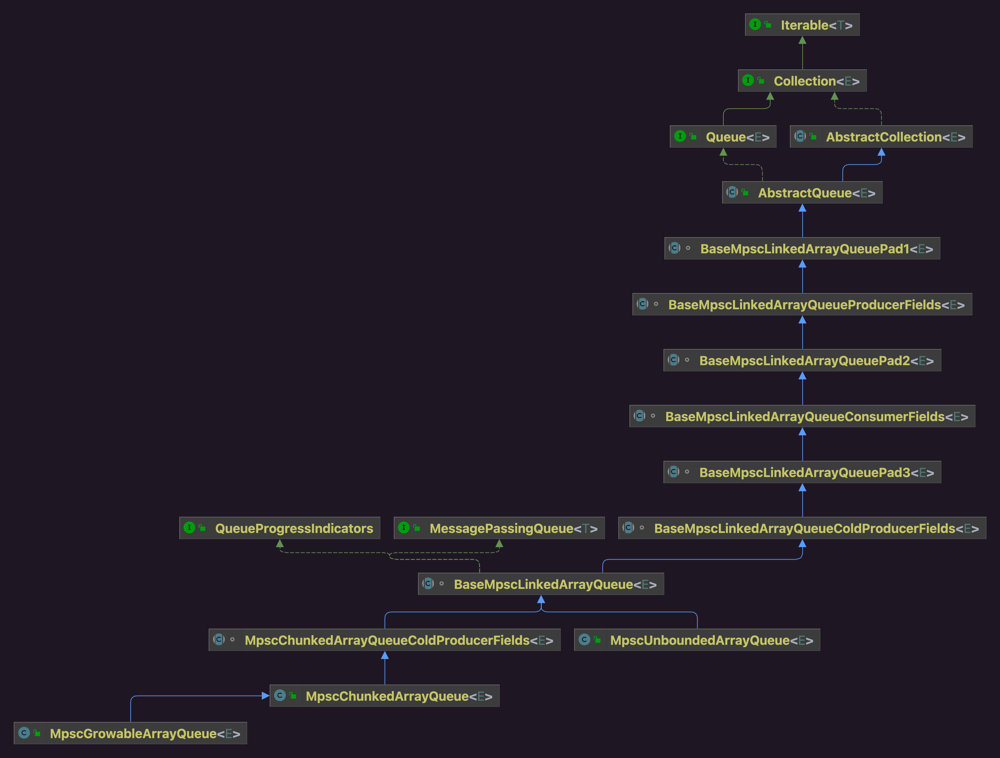

在IO线程NioEventLoop中维护了一个队列实现，用于存放非IO任务，一个IO线程负责N个Channel，为了保证一个线程贯穿始终负责一个Channel的所有任务(任务执行次序有先后区分需要)，因此可能IO线程自己将待执行的内容封装成异步任务，也有可能其他线程提交任务(立即执行或者定时任务)。

面对这种场景：

* 多个线程充当生产者
* 唯一线程充当消费者

Netty选择了JCTools的实现MpscQueue，即多生产者单消费者模型。

## 一 源码出处

NioEventLoop的构造方法：

```java
// NioEventLoop.java
newTaskQueue(taskQueueFactory), // 非IO任务队列
```


```java
// NioEventLoop.java
private static Queue<Runnable> newTaskQueue(
    EventLoopTaskQueueFactory queueFactory) {
    if (queueFactory == null) {
        return newTaskQueue0(DEFAULT_MAX_PENDING_TASKS);
    }
    return queueFactory.newTaskQueue(DEFAULT_MAX_PENDING_TASKS);
}
```


```java
// NioEventLoop.java
private static Queue<Runnable> newTaskQueue0(int maxPendingTasks) {
    // This event loop never calls takeTask()
    return maxPendingTasks == Integer.MAX_VALUE ? PlatformDependent.<Runnable>newMpscQueue()
        : PlatformDependent.<Runnable>newMpscQueue(maxPendingTasks);
}
```


```java
// PlatformDependent.java
public static <T> Queue<T> newMpscQueue() {
    return Mpsc.newMpscQueue();
}
```


```java
static <T> Queue<T> newMpscQueue() {
    return USE_MPSC_CHUNKED_ARRAY_QUEUE ? new MpscUnboundedArrayQueue<T>(MPSC_CHUNK_SIZE)
        : new MpscUnboundedAtomicArrayQueue<T>(MPSC_CHUNK_SIZE);
}
```

## 二 类图关系




## 三 实现
