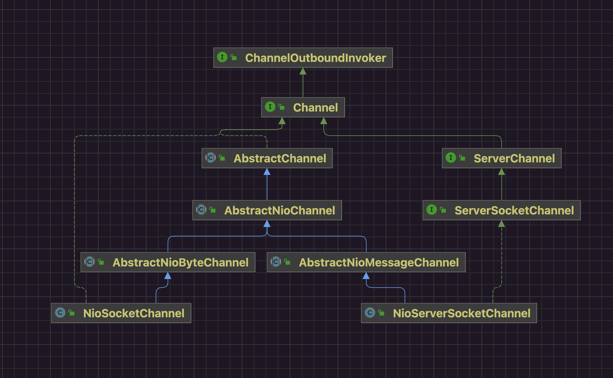

## 一 类图关系



在Java的NIO体系中定义了ServerSocketChannel和SocketChannel。Netty为了支持Reactor线程模型和异步编程，自己也实现了与Java中对应的两个实现：

* NioServerSocketChannel。
* NioSocketChannel。

从功能职责来看：

* NioServerSocketChannel负责连接数据。
* NioSocketChannel负责读写数据。

从工作端来看：

* NioServerSocketChannel对接ServerSocket，仅使用在服务端。
* NioSocketChannel对接Socket，可以使用在服务端，也可以使用在客户端。

一般涉及资源开辟都使用懒加载方式，涉及多实现都会通过提供对应Provider或者Factory方式进行创建。

## 二 ChannelFactory

```java
// AbstractBootstrap.java

/**
     * Channel创建工厂->内部阈维护了xxxChannel的默认构造器->触发时机->{@link AbstractBootstrap#initAndRegister()}->newInstance()方式创建xxxChannel实例
     *
     * {@link NioServerSocketChannel#NioServerSocketChannel()}->创建服务端Chanel实例
     * {@link NioSocketChannel#NioSocketChannel()}->创建客户端Channel实例
     *
     * 触发时机分别为:
     * 服务端{@link ServerBootstrap#bind()}
     * 客户端{@link Bootstrap#connect()}
     */
@SuppressWarnings("deprecation")
private volatile ChannelFactory<? extends C> channelFactory;

/**
     * 创建channelFactory->等到特定时机->创建SocketChannel
     *
     * 形参指向的类是
     * {@link io.netty.channel.socket.nio.NioServerSocketChannel} 无参构造器是{@link NioServerSocketChannel#NioServerSocketChannel()}
     * {@link io.netty.channel.socket.nio.NioSocketChannel} 无参构造器是{@link NioSocketChannel#NioSocketChannel()}
     *
     * 其作用就是提供SocketChannel的无参构造器 生成ChannelFactory
     */
public B channel(Class<? extends C> channelClass) { // 指定Channel类型->根据Channel特定实现的无参构造方法->反射创建Channel实例
    return this.channelFactory(new ReflectiveChannelFactory<C>(channelClass)); // NioServerSocket的class对象
}
```

在AbstractBootstrap维护了channelFactory，将来在恰当时机可以通过Factory创建需要的实例。

### 1 channelFactory(...)

```java
// AbstractBootstrap.java
public B channelFactory(io.netty.channel.ChannelFactory<? extends C> channelFactory) {
return this.channelFactory((ChannelFactory<C>) channelFactory);
}
```


```java
@Deprecated
public B channelFactory(ChannelFactory<? extends C> channelFactory) { // channelFactory的setter
    if (this.channelFactory != null) throw new IllegalStateException("channelFactory set already");
    /**
         * {@link io.netty.channel.ChannelFactory}本质就是一个Channel工厂->阈维护了一个无参构造器->通过newInstance()创建Channel实例
         *
         * 两个无参构造器:
         * {@link NioServerSocketChannel#NioServerSocketChannel()}->创建服务端Channel实例
         * {@link NioSocketChannel#NioSocketChannel()}->创建客户端Channel实例
         */
    this.channelFactory = channelFactory; // 设置channelFactory属性 将ReflectiveChannelFactory实例赋值给该属性
    return self();
}
```

该方法的作用就是个setter方法，负责channelFactory赋值。

### 2 new ReflectiveChannelFactory(...)

```java
// ReflectiveChannelFactory.java
public ReflectiveChannelFactory(Class<? extends T> clazz) {
    try {
        this.constructor = clazz.getConstructor(); // NioServerSocket的class对象
    } catch (NoSuchMethodException e) {
        throw new IllegalArgumentException("Class " + StringUtil.simpleClassName(clazz) + " does not have a public non-arg constructor", e);
    }
}
```


```java
@Override
public T newChannel() {
    try {
        return this.constructor.newInstance(); // 反射调用Channel的无参构造方法创建Channel NioSocketChannel充当客户端功能 它的创建时机在connect()的时候 NioServerSocketChannel充当服务端 它的创建时机在bind()的时候
    } catch (Throwable t) {
        throw new ChannelException("Unable to create Channel from class " + constructor.getDeclaringClass(), t);
    }
}
```

ReflectiveChannelFactory这个类也很简单，只提供了一个构造方法，需要指定Channel实现类对象，将来调用channelFactory的newChannel就可以通过类对象的无参构造方法反射创建Channel实例对象。


## 三 SelectorProvider

关于SelectorProvider的分析，在中有涉及。

现在我们只需要关心两个方法的实现：

* openServerSocketChannel
* openSocketChannel

不同平台的SelectorProvider如下：

* Linux EPollSelectorProvider
* MacOSX KQueueSelectorProvider
* Windows WindowsSelectorProvider

它们都继承自SelectorProviderImpl。

```java
// SelectorProviderImpl.java
public abstract class SelectorProviderImpl
    extends SelectorProvider
{

    public DatagramChannel openDatagramChannel() throws IOException {
        return new DatagramChannelImpl(this);
    }

    public DatagramChannel openDatagramChannel(ProtocolFamily family) throws IOException {
        return new DatagramChannelImpl(this, family);
    }

    public Pipe openPipe() throws IOException {
        return new PipeImpl(this);
    }

    public abstract AbstractSelector openSelector() throws IOException;

    public ServerSocketChannel openServerSocketChannel() throws IOException {
        return new ServerSocketChannelImpl(this);
    }

    public SocketChannel openSocketChannel() throws IOException {
        return new SocketChannelImpl(this);
    }
}
```

### 1 openServerSocketChannel()

```java
// ServerSocketChannelImpl.java
ServerSocketChannelImpl(SelectorProvider sp) throws IOException {
    super(sp);
    this.fd =  Net.serverSocket(true);
    this.fdVal = IOUtil.fdVal(fd);
    this.state = ST_INUSE;
}
```


```java
// Net.java
static FileDescriptor serverSocket(boolean stream) {
    return IOUtil.newFD(socket0(isIPv6Available(), stream, true, fastLoopback));
}
```

### 2 openSocketChannel()

```java
// SocketChannelImpl
SocketChannelImpl(SelectorProvider sp) throws IOException {
    super(sp);
    this.fd = Net.socket(true);
    this.fdVal = IOUtil.fdVal(fd);
    this.state = ST_UNCONNECTED;
}
```


```java
// Net.java
static FileDescriptor socket(ProtocolFamily family, boolean stream)
    throws IOException {
    boolean preferIPv6 = isIPv6Available() &&
        (family != StandardProtocolFamily.INET);
    return IOUtil.newFD(socket0(preferIPv6, stream, false, fastLoopback));
}
```

### 3 创建OS的Socket

```cpp
// Net.java
private static native int socket0(boolean preferIPv6, boolean stream, boolean reuse,
                                  boolean fastLoopback);
```


```cpp
//Net.c
JNIEXPORT jint JNICALL
Java_sun_nio_ch_Net_socket0(JNIEnv *env, jclass cl, jboolean preferIPv6,
                            jboolean stream, jboolean reuse, jboolean ignored)
{
    int fd;
    int type = (stream ? SOCK_STREAM : SOCK_DGRAM);
    int domain = (ipv6_available() && preferIPv6) ? AF_INET6 : AF_INET;

    fd = socket(domain, type, 0);
    if (fd < 0) {
        return handleSocketError(env, errno);
    }

    /* Disable IPV6_V6ONLY to ensure dual-socket support */
    if (domain == AF_INET6) {
        int arg = 0;
        if (setsockopt(fd, IPPROTO_IPV6, IPV6_V6ONLY, (char*)&arg,
                       sizeof(int)) < 0) {
            JNU_ThrowByNameWithLastError(env,
                                         JNU_JAVANETPKG "SocketException",
                                         "Unable to set IPV6_V6ONLY");
            close(fd);
            return -1;
        }
    }

    if (reuse) {
        int arg = 1;
        if (setsockopt(fd, SOL_SOCKET, SO_REUSEADDR, (char*)&arg,
                       sizeof(arg)) < 0) {
            JNU_ThrowByNameWithLastError(env,
                                         JNU_JAVANETPKG "SocketException",
                                         "Unable to set SO_REUSEADDR");
            close(fd);
            return -1;
        }
    }

#if defined(__linux__)
    if (type == SOCK_DGRAM) {
        int arg = 0;
        int level = (domain == AF_INET6) ? IPPROTO_IPV6 : IPPROTO_IP;
        if ((setsockopt(fd, level, IP_MULTICAST_ALL, (char*)&arg, sizeof(arg)) < 0) &&
            (errno != ENOPROTOOPT)) {
            JNU_ThrowByNameWithLastError(env,
                                         JNU_JAVANETPKG "SocketException",
                                         "Unable to set IP_MULTICAST_ALL");
            close(fd);
            return -1;
        }
    }

    /* By default, Linux uses the route default */
    if (domain == AF_INET6 && type == SOCK_DGRAM) {
        int arg = 1;
        if (setsockopt(fd, IPPROTO_IPV6, IPV6_MULTICAST_HOPS, &arg,
                       sizeof(arg)) < 0) {
            JNU_ThrowByNameWithLastError(env,
                                         JNU_JAVANETPKG "SocketException",
                                         "Unable to set IPV6_MULTICAST_HOPS");
            close(fd);
            return -1;
        }
    }
#endif
    return fd;
}
```

也就是最终通过系统调用socket()创建了Socket对象，Netty根据OS的fd根据调用封装成Java对象ServerSocketChannel和SocketChannel。

## 四 NioServerSocketChannel无参构造方法

```java
// NioServerSocketChannel.java
private static final SelectorProvider DEFAULT_SELECTOR_PROVIDER = SelectorProvider.provider();

public NioServerSocketChannel() {
    this(newSocket(DEFAULT_SELECTOR_PROVIDER)); // newSocket触发创建jdk底层ServerSocketChannel实例
}

private static ServerSocketChannel newSocket(SelectorProvider provider) {
    try {
        /**
             *  Use the {@link SelectorProvider} to open {@link SocketChannel} and so remove condition in
             *  {@link SelectorProvider#provider()} which is called by each ServerSocketChannel.open() otherwise.
             *
             *  See <a href="https://github.com/netty/netty/issues/2308">#2308</a>.
             */
        return provider.openServerSocketChannel(); // Java根据系统调用socket()创建Socket实例 返回的fd封装成ServerSocketChannel
    } catch (IOException e) {
        throw new ChannelException("Failed to open a server socket.", e);
    }
}

public NioServerSocketChannel(SelectorProvider provider) {
    this(newSocket(provider));
}

public NioServerSocketChannel(ServerSocketChannel channel) { // 这个channel就是newSocket(...)创建出来jdk的ServerSocketChannel
    super(null, channel, SelectionKey.OP_ACCEPT); // 调用父类构造器 保存属性 设置ServerSocketChannel的非阻塞模式(系统调用fcntl) 服务端关心的是SelectionKey.OP_ACCEPT事件 等待客户端连接
    /**
         * 创建NioServerSocketChannelConfig实例 保存channel配置信息
         * 每一个NioServerSocketChannel都拥有一个config属性 这个属性存放着NioServerSocketChannel的相关配置
         * 这里创建了一个NioServerSocketChannelConfig对象 并将当前channel和channel对应的java底层的socket对象进行了传入
         * NioServerSocketChannelConfig其实是NioServerSocketChannel的内部类
         */
    this.config = new NioServerSocketChannelConfig(this, this.javaChannel().socket());
}
```


```java
// AbstractNioMessageChannel.java
protected AbstractNioMessageChannel(Channel parent, SelectableChannel ch, int readInterestOp) {
    super(parent, ch, readInterestOp);
}
```


```java
// AbstractNioChannel.java
protected AbstractNioChannel(Channel parent, SelectableChannel ch, int readInterestOp) {
    super(parent);
    this.ch = ch; // jdk的channel 绑定jdk底层的ServerSocketChannel netty的channel跟jdk的channel关系是组合关系 在netty的channel中有个jdk的channel成员变量 这个成员变量定义在AbstractNioChannel中
    this.readInterestOp = readInterestOp; // Channel关注的IO事件 NioSocketChannel的OP_READ NioServerSocketChannel关注OP_ACCEPT连接事件
    try {
        ch.configureBlocking(false); // 将jdk的channel设置为非阻塞模式(系统调用fcntl)
    } catch (IOException e) {
        try {
            ch.close();
        } catch (IOException e2) {
        }
        throw new ChannelException("Failed to enter non-blocking mode.", e);
    }
}
```


```java
// AbstractChannel.java
protected AbstractChannel(Channel parent) {
    this.parent = parent;
    id = this.newId(); // 给每个channel分配一个唯一id
    /**
         * 每个channel内部都需要一个Unsafe实例 执行偏底层的操作
         * {@link io.netty.channel.nio.NioEventLoop}调用的时候会走到其父类的{@link AbstractNioByteChannel#newUnsafe()}方法
         */
    unsafe = this.newUnsafe();
    pipeline = this.newChannelPipeline(); // 每个channel内部都会创建一个pipeline
}
```

## 五 NioSocketChannel无参构造方法

```java
// NioSocketChannel.java
private static final SelectorProvider DEFAULT_SELECTOR_PROVIDER = SelectorProvider.provider(); // 依赖Jdk版本->依赖OS类型

public NioSocketChannel() {
    this(DEFAULT_SELECTOR_PROVIDER);
}

public NioSocketChannel(SelectorProvider provider) {
    this(newSocket(provider)); // newSocket创建了jdk底层的SocketChannel
}

private static SocketChannel newSocket(SelectorProvider provider) {
    try {
        /**
             *  Use the {@link SelectorProvider} to open {@link SocketChannel} and so remove condition in
             *  {@link SelectorProvider#provider()} which is called by each SocketChannel.open() otherwise.
             *
             *  See <a href="https://github.com/netty/netty/issues/2308">#2308</a>.
             */
        return provider.openSocketChannel(); // Java根据系统调用socket()创建Socket实例 返回的fd封装成SocketChannel
    } catch (IOException e) {
        throw new ChannelException("Failed to open a socket.", e);
    }
}

public NioSocketChannel(Channel parent, SocketChannel socket) {
    /**
         * 调用父类构造器 设置属性 设置SocketChannel的非阻塞模式
         * socket代表jdk底层的socketChannel
         * parent的含义在于标识SocketChannel的创建场景
         *     - 客户端主动创建Socket跟服务端Socket通信 parent为null
         *     - 服务端Socket监听到有来自客户端的连接后 会copy服务端Socket的创建参数clone一个新的Socket用于跟客户端通信 parent为服务端Socket
         */
    super(parent, socket);
    /**
         * 实例化内部的NioSocketChannelConfig实例 保存channel的配置信息
         */
    config = new NioSocketChannelConfig(this, socket.socket());
}
```


```java
// AbstractNioByteChannel.java
protected AbstractNioByteChannel(Channel parent, SelectableChannel ch) {
    super(parent, ch, SelectionKey.OP_READ); // SocketChannel关心的是OP_READ可读事件
}
```


```java
// AbstractNioChannel.java
protected AbstractNioChannel(Channel parent, SelectableChannel ch, int readInterestOp) {
    super(parent);
    this.ch = ch; // jdk的channel 绑定jdk底层的ServerSocketChannel netty的channel跟jdk的channel关系是组合关系 在netty的channel中有个jdk的channel成员变量 这个成员变量定义在AbstractNioChannel中
    this.readInterestOp = readInterestOp; // Channel关注的IO事件 NioSocketChannel关注OP_READ可读事件 NioServerSocketChannel关注OP_ACCEPT连接事件
    try {
        ch.configureBlocking(false); // 将jdk的channel设置为非阻塞模式(系统调用fcntl)
    } catch (IOException e) {
        try {
            ch.close();
        } catch (IOException e2) {
        }
        throw new ChannelException("Failed to enter non-blocking mode.", e);
    }
}
```


```java
// AbstractChannel.java
protected AbstractChannel(Channel parent) {
    this.parent = parent;
    id = this.newId(); // 给每个channel分配一个唯一id
    /**
         * 每个channel内部都需要一个Unsafe实例 执行偏底层的操作
         * {@link io.netty.channel.nio.NioEventLoop}调用的时候会走到其父类的{@link AbstractNioByteChannel#newUnsafe()}方法
         */
    unsafe = this.newUnsafe();
    pipeline = this.newChannelPipeline(); // 每个channel内部都会创建一个pipeline
}
```

