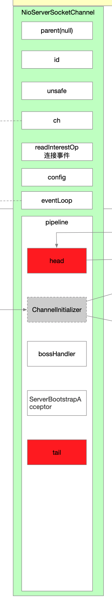

## 一 回顾几个时机点

* pipeline的初始化
* 用户向pipeline添加ChannelInitializer辅助实例
* Channel注册到复用器之后回调

### 1 pipeline的初始化

初始化Channel的时候触发了pipeline的初始化

```java
// AbstractChannel.java
pipeline = this.newChannelPipeline(); // 每个channel内部都会创建一个pipeline 默认两个节点(head和tail 都不是哑节点 是有实际作用的)
```


```java
// AbstractChannel.java
protected DefaultChannelPipeline newChannelPipeline() {
    /**
         * 传入当前的channel
         */
    return new DefaultChannelPipeline(this);
}
```


```java
// DefaultChannelPipeline.java
protected DefaultChannelPipeline(Channel channel) {
    this.channel = ObjectUtil.checkNotNull(channel, "channel");
    succeededFuture = new SucceededChannelFuture(channel, null);
    voidPromise =  new VoidChannelPromise(channel, true);

    tail = new TailContext(this); // tail实现了ChannelInboundHandler
    head = new HeadContext(this); // head实现了ChannelOutboundHandler和ChannelInboundHandler

    head.next = tail; // 双向链表
    tail.prev = head;
}
```




此时pipeline中只有两个处理器：

* head
* tail

### 2 向pipeline中添加ChannelInitializer实例

```java
// ServerBootstrap.java
/**
     * - NioServerSocketChannel->pipeline中添加个ChannelInitializer
     *     - 等待NioServerSocketChannel注册复用器后被回调
     *         - 添加workerHandler
     *         - 提交异步任务
     *             - 在pipeline中添加ServerBootstrapAcceptor
     */
@Override
void init(Channel channel) { // NioServerSocketChannel实例
    setChannelOptions(channel, newOptionsArray(), logger);
    setAttributes(channel, newAttributesArray());

    ChannelPipeline p = channel.pipeline(); // channel内部的pipeline实例 在创建NioServerSocketChannel的时候一起创建了pipeline实例

    final EventLoopGroup currentChildGroup = childGroup; // workerGroup
    final ChannelHandler currentChildHandler = childHandler; // workerHandler
    final Entry<ChannelOption<?>, Object>[] currentChildOptions = newOptionsArray(childOptions);
    final Entry<AttributeKey<?>, Object>[] currentChildAttrs = newAttributesArray(childAttrs);

    /**
         * 往ServerSocketChannel的pipeline中添加一个handler 这个handler是ChannelInitializer的实例 该处涉及到pipeline中的辅助类ChannelInitializer 它本身也是一个handler(Inbound类型) 它的作用仅仅是辅助其他的handler加入到pipeline中
         * ChannelInitializer的initChannel方法触发时机是在Channel注册到NioEventLoop复用器之后(NioEventLoop启动执行注册操作) 那么到时候会发生回调
         *     - 添加一个ServerBootstrap指定的bossHandler(也可能没指定) 比如指定了workerHandler 那么回调执行后 pipeline存在 headHandler-workerHandler-tailHandler
         *     - 向NioEventLoop提交添加handler的异步任务
         *         - 等NioEventLoop把这个异步任务执行完了之后 pipeline中变成 head-workerHandler-ServerBootstrapAcceptor-tail
         */
    p.addLast(new ChannelInitializer<Channel>() {
        @Override
        public void initChannel(final Channel ch) { // ChannelInitializer的这个方法会在Channel注册到EventLoop线程上复用器之后被回调
            final ChannelPipeline pipeline = ch.pipeline(); // NioServerSocketChannel的pipeline
            ChannelHandler handler = config.handler(); // 这个handler是在ServerBootstrap::handler()方法中指定的workerHandler
            if (handler != null) pipeline.addLast(handler); // 将bossHandler添加到NioServerSocket的pipeline中

            ch.eventLoop().execute(new Runnable() { // 往NioEventLoop线程添加一个任务 boss的NioEventLoop线程会执行这个任务 就是给Channel指定一个处理器 处理器的功能是接收客户端请求
                @Override
                public void run() {
                    pipeline.addLast(
                        // 添加一个handler到pipeline中 ServerBootstrapAcceptor这个handler目的是用来接收客户端请求的
                        new ServerBootstrapAcceptor(
                            ch, // NioServerSocketChannel
                            currentChildGroup, // workerGroup
                            currentChildHandler, // workerHandler
                            currentChildOptions,
                            currentChildAttrs
                        )
                    );
                }
            });
        }
    });
}
```


```java
// DefaultChannelPipeline.java
@Override
public final ChannelPipeline addLast(EventExecutorGroup group, String name, ChannelHandler handler) {
    final AbstractChannelHandlerContext newCtx;
    synchronized (this) {
        /**
             * 判断handler是否被重复添加
             */
        checkMultiplicity(handler);
        /**
             * 创建一个HandlerContext并添加到列表
             */
        newCtx = newContext(group, filterName(name, handler), handler);
        // 添加HandlerContext
        this.addLast0(newCtx);

        // If the registered is false it means that the channel was not registered on an eventLoop yet.
        // In this case we add the context to the pipeline and add a task that will call
        // ChannelHandler.handlerAdded(...) once the channel is registered.
        if (!registered) { // 当使用ChannelInitializer辅助类添加handler时候 Channel还没注册到复用器上 这时候进行标识等待回调
            newCtx.setAddPending();
            callHandlerCallbackLater(newCtx, true); // newCtx就是对当前handler的封装
            return this;
        }

        EventExecutor executor = newCtx.executor();
        if (!executor.inEventLoop()) {
            // 回调用户事件
            callHandlerAddedInEventLoop(newCtx, executor);
            return this;
        }
    }
    this.callHandlerAdded0(newCtx); // 回调handler的添加事件(内部也会判断执行的时候Channel有没有注册到复用器上 严格保证回调执行时机是在Channel注册复用器之后)
    return this;
}
```

在Channel创建好了对其进行初始化，以NioServerSocketChannel为例，Netty向pipline中添加了一个handler，就是ChannelInitializer实例。

* pipeline中添加handler就是双链表的insert操作
  * 添加到双链表
  * 此刻Channel还在初始化环节 Channel还没注册到复用器上 
* ChannelInitializer的方法等待时机被回调

### 3 Channel注册之后发布事件触发ChannelInitializer方法回调

```java
// AbstractUnsafe.java
/**
                 * 发布handlerAdd事件
                 * 让pipeline中handler关注handlerAdded(...)的handler执行
                 *     - 触发ChannelInitializer方法执行
                 */
pipeline.invokeHandlerAddedIfNeeded();
```


```java
// DefaultChannelPipeline.java
final void invokeHandlerAddedIfNeeded() {
    assert channel.eventLoop().inEventLoop();
    if (firstRegistration) { // 保证了这个方法只会在Channel注册到IO多路复用器上之后才会执行
        firstRegistration = false;
        // We are now registered to the EventLoop. It's time to call the callbacks for the ChannelHandlers,
        // that were added before the registration was done.
        this.callHandlerAddedForAllHandlers();
    }
}
```


```java
// DefaultChannelPipeline.java

private PendingHandlerCallback pendingHandlerCallbackHead; // 但链表数据结构 挂着的都是等待Channel注册复用器成功后执行回调的handler(比如ChannelInitializer实例)
```


```java
private void callHandlerAddedForAllHandlers() {
    final PendingHandlerCallback pendingHandlerCallbackHead;
    synchronized (this) {
        assert !registered;

        // This Channel itself was registered.
        this.registered = true;

        pendingHandlerCallbackHead = this.pendingHandlerCallbackHead;
        // Null out so it can be GC'ed.
        this.pendingHandlerCallbackHead = null;
    }

    // This must happen outside of the synchronized(...) block as otherwise handlerAdded(...) may be called while
    // holding the lock and so produce a deadlock if handlerAdded(...) will try to add another handler from outside
    // the EventLoop.
    PendingHandlerCallback task = pendingHandlerCallbackHead;
    while (task != null) { // 轮询单链表
        task.execute();
        task = task.next;
    }
}
```


```java
@Override
void execute() {
    EventExecutor executor = ctx.executor();
    // 线程切换 NioEventLoop线程负责执行
    if (executor.inEventLoop()) {
        callHandlerAdded0(ctx);
    } else {
        try {
            executor.execute(this);
        } catch (RejectedExecutionException e) {
            atomicRemoveFromHandlerList(ctx);
            ctx.setRemoved();
        }
    }
}
```


```java
private void callHandlerAdded0(final AbstractChannelHandlerContext ctx) {
    try {
        ctx.callHandlerAdded(); // NioServerSocketChannel在init初始化时向pipeline中添加ChannelInitializer实例 ctx就是对ChannelInitializer实例的封装
    } catch (Throwable t) {
        boolean removed = false;
        try {
            atomicRemoveFromHandlerList(ctx);
            ctx.callHandlerRemoved();
            removed = true;
        } catch (Throwable t2) {
        }

        if (removed) {
            fireExceptionCaught(new ChannelPipelineException(ctx.handler().getClass().getName() + ".handlerAdded() has thrown an exception; removed.", t));
        } else {
            fireExceptionCaught(new ChannelPipelineException(ctx.handler().getClass().getName() + ".handlerAdded() has thrown an exception; also failed to remove.", t));
        }
    }
}
```


```java
// AbstractChannelHandlerContext.java
final void callHandlerAdded() throws Exception {
    // We must call setAddComplete before calling handlerAdded. Otherwise if the handlerAdded method generates
    // any pipeline events ctx.handler() will miss them because the state will not allow it.
    if (setAddComplete()) handler().handlerAdded(this); // NioServerSocketChannel的初始化init时 向pipeline中添加的ChannelInitializer实例
}
```


```java
// ChannelInitializer.java
@Override
    public void handlerAdded(ChannelHandlerContext ctx) throws Exception {
        if (ctx.channel().isRegistered()) { // 执行时机是在Channel注册到复用器之后(发布handlerAdded事件)
            // This should always be true with our current DefaultChannelPipeline implementation.
            // The good thing about calling initChannel(...) in handlerAdded(...) is that there will be no ordering
            // surprises if a ChannelInitializer will add another ChannelInitializer. This is as all handlers
            // will be added in the expected order.
            if (initChannel(ctx)) {

                // We are done with init the Channel, removing the initializer now.
                removeState(ctx);
            }
        }
    }
```

调用链终于走到了ChannelInitializer中了。

## 二 ChannelInitializer源码

### 1 handlerAdded

```java
// ChannelInitializer.java
@Override
public void handlerAdded(ChannelHandlerContext ctx) throws Exception {
    if (ctx.channel().isRegistered()) { // 执行时机是在Channel注册到复用器之后(发布handlerAdded事件)
        // This should always be true with our current DefaultChannelPipeline implementation.
        // The good thing about calling initChannel(...) in handlerAdded(...) is that there will be no ordering
        // surprises if a ChannelInitializer will add another ChannelInitializer. This is as all handlers
        // will be added in the expected order.
        if (initChannel(ctx)) {

            // We are done with init the Channel, removing the initializer now.
            removeState(ctx);
        }
    }
}
```


```java
private boolean initChannel(ChannelHandlerContext ctx) throws Exception {
    if (initMap.add(ctx)) { // Guard against re-entrance.
        try {
            this.initChannel((C) ctx.channel()); // initChannel(...)就是交给实例自己去关注实现的点
        } catch (Throwable cause) {
            // Explicitly call exceptionCaught(...) as we removed the handler before calling initChannel(...).
            // We do so to prevent multiple calls to initChannel(...).
            exceptionCaught(ctx, cause);
        } finally {
            ChannelPipeline pipeline = ctx.pipeline();
            if (pipeline.context(this) != null) {
                pipeline.remove(this); // 将ChannelInitializer从pipeline中移除
            }
        }
        return true;
    }
    return false;
}
```

### 2 initChannel

这个方法是ChannelInitializer提供的抽象方法，供用户自定具体实现。

列举几个例子：

#### 2.1 SerberBootstrap的init方法

```java
/**
         * 往ServerSocketChannel的pipeline中添加一个handler 这个handler是ChannelInitializer的实例 该处涉及到pipeline中的辅助类ChannelInitializer 它本身也是一个handler(Inbound类型) 它的作用仅仅是辅助其他的handler加入到pipeline中
         * ChannelInitializer的initChannel方法触发时机是在Channel注册到NioEventLoop复用器之后(NioEventLoop启动执行注册操作) 那么到时候会发生回调
         *     - 添加一个ServerBootstrap指定的bossHandler(也可能没指定) 比如指定了workerHandler 那么回调执行后 pipeline存在 headHandler-workerHandler-tailHandler
         *     - 向NioEventLoop提交添加handler的异步任务
         *         - 等NioEventLoop把这个异步任务执行完了之后 pipeline中变成 head-workerHandler-ServerBootstrapAcceptor-tail
         */
p.addLast(new ChannelInitializer<Channel>() {
    @Override
    public void initChannel(final Channel ch) { // ChannelInitializer的这个方法会在Channel注册到EventLoop线程上复用器之后被回调
        final ChannelPipeline pipeline = ch.pipeline(); // NioServerSocketChannel的pipeline
        ChannelHandler handler = config.handler(); // 这个handler是在ServerBootstrap::handler()方法中指定的workerHandler
        if (handler != null) pipeline.addLast(handler); // 将bossHandler添加到NioServerSocket的pipeline中

        ch.eventLoop().execute(new Runnable() { // 往NioEventLoop线程添加一个任务 boss的NioEventLoop线程会执行这个任务 就是给Channel指定一个处理器 处理器的功能是接收客户端请求
            @Override
            public void run() {
                pipeline.addLast(
                    // 添加一个handler到pipeline中 ServerBootstrapAcceptor这个handler目的是用来接收客户端请求的
                    new ServerBootstrapAcceptor(
                        ch, // NioServerSocketChannel
                        currentChildGroup, // workerGroup
                        currentChildHandler, // workerHandler
                        currentChildOptions,
                        currentChildAttrs
                    )
                );
            }
        });
    }
})
```

假设bossHandler没有传，那么此时pipeline中有3个handler：

* head
* ServerBootstrapAcceptor
* tail

#### 2.2 EchoServer的ServerBootstrap初始化

```java
.childHandler(new ChannelInitializer<SocketChannel>() { // childHandler指定的handlers是给新创建的连接用的 服务端ServerSocketChannel在accept一个连接以后需要创建SocketChannel的实例 childHandler中设置的handler就是用于处理新创建的SocketChannel的 而不是用来处理ServerSocketChannel实例的
    @Override
    public void initChannel(SocketChannel ch) throws Exception { // pipeline需要ChannelInitializer辅助类 借助辅助类可以指定多个handler组成pipeline 就是拦截器 在每个NioSocketChannel或NioServerSocketChannel实例内部都会有一个pipeline实例 并且还涉及到handler执行顺序
        ChannelPipeline p = ch.pipeline();
        p.addLast(new EchoServerHandler());
    }
});
```


#### 2.3 EchoClient的Bootstrap初始化

```java
.handler(new ChannelInitializer<SocketChannel>() {
    @Override
    public void initChannel(SocketChannel ch) throws Exception {
        ChannelPipeline p = ch.pipeline();
        p.addLast(new EchoClientHandler());
    }
}); // 指定handler 客户端处理请求过程中使用的handlers
```
