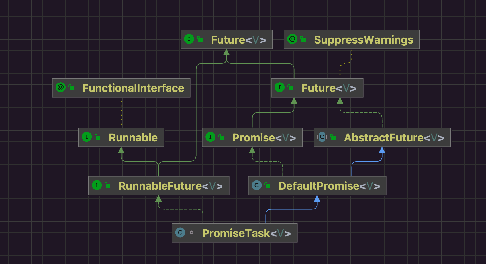

Netty为了提高系统的吞吐，大量使用异步线程模型。

## 一 Demo

```java
public class FutureTest00 {

    public static void main(String[] args) throws InterruptedException, ExecutionException {
        CountDownLatch latch = new CountDownLatch(3);
        EventLoopGroup group = new DefaultEventLoopGroup(3);

        Future<Long> f = group.submit(() -> {
            System.out.println("task...");
            Thread.sleep(100_000);
            return 100L;
        });

        new Thread(() -> {
            try {
                Long ans = f.get();
                System.out.println("get..." + Thread.currentThread().getName() + " " + ans);
            } catch (InterruptedException | ExecutionException e) {
                throw new RuntimeException(e);
            } finally {
                latch.countDown();
            }
        }, "get").start();

        new Thread(() -> {
            try {
                Long ans = f.sync().getNow();
                System.out.println("sync..." + Thread.currentThread().getName() + " " + ans);
            } catch (InterruptedException e) {
                throw new RuntimeException(e);
            } finally {
                latch.countDown();
            }
        }, "sync").start();

        new Thread(() -> {
            f.addListener(future -> {
                System.out.println("future..." + Thread.currentThread().getName() + " " + f.get());
                latch.countDown();
            });
        }, "listen").start();

        latch.await();
        group.shutdownGracefully();
    }
}

```

异步线程模型一定是依托于多线程实现的。

提交任务的线程负责提交任务，有专门的线程去关注任务过程，对于结果而言就有两种方式获取。

* 提交任务的线程自己去取，但是不知道什么时候执行线程才执行结束，所以可以阻塞等待执行线程的结果。
* 任务提交线程不要干等，通过监听器的回调机制，执行线程负责执行过程，自然知道什么时候执行结束，所以主动权交给执行线程，等有结果了让执行线程按照监听器的定义处理结果。

## 二 类图



## 三 任务提交流程

我们要关注ftask的实现类型是什么。

```java
// AbstractExecutorService.java
public <T> Future<T> submit(Callable<T> task) {
    if (task == null) throw new NullPointerException();
    RunnableFuture<T> ftask = newTaskFor(task);
    execute(ftask);
    return ftask;
}
```


```java
// AbstractEventExecutor.java
@Override
protected final <T> RunnableFuture<T> newTaskFor(Callable<T> callable) {
    return new PromiseTask<T>(this, callable); // 提交给EventLoop线程的任务被封装称PromiseTask实现
}
```

## 四 sync阻塞等待

```java
// Demo.java
Long ans = f.get();
```


```java
// DefaultPromise.java
@Override
public V get() throws InterruptedException, ExecutionException {
    Object result = this.result;
    if (!isDone0(result)) { // 异步任务执行完了就直接返回
        this.await(); // 异步任务还没执行完 取结果的线程需要阻塞等待异步结果的到来
        result = this.result; // 阻塞等待异步结果的线程被唤醒了 说明异步线程已经将执行结果放到了result阈上
    }
    if (result == SUCCESS || result == UNCANCELLABLE) {
        return null;
    }
    Throwable cause = cause0(result);
    if (cause == null) {
        return (V) result;
    }
    if (cause instanceof CancellationException) {
        throw (CancellationException) cause;
    }
    throw new ExecutionException(cause);
}
```


```java
@Override
public Promise<V> await() throws InterruptedException {
    if (this.isDone()) { // 异步任务已经执行结束了 直接返回
        return this;
    }

    if (Thread.interrupted()) {
        throw new InterruptedException(toString());
    }

    checkDeadLock(); // 避免EventLoop线程自锁

    synchronized (this) { // 多线程获取同一个异步任务的执行结果
        while (!isDone()) {
            incWaiters(); // 阻塞获取异步任务的线程计数
            try {
                wait(); // 阻塞住线程等待被notify唤醒 获取异步结果的线程释放了管程锁 进入了当前promise的阻塞列表
            } finally {
                decWaiters(); // 阻塞在promise上的线程会唤醒 说明异步结果已经被异步线程放回了promise 更新阻塞获取异步结果的线程数量
            }
        }
    }
    return this;
}
```

现在获取任务的线程已经阻塞了，只能等待异步线程执行完任务之后，通过notify或者notifyAll唤醒这个阻塞线程了。


```java
// PromiseTask.java
@Override
public void run() {
    try {
        if (setUncancellableInternal()) { // 设置任务不可取消
            V result = runTask(); // 任务执行结果
            /**
                 * 将异步结果设置到DefaultPromise的result阈上
                 * 后置动作
                 *     - 唤醒所有阻塞在等待异步结果上的线程
                 *     - 执行监听器的回调
                 */
            setSuccessInternal(result);
        }
    } catch (Throwable e) {
        setFailureInternal(e);
    }
}
```


```java
protected final Promise<V> setSuccessInternal(V result) {
    /**
         * 将异步结果设置到DefaultPromise的result阈上
         * 后置动作
         *     - 唤醒所有阻塞在等待异步结果上的线程
         *     - 执行监听器的回调
         */
    super.setSuccess(result);
    clearTaskAfterCompletion(true, COMPLETED);
    return this;
}
```


```java
// DefaultPromise.java
/**
     * 将异步结果设置到DefaultPromise的result阈上
     * 后置动作
     *     - 唤醒所有阻塞在等待异步结果上的线程
     *     - 执行监听器的回调
     */
@Override
public Promise<V> setSuccess(V result) {
    if (this.setSuccess0(result)) {
        return this;
    }
    throw new IllegalStateException("complete already: " + this);
}
```


```java
/**
     * 将异步结果设置到DefaultPromise的result阈上
     * 后置动作
     *     - 唤醒所有阻塞在等待异步结果上的线程
     *     - 执行监听器的回调
     */
private boolean setSuccess0(V result) {
    return this.setValue0(result == null ? SUCCESS : result); // CAS方式将异步任务结果设置到result阈上
}
```


```java
/**
     * 将异步结果设置到DefaultPromise的result阈上
     * 后置动作
     *     - 唤醒所有阻塞在等待异步结果上的线程
     *     - 执行监听器的回调
     */
private boolean setValue0(Object objResult) { // 设置好值然后执行监听者的回调方法
    if (RESULT_UPDATER.compareAndSet(this, null, objResult) ||
        RESULT_UPDATER.compareAndSet(this, UNCANCELLABLE, objResult)) { // CAS将异步结果设置到result阈上
        if (checkNotifyWaiters()) { // 唤醒所有阻塞等待异步结果的线程
            this.notifyListeners(); // 如果还有监听器 执行监听器的回调
        }
        return true;
    }
    return false;
}
```


唤醒阻塞的线程。

```java
// DefaultPromise.java
private synchronized boolean checkNotifyWaiters() {
    if (waiters > 0) { // 阻塞等待异步结果的线程数量
        notifyAll(); // 唤醒所有阻塞等待异步结果的线程
    }
    return listeners != null;
}
```

## 五 监听器回调

```java
// DefaultPromise.java
private void notifyListeners() {
    EventExecutor executor = executor();
    // 线程切换 确保回调监听器的线程就是执行异步任务的线程
    if (executor.inEventLoop()) {
        final InternalThreadLocalMap threadLocals = InternalThreadLocalMap.get();
        final int stackDepth = threadLocals.futureListenerStackDepth();
        if (stackDepth < MAX_LISTENER_STACK_DEPTH) {
            threadLocals.setFutureListenerStackDepth(stackDepth + 1);
            try {
                notifyListenersNow();
            } finally {
                threadLocals.setFutureListenerStackDepth(stackDepth);
            }
            return;
        }
    }

    safeExecute(executor, new Runnable() {
        @Override
        public void run() {
            notifyListenersNow();
        }
    });
}
```


```java
private void notifyListenersNow() {
    Object listeners;
    synchronized (this) {
        // Only proceed if there are listeners to notify and we are not already notifying listeners.
        if (notifyingListeners || this.listeners == null) {
            return;
        }
        notifyingListeners = true;
        listeners = this.listeners;
        this.listeners = null;
    }
    for (;;) { // 回调监听器
        if (listeners instanceof DefaultFutureListeners) {
            notifyListeners0((DefaultFutureListeners) listeners);
        } else {
            notifyListener0(this, (GenericFutureListener<?>) listeners);
        }
        synchronized (this) {
            if (this.listeners == null) {
                // Nothing can throw from within this method, so setting notifyingListeners back to false does not
                // need to be in a finally block.
                notifyingListeners = false;
                return;
            }
            listeners = this.listeners;
            this.listeners = null;
        }
    }
}
```


```java
private void notifyListeners0(DefaultFutureListeners listeners) {
    GenericFutureListener<?>[] a = listeners.listeners();
    int size = listeners.size();
    for (int i = 0; i < size; i ++) {
        notifyListener0(this, a[i]);
    }
}
```


```java
private static void notifyListener0(Future future, GenericFutureListener l) {
    try {
        l.operationComplete(future); // 回调执行监听器的operationComplete方法 这个方法是放置监听器的线程自定义的
    } catch (Throwable t) {
        if (logger.isWarnEnabled()) {
            logger.warn("An exception was thrown by " + l.getClass().getName() + ".operationComplete()", t);
        }
    }
}
```

