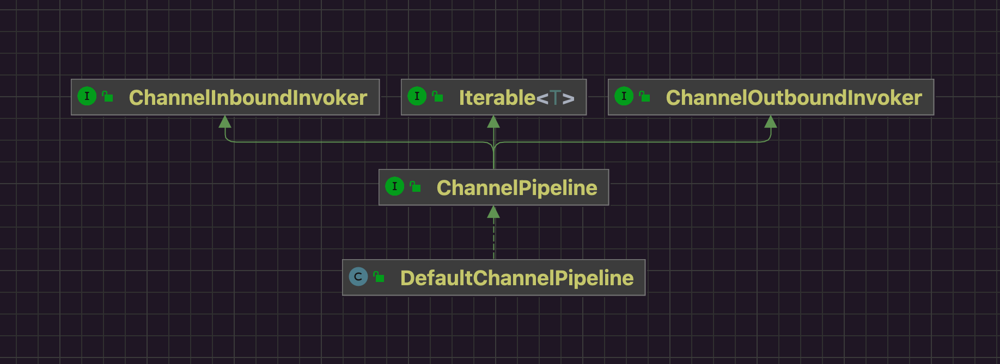
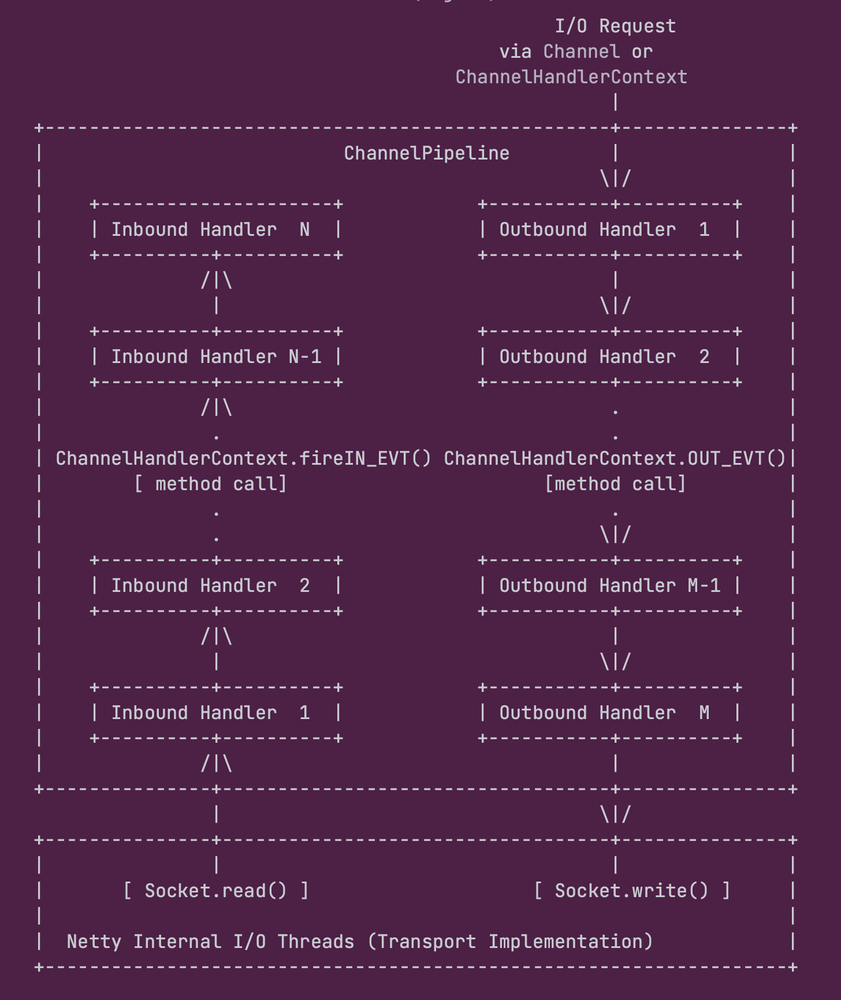
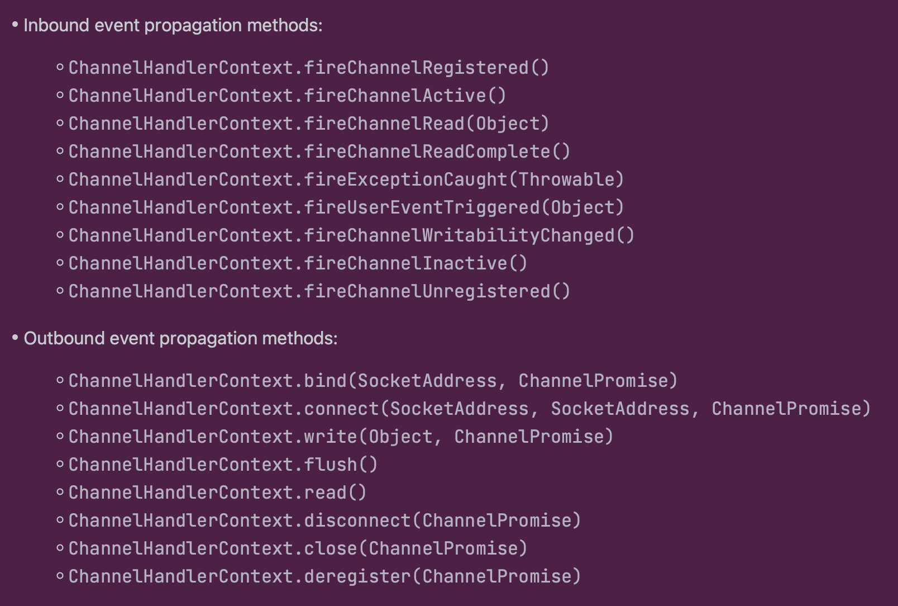

在的初始化过程中会给每个Channel实例构造一个Pipeline，因此研究pipeline的入口就是构造方法。

## 一 类图

是继承关系上看，pipeline的实现比较简单。



## 二 JavaDoc



Netty采用Reactor的线程模型，一个IO线程负责读写，至于怎么操作读写的逻辑则定义在不同的handler中，pipline就是handler的栖身之所，pipeline负责组织和管理着。

将数据流转抽象定义为：

* 入站 从Socket流向Netty的Channel。
* 出站 从Netty的Channel流向Socket。

## 三 Demo

```java
package io.netty.example.basic.pipeline;

import io.netty.channel.ChannelHandlerContext;
import io.netty.channel.ChannelInboundHandlerAdapter;
import io.netty.channel.ChannelOutboundHandlerAdapter;
import io.netty.channel.embedded.EmbeddedChannel;

/**
 *
 * @since 2022/11/15
 * @author dingrui
 */
public class PipelineTest00 {

    public static void main(String[] args) {
        EmbeddedChannel ch = new EmbeddedChannel();
        ch.pipeline()
                .addLast(new ChannelInboundHandlerAdapter() {
                    @Override
                    public void channelRead(ChannelHandlerContext ctx, Object msg) throws Exception {
                        System.out.println("1");
                        ctx.fireChannelRead(msg);
                    }
                })
                .addLast(new ChannelOutboundHandlerAdapter() {
                    @Override
                    public void read(ChannelHandlerContext ctx) throws Exception {
                        System.out.println("2");
                        ctx.read();
                    }
                })
                .addLast(new ChannelInboundHandlerAdapter() {
                    @Override
                    public void channelRegistered(ChannelHandlerContext ctx) throws Exception {
                        System.out.println("3");
                        ctx.fireChannelRegistered();
                    }
                })
                .addLast(new ChannelOutboundHandlerAdapter() {
                    @Override
                    public void read(ChannelHandlerContext ctx) throws Exception {
                        System.out.println("4");
                        ctx.read();
                    }
                })
                .addLast(new ChannelInboundHandlerAdapter() {
                    @Override
                    public void channelRead(ChannelHandlerContext ctx, Object msg) throws Exception {
                        System.out.println("5");
                        ctx.fireChannelRead(msg);
                    }
                });
        System.out.println("入站");
        ch.pipeline().fireChannelRead("");
        System.out.println();
        System.out.println("出站");
        ch.pipeline().read();
    }
}
```

从demo的输出直观看出：

* 入站事件 pipeline从head发布事件->tail。
* 出站事件 pipeline从tail发布事件->head。

## 四 构造方法

```java
// DefaultChannelPipeline.java
/**
     * 每个Channel(NioServerSocketChannel和NioSocketChannel)都持有一个pipeline
     * pipeline就是HandlerContext的容器(HandlerContext就是handler的封装)
     *
     * 所有的IO读写底层都是通过unsafe实例 然后一层层委托
     * unsafe读写->Channel->pipeline->向handler发布传播
     *     - InBound事件 head->tail方向
     *     - OutBound事件 tail->head方向
     */
protected DefaultChannelPipeline(Channel channel) {
    this.channel = ObjectUtil.checkNotNull(channel, "channel");
    succeededFuture = new SucceededChannelFuture(channel, null);
    voidPromise =  new VoidChannelPromise(channel, true);

    tail = new TailContext(this); // tail实现了ChannelInboundHandler
    head = new HeadContext(this); // head实现了ChannelOutboundHandler和ChannelInboundHandler

    head.next = tail; // 双向链表
    tail.prev = head;
}
```

内部就是一条双向链表，对于hanlder本身标识它对入站事件还是出站事件感兴趣，然后来了事件就顺着链表以职责链设计模式走一遍，哪个handler感兴趣就自己触发回调。

* 入站事件 从head->tail走一遍。
* 出站事件 从tail->head走一遍。

pipeline并没有将handler直接组织成双链表的节点，而是将handler封装成了HandlerContext。

而二者的区别在于：

* Handler - 执行逻辑处理。
* HandlerContext - 干预事件传播机制。

### 1 HeadContext

```java
// HeadContext
HeadContext(DefaultChannelPipeline pipeline) {
    super(pipeline, null, HEAD_NAME, HeadContext.class);
    unsafe = pipeline.channel().unsafe();
    setAddComplete();
}
```

### 2 TailContext

```java
// TailContext
TailContext(DefaultChannelPipeline pipeline) {
    /**
             * inbound处理器
             */
    super(pipeline, null, TAIL_NAME, TailContext.class);
    // 将当前节点设置为已添加
    setAddComplete();
}
```

### 3 AbstractChannelHandlerContext

怎么标识一个handler是属于入站还是出站就是通过这个executionMask来体现的。

```java
// AbstractChannelHandlerContext.java
private final int executionMask; // 标识该handler感兴趣的事件集合 将来事件在pipeline中传播的时候 每个handler看看自己的感兴趣事件集合是不是包含传播的事件就行


AbstractChannelHandlerContext(DefaultChannelPipeline pipeline, EventExecutor executor, String name, Class<? extends ChannelHandler> handlerClass) {
    // 名字
    this.name = ObjectUtil.checkNotNull(name, "name");
    // pipeline
    this.pipeline = pipeline;
    // 线程处理器
    this.executor = executor;
    // 事件标识 标识该handler感兴趣的事件集合
    this.executionMask = mask(handlerClass);
    // Its ordered if its driven by the EventLoop or the given Executor is an instanceof OrderedEventExecutor.
    ordered = executor == null || executor instanceof OrderedEventExecutor;
}
```


通过位运算便可以组合出每个handler的感兴趣事件集合，来标榜每个handler是属于入站类型还是出站类型。

```java
static final int MASK_EXCEPTION_CAUGHT = 1; // 入站 出站 都要关注
static final int MASK_CHANNEL_REGISTERED = 1 << 1; // 入站
static final int MASK_CHANNEL_UNREGISTERED = 1 << 2; // 入站
static final int MASK_CHANNEL_ACTIVE = 1 << 3; // 入站
static final int MASK_CHANNEL_INACTIVE = 1 << 4; // 入站
static final int MASK_CHANNEL_READ = 1 << 5; // 入站
static final int MASK_CHANNEL_READ_COMPLETE = 1 << 6; // 入站
static final int MASK_USER_EVENT_TRIGGERED = 1 << 7; // 入站
static final int MASK_CHANNEL_WRITABILITY_CHANGED = 1 << 8; // 入站
static final int MASK_BIND = 1 << 9; // 出站
static final int MASK_CONNECT = 1 << 10; // 出站
static final int MASK_DISCONNECT = 1 << 11; // 出站
static final int MASK_CLOSE = 1 << 12; // 出站
static final int MASK_DEREGISTER = 1 << 13; // 出站
static final int MASK_READ = 1 << 14; // 出站
static final int MASK_WRITE = 1 << 15; // 出站
static final int MASK_FLUSH = 1 << 16; // 出站
```


上面这些枚举也对应着每个API，也可以直接看JavaDoc的说明：



## 五 入站事件

比如ChannelRead属于入站事件。

```java
// DefaultChannelPipeline.java
/**
     * - pipeline#fireChannelRead() 从head节点发布ChannelRead事件
     *
     * - head中定义在channelRead(...)方法中的逻辑肯定会被回调
     *     - 执行逻辑
     *     - ctx#fireChannelRead()从head->tail方向找距离当前最近的下一个处理器传播事件
     */
@Override
public final ChannelPipeline fireChannelRead(Object msg) {
    AbstractChannelHandlerContext.invokeChannelRead(head, msg);
    return this;
}
```


```java
// AbstractChannelHandlerContext.java
static void invokeChannelRead(final AbstractChannelHandlerContext next, Object msg) { // ChannelRead属于入站事件 pipeline发布事件从head开始传播
    final Object m = next.pipeline.touch(ObjectUtil.checkNotNull(msg, "msg"), next);
    EventExecutor executor = next.executor();
    // 线程切换 确保IO线程的永远执行权
    if (executor.inEventLoop())
        next.invokeChannelRead(m);
    else {
        executor.execute(new Runnable() {
            @Override
            public void run() {
                next.invokeChannelRead(m);
            }
        });
    }
}
```


```java
private void invokeChannelRead(Object msg) {
    if (invokeHandler()) {
        try {
            ((ChannelInboundHandler) handler()).channelRead(this, msg);
        } catch (Throwable t) {
            // 发生异常的时候在这进行捕获
            this.invokeExceptionCaught(t);
        }
    } else {
        fireChannelRead(msg);
    }
}
```


```java
// HeadContext
@Override
public void channelRead(ChannelHandlerContext ctx, Object msg) { // head节点并没有对ChannelRead做处理 将ChannelRead事件继续顺着head->tail的方向传播
    ctx.fireChannelRead(msg);
}
```

### 1 HandlerContext处理事件

HandlerContext本身组合了handler，所以可以执行处理逻辑。

### 2 HandlerContext干预事件传播

```java
// AbstractChannelHandlerContext.java
@Override
public ChannelHandlerContext fireChannelRead(final Object msg) { // ChannelRead属于入站事件 顺着head->tail方向 找到当前处理器下一个入站处理器
    this.invokeChannelRead(this.findContextInbound(MASK_CHANNEL_READ), msg);
    return this;
}
```

HandlerContext处理完逻辑之后还可以决定是否将事件继续传播下去，还是到此为止。

然后就是周而复始：

* invokeChannelRead
* channelRead
* fireChannelRead

每个入站处理器的逻辑都定义在channelRead(...)被回调，在fireChannelRead向后传播。

从入站事件传播就可以推出来出站事件的逻辑：

* pipline发布的出站事件以tail为起始点，开始传播
* 每个处理器处理完回调逻辑，继续顺着tail->head的方向传播事件

## 六 出站事件

比如Read属于出站事件。

```java
// AbstractChannel.java
/**
     * read属于出站事件
     * pipeline发布read事件 从tail开始 顺着tail->head方向传播
     *     - tail节点是Inbound类型处理器 自己不处理
     *     - tail顺着tail->head方向往前找前驱节点 找到离自己最近的 对read事件感兴趣的处理器节点
     *     - 然后周而复始
     */
@Override
public Channel read() {
    pipeline.read();
    return this;
}
```


```java
// DefaultChannelPipeline.java
/**
     * read属于出站事件
     * pipeline发布read事件 从tail开始 顺着tail->head方向传播
     *     - tail节点是Inbound类型处理器 自己不处理
     *     - tail顺着tail->head方向往前找前驱节点 找到离自己最近的 对read事件感兴趣的处理器节点
     *     - 然后周而复始
     */
@Override
public final ChannelPipeline read() {
    tail.read();
    return this;
}
```


```java
// AbstractChannelHandlerContext.java
@Override
public ChannelHandlerContext read() {
    final AbstractChannelHandlerContext next = findContextOutbound(MASK_READ); // 从tail->head往前找OutBound类型处理器 找到了head 最终实现在head中
    EventExecutor executor = next.executor();
    // 线程切换 保证IO线程对任务的执行权
    if (executor.inEventLoop()) {
        next.invokeRead();
    } else {
        Tasks tasks = next.invokeTasks;
        if (tasks == null) {
            next.invokeTasks = tasks = new Tasks(next);
        }
        executor.execute(tasks.invokeReadTask);
    }

    return this;
}
```


```java
private AbstractChannelHandlerContext findContextOutbound(int mask) { // mask标识事件类型 出站类型事件 在pipeline中以当前处理器为起点 顺着tail->head方向找离自己最近的前驱节点 对mask事件感兴趣的handler
    AbstractChannelHandlerContext ctx = this;
    EventExecutor currentExecutor = executor();
    do {
        ctx = ctx.prev;
    } while (skipContext(ctx, currentExecutor, mask, MASK_ONLY_OUTBOUND));
    return ctx;
}
```


