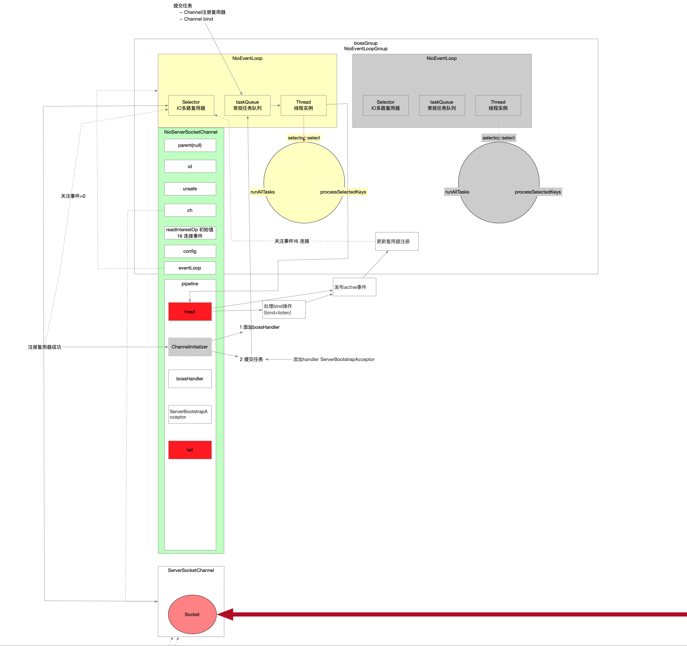

研究服务端的启动流程。

## 一 入口

```java
// AbstractBootstrap.java
/**
     * 异步非阻塞方法
     *     - 异步 比如main线程发起调用 真正的bind结果main线程并不是直接去取 而是将来真正bind成功的线程将结果回调
     *     - 非阻塞 比如main线程发起调用 最后真正执行bind操作的是其他线程(Nio线程 NioEventLoop线程)
     */
public ChannelFuture bind(int inetPort) {
    return this.bind(new InetSocketAddress(inetPort));
}
```


```java
public ChannelFuture bind(SocketAddress localAddress) {
    this.validate();
    return this.doBind(localAddress);
}
```


```java
private ChannelFuture doBind(final SocketAddress localAddress) {
    /**
         * 完成几个步骤
         *     - Netty的Channel创建(本质是通过反射方式 NioServerSocketChannel和NioSocketChannel的无参构造器)
         *     - Channel中维护几个重要组件
         *         - unsafe 操作读写
         *         - eventLoop Channel绑定的NioEventLoop Channel注册到这个NioEventLoop上的复用器Selector
         *         - pipeline 维护handler
         *     - 绑定关联Netty的Channel和NioEventLoop线程关系
         *     - Jdk的Channel注册到NioEventLoop的复用器Selector上
         *     - 注册复用器成功后发布事件
         *         - handlersAdded事件 -> 会触发ChannelInitializer的方法回调
         *         - active事件
         *         - ...
         */
    final ChannelFuture regFuture = this.initAndRegister();
    final Channel channel = regFuture.channel(); // 获取channel NioServerSocketChannel的实例
    if (regFuture.cause() != null) return regFuture;

    /**
         * Channel注册复用器是NioEventLoop线程的异步任务
         * 这里是为了保证注册复用器的操作先于bind
         *     - 复用器注册完触发ChannelInitializer方法回调 向pipeline中添加必要的handler 保证后续发生读写时 Channel都能依赖上完整的handler链
         *     - 前一个复用器注册时异步执行
         *         - 如果已经复用器注册已经完成 pipeline中handler已经初始化好 向NioEventLoop提交任务让它执行bind
         *         - 如果复用器注册还没完成 说明这个任务还在NioEventLoop的任务队列taskQueue中 这个时候再向NioEventLoop提交一个异步任务 这两个任务的顺序通过任务队列保证了相对顺序
         */
    if (regFuture.isDone()) {
        // At this point we know that the registration was complete and successful.
        ChannelPromise promise = channel.newPromise();
        doBind0(regFuture, channel, localAddress, promise); // 此时Channel已经跟NioEventLoop线程绑定了 给boss线程添加个任务 让boss线程执行bind操作 这个地方也是真正启动boss线程的时机
        return promise;
    } else {
        // Registration future is almost always fulfilled already, but just in case it's not.
        final PendingRegistrationPromise promise = new PendingRegistrationPromise(channel);
        regFuture.addListener(new ChannelFutureListener() { // nio线程注册复用器是异步操作 给这个操作加个回调 等nio线程完成注册复用器之后 让它执行doBind0(...)
            @Override
            public void operationComplete(ChannelFuture future) throws Exception {
                Throwable cause = future.cause();
                if (cause != null) {
                    // Registration on the EventLoop failed so fail the ChannelPromise directly to not cause an
                    // IllegalStateException once we try to access the EventLoop of the Channel.
                    promise.setFailure(cause);
                } else {
                    // Registration was successful, so set the correct executor to use.
                    // See https://github.com/netty/netty/issues/2586
                    promise.registered();

                    doBind0(regFuture, channel, localAddress, promise); // NioEventLoop线程执行bind(headHandler处理器真正处理) bind完成后通过向NioEventLoop提交异步任务方式 让NioEventLoop发布一个NioServerSocketChannel的active事件
                }
            }
        });
        return promise;
    }
}
```

这里涉及两个步骤：

* initAndRegister(...)方法，Channel的实例化已经将Channel跟bossGroup中NioEventLoop线程绑定，也借此启动了NioEventLoop线程，让NioEventLoop将Channel持有的Jdk的Channel注册到了NioEventLoop的复用器上。
* doBind0(...)提交异步任务让这个Channel绑定的EventLoop线程执行bind操作。

因为一个IO线程负责多个Channel，一个Channel由一个IO线程负责，非IO任务又是通过队列存取的，所以这儿的Channel注册复用器动作优先于Channel的listen动作。

假设一个场景，如果在注册复用器的时候就指定了关注的事件集合，但是Socket还没执行bind和listen，就有客户端connect，这个场景下顺序是不对的，因此在注册复用的时候是不能关注事件的，必须要等待Socket打开之后才能让复用器关注事件。

## 二 Channel注册复用器

```java
/**
     * 完成几个步骤
     *     - Netty的Channel创建(本质是通过反射方式 NioServerSocketChannel和NioSocketChannel的无参构造器)
     *     - Channel中维护几个重要组件
     *         - unsafe 操作读写
     *         - eventLoop Channel绑定的NioEventLoop Channel注册到这个NioEventLoop上的复用器Selector
     *         - pipeline 维护handler
     *     - 绑定关联Netty的Channel和NioEventLoop线程关系
     *     - Jdk的Channel注册到NioEventLoop的复用器Selector上
     *     - 注册复用器成功后发布事件
     *         - handlersAdded事件 -> 会触发ChannelInitializer的方法回调
     *         - active事件
     *         - ...
     */
final ChannelFuture initAndRegister() {
    /**
         * 具体实现是{@link NioServerSocketChannel}的实例或者{@link NioSocketChannel}的实例
         */
    Channel channel = null;
    try {
        /**
             * {@link io.netty.channel.ChannelFactory#newChannel()}->{@link ReflectiveChannelFactory#newChannel()}->{@link NioServerSocketChannel}或{@link NioSocketChannel}的无参构造器
             *
             * 两个无参构造器分别是:
             * {@link NioServerSocketChannel#NioServerSocketChannel()}
             * {@link NioSocketChannel#NioSocketChannel()}
             *
             * <p><h3>netty的channel实例化</h3></p>
             * <ul>
             *     <li>创建jdk的ServerSocketChannel和SocketChannel封装成Netty中的NioServerSocketChannel和NioSocketChannel</li>
             *     <li>给每个netty channel分配属性</li>
             *     <ul>
             *         <li>id</li>
             *         <li>unsafe实例</li>
             *         <li>pipeline实例 pipeline中有两个handler(head和tail 它们不是哑节点)</li>
             *     </ul>
             *     <li>netty的NioServerSocketChannel组合jdk的ServerSocketChannel</li>
             *     <li>NioServerSocketChannel关注OP_ACCEPT连接事件</li>
             *     <li>NioSocketChannel关注OP_READ可读事件</li>
             *     <li>设置jdk ServerSocketChannel的非阻塞模式</li>
             * </ul>
             *
             */
        channel = this.channelFactory.newChannel(); // 通过Factory触发NioServerSocketChannel和SocketChannel的反射创建实例
        /**
             *  - pipeline中添加个ChannelInitializer
             *      - 等待NioServerSocketChannel注册复用器后被回调
             *          - 添加workerHandler
             *          - 提交异步任务
             *              - 在pipeline中添加ServerBootstrapAcceptor
             */
        this.init(channel);
    } catch (Throwable t) {
        if (channel != null) {
            // channel can be null if newChannel crashed (eg SocketException("too many open files"))
            channel.unsafe().closeForcibly();
            // as the Channel is not registered yet we need to force the usage of the GlobalEventExecutor
            return new DefaultChannelPromise(channel, GlobalEventExecutor.INSTANCE).setFailure(t);
        }
        // as the Channel is not registered yet we need to force the usage of the GlobalEventExecutor
        return new DefaultChannelPromise(new FailedChannel(), GlobalEventExecutor.INSTANCE).setFailure(t);
    }

    /**
         * 至此NioEventLoop线程还没启动
         * 在register(...)方法之前 已经完成的工作
         *
         *     - channel实例
         *         - pipeline实例化
         *             - pipeline中添加了{@link ChannelInitializer}辅助类的实例 而这个辅助类的触发时机是在Channel跟EventLoop线程绑定之后
         *         - unsafe实例
         *         - 设置了jdk channel的非阻塞模式
         *     - bossGroup中仅仅实例化了特定数量的EventLoop 但是此时线程并没有被真正创建
         *     - Channel跟EventLoop没有关联
         *
         * <pre>{@code this.config().group()}返回的是{@link io.netty.channel.nio.NioEventLoopGroup}实例</pre>
         * 对于ServerBootstrap而言是bossGroup线程组
         * 对于Bootstrap而言只有一个group线程组
         *
         * 线程组的register(...)方法就是从group中轮询出来一个NioEventLoop线程执行register(...)方法 Channel跟NioEventLoop关联起来并注册到NioEventLoop的Selector上
         *     - 注册复用器结束后 NioEventLoop线程发布一些事件让关注的handler执行
         *         - handlersAdd(...)事件 触发
         *         - ...
         *             - 添加ServerBootstrapAcceptor处理来自客户端的连接
         *             - NioEventLoop线程循环
         *
         * 并且一旦Channel一旦跟EventLoop绑定 以后Channel的所有事件都由这个EventLoop线程处理
         */
    ChannelFuture regFuture = this
        .config()
        .group() // {#link ServerBootstrap#group()}或者{@link Bootstrap#group()}传进去的 比如在服务端就是boss线程组 客户端只有一个group
        .register(channel); // 异步编程 这一步就是绑定Channel跟EventLoop线程 并且往NioEventLoop中扔了个异步任务 此时NioEventLoop线程被唤醒去执行注册复用器的动作
    if (regFuture.cause() != null) { // 在register过程中发生异常
        if (channel.isRegistered()) channel.close();
        else channel.unsafe().closeForcibly();
    }

    // If we are here and the promise is not failed, it's one of the following cases:
    // 1) If we attempted registration from the event loop, the registration has been completed at this point.
    //    i.e. It's safe to attempt bind() or connect() now because the channel has been registered.
    // 2) If we attempted registration from the other thread, the registration request has been successfully
    //    added to the event loop's task queue for later execution.
    //    i.e. It's safe to attempt bind() or connect() now:
    //         because bind() or connect() will be executed *after* the scheduled registration task is executed
    //         because register(), bind(), and connect() are all bound to the same thread.
    /**
         * // 执行到这 说明后续可以进行NioSocketChannel::connect()方法或者NioServerSocketChannel::bind()方法
         * 两种情况
         *     -1 register动作是在eventLoop中发起 那么到这里的时候 register一定已经完成了
         *     -2 如果register任务已经提交到eventLoop中 也就是进到了eventLoop中的taskQueue中 由于后续的connect和bind方法也会进入到同一个eventLoop的taskQueue中 所以一定会先执行register成功 再执行connect和bind方法
         */
    return regFuture;
}
```

3个步骤

* Channel创建。
* Channel初始化。
* Channel注册到bossGroup中NioEventLoop的复用器上。

### 1 Channel创建



### 2 Channel初始化

```java
/**
             *  - pipeline中添加个ChannelInitializer
             *      - 等待NioServerSocketChannel注册复用器后被回调
             *          - 添加workerHandler
             *          - 提交异步任务
             *              - 在pipeline中添加ServerBootstrapAcceptor
             */
this.init(channel);
```


```java
// ServerBootstrap.java
/**
     * - pipeline中添加个ChannelInitializer
     *     - 等待NioServerSocketChannel注册复用器后被回调
     *         - 添加workerHandler
     *         - 提交异步任务
     *             - 在pipeline中添加ServerBootstrapAcceptor
     */
@Override
void init(Channel channel) { // NioServerSocketChannel实例
    setChannelOptions(channel, newOptionsArray(), logger);
    setAttributes(channel, newAttributesArray());

    ChannelPipeline p = channel.pipeline(); // channel内部的pipeline实例 在创建NioServerSocketChannel的时候一起创建了pipeline实例

    final EventLoopGroup currentChildGroup = childGroup; // workerGroup
    final ChannelHandler currentChildHandler = childHandler; // workerHandler
    final Entry<ChannelOption<?>, Object>[] currentChildOptions = newOptionsArray(childOptions);
    final Entry<AttributeKey<?>, Object>[] currentChildAttrs = newAttributesArray(childAttrs);

    /**
         * 往ServerSocketChannel的pipeline中添加一个handler 这个handler是ChannelInitializer的实例 该处涉及到pipeline中的辅助类ChannelInitializer 它本身也是一个handler(Inbound类型) 它的作用仅仅是辅助其他的handler加入到pipeline中
         * ChannelInitializer的initChannel方法触发时机是在Channel注册到NioEventLoop复用器之后(NioEventLoop启动执行注册操作) 那么到时候会发生回调
         *     - 添加一个ServerBootstrap指定的bossHandler(也可能没指定) 比如指定了workerHandler 那么回调执行后 pipeline存在 headHandler-workerHandler-tailHandler
         *     - 向NioEventLoop提交添加handler的异步任务
         *         - 等NioEventLoop把这个异步任务执行完了之后 pipeline中变成 head-workerHandler-ServerBootstrapAcceptor-tail
         */
    p.addLast(new ChannelInitializer<Channel>() {
        @Override
        public void initChannel(final Channel ch) { // ChannelInitializer的这个方法会在Channel注册到EventLoop线程上复用器之后被回调
            final ChannelPipeline pipeline = ch.pipeline(); // NioServerSocketChannel的pipeline
            ChannelHandler handler = config.handler(); // 这个handler是在ServerBootstrap::handler()方法中指定的workerHandler
            if (handler != null) pipeline.addLast(handler); // 将bossHandler添加到NioServerSocket的pipeline中

            ch.eventLoop().execute(new Runnable() { // 往NioEventLoop线程添加一个任务 boss的NioEventLoop线程会执行这个任务 就是给Channel指定一个处理器 处理器的功能是接收客户端请求
                @Override
                public void run() {
                    pipeline.addLast(
                        // 添加一个handler到pipeline中 ServerBootstrapAcceptor这个handler目的是用来接收客户端请求的
                        new ServerBootstrapAcceptor(
                            ch, // NioServerSocketChannel
                            currentChildGroup, // workerGroup
                            currentChildHandler, // workerHandler
                            currentChildOptions,
                            currentChildAttrs
                        )
                    );
                }
            });
        }
    });
}
```

### 3 Channel注册到NioEventLoop

```java
// AbstractBootstrap.java
/**
         * 至此NioEventLoop线程还没启动
         * 在register(...)方法之前 已经完成的工作
         *
         *     - channel实例
         *         - pipeline实例化
         *             - pipeline中添加了{@link ChannelInitializer}辅助类的实例 而这个辅助类的触发时机是在Channel跟EventLoop线程绑定之后
         *         - unsafe实例
         *         - 设置了jdk channel的非阻塞模式
         *     - bossGroup中仅仅实例化了特定数量的EventLoop 但是此时线程并没有被真正创建
         *     - Channel跟EventLoop没有关联
         *
         * <pre>{@code this.config().group()}返回的是{@link io.netty.channel.nio.NioEventLoopGroup}实例</pre>
         * 对于ServerBootstrap而言是bossGroup线程组
         * 对于Bootstrap而言只有一个group线程组
         *
         * 线程组的register(...)方法就是从group中轮询出来一个NioEventLoop线程执行register(...)方法 Channel跟NioEventLoop关联起来并注册到NioEventLoop的Selector上
         *     - 注册复用器结束后 NioEventLoop线程发布一些事件让关注的handler执行
         *         - handlersAdd(...)事件 触发
         *         - ...
         *             - 添加ServerBootstrapAcceptor处理来自客户端的连接
         *             - NioEventLoop线程循环
         *
         * 并且一旦Channel一旦跟EventLoop绑定 以后Channel的所有事件都由这个EventLoop线程处理
         * 所谓的注册指的是将Java的Channel注册到复用器Selector上
         *     - 逻辑绑定映射关系 Netty Channel跟NioEventLoop关系绑定
         *     - 物理注册复用器
         *         - 通过向NioEventLoop提交任务方式启动NioEventLoop线程
         *         - NioEventLoop线程将Jdk的Channel注册到Selector复用器上
         *             - Socket注册复用器 不关注事件
         *             - 触发事件 让pipeline中的handler关注响应(此刻pipeline中有head ChannelInitializer实例 tail)
         *                 - 发布handlerAdd事件 触发ChannelInitializer方法执行
         *                 - 发布register事件
         */
ChannelFuture regFuture = this
    .config()
    .group() // {#link ServerBootstrap#group()}或者{@link Bootstrap#group()}传进去的 比如在服务端就是boss线程组 客户端只有一个group
    .register(channel);
```


```java
// EventLoopGroup.java
ChannelFuture register(Channel channel);

// SingleThreadEventLoop.java
@Override
public ChannelFuture register(Channel channel) {
    return this.register(new DefaultChannelPromise(channel, this)); // 实例化一个Promise 将当前channel带进到promise中去
}

```


```java
// SingleThreadEventLoop.java
/**
     * <p>涉及3个方法</p>
     *
     * <p>
     *     <ul><pre>{@code channel()}</pre>返回的初始化好了的{@link io.netty.channel.socket.nio.NioServerSocketChannel}实例 发生在{@link NioServerSocketChannel#NioServerSocketChannel()}</ul>
     *     <ul><pre>{@code unsafe()}</pre>返回的是初始化channel实例的时候给每个channel分配的{@link io.netty.channel.Channel.Unsafe}实例 对象类型是{@link io.netty.channel.nio.AbstractNioMessageChannel.NioMessageUnsafe} 发生在{@link AbstractChannel#AbstractChannel(Channel)}</ul>
     *     <ul><pre>{@code register()}</pre>执行的是{@link io.netty.channel.nio.AbstractNioMessageChannel.NioMessageUnsafe}的register(...)方法 实现是在其父类中{@link io.netty.channel.AbstractChannel.AbstractUnsafe#register(EventLoop, ChannelPromise)}</ul>
     * </p>
     */
@Override
public ChannelFuture register(final ChannelPromise promise) {
    promise
        .channel()
        .unsafe()
        .register(this, promise); // promise创建的时候关联了channel
    return promise;
}
```


```java
// AbstractChannel.java::AbstractUnsafe
/**
         * Java的Channel注册到复用器Selector上
         *     - 逻辑绑定映射关系 Netty Channel跟NioEventLoop关系绑定
         *     - 物理注册复用器
         *         - 通过向NioEventLoop提交任务方式启动NioEventLoop线程
         *         - NioEventLoop线程将Jdk的Channel注册到Selector复用器上
         *             - Socket注册复用器 不关注事件
         *             - 触发事件 让pipeline中的handler关注响应(此刻pipeline中有head ChannelInitializer实例 tail)
         *                 - 发布handlerAdd事件 触发ChannelInitializer方法执行
         *                 - 发布register事件
         */
@Override
public final void register(EventLoop eventLoop, final ChannelPromise promise) {
    ObjectUtil.checkNotNull(eventLoop, "eventLoop");
    if (isRegistered()) { // 判定Channel是有跟NioEventLoop线程绑定过了 一个Channel终身只能跟一个NioEventLoop线程绑定
        promise.setFailure(new IllegalStateException("registered to an event loop already"));
        return;
    }
    if (!isCompatible(eventLoop)) { // Channel只能跟NioEventLoop这种实现进行绑定 都是网络模型下的概念
        promise.setFailure(new IllegalStateException("incompatible event loop type: " + eventLoop.getClass().getName()));
        return;
    }

    /**
             * 绑定eventLoop线程
             * 将eventLoop实例设置给channel 从此这个channel就拥有了eventLoop 后续该channel的所有异步操作都要提交给这个eventLoop来执行
             *
             * IO的本质就是数据在IO设备和内存之间的复制 所有的复制操作都交给EventLoop处理
             */
    AbstractChannel.this.eventLoop = eventLoop; // 这就是所谓的绑定关系

    /**
             * 本质目的是为了保证某些操作的执行权永远在Nio线程中
             * 条件分支的判断是为了区别当前线程是不是eventLoop线程 比如从main线程跟着{@link AbstractBootstrap#bind(int)}方法过来 main线程不是eventLoop就进行线程切换
             * 到这里为止 NioEventLoop中的Thread实例还没有创建
             */
    if (eventLoop.inEventLoop()) {
        this.register0(promise);
    } else {
        try {
            // NioEventLoop线程负责任务执行 执行真正的操作 将Java的Channel注册到复用器上
            eventLoop.execute(new Runnable() {
                @Override
                public void run() {
                    AbstractUnsafe.this.register0(promise);
                }
            });
        } catch (Throwable t) {
            closeForcibly();
            closeFuture.setClosed();
            safeSetFailure(promise, t);
        }
    }
}
```

从这个地方就可以明白所谓的Channl注册到NioEventLoop的含义：

* 将Channel跟NioEvnetLoop进行关系绑定。
* 将Channel代表的系统Socket注册到NioEventLoop持有的IO多路复用器上 还不关注事件 因为NioServerSocketChannel还没打开。
* 注册复用器之后 触发一些回调方法执行或者发布事件。
  * 发布handlerAdded事件，触发ChannelInitializer方法回调。
  * 发布NioServerSocketChannel register事件。

```java
// AbstractChannel.java::AbstractUnsafe
/**
         * - NioEventLoop线程执行 Jdk的Channel注册到复用器上
         * - 发布事件
         *     - 发布handlerAdd事件 触发ChannelInitializer方法执行
         *     - 发布register事件
         */
private void register0(ChannelPromise promise) {
    try {
        // check if the channel is still open as it could be closed in the mean time when the register
        // call was outside of the eventLoop
        if (!promise.setUncancellable() || !ensureOpen(promise)) return;
        boolean firstRegistration = neverRegistered;
        /**
                 * 实际的注册
                 * jdk底层操作 将channel注册到selector复用器上
                 */
        AbstractChannel.this.doRegister();
        neverRegistered = false;
        AbstractChannel.this.registered = true; // 标识Channel跟NioEventLoop绑定成功

        // Ensure we call handlerAdded(...) before we actually notify the promise. This is needed as the
        // user may already fire events through the pipeline in the ChannelFutureListener.

        /**
                 *
                 * 事件响应式编程的体现点
                 * 当前的register操作已经成功 该事件应该被pipeline上所有关心register事件的handler感知
                 * 因此需要先确保pipeline上handler已经完备 也就是ChannelInitializer这个辅助类已经完成
                 */

        /**
                 * 发布handlerAdd事件
                 * 让pipeline中handler关注handlerAdded(...)的handler执行
                 *     - 触发ChannelInitializer方法执行
                 */
        pipeline.invokeHandlerAddedIfNeeded();

        safeSetSuccess(promise); // 设置当前promise状态为success 当前register()方法是在eventLoop中的线程中执行的 需要通知提交register操作的那个线程
        /**
                 * 发布register事件
                 * 让pipeline中handler关注channelRegistered(...)的handler执行
                 */
        pipeline.fireChannelRegistered();
        // Only fire a channelActive if the channel has never been registered. This prevents firing
        // multiple channel actives if the channel is deregistered and re-registered.
        if (isActive()) { // active指channel已经打开
            if (firstRegistration) { // 如果该channel是第一次执行register 那么往pipeline中丢一个fireChannelActive事件
                /**
                         * 发布active事件
                         * 让pipeline中handler关注invokeChannelActive(...)的handler执行
                         */
                pipeline.fireChannelActive();
            } else if (config().isAutoRead()) {
                // This channel was registered before and autoRead() is set. This means we need to begin read
                // again so that we process inbound data.
                //
                // See https://github.com/netty/netty/issues/4805
                this.beginRead(); // 该channel已经register过了 让该channel立马去监听通道中的OP_READ事件
            }
        }
    } catch (Throwable t) {
        // Close the channel directly to avoid FD leak.
        closeForcibly();
        closeFuture.setClosed();
        safeSetFailure(promise, t);
    }
}
```

#### 3.1 Selector复用器注册

```java
// AbstractChannel.java::AbstractUnsafe
AbstractChannel.this.doRegister();
```

可以参考之前。

#### 3.2 Channel注册复用器之后 触发一些方法执行

##### 3.2.1 发布handlerAdd事件

```java
// AbstractChannel.java::AbstractUnsafe
/**
                 * 发布handlerAdd事件
                 * 让pipeline中handler关注handlerAdded(...)的handler执行
                 *     - 触发ChannelInitializer方法执行
                 */
pipeline.invokeHandlerAddedIfNeeded();
```

原理。

##### 3.2.2 发布register事件

```java
// AbstractChannel.java::AbstractUnsafe
// 到此为止 Channel中pipeline中的handler已经完备了 可以对关注的事件进行关注了

/**
                 * 发布register事件
                 * 让pipeline中handler关注channelRegistered(...)的handler执行
                 */
pipeline.fireChannelRegistered();
```


```java
// DefaultChannelPipeline.java
@Override
public final ChannelPipeline fireChannelRegistered() {
    AbstractChannelHandlerContext.invokeChannelRegistered(head); // 参数为pipeline中的head节点 明显的责任链模式 让链表上所有处理器都走一遍事件 InBound类型事件 从head->tail
    return this;
}
```


```java
// AbstractChannelHandlerContext.java
static void invokeChannelRegistered(final AbstractChannelHandlerContext next) { // 责任链模式 pipeline上所有handler都处理一遍事件
    EventExecutor executor = next.executor();
    // 线程切换 确保NioEventLoop的执行权
    if (executor.inEventLoop()) {
        next.invokeChannelRegistered();
    } else {
        executor.execute(new Runnable() {
            @Override
            public void run() {
                next.invokeChannelRegistered();
            }
        });
    }
}
```


```java
private void invokeChannelRegistered() {
    if (invokeHandler()) {
        try {
            ((ChannelInboundHandler) handler()).channelRegistered(this); // head->tail
        } catch (Throwable t) {
            invokeExceptionCaught(t);
        }
    } else {
        fireChannelRegistered();
    }
}
```

上面一步已经执行过handlersAdded的回调，也就是执行过ChannelInitializer的方法，此时NioServerSocketChannel的pipeline中有head、workerHandler、SocketBootstrapAcceptor、tail。

从head->tail上这个4个handler都要看一下invokeChannelRegistered这个方法有没有自己的实现。

下面事件发布需要一个前提条件就是Channel已经打开。

但是在Netty中Channel注册复用器属于前置动作：

* 先于NioServerSocketChannel的bind(bind+listen)操作。
* 先于NioSocketChannel的connect操作。

因此Channel注册完复用器走到这时Channel还没有active。

## 三 bind操作

在bind之前此时IO线程已经运行起来了，但是Channel注册复用器时候关注的事件集合是0，因此在bind操作之后还需要更新复用器的register。

bind步骤：

* bind+listen
* 更新register

```java
/**
     * Channel中发生的读写数据操作都会按照InBound和OutBound类型交给pipeline 让关注的handler执行
     */
private static void doBind0(final ChannelFuture regFuture, final Channel channel, final SocketAddress localAddress, final ChannelPromise promise) {
    // This method is invoked before channelRegistered() is triggered.  Give user handlers a chance to set up
    // the pipeline in its channelRegistered() implementation.
    /**
         * 提交异步任务让NioEventLoop线程执行bind
         * 这个地方的bind对应OS的Socket编程中的bind和listen
         * 此时pipeline的handler(head workerHandler ServerBootstrapAcceptor tail) bind操作属于OutBound类型 因此从tail往前找handler headHandler负责真正执行bind和listen
         * NioEventLoop执行真正的bind操作 添加监听器处理异步操作结果 NioEventLoop执行bind结束后 它自己知道bind结果 处理ChannelFutureListener.CLOSE_ON_FAILURE的逻辑
         */
    channel.eventLoop().execute(new Runnable() {
        @Override
        public void run() {
            if (regFuture.isSuccess()) channel.bind(localAddress, promise).addListener(ChannelFutureListener.CLOSE_ON_FAILURE);
            else promise.setFailure(regFuture.cause());
        }
    });
}
```


```java
// AbstractChannel.java
@Override
public ChannelFuture bind(SocketAddress localAddress, ChannelPromise promise) { // Channel上pipeline中handler 责任链处理
    return this.pipeline.bind(localAddress, promise);
}
```


```java
// DefaultChannelPipeline.java
@Override
public final ChannelFuture bind(SocketAddress localAddress, ChannelPromise promise) {
    /**
         * bind是交给pipeline来执行的 bind属于Outbound类型的操作 从pipeline的tail开始往前找 tailHandler->workerHandler->ServerBootstrapAcceptor->headHandler
         * head和tail的基类是AbstractChannelHandlerContext 具体实现维护在当前类的两个内部类中HeadContext和TailContext
         * {@link HeadContext}
         * {@link TailContext}
         * 最终bind的操作由headHandler来处理 执行了Jdk的Socket的bind和listen操作
         */
    return tail.bind(localAddress, promise);
}
```


```java
// AbstractChannelHandlerContext.java
@Override
public ChannelFuture bind(final SocketAddress localAddress, final ChannelPromise promise) { // 执行Jdk底层Socket逻辑 bind和listen
    ObjectUtil.checkNotNull(localAddress, "localAddress");
    if (isNotValidPromise(promise, false)) return promise;
    final AbstractChannelHandlerContext next = this.findContextOutbound(MASK_BIND); // 比如此刻pipeline中有4个handler(headHandler->logHandler->ServerBootstrapAcceptor->tailHandler) bind属于OutBound操作 从tailHandler往前找OutBound类型的handler 先找到了logHandler 但是它没有重写bind方法 而是直接调用模板方法(将任务继续往前传 让OutBound类型handler继续处理) 最终bind的实现在headHandler中
    EventExecutor executor = next.executor();
    // 保证NioEventLoop处理同一个Channel 如果不是NioEventLoop在执行 就通过向NioEventLoop提交异步任务方式切换线程
    if (executor.inEventLoop())
        next.invokeBind(localAddress, promise);
    else {
        safeExecute(executor, new Runnable() {
            @Override
            public void run() {
                next.invokeBind(localAddress, promise);
            }
        }, promise, null, false);
    }
    return promise;
}
```


```java
// HeadContext
@Override
public void bind(ChannelHandlerContext ctx, SocketAddress localAddress, ChannelPromise promise) { // bind最终实现在headHandler
    unsafe.bind(localAddress, promise);
}
```


```java
// AbstractChannel.java
@Override
public final void bind(final SocketAddress localAddress, final ChannelPromise promise) {
    assertEventLoop();

    if (!promise.setUncancellable() || !ensureOpen(promise))
        return;

    // See: https://github.com/netty/netty/issues/576
    if (Boolean.TRUE.equals(config().getOption(ChannelOption.SO_BROADCAST)) &&
        localAddress instanceof InetSocketAddress &&
        !((InetSocketAddress) localAddress).getAddress().isAnyLocalAddress() &&
        !PlatformDependent.isWindows() && !PlatformDependent.maybeSuperUser()) {
        // Warn a user about the fact that a non-root user can't receive a
        // broadcast packet on *nix if the socket is bound on non-wildcard address.
    }

    boolean wasActive = isActive(); // Channel执行完bind操作之后 这个标识位是true 此时还没bind因此它是false
    try {
        /**
                 * 子类{@link io.netty.channel.socket.nio.NioServerSocketChannel#doBind(SocketAddress)} 调用jdk的channel绑定端口的逻辑
                 */
        AbstractChannel.this.doBind(localAddress);
    } catch (Throwable t) {
        safeSetFailure(promise, t);
        closeIfClosed();
        return;
    }

    if (!wasActive && isActive()) { // 确保bind操作成功 发布NioServerSocket的active的事件
        invokeLater(new Runnable() {
            @Override
            public void run() {
                pipeline.fireChannelActive(); // bind(bind+listen)成功了 截止当前服务端复用器关注的事件集合还是0 不关注事件 这个active事件会触发更新复用器关注NioServerSocketChannel的可读事件
            }
        });
    }

    safeSetSuccess(promise);
}
```

### 1 Jdk的bind和listen

```java
// AbstractChannel.java
/**
                 * 子类{@link io.netty.channel.socket.nio.NioServerSocketChannel#doBind(SocketAddress)} 调用jdk的channel绑定端口的逻辑
                 */
AbstractChannel.this.doBind(localAddress);
```

### 2 更新复用器register的selectionKey

```java
// AbstractChannel.java
/**
                 * 异步任务 此时pipeline中的handler有4个
                 *     - head
                 *     - workerHandler
                 *     - ServerBootstrapAcceptor
                 *     - tail
                 *     
                 * 从head->tail开始关注NioServerSocketChannel的active事件
                 * 在head节点中埋点更新了复用器的register
                 */
invokeLater(new Runnable() {
    @Override
    public void run() {
        pipeline.fireChannelActive(); // bind(bind+listen)成功了 截止当前服务端复用器关注的事件集合还是0 不关注事件 这个active事件会触发更新复用器关注NioServerSocketChannel的可读事件
    }
});
```


```java
// HeadContext
@Override
public void channelActive(ChannelHandlerContext ctx) {
    ctx.fireChannelActive(); // head->tail head将NioServerSocketChannel的active事件向后传播 让后面关注这个事件的handler继续处理

    readIfIsAutoRead(); // 更新复用器register的地方
}
```


```java
private void readIfIsAutoRead() {
    if (channel.config().isAutoRead()) { // 默认值就是true
        channel.read();
    }
}
```


```java
// AbstractChannel.java
@Override
public Channel read() {
    pipeline.read();
    return this;
}
```


```java
// DefaultChannelPipeline.java
@Override
public final ChannelPipeline read() {
    tail.read();
    return this;
}
```


```java
// AbstractChannelHandlerContext.java
@Override
public ChannelHandlerContext read() {
    final AbstractChannelHandlerContext next = findContextOutbound(MASK_READ); // 从tail->head往前找OutBound类型处理器 找到了head
    EventExecutor executor = next.executor();
    if (executor.inEventLoop()) {
        next.invokeRead();
    } else {
        Tasks tasks = next.invokeTasks;
        if (tasks == null) {
            next.invokeTasks = tasks = new Tasks(next);
        }
        executor.execute(tasks.invokeReadTask);
    }

    return this;
}
```


```java
private void invokeRead() {
    if (invokeHandler()) {
        try {
            ((ChannelOutboundHandler) handler()).read(this); // NioServerSocketChannel的active触发读发生在head中
        } catch (Throwable t) {
            invokeExceptionCaught(t);
        }
    } else {
        read();
    }
}
```


```java
// HeadContext
@Override
public void read(ChannelHandlerContext ctx) {
    unsafe.beginRead();
}
```


```java
// AbstractChannel.java
@Override
public final void beginRead() { // NioServerSocketChannel的active触发的读
    assertEventLoop();

    try {
        AbstractChannel.this.doBeginRead();
    } catch (final Exception e) {
        invokeLater(new Runnable() {
            @Override
            public void run() {
                pipeline.fireExceptionCaught(e);
            }
        });
        close(voidPromise());
    }
}

```


```java
@Override
protected void doBeginRead() throws Exception { // NioServerSocketChannel bind之后的active事件触发的读
    // Channel.read() or ChannelHandlerContext.read() was called
    final SelectionKey selectionKey = this.selectionKey; // 复用器待监听的Channel NioServerSocketChannel注册复用器时候关注的事件是0 也就是不关注事件 现在已经bind+listen好 需要更新监听状态 关注连接事件了
    if (!selectionKey.isValid())
        return;

    readPending = true;
    final int interestOps = selectionKey.interestOps(); // 之前注册的时候感兴趣的事件
    if ((interestOps & readInterestOp) == 0) { // NioServerSocketChannel已经bind+listen好 需要关注可读事件(也就是连接事件) 因此现在更新复用器的register
        selectionKey.interestOps(interestOps | readInterestOp);
    }
}
```

## 四 流程图

至此NioServerSocketChannel相关流程图如下：



服务端彻底启动：

* Socket完成了bind
* Socket完成了listen
* 注册IO多路复用器关注连接事件(16)
* IO线程阻塞在复用器上等待客户端的连接进来

至于的工作原理请移步。
