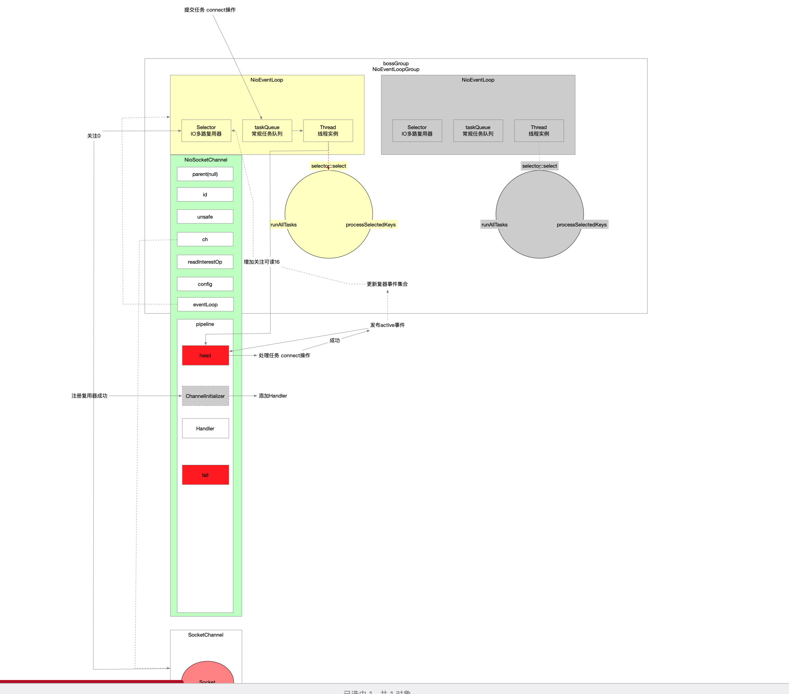

有过之前对服务端的分析之后，客户端的connect流程就显得简单了。

## 一 入口

```java
// Bootstrap.java
public ChannelFuture connect(String inetHost, int inetPort) { // 异步
    return this.connect(InetSocketAddress.createUnresolved(inetHost, inetPort));
}
```


```java
public ChannelFuture connect(SocketAddress remoteAddress) {
    ObjectUtil.checkNotNull(remoteAddress, "remoteAddress");
    this.validate(); // 校验参数是否正确设置
    return this.doResolveAndConnect(remoteAddress, config.localAddress());
}
```


```java
private ChannelFuture doResolveAndConnect(final SocketAddress remoteAddress, final SocketAddress localAddress) {
    final ChannelFuture regFuture = super.initAndRegister(); // 跟NioServerSocketChanel::bind一样都是在父类中实现
    final Channel channel = regFuture.channel();

    if (regFuture.isDone()) {
        if (!regFuture.isSuccess()) {
            return regFuture;
        }
        return this.doResolveAndConnect0(channel, remoteAddress, localAddress, channel.newPromise()); // 触发了NioSocketChannel绑定的NioEventLoop线程启动
    } else {
        // Registration future is almost always fulfilled already, but just in case it's not.
        final PendingRegistrationPromise promise = new PendingRegistrationPromise(channel);
        regFuture.addListener(new ChannelFutureListener() {
            @Override
            public void operationComplete(ChannelFuture future) throws Exception {
                // Directly obtain the cause and do a null check so we only need one volatile read in case of a
                // failure.
                Throwable cause = future.cause();
                if (cause != null) {
                    // Registration on the EventLoop failed so fail the ChannelPromise directly to not cause an
                    // IllegalStateException once we try to access the EventLoop of the Channel.
                    promise.setFailure(cause);
                } else {
                    // Registration was successful, so set the correct executor to use.
                    // See https://github.com/netty/netty/issues/2586
                    promise.registered();
                    doResolveAndConnect0(channel, remoteAddress, localAddress, promise);
                }
            }
        });
        return promise;
    }
}
```

核心方法有2个:

* 。
* doResolveAndConnect0(...)方法。

initAndRegister跟NioServerSocket中的bind(...)流程一样。

* 都是将Channel注册复用器前置化，有IO线程异步完成。
* Netty Channel的创建，底层映射OS的Socket。
* Channel中pipeline初始化。
* Netty Channel中持有Jdk的Channel 将Jdk的Channel注册到IO多路复用器上，关注的事件集合为0(不关注事件，因为此时Channel还没打开)。
* 注册复用器后执行一些回调，完善pipeline中handler链。

我们只要关注doResolveAndConnect0(...)这个方法就行。

## 二 doResolveAndConnect0(...)方法

```java
// Bootstrap.java
private ChannelFuture doResolveAndConnect0(final Channel channel, SocketAddress remoteAddress,
                                           final SocketAddress localAddress, final ChannelPromise promise) {
    try {
        final EventLoop eventLoop = channel.eventLoop();
        AddressResolver<SocketAddress> resolver;
        try {
            resolver = this.resolver.getResolver(eventLoop);
        } catch (Throwable cause) {
            channel.close();
            return promise.setFailure(cause);
        }

        if (!resolver.isSupported(remoteAddress) || resolver.isResolved(remoteAddress)) {
            // Resolver has no idea about what to do with the specified remote address or it's resolved already.
            doConnect(remoteAddress, localAddress, promise); // 通过向NioEventLoop线程提交任务方式触发线程启动 并让该线程真正发起系统调用connect
            return promise;
        }

        final Future<SocketAddress> resolveFuture = resolver.resolve(remoteAddress);

        if (resolveFuture.isDone()) {
            final Throwable resolveFailureCause = resolveFuture.cause();

            if (resolveFailureCause != null) {
                // Failed to resolve immediately
                channel.close();
                promise.setFailure(resolveFailureCause);
            } else {
                // Succeeded to resolve immediately; cached? (or did a blocking lookup)
                doConnect(resolveFuture.getNow(), localAddress, promise);
            }
            return promise;
        }

        // Wait until the name resolution is finished.
        resolveFuture.addListener(new FutureListener<SocketAddress>() {
            @Override
            public void operationComplete(Future<SocketAddress> future) throws Exception {
                if (future.cause() != null) {
                    channel.close();
                    promise.setFailure(future.cause());
                } else {
                    doConnect(future.getNow(), localAddress, promise);
                }
            }
        });
    } catch (Throwable cause) {
        promise.tryFailure(cause);
    }
    return promise;
}
```


```java
// Bootstrap.java
private static void doConnect(final SocketAddress remoteAddress, final SocketAddress localAddress, final ChannelPromise connectPromise) {

    // This method is invoked before channelRegistered() is triggered.  Give user handlers a chance to set up
    // the pipeline in its channelRegistered() implementation.
    final Channel channel = connectPromise.channel();
    // 确保IO线程的执行权利 提交异步任务
    channel.eventLoop().execute(new Runnable() {
        @Override
        public void run() {
            if (localAddress == null) {
                channel.connect(remoteAddress, connectPromise);
            } else {
                channel.connect(remoteAddress, localAddress, connectPromise);
            }
            connectPromise.addListener(ChannelFutureListener.CLOSE_ON_FAILURE);
        }
    });
}
```


```java
// ChannelOutboundInvoker.java
ChannelFuture connect(SocketAddress remoteAddress, ChannelPromise promise);
```


```java
// DefaultChannelPipeline.java
@Override
public final ChannelFuture connect(SocketAddress remoteAddress, ChannelPromise promise) {
    return tail.connect(remoteAddress, promise); // connect是交给pipeline来执行的 connect属于Outbound类型的操作 从pipeline的tail开始 此时NioSocketChannel的pipeline中有head bizHandler tail
}
```


```java
// AbstractChannelHandlerContext.java
@Override
public ChannelFuture connect(SocketAddress remoteAddress, ChannelPromise promise) {
    return this.connect(remoteAddress, null, promise);
}
```


```java
@Override
public ChannelFuture connect(final SocketAddress remoteAddress, final SocketAddress localAddress, final ChannelPromise promise) {
    ObjectUtil.checkNotNull(remoteAddress, "remoteAddress");

    if (isNotValidPromise(promise, false)) {
        // cancelled
        return promise;
    }

    final AbstractChannelHandlerContext next = findContextOutbound(MASK_CONNECT); // 在客户端初始化时 pipeline中只有3个handler(head bizHandler tail) connect是Outbound类型事件 从tail->head找Outbound类型的handler 最终实现在head中
    EventExecutor executor = next.executor();
    // connect这一动作也是有NioEventLoop负责
    if (executor.inEventLoop()) {
        next.invokeConnect(remoteAddress, localAddress, promise);
    } else {
        safeExecute(executor, new Runnable() {
            @Override
            public void run() {
                next.invokeConnect(remoteAddress, localAddress, promise);
            }
        }, promise, null, false);
    }
    return promise;
}
```

## 三 HeadContext中实现connect

```java
// HeadContext
@Override
public void connect(
    ChannelHandlerContext ctx,
    SocketAddress remoteAddress, SocketAddress localAddress,
    ChannelPromise promise) {
    unsafe.connect(remoteAddress, localAddress, promise); // 用unsafe操作OS底层系统调用
}
```


```java
// AbstractNioUnsafe
@Override
public final void connect(
    final SocketAddress remoteAddress, final SocketAddress localAddress, final ChannelPromise promise) {
    if (!promise.setUncancellable() || !ensureOpen(promise)) {
        return;
    }

    try {
        if (connectPromise != null) {
            // Already a connect in process.
            throw new ConnectionPendingException();
        }

        boolean wasActive = isActive(); // 在系统调用connect执行成功前标识还是false
        /**
                 * 当前是基于Nio非阻塞模型 所以调用Socket的connect操作是非阻塞的 不管是否connect成功 都会立即返回
                 * - 如果立即连接服务器就成功了 客户端的连接工作就结束了
                 *     - 向pipeline发布传递一个active事件
                 * - 如果暂时还没连接成功 就需要客户端阻塞在复用器上关注着连接事件到来
                 *     - 此前复用器上的事件集合是0 所以如果连接失败 需要关注连接事件8
                 *     - 但是不能无限阻塞着 所以一般客户端都会设置连接超时时间
                 *
                 * 所以什么时候客户端连接服务端成功了 什么时候就向pipeline发布传播一个active事件
                 * 这个时机只有两个
                 *     - 立即连接成功 下面这个方法fulfillConnectPromise(...)直接发布事件
                 *     - 超时内连接成功 复用器select(...)出来了就绪IO
                 */
        if (doConnect(remoteAddress, localAddress)) {
            fulfillConnectPromise(promise, wasActive); // 连接成功 在NioSocketChannel的pipeline传播active事件
        } else { // 根据配置的超时检查一次
            connectPromise = promise;
            requestedRemoteAddress = remoteAddress;

            // Schedule connect timeout.
            int connectTimeoutMillis = config().getConnectTimeoutMillis();
            if (connectTimeoutMillis > 0) {
                // 向IO线程提交一个超时检测器 这个超时检测器就是为了控制客户端连接超时
                connectTimeoutFuture = eventLoop().schedule(new Runnable() {
                    @Override
                    public void run() {
                        ChannelPromise connectPromise = AbstractNioChannel.this.connectPromise;
                        if (connectPromise != null && !connectPromise.isDone()
                            && connectPromise.tryFailure(new ConnectTimeoutException(
                                "connection timed out: " + remoteAddress))) {
                            close(voidPromise());
                        }
                    }
                }, connectTimeoutMillis, TimeUnit.MILLISECONDS);
            }

            promise.addListener(new ChannelFutureListener() {
                @Override
                public void operationComplete(ChannelFuture future) throws Exception {
                    if (future.isCancelled()) {
                        if (connectTimeoutFuture != null) {
                            connectTimeoutFuture.cancel(false);
                        }
                        connectPromise = null;
                        close(voidPromise());
                    }
                }
            });
        }
    } catch (Throwable t) {
        promise.tryFailure(annotateConnectException(t, remoteAddress));
        closeIfClosed();
    }
}
```

## 四 连接成功后active事件发布

### 1 立即连接成功

```java
// AbstractNioUnsafe
fulfillConnectPromise(promise, wasActive); // 连接成功 在NioSocketChannel的pipeline传播active事件
```

### 2 超时内连接成功

```java
// NioEventLoop.java
int readyOps = k.readyOps(); // Jdk的Channel发生的事件类型
if ((readyOps & SelectionKey.OP_CONNECT) != 0) { // Jdk的Channel发生了连接事件(8) 客户端向服务端发起connect操作 是个非阻塞操作 可能没有立即连接成功 在超时时间内连接成功了 因此在发起连接后要关注客户上的连接事件
    // remove OP_CONNECT as otherwise Selector.select(..) will always return without blocking
    // See https://github.com/netty/netty/issues/924
    int ops = k.interestOps();
    ops &= ~SelectionKey.OP_CONNECT;
    k.interestOps(ops); // 连接建立之后 客户端向服务端关注的事件将是读写 所以不必继续关注连接

    unsafe.finishConnect(); // 客户端连接成功后 向NioSocketChannel的pipeline发布传播active事件
}
```


不管连接成功时机，都将触发fulfillConnectPromise(...)执行，通过它向pipeline发布active事件：

```java
// AbstractNioUnsafe
private void fulfillConnectPromise(ChannelPromise promise, boolean wasActive) {
    if (promise == null) {
        // Closed via cancellation and the promise has been notified already.
        return;
    }

    // Get the state as trySuccess() may trigger an ChannelFutureListener that will close the Channel.
    // We still need to ensure we call fireChannelActive() in this case.
    boolean active = isActive();

    // trySuccess() will return false if a user cancelled the connection attempt.
    boolean promiseSet = promise.trySuccess();

    // Regardless if the connection attempt was cancelled, channelActive() event should be triggered,
    // because what happened is what happened.
    if (!wasActive && active) {
        pipeline().fireChannelActive(); // 向NioSocketChannel的pipeline发布一个active事件 head->tail 现在pipeline中有3个handler head-bizHandler-tail 最终实现在head中
    }

    // If a user cancelled the connection attempt, close the channel, which is followed by channelInactive().
    if (!promiseSet) {
        close(voidPromise());
    }
}
```


```java
// DefaultChannelPipeline.java
@Override
public final ChannelPipeline fireChannelActive() { // NioSocketChannel连接成功之后 pipeline中有head-bizHandler-tail 从head->tail向pipeline传播一个active事件 最终实现在head中
    AbstractChannelHandlerContext.invokeChannelActive(head);
    return this;
}
```


```java
// HeadContext
/**
         * Channel打开后 沿着head->tail的方向在pipeline中传播active事件 让后面关注这个事件的handler继续处理
         * - NioServerSocketChannel 执行bind+listen成功后发布active事件
         *     - 在NioServerSocketChannel打开之前 复用器关注的事件集合是0
         *     - 现在已经打开 需要关注连接事件(16)
         * - NioSocketChannel 执行connect成功后发布active事件
         *     - 在NioSocketChannel连接成功之前
         *         - 可能关注的事件集合一直都是0 发起连接connect立即成功
         *         - 可能罐组合的事件集合0->8为了在连接超时内让复用器关注连接事件 然后连接成功之后有将8移除恢复原状
         *     - 现在已经连接上服务端 不需要再继续关注连接类型事件(8) 将连接类型从事件集合中移除
         *     
         * 现在不管是NioServerSocketChannel还是NioSocketChannel都是处于active状态
         * 需要更新复用器事件集合
         */
@Override
public void channelActive(ChannelHandlerContext ctx) {
    ctx.fireChannelActive();

    readIfIsAutoRead(); // 更新复用器register的地方
}
```


```java
// HeadContext
/**
         * Channel打开后 沿着head->tail的方向在pipeline中传播active事件 让后面关注这个事件的handler继续处理
         * - NioServerSocketChannel 执行bind+listen成功后发布active事件
         *     - 在NioServerSocketChannel打开之前 复用器关注的事件集合是0
         *     - 现在已经打开 需要关注连接事件(16)
         * - NioSocketChannel 执行connect成功后发布active事件
         *     - 在NioSocketChannel连接成功之前
         *         - 可能关注的事件集合一直都是0 发起连接connect立即成功
         *         - 可能罐组合的事件集合0->8为了在连接超时内让复用器关注连接事件 然后连接成功之后有将8移除恢复原状
         *     - 现在已经连接上服务端 不需要再继续关注连接类型事件(8) 将连接类型从事件集合中移除
         *
         * 现在不管是NioServerSocketChannel还是NioSocketChannel都是处于active状态
         * 需要更新复用器事件集合
         */
@Override
public void channelActive(ChannelHandlerContext ctx) {
    ctx.fireChannelActive();

    readIfIsAutoRead(); // 更新复用器register的地方
}

private void readIfIsAutoRead() {
    if (channel.config().isAutoRead()) { // 默认值就是true
        channel.read();
    }
}
```


```java
// AbstractChannel.java
@Override
public Channel read() {
    pipeline.read(); // tail->head方向找Outbound类型处理器 最终实现在head中
    return this;
}
```


```java
// DefaultChannelPipeline.java
@Override
public final ChannelPipeline read() {
    tail.read(); // tail->head找Outbound类型处理器 最终实现在head中
    return this;
}
```


```java
// AbstractChannelHandlerContext.java
@Override
public ChannelHandlerContext read() {
    final AbstractChannelHandlerContext next = findContextOutbound(MASK_READ); // 从tail->head往前找OutBound类型处理器 找到了head 最终实现在head中
    EventExecutor executor = next.executor();
    if (executor.inEventLoop()) { // 发生在head中
        next.invokeRead();
    } else {
        Tasks tasks = next.invokeTasks;
        if (tasks == null) {
            next.invokeTasks = tasks = new Tasks(next);
        }
        executor.execute(tasks.invokeReadTask);
    }

    return this;
}
```


```java
// HeadContext
@Override
public void read(ChannelHandlerContext ctx) {
    unsafe.beginRead(); // NioServerSocketChannel和NioSocketChannel的active触发读发生在head中
}
```


```java
// AbstractUnsafe
@Override
public final void beginRead() { // NioServerSocketChannel和NioSocketChannel的active触发的读
    assertEventLoop();

    try {
        AbstractChannel.this.doBeginRead();
    } catch (final Exception e) {
        invokeLater(new Runnable() {
            @Override
            public void run() {
                pipeline.fireExceptionCaught(e);
            }
        });
        close(voidPromise());
    }
}
```


```java
// AbstractNioChannel.java
/**
     * NioServerSocketChannel和NioSocketChannel active之后触发的读
     *     - NioServerSocketChannel bind之后
     *     - NioSocketChannel connect之后
     *
     * 复用器待监听的Channel
     *     - NioServerSocketChannel注册复用器时候关注的事件是0 也就是不关注事件 现在已经bind+listen好 需要更新监听状态 关注连接事件了 对于服务端而言 客户端向其连接/读 服务端视角看到的都是收到了可读事件
     *     - NioSocketChannel
     *         - 注册的时候关注的是0 立即连接服务器成功 现在需要关注可读事件
     *         - 注册的时候关注的是0 连接操作的时候没有立即成功 而是在超时内成功的 中间复用器关注的类型就增加过连接状态(8) 连接成功之后 又将连接状态从复用器事件集合中移除了 最终还是变成了0
     *
     * 现在Channel都要增加对可读的关注
     */
@Override
protected void doBeginRead() throws Exception {
    // Channel.read() or ChannelHandlerContext.read() was called
    final SelectionKey selectionKey = this.selectionKey;
    if (!selectionKey.isValid())
        return;

    readPending = true;
    final int interestOps = selectionKey.interestOps(); // 之前注册的时候感兴趣的事件 之前关注的事件=0
    if ((interestOps & readInterestOp) == 0) { // NioServerSocketChannel已经bind+listen好 需要关注可读事件(也就是连接事件) 因此现在更新复用器的register
        selectionKey.interestOps(interestOps | readInterestOp);
    }
}
```

## 五 流程图


