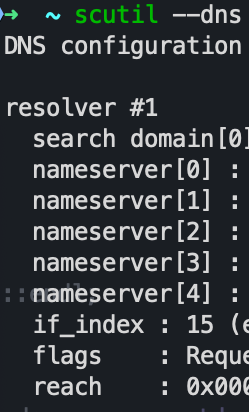
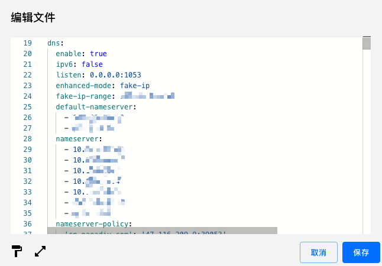

最近Clash代理出现问题

- dns打开，外网可以，内网炸
- dns关闭，内网可以，外网炸

所以问题就出在了dns解析上，打开dns后，Clash会劫持系统的dns请求，但是dns解析不了公司的域名，所以要把公司的dns配置上就行

## 1 查出来公司的DNS

```shell
scutil --dns
```



## 2 配置到Clash

把对应的ip粘贴到Clash的DNS配置，加在nameserver下面




