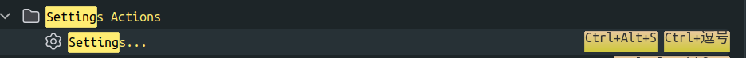
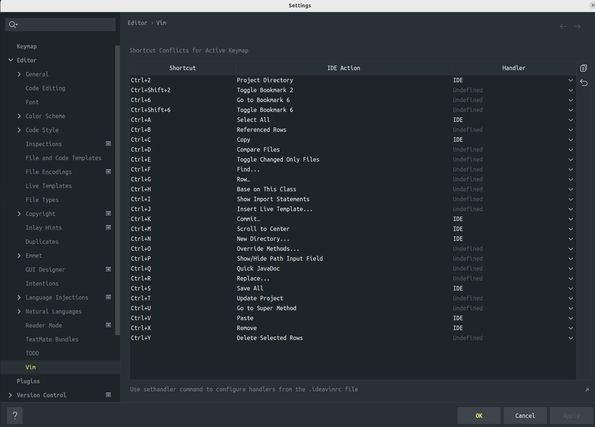

零刻Ser6ProVest，配置是AMD-R7+32G+1T，刷了Ubuntu系统作为主力机。

1 刷机步骤
---

- 下载ubuntu桌面板iso

- 用balenaEtcher制作u盘启动盘

- mini主机背面有提示，Dlete键进BIOS设置

- bios->security->secure mode=standard

- bios->security->secure boot=enabled

- bios->boot->boot option#1=USB Device:UEFI

- F4保存并退出

2 键盘健位改键
---

### 2.1 keycodes

```shell
cd /usr/share/X11/xkb/keycodes/

sudo cp evdev evdev.bak
```

将`LALT`和`LCTL`的值互换，然后保存，注销重启。

#### 2.2 gssettings

it also works as below

```sh
gsettings get org.gnome.desktop.input-sources xkb-options
gsettings set org.gnome.desktop.input-sources xkb-options "['ctrl:swap_lalt_lctl']"
gsettings get org.gnome.desktop.input-sources xkb-options
```

3 软件安装
---

### 3.1 clash

#### 3.1.1 download

https://v2rayse.com/client/#google_vignette


Clash.for.Windows-0.20.30-x64-linux.tar.gz

#### 3.1.2  创建文件夹

mkdir /home/Documents/softWare

#### 3.1.3 unzip

```shell
mv /home/Downloads/Clash.for.Windows-0.20.30-x64-linux.tar.gz /home/Documents/softWare

cd /home/Documents/softWare

tar -zxvf Clash.for.Windows-0.20.30-x64-linux.tar.gz

rm -rf *.gz

mv Clash.for.Windows-0.20.30-x64-linux clash
```

#### 3.1.4 icon

为其下载图片作为icon

/home/rui/Documents/softWare/clash/Clash_Logo.png

#### 3.1.5 制作桌面启动器

```shell
/home/rui/.local/share/applications

vi clash.desktop
```

内容如下

```shell
[Desktop Entry]
Name=clash for windows
Icon=/home/rui/Documents/softWare/clash/Clash_Logo.png
Exec=/home/rui/Documents/softWare/clash/cfw
Type=Application
```

权限

```shell
chmod +x clash.desktop
```

#### 3.1.6 添加到dock栏

添加到Dock栏
显示应用程序-添加到收藏夹


### 3.2 Typora

现在Typora已经开始收费，因此安装免费版本

```shell
cd /home/rui/Downloads

wget https://github.com/Bannirui/tools/releases/download/Typora-0.11.18/Typora-Linux-0_11_18-amd64.deb

sudo dpkg -i Typora-Linux_0_11_18-amd64.deb
```

### 3.3 sh终端

terminator

#### 3.3.1 install

```shell
sudo add-apt-repository ppa:gnome-terminator
sudo apt update
sudo apt install terminator
```

#### 3.3.2 设置为默认终端

```shell
gsettings set org.gnome.desktop.default-applications.terminal exec /usr/bin/terminator
gsettings set org.gnome.desktop.default-applications.terminal exec-arg "-x"
```

若想要设置回去

```shell
gsettings reset org.gnome.desktop.default-applications.terminal exec
gsettings reset org.gnome.desktop.default-applications.terminal exec-arg
```

#### 3.3.3 配置终端

编辑区右键-配置文件首选项


##### 3.3.3.1 字体


##### 3.3.3.2 颜色


### 3.4 zsh

#### 3.4.1 install

```shell
cat /etc/shells 
```

文件内容中没有zsh，则需要安装

```shell
sudo apt update
sudo apt install zsh -y
```

zsh as system default shell

```shell
sudo chsh -s /bin/zsh
```

#### 3.4.2 setting

```shell
sudo apt install curl

sh -c "$(curl -fsSL https://raw.github.com/ohmyzsh/ohmyzsh/master/tools/install.sh)"

sudo apt install powerline fonts-powerline
```

### 3.5 IDE

https://www.jetbrains.com/toolbox-app/


```shell
mkdir /home/rui/Documents/softWare/jb
cd /home/rui/Documents/softWare/jb
mv ~/Downloads/jetbrains-toolbox-1.28.1.15219.tar.gz ./
tar -zxvf jetbrains-toolbox-1.28.1.15219.tar.gz 
rm -rf *.gz
cd jetbrains-toolbox-1.28.1.15219
./jetbrains-toolbox
```

#### 3.5.1 settings


#### 3.5.2 jdk

```shell
apt-cache search openjdk
sudo apt install openjdk-8-jdk
sudo apt install openjdk-18-jdk

sudo update-alternatives --config java
```


#### 3.5.3 快捷键


- Command+,

  

- Command+;

  

- Command+w

  

- vim快捷键冲突

  

  

- Command+1

  

- Command+N

  

### 3.6 nasm

```shell
sudo apt-cache search nasm

sudo apt install nasm

nasm -v
```

### 3.7 python

```shell
python3 --version

whereis python3

cd /usr/local/bin

sudo ln -s ../../bin/python3 python

ptyhon --version
```

### 3.8 pip

```shell
apt-cache search python3-pip

sudo apt update

sudo apt install python3-pip

pip --version
```

### 3.9 openocd

```shell
apt-cache search openocd

sudo apt update

sudo apt install openocd

openocd -v

dpgk -L openocd
```


### 3.10 arm-none-eabi-gcc

```shell
dkpg -L arm-none-eabi-gcc

apt-cache search arm-none-eabi-gcc
apt-cache search gcc-arm-none-eabi

sudo apt update
sudo apt install gcc-arm-none-eabi

arm-none-eabi-gcc -v
```

### 3.11 Clion配置

#### 3.11.1 toolchain

```shell
whereis make
whereis arm-none-eabi-gcc
whereis arm-none-eabi-g++
```


#### 3.11.2 cmake


### 3.12 STM32CubeMX

#### 3.12.1 官网下载

https://www.st.com/en/development-tools/stm32cubemx.html#get-software

#### 3.12.2 安装

```shell
cd Documents/softWare
mkdir -p stm && cd stm
cp ~/Downloads/en.stm32cubemx-lin-v6-9-1.zip ./
unzip en.stm32cubemx-lin-v6-9-1.zip
rm -rf *.zip
./SetupSTM32CubeMX-6.9.1
```


#### 3.12.3 添加到dock

- 执行路径

  

- logo

  

- desktop

  ```shell
  cd /home/rui/.local/share/applications
  cp clash.desktop stm32cubemx.desktop
  ```

  

- 添加收藏夹

  

### 3.13 ctags

```shell
sudo apt update
apt-cache search ctags

sudo apt install universal-ctags

dpkg -l |grep -i ctags
```

### 3.14 编程环境

通过git的私人仓库os-script脚本配置

- vim

- zsh

- maven

- git

- ideavim

- codestyle

### 3.15 xclip

```shell
apt-cache search xclip
sudo apt update
sudo apt install xclip
```

### 3.16 yt-dlp

```shell
pip install yt-dlp
yt-dlp --version

sudo apt update
apt-cache search ffmpeg
sudo apt install ffmpeg

yt-dlp https://www.bilibili.com/video/BV1zy4y1b7jZ/\?spm_id_from\=333.999.0.0\&vd_source\=4f8115abf6e07772d02db76f3b552dba --proxy socks5://127.0.0.1:7890 -F

yt-dlp https://www.bilibili.com/video/BV1zy4y1b7jZ/\?spm_id_from\=333.999.0.0\&vd_source\=4f8115abf6e07772d02db76f3b552dba --proxy socks5://127.0.0.1:7890
```

### 3.17 KiCad

```bash
sudo add-apt-repository ppa:kicad/kicad-7.0-releases
sudo apt update
sudo apt install kicad
```

### 3.18 git

```sh
apt search git
sudo apt install git
```