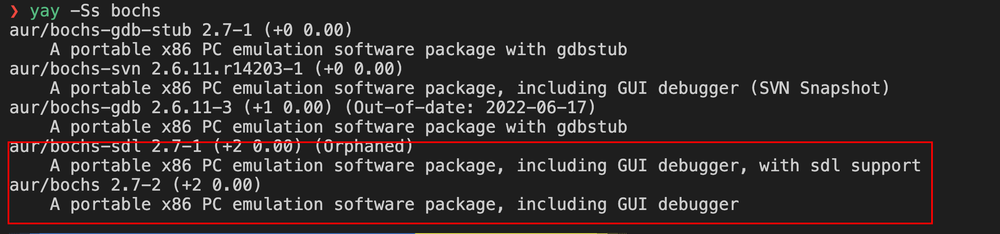

系统信息


[bochs官网](https://bochs.sourceforge.io/)

从官网信息可以看到现在代码也迁移到了github上

1 包管理器安装
---

### 1.1 安装

```shell
yay -Ss bochs
```



我们肯定是想要gui的，方便看调试输出信息

以sdl库支持的版本为例

```shell
yay -Syy bochs-sdl
whereis bochs
```

### 1.2 使用


`bochs`选项4生成配置文件，并将`floppya`配置项内容指定上软盘镜像，修改为`floppya: type=1_44, image=/home/dingrui/MyDev/doc/tutorial/os/64bit_os/01/build/my_os_floppy.img, status=inserted, write_protected=0`

随后启动`bochs -q -f ./my_bochs_cfg`，启动报错找不到gui的库


修改配置文件中`display_library: sdl2`配置项再次启动还是报错

从官网上看到，不同平台都会有推荐的选择以及默认的库


所以我的猜想是上传在aur上的包，可能在编译的时候没有指定`display lib`所以用的是默认的x，但是我当前的linux不支持这个gui。

所以稳妥的办法是，自己下载源码进行编译，在编译的时候指定编译选项。

2 手动编译
---

### 2.1 安装bochs


#### 2.1.1 download source code

```shell
wget -P ~/MyDev/env https://sourceforge.net/projects/bochs/files/bochs/2.7/bochs-2.7.tar.gz
mkdir bochs
tar -zxvf ./bochs-2.7.tar.gz -C ./bochs --strip-components 1
```

#### 2.1.3 config file

修改一下configure命令

```sh
vim .conf.linux
```


至于使用哪个lib，根据自己的情况

- --with-sdl

- --with-sdl2

#### 2.1.4 configure

```sh
sh -x .conf.linux
```

#### 2.1.5 make

```shell
make
sudo make install
```

#### 2.1.4 error

- Plugin support requires libltdl installed on your syste

  ```sh
  apt search libltdl
  sudo apt install libltdl-dev
  ```

- fatal error: SDL.h: No such file or directory

  ```sh
  apt search sdl2
  sudo apt install libsdl2-dev
  ```

#### 2.1.5 uninstall

以后卸载也很简单

```shell
cd ~/MyDev/env/bochs
sudo make uninstall
make clean
make dist-clean
cd ..
rm -rf bochs
```

### 2.2 使用

```shell
bximage --help
bochs --help cpu

bochs -q -f ./my_bochs_cfg
```


怎么配置ssh的远程gui，