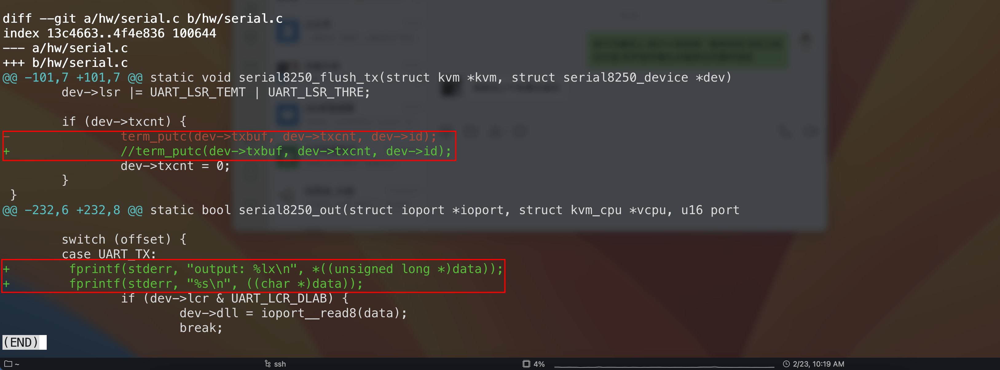

本机环境


1 编译kvmtool
---

### 1.1 kvmtool源码

```shell
cd ~/MyDev/env
git clone https://git.kernel.org/pub/scm/linux/kernel/git/maz/kvmtool.git/
```

### 1.2 修改源码

修改点有2处

- 串口打印没有换行，可读性较差，将其注释掉

- 增加打印语句，分别以16进制和字符串方式打印



### 1.3 编译

在源码根目录直接执行`make`会报编译错误


根据提示信息，需要修改一下编译选项，在Makefile中可以看到


那么就有2个方法

- 执行make的时候传递参数`make WERROR=0`

- 注释掉`CFLAGS += -Werror`这一行

重新编译

```shell
make WERROR=0
```

lkvm就是编译后的可执行程序


2 运行
---

使用kvmtool虚拟一台计算机运行编译后的可执行程序

kvmtool将可执行程序加载到内存中，然后跳转到起始位置开始运行

kvmtool虚拟计算机时，会事先设置好段寄存器，它将CS、DS等段寄存器初始化为0x1000，将IP初始化为0。当虚拟计算机启动后，处理器将从内存地址0x1000<<4+0x0，即0x10000这个地址取指

所以kvmtool会将可执行程序加载到内存0x10000处，确保可以读取到可执行程序的第一条指令

[示例代码托管在git上](https://github.com/Bannirui/tutorial/tree/master/as/01)


```shell
./configure.sh
./build.sh
./run.sh
```

屏幕上输出的字符A按照上述修改的kvmtool换行分别以16进制和字符方式显示

