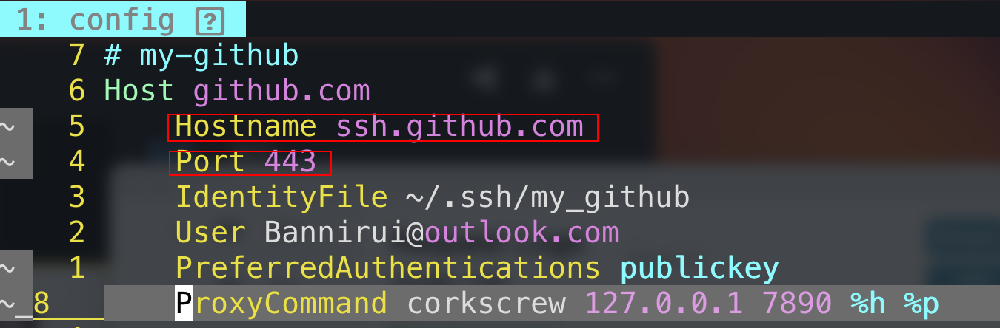

1 遇到的问题
---

linux是专门用来干重活的一台mini机，最近天气太冷，不想下床，就用mac走ssh连接局域网的linux，但是用git的时候发现网络不通。

印象中记得当时配置的ssh的代理有点问题，为此还特地在github的社区留了言

2 历史遗留包袱
---

当时我为了兼容mac和linux的终端网络代理工具，就选择了corkscrew，而不是nc等。

但是不管在mac还是linux上使用`ssh -T git@github.com`的时候都会报错`UNKNOWN port 65535`这个错误，网上的说法是因为机场屏蔽了22端口。

- 所以解决方案之一就是登到机场服务器开放22端口或者其他非知名端口，我的机场是买的，所以这个方案可以pass

- 另一种方式就是修改ssh的config

3 修改ssh的config
---

[附上github的官方文档](https://docs.github.com/en/authentication/troubleshooting-ssh/using-ssh-over-the-https-port)

修改点

- hostname加上ssh前缀

- port端口由22改为443

4 测试
---

