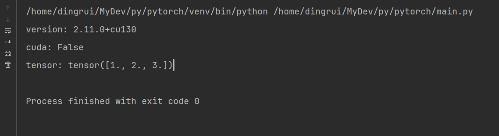

我的宿主机没有GPU，所以选择在wsl中配置CPU版本的

## 1 Python环境

```shell
sudo apt update
sudo apt install python3-venv python3-pip -y
```

## 2 Py工程目录

整个工程目录放在`/home/dingrui/MyDev/py/pytorch`

### 2.1 Py的虚拟环境安装PyTorch

```shell
python3 -m venv venv
source venv/bin/activate
pip install torch torchvision torchaudio
deactivate
```

### 2.2 代码验证

```shell
touch main.py
touch run.sh
```

#### 2.2.1 源码

```python
import torch

print("version:", torch.__version__)
print("cuda:", torch.cuda.is_available())

x = torch.tensor([1.0, 2.0, 3.0])
print("tensor:", x)
```

#### 2.2.2 运行脚本

```shell
#!/bin/bash

source venv/bin/activate ; python4 main.py
```

