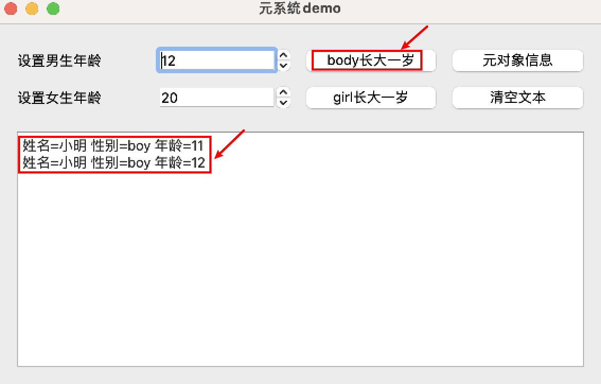

### 1 问题



如图，点击一次按钮，两次执行效果。

### 2 代码

```cpp
widget::widget(QWidget* parent) :
	QWidget(parent), ui(new Ui::widget)
{
	ui->setupUi(this);
	this->boy = new TPerson("小明", 10, this);
	this->boy->setProperty("sex", "boy");
	this->girl = new TPerson("小花", 20, this);
	this->girl->setProperty("sex", "girl");
	// 收到spinBox的值 没办法辨别是男孩还是女孩的年龄发生了变化 因此给spinBox添加属性
	this->ui->spinBoy->setProperty("isBoy", true);
	this->ui->spinGirl->setProperty("isBoy", false);
	// 对象年龄发生变化的时候
	connect(this->boy, SIGNAL(ageChanged(int)), this, SLOT(do_ageChanged(int)));
	connect(this->girl, SIGNAL(ageChanged(int)), this, SLOT(do_ageChanged(int)));
	connect(this->boy, SIGNAL(ageChanged(int)), this->ui->spinBoy, SLOT(setValue(int)));
	connect(this->girl, SIGNAL(ageChanged(int)), this->ui->spinGirl, SLOT(setValue(int)));
	// 增加/减少按钮
	connect(this->ui->spinBoy, SIGNAL(valueChanged(int)), this, SLOT(do_spinChanged(int)));
	connect(this->ui->spinGirl, SIGNAL(valueChanged(int)), this, SLOT(do_spinChanged(int)));
	// 增加一岁的按钮
	connect(this->ui->btnBoyInc, SIGNAL(clicked()), this, SLOT(on_btnBoyInc_clicked()));
	connect(this->ui->btnGirlInc, SIGNAL(clicked()), this, SLOT(on_btnGirlInc_clicked()));
	// 元对象信息
	connect(this->ui->btnClassInfo, SIGNAL(clicked()), this, SLOT(on_btnClassInfo_clicked()));
}
```

### 3 原因

qt官方命名槽函数的规则是`on_对象名_信号()`，qt会自动将信号与槽连接起来，不需要再显式连接。上面代码我自己又调用了connect进行连接。

因此删掉自己的显式connect就行了。