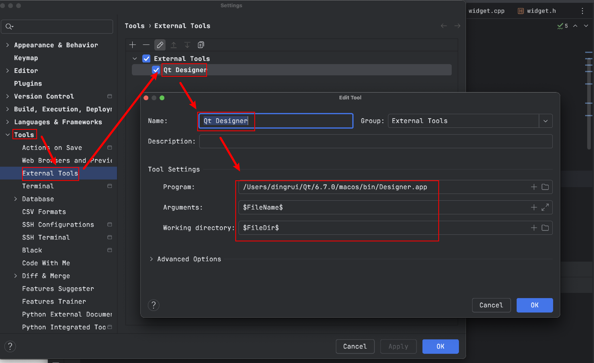
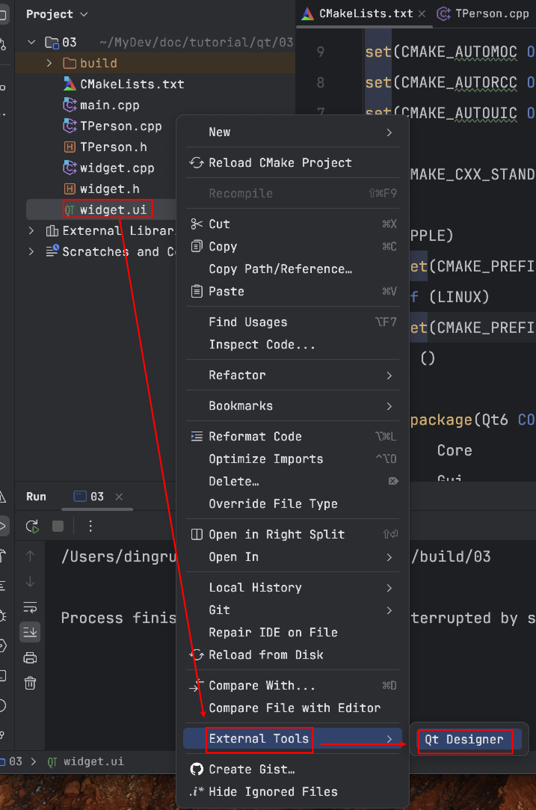
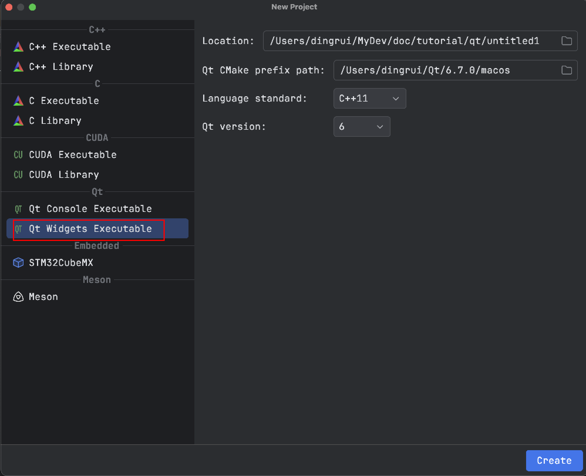

毕竟我还是独爱Clion，此前下载的qt creator体验也不是很好，因此还是需要搭建clion的工具链。

目前为止我还是比较依赖ui，因此还是需要qt designer，所以我需要在clion中添加designer。

### 1 designer工具

- 首先找到自己的qt安装路径`/Users/dingrui/Qt/6.7.0/macos/bin/Designer.app`

- 其次到clion中配置工具

    

- 以后便可以右击ui文件方式唤出designer工具

    

### 2 cmake配置

- Clion提供了qt工程的模板入口

    

- 设置qt的meta/resouce/ui编译器开启

  ```cmake
  set(CMAKE_AUTOMOC ON)
  set(CMAKE_AUTORCC ON)
  set(CMAKE_AUTOUIC ON)
  ```

- 设置CMAKE_PREFIX_PATH

  ```cmake
  if (APPLE)
    set(CMAKE_PREFIX_PATH "/Users/dingrui/Qt/6.7.0/macos")
  elseif (LINUX)
    set(CMAKE_PREFIX_PATH "/home/dingrui/MyApp/Qt/6.7.0/gcc_64")
  endif ()
  ```