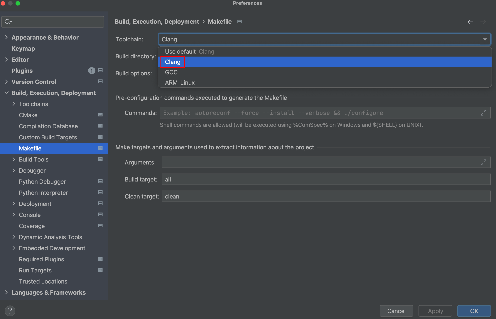
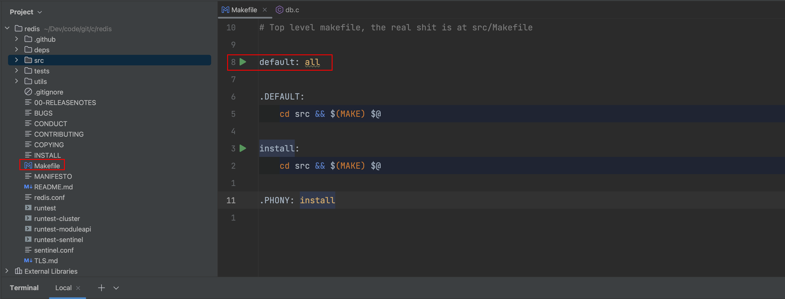
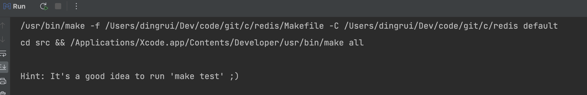
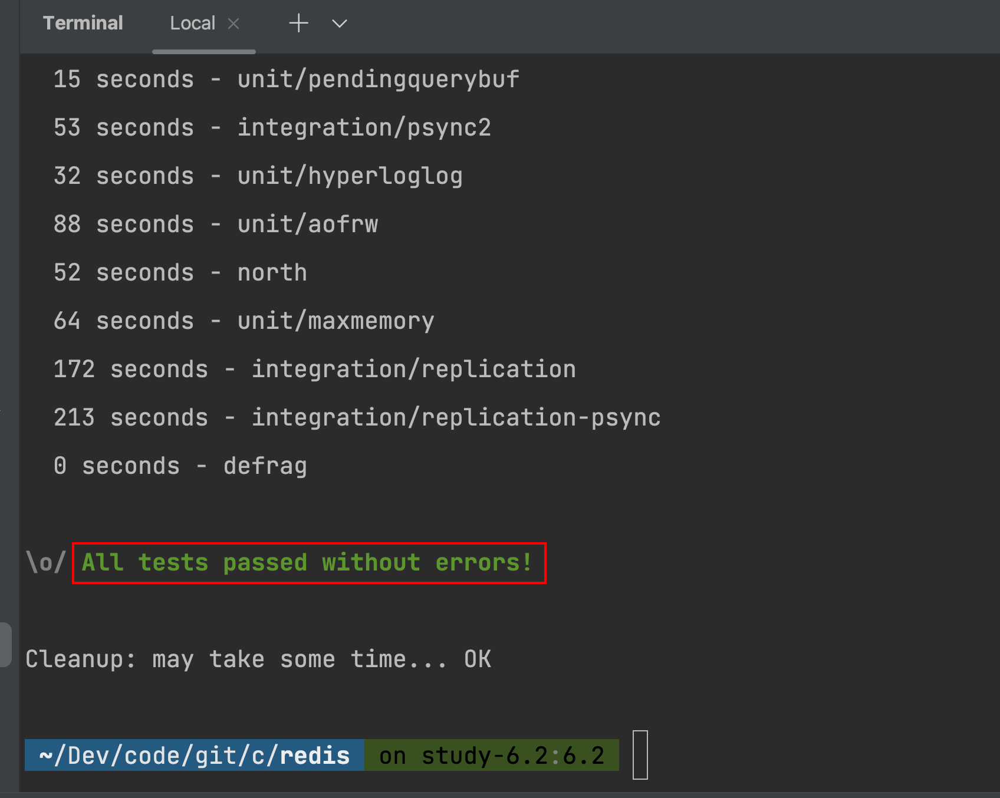
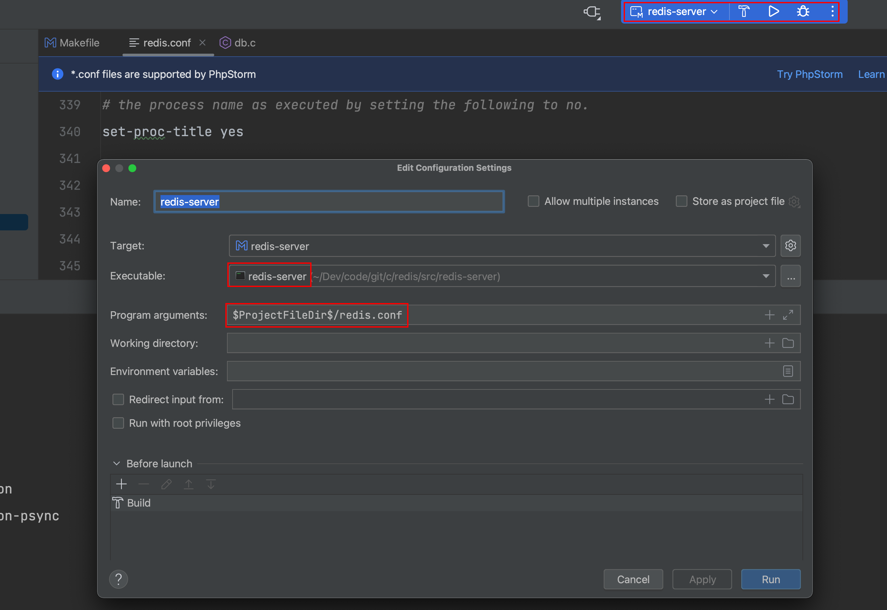
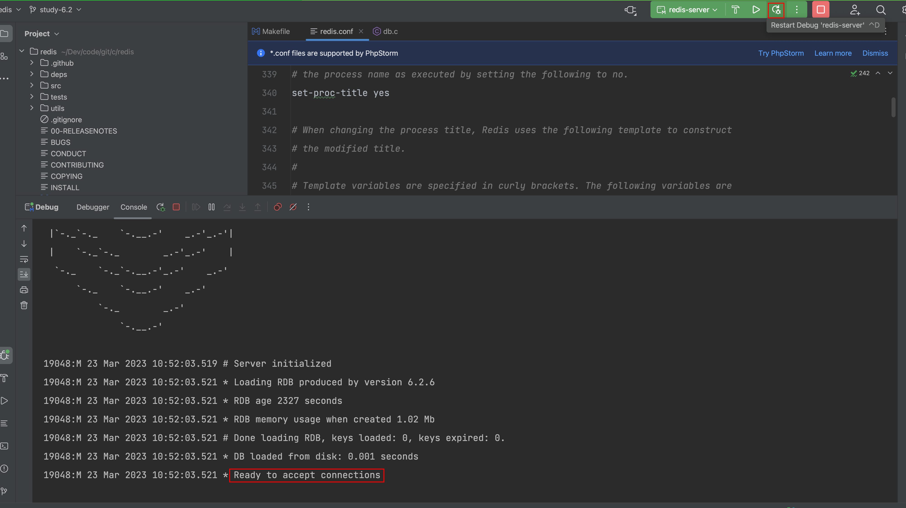
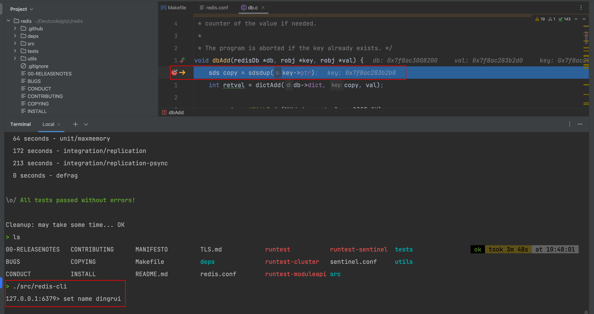

## 1 环境

| Name  | Ver      |
| ----- | -------- |
| MacOS | 11.5.2   |
| Clion | 2022.3.3 |
| Clang | 12.0.5   |
| LLDB  | 15.0.5   |

## 2 源码

https://github.com/redis/redis

```shell
1 fork
2 git clone git@github.com:Bannirui/redis.git
3 git remote add upstream git@github.com:redis/redis.git
4 git remote set-url --push upstream no_push
5 git fetch upstream
6 git checkout 6.2
7 git checkout -b study-6.2
8 git push origin study-6.2
```

## 3 Clion

### 3.1 ToolChain

将使用Clang作为构建调试工具，调试器不能使用GDB，之前使用GDB有问题，得使用LLDB。


### 3.2 Makefile

选择Clang作为Makefile项目的构建工具。



### 3.3 编译

#### 3.3.1 运行



#### 3.3.2 make test

根据提示，出现如下提示`It's a good idea to run 'make test'`，则在终端执行`make test`。



#### 3.3.3 编译成功

终端出现如下提示`All tests passed without errors`，则表示编译成功。



## 4 调试

### 4.1 配置



### 4.2 启动

#### 4.2.1 服务端

服务端已经启动监听在知名端口。



#### 4.2.2 客户端

启动客户端跟服务端交互，此时就可以进行调试跟踪了。


