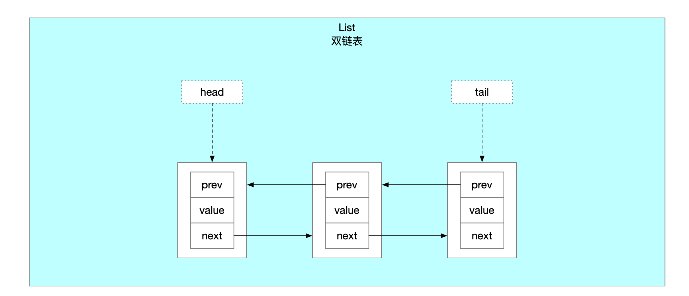

## 1 adlist.h

```c
// 链表节点
typedef struct listNode {
    // 前驱节点
    struct listNode *prev;
    // 后继节点
    struct listNode *next;
    // 节点存储的值
    void *value;
} listNode;

// 链表迭代器
// 单向
typedef struct listIter {
    // 当前迭代位置的下一个节点
    listNode *next;
    // 标识迭代器方向
    int direction;
} listIter;

// 链表 双链表
typedef struct list {
    // 头节点 实节点
    listNode *head;
    // 尾节点 实节点
    listNode *tail;
    // 复制函数指针 负责实现链表节点的复制 没有指定就浅拷贝
    void *(*dup)(void *ptr);
    // 释放函数指针 负责实现链表节点的值的释放
    void (*free)(void *ptr);
    // 匹配函数指针 负责搜索链表时匹配链表节点值
    int (*match)(void *ptr, void *key);
    // 列表长度
    unsigned long len;
} list;

/* Functions implemented as macros */
#define listLength(l) ((l)->len) // 链表长度
#define listFirst(l) ((l)->head) // 链表头节点 实节点
#define listLast(l) ((l)->tail) // 链表尾节点 实节点
#define listPrevNode(n) ((n)->prev) // 节点的前驱节点
#define listNextNode(n) ((n)->next) // 节点的后继节点
#define listNodeValue(n) ((n)->value) // 节点的值 函数指针

#define listSetDupMethod(l,m) ((l)->dup = (m)) // 链表节点值的复制方法 设置
#define listSetFreeMethod(l,m) ((l)->free = (m)) // 链表节点值的释放方法 设置
#define listSetMatchMethod(l,m) ((l)->match = (m)) // 链表节点值的匹配方法 设置

#define listGetDupMethod(l) ((l)->dup)
#define listGetFreeMethod(l) ((l)->free)
#define listGetMatchMethod(l) ((l)->match)

/* Prototypes */
list *listCreate(void); // 创建链表
void listRelease(list *list); // 链表的释放
void listEmpty(list *list); // 释放链表上所有节点
list *listAddNodeHead(list *list, void *value); // 添加元素为链表头节点
list *listAddNodeTail(list *list, void *value); // 添加元素为链表尾节点
list *listInsertNode(list *list, listNode *old_node, void *value, int after); // 插入节点
void listDelNode(list *list, listNode *node); // 删除链表上指定节点
listIter *listGetIterator(list *list, int direction); // 链表指定方向的迭代器
listNode *listNext(listIter *iter); // 迭代器内下一个节点
void listReleaseIterator(listIter *iter); // 释放迭代器
list *listDup(list *orig); // 复制链表
listNode *listSearchKey(list *list, void *key); // 关键字搜索节点
listNode *listIndex(list *list, long index); // 下标索引节点
void listRewind(list *list, listIter *li); // 重置迭代器 head->tail方向
void listRewindTail(list *list, listIter *li); // 重置迭代器 tail->head方向
void listRotateTailToHead(list *list); // 链表tail节点挂成head
void listRotateHeadToTail(list *list); // 链表head节点挂成tail
void listJoin(list *l, list *o); // 链表o挂到链表l上

/* Directions for iterators */
#define AL_START_HEAD 0 // 迭代方向 头->尾
#define AL_START_TAIL 1 // 迭代方向 尾->头

```

## 2 adlist.c

```c
// 创建列表
list *listCreate(void)
{
    struct list *list;

    // 申请内存空间
    if ((list = zmalloc(sizeof(*list))) == NULL)
        return NULL;
    // 初始化操作
    list->head = list->tail = NULL;
    list->len = 0;
    list->dup = NULL;
    list->free = NULL;
    list->match = NULL;
    return list;
}

/* Remove all the elements from the list without destroying the list itself. */
// 释放列表上所有节点
void listEmpty(list *list)
{
    unsigned long len;
    listNode *current, *next;

    current = list->head;
    len = list->len; // 列表长度
    while(len--) { // 轮询列表节点
        next = current->next;
        if (list->free) list->free(current->value);
        zfree(current); // 释放节点
        current = next;
    }
    list->head = list->tail = NULL;
    list->len = 0;
}

/* Free the whole list.
 *
 * This function can't fail. */
void listRelease(list *list)
{
    // 释放列表节点
    listEmpty(list);
    // 释放列表内存
    zfree(list);
}

/* Add a new node to the list, to head, containing the specified 'value'
 * pointer as value.
 *
 * On error, NULL is returned and no operation is performed (i.e. the
 * list remains unaltered).
 * On success the 'list' pointer you pass to the function is returned. */
list *listAddNodeHead(list *list, void *value)
{
    listNode *node;
    // 列表节点内存申请
    if ((node = zmalloc(sizeof(*node))) == NULL)
        return NULL;
    node->value = value; // 节点的值
    if (list->len == 0) { // 加进来的元素是首个节点
        list->head = list->tail = node;
        node->prev = node->next = NULL;
    } else { // 链表指针操作
        node->prev = NULL;
        node->next = list->head;
        list->head->prev = node;
        list->head = node;
    }
    list->len++;
    return list;
}

/* Add a new node to the list, to tail, containing the specified 'value'
 * pointer as value.
 *
 * On error, NULL is returned and no operation is performed (i.e. the
 * list remains unaltered).
 * On success the 'list' pointer you pass to the function is returned. */
list *listAddNodeTail(list *list, void *value)
{
    listNode *node;

    if ((node = zmalloc(sizeof(*node))) == NULL)
        return NULL;
    node->value = value;
    if (list->len == 0) {
        list->head = list->tail = node;
        node->prev = node->next = NULL;
    } else {
        node->prev = list->tail;
        node->next = NULL;
        list->tail->next = node;
        list->tail = node;
    }
    list->len++;
    return list;
}

list *listInsertNode(list *list, listNode *old_node, void *value, int after) {
    listNode *node;

    if ((node = zmalloc(sizeof(*node))) == NULL)
        return NULL;
    node->value = value;
    if (after) { // old_node后面插入新节点
        node->prev = old_node;
        node->next = old_node->next;
        if (list->tail == old_node) {
            list->tail = node;
        }
    } else { // old_node前面插入新节点
        node->next = old_node;
        node->prev = old_node->prev;
        if (list->head == old_node) {
            list->head = node;
        }
    }
    if (node->prev != NULL) {
        node->prev->next = node;
    }
    if (node->next != NULL) {
        node->next->prev = node;
    }
    list->len++;
    return list;
}

/* Remove the specified node from the specified list.
 * It's up to the caller to free the private value of the node.
 *
 * This function can't fail. */
void listDelNode(list *list, listNode *node)
{
    if (node->prev)
        node->prev->next = node->next;
    else // 要删除的node是头节点
        list->head = node->next;
    if (node->next)
        node->next->prev = node->prev;
    else // 要删除的node是尾节点
        list->tail = node->prev;
    if (list->free) list->free(node->value);
    zfree(node);
    list->len--;
}

/* Returns a list iterator 'iter'. After the initialization every
 * call to listNext() will return the next element of the list.
 *
 * This function can't fail. */
listIter *listGetIterator(list *list, int direction)
{
    listIter *iter;

    if ((iter = zmalloc(sizeof(*iter))) == NULL) return NULL;
    if (direction == AL_START_HEAD)
        iter->next = list->head; // 迭代器方向 head->tail
    else
        iter->next = list->tail; // 迭代器方向 tail->head
    iter->direction = direction;
    return iter;
}

/* Release the iterator memory */
void listReleaseIterator(listIter *iter) {
    zfree(iter);
}

/* Create an iterator in the list private iterator structure */
// 重置迭代器 head->tail方向
void listRewind(list *list, listIter *li) {
    li->next = list->head;
    li->direction = AL_START_HEAD;
}

// 重置迭代器 tail->head方向
void listRewindTail(list *list, listIter *li) {
    li->next = list->tail;
    li->direction = AL_START_TAIL;
}

/* Return the next element of an iterator.
 * It's valid to remove the currently returned element using
 * listDelNode(), but not to remove other elements.
 *
 * The function returns a pointer to the next element of the list,
 * or NULL if there are no more elements, so the classical usage
 * pattern is:
 *
 * iter = listGetIterator(list,<direction>);
 * while ((node = listNext(iter)) != NULL) {
 *     doSomethingWith(listNodeValue(node));
 * }
 *
 * */
listNode *listNext(listIter *iter)
{
    listNode *current = iter->next;

    if (current != NULL) {
        if (iter->direction == AL_START_HEAD) // head->tail
            iter->next = current->next;
        else
            iter->next = current->prev;
    }
    return current;
}

/* Duplicate the whole list. On out of memory NULL is returned.
 * On success a copy of the original list is returned.
 *
 * The 'Dup' method set with listSetDupMethod() function is used
 * to copy the node value. Otherwise the same pointer value of
 * the original node is used as value of the copied node.
 *
 * The original list both on success or error is never modified. */
list *listDup(list *orig)
{
    list *copy;
    listIter iter;
    listNode *node;

    if ((copy = listCreate()) == NULL) // 创建链表
        return NULL;
    copy->dup = orig->dup;
    copy->free = orig->free;
    copy->match = orig->match;
    listRewind(orig, &iter); // 链表的head->tail的迭代器
    while((node = listNext(&iter)) != NULL) { // 从head->tail迭代节点进行复制
        void *value;

        if (copy->dup) {
            value = copy->dup(node->value);
            if (value == NULL) {
                listRelease(copy);
                return NULL;
            }
        } else
            value = node->value;
        if (listAddNodeTail(copy, value) == NULL) {
            listRelease(copy);
            return NULL;
        }
    }
    return copy;
}

/* Search the list for a node matching a given key.
 * The match is performed using the 'match' method
 * set with listSetMatchMethod(). If no 'match' method
 * is set, the 'value' pointer of every node is directly
 * compared with the 'key' pointer.
 *
 * On success the first matching node pointer is returned
 * (search starts from head). If no matching node exists
 * NULL is returned. */
listNode *listSearchKey(list *list, void *key)
{
    listIter iter;
    listNode *node;

    listRewind(list, &iter);
    while((node = listNext(&iter)) != NULL) {
        if (list->match) {
            if (list->match(node->value, key)) {
                return node;
            }
        } else {
            if (key == node->value) {
                return node;
            }
        }
    }
    return NULL;
}

/* Return the element at the specified zero-based index
 * where 0 is the head, 1 is the element next to head
 * and so on. Negative integers are used in order to count
 * from the tail, -1 is the last element, -2 the penultimate
 * and so on. If the index is out of range NULL is returned. */
listNode *listIndex(list *list, long index) {
    listNode *n;

    if (index < 0) {
        index = (-index)-1;
        n = list->tail;
        while(index-- && n) n = n->prev;
    } else {
        n = list->head;
        while(index-- && n) n = n->next;
    }
    return n;
}

/* Rotate the list removing the tail node and inserting it to the head. */
void listRotateTailToHead(list *list) {
    if (listLength(list) <= 1) return;

    /* Detach current tail */
    listNode *tail = list->tail;
    list->tail = tail->prev;
    list->tail->next = NULL;
    /* Move it as head */
    list->head->prev = tail;
    tail->prev = NULL;
    tail->next = list->head;
    list->head = tail;
}

/* Rotate the list removing the head node and inserting it to the tail. */
void listRotateHeadToTail(list *list) {
    if (listLength(list) <= 1) return;

    listNode *head = list->head;
    /* Detach current head */
    list->head = head->next;
    list->head->prev = NULL;
    /* Move it as tail */
    list->tail->next = head;
    head->next = NULL;
    head->prev = list->tail;
    list->tail = head;
}

/* Add all the elements of the list 'o' at the end of the
 * list 'l'. The list 'other' remains empty but otherwise valid. */
void listJoin(list *l, list *o) {
    if (o->len == 0) return;

    o->head->prev = l->tail;

    if (l->tail)
        l->tail->next = o->head;
    else
        l->head = o->head;

    l->tail = o->tail;
    l->len += o->len;

    /* Setup other as an empty list. */
    o->head = o->tail = NULL;
    o->len = 0;
}
```

## 3 示意图


