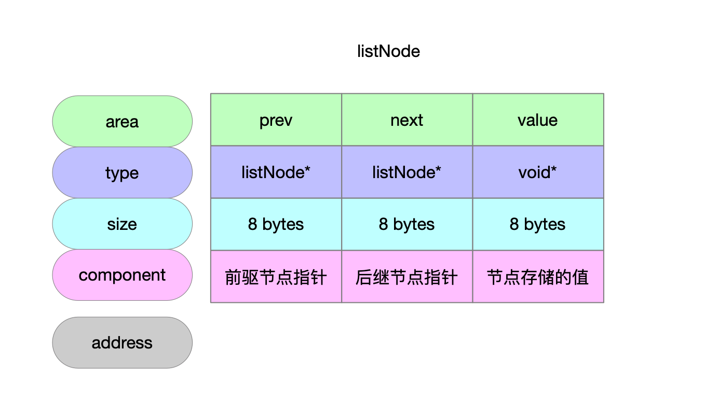
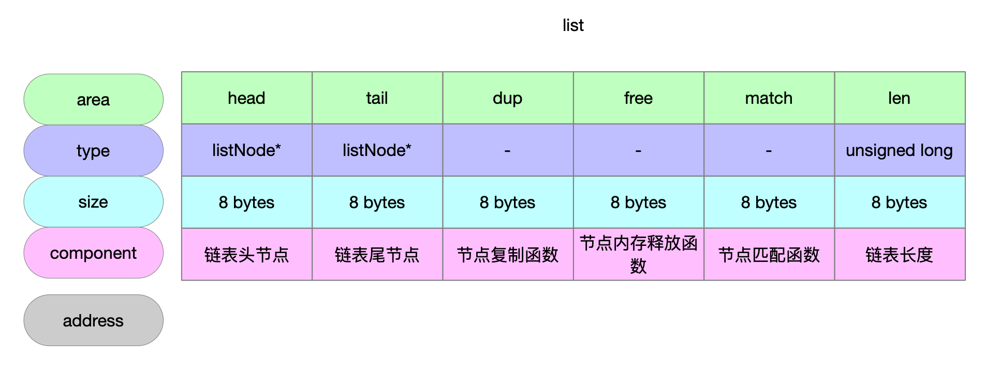

不作为数据类型的编码方式使用，使用在redisServer字段上，单纯作为双链表数据结构使用。

## 1 数据结构

### 1.1 链表节点

```c
// 链表节点
typedef struct listNode {
    // 前驱节点
    struct listNode *prev;
    // 后继节点
    struct listNode *next;
    // 节点存储的值
    void *value;
} listNode;
```



## 1.2 链表

```c
// 链表 双链表
typedef struct list {
    // 头节点 实节点
    listNode *head;
    // 尾节点 实节点
    listNode *tail;
    // 复制函数指针 负责实现链表节点的复制 没有指定就浅拷贝
    void *(*dup)(void *ptr);
    // 释放函数指针 负责实现链表节点的值的释放
    void (*free)(void *ptr);
    // 匹配函数指针 负责搜索链表时匹配链表节点值
    int (*match)(void *ptr, void *key);
    // 链表长度
    unsigned long len;
} list;
```



## 2 示意图


## 3 链表初始化

```c
// 创建链表实例
// @return 双链表实例
list *listCreate(void)
{
    struct list *list;

    // 申请内存空间 申请48 bytes
    if ((list = zmalloc(sizeof(*list))) == NULL)
        return NULL;
    // 初始化操作
    list->head = list->tail = NULL;
    list->len = 0;
    list->dup = NULL; // 节点复制函数
    list->free = NULL; // 节点释放函数
    list->match = NULL; // 节点匹配函数
    return list;
}
```

## 4 释放链表节点内存

```c
// 释放链表上所有节点 从链表头开始遍历节点 逐个释放内存
// @param list 链表实例
void listEmpty(list *list)
{
    unsigned long len;
    listNode *current, *next;

    current = list->head;
    len = list->len; // 链表长度
    while(len--) { // 轮询链表节点
        next = current->next;
        if (list->free) list->free(current->value);
        zfree(current); // 释放节点
        current = next;
    }
    list->head = list->tail = NULL;
    list->len = 0;
}
```

## 5 释放链表

```c
// 链表内存释放 包括链表上所有节点的释放和链表实例本身内存释放
// @param list 链表实例
void listRelease(list *list)
{
    // 释放列表节点
    listEmpty(list);
    // 释放列表内存
    zfree(list);
}
```

## 6 添加元素

### 6.1 添加为头节点

```c
// 添加元素为链表头节点
// @param list 链表实例
// @param value 待添加的元素
list *listAddNodeHead(list *list, void *value)
{
    listNode *node;
    // 列表节点内存申请 大小为24字节
    if ((node = zmalloc(sizeof(*node))) == NULL)
        return NULL;
    node->value = value; // 节点的值 value字段
    if (list->len == 0) { // 既有的链表为空链表 加进来的元素是首个节点
        list->head = list->tail = node;
        node->prev = node->next = NULL;
    } else { // 链表指针操作
        node->prev = NULL;
        node->next = list->head;
        list->head->prev = node;
        list->head = node;
    }
    list->len++; // 链表节点计数更新
    return list;
}
```

### 6.2 添加为尾节点

```c
// 添加元素为链表尾节点
// @param list 链表实例
// @param value 待添加的元素
list *listAddNodeTail(list *list, void *value)
{
    listNode *node;

    // 申请内存24字节
    if ((node = zmalloc(sizeof(*node))) == NULL)
        return NULL;
    node->value = value; // 节点的value字段
    if (list->len == 0) { // 既有的链表为空 新添加的元素为首个元素
        list->head = list->tail = node;
        node->prev = node->next = NULL;
    } else {
        // 链表操作
        node->prev = list->tail;
        node->next = NULL;
        list->tail->next = node;
        list->tail = node;
    }
    list->len++; // 链表节点计数更新
    return list;
}
```

## 7 删除元素

```c
// @param list 链表实例
// @param node 要删除的节点
void listDelNode(list *list, listNode *node)
{
    if (node->prev)
        node->prev->next = node->next;
    else // 要删除的node是头节点
        list->head = node->next;
    if (node->next)
        node->next->prev = node->prev;
    else // 要删除的node是尾节点
        list->tail = node->prev;
    if (list->free) list->free(node->value);
    zfree(node); // 释放节点内存
    list->len--; // 更新链表节点计数
}
```

