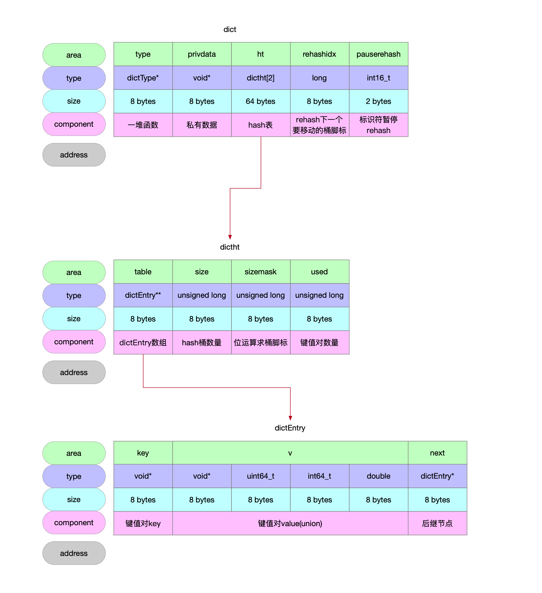
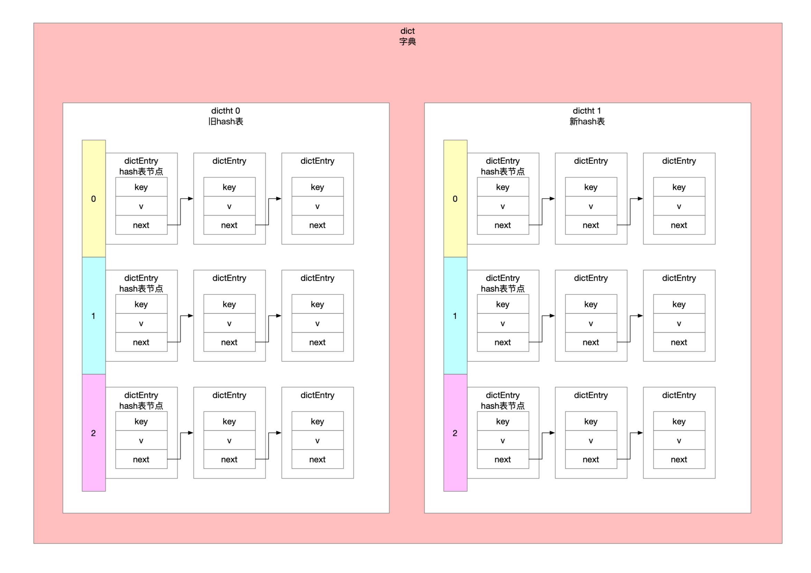

## 1 数据结构



### 1.1 dictEntry

```c
// 哈希表的节点 存储k-v键值对
// hash表的节点会组成一个单链表
// key可以是void*指针类型 相当于Java的Object
typedef struct dictEntry {
    void *key; // 节点的key
    union {
        void *val;
        uint64_t u64;
        int64_t s64;
        double d;
    } v; // 节点的v 可以是指针\u64整数\int64整数\浮点数
    struct dictEntry *next; // 下一个节点 相当于单链表
} dictEntry;
```

### 1.2 dictht

```c
// 哈希表
typedef struct dictht {
    // hash表的指针数组 指向hash节点的数组首地址
    dictEntry **table;
    unsigned long size; // hash数组大小 桶的数量
    unsigned long sizemask; // hash数组长度掩码=size-1
    unsigned long used; // hash表节点的数量 有多少个键值对
} dictht;
```

### 1.3 dict

```c
// 字典
// 字典是由两个hash表组成的 常用的hash表是ht[0] 当进行rehash时使用到ht[1]进行渐进式rehash
// type和privdata为了实现多态
// type保存了特定函数的指针
// privdata携带了特定函数需要的一些可选参数
// redis根据字典的用途 在type中设置不同的特定函数
typedef struct dict {
    dictType *type; // 字典的类型指针
    void *privdata; // 私有数据指针
    // 2个hash表 用于渐进式rehash
    dictht ht[2];
    // rehash下一个要迁移的桶索引 不进行rehash时为-1
    long rehashidx; /* rehashing not in progress if rehashidx == -1 */
    // 暂停rehash 重入式的模式 在安全迭代器模式中要暂停rehash
    // >0标识rehash是暂停的 安全的迭代需要rehash是暂停状态
    // ==0初始状态
    // <0标识rehash异常
    int16_t pauserehash; /* If >0 rehashing is paused (<0 indicates coding error) */
} dict;
```

## 2 示意图



## 3 创建dict实例

```c
// 创建空字典实例
// 字典里面的hash表是空的
// @param type 用来填充dict实例的type字段
// @param privDataPtr 用来填充dict实例的privdata字段
dict *dictCreate(dictType *type,
        void *privDataPtr)
{
    // 分配字典内存 算上填充字节 总共96 bytes
    dict *d = zmalloc(sizeof(*d));
    // 初始化字典
    _dictInit(d,type,privDataPtr);
    return d;
}
```

```c
// 字典初始化
// 字典里面的hash表是空的
// @param d 要初始化的dict实例
// @param type 用来填充dict实例的type字段
// @param privDataPtr 用来填充dict实例的privdata字段
int _dictInit(dict *d, dictType *type,
        void *privDataPtr)
{
    // 初始化0号hash表 hash表是空的
    _dictReset(&d->ht[0]);
    // 初始化1号hash表 hash表是空的
    _dictReset(&d->ht[1]);
    // 字典类型
    d->type = type;
    // 字典私有数据
    d->privdata = privDataPtr;
    // 标识当前状态没有处在rehash中
    d->rehashidx = -1;
    // 标识当前状态没有处在rehash中
    d->pauserehash = 0;
    return DICT_OK;
}
```

## 4 扩容

```c
// hash表扩容
// @param d 要扩容的dict实例
// @param size 扩容到多大
// @return 操作标识符
int dictExpand(dict *d, unsigned long size) {
    return _dictExpand(d, size, NULL);
}
```


```c
// dict实例的hash表扩容
// @param d 要扩容的dict实例
// @param size 要扩容到多大(多少个byte)
// @param malloc_failed 内存分配失败标识符 如果调用方传递了该指针 扩容实现内部申请内存失败了 就标识为1通知调用方
//                      目的在于函数的返回值标识的是统一的失败\成功 没有细分失败的详情 这样可以知道如果扩容失败了 是否是因为内存开辟导致的
// @return 操作码 0-成功
//               1-失败
int _dictExpand(dict *d, unsigned long size, int* malloc_failed)
{
    if (malloc_failed) *malloc_failed = 0;

    /* the size is invalid if it is smaller than the number of
     * elements already inside the hash table */
    // 扩容的大小不满足当前使用
    if (dictIsRehashing(d) || d->ht[0].used > size)
        return DICT_ERR;

    dictht n; /* the new hash table */
    // 保证扩容后大小是2的幂次方 这样就可以通过位运算计算key的hash桶脚标=hash&(len-1)
    unsigned long realsize = _dictNextPower(size);

    /* Detect overflows */
    if (realsize < size || realsize * sizeof(dictEntry*) < realsize)
        return DICT_ERR;

    /* Rehashing to the same table size is not useful. */
    if (realsize == d->ht[0].size) return DICT_ERR;

    /* Allocate the new hash table and initialize all pointers to NULL */
    // 新表
    n.size = realsize; // dictht字段size
    n.sizemask = realsize-1; // dictht字段sizemask
    if (malloc_failed) {
        n.table = ztrycalloc(realsize*sizeof(dictEntry*));
        *malloc_failed = n.table == NULL;
        if (*malloc_failed)
            return DICT_ERR;
    } else
        n.table = zcalloc(realsize*sizeof(dictEntry*));

    n.used = 0; // dcitht字段used

    /* Is this the first initialization? If so it's not really a rehashing
     * we just set the first hash table so that it can accept keys. */
    if (d->ht[0].table == NULL) { // 整个dict字典刚初始化好hash表
        d->ht[0] = n;
        return DICT_OK;
    }

    /* Prepare a second hash table for incremental rehashing */
    // 不是hash表的初始化场景 而是扩容->节点迁移的场景
    d->ht[1] = n;
    d->rehashidx = 0; // 标识准备从老表的0号桶开始迁移
    return DICT_OK;
}
```

## 5 渐进式rehash

```c
// 渐进式rehash实现
// @param n 迁移n个hash桶
// @return 1 标识hash表还有节点待迁移
//         0 标识hash表已经迁移完成
int dictRehash(dict *d, int n) {
    // 最多遍历空桶的数量
    int empty_visits = n*10; /* Max number of empty buckets to visit. */
    if (!dictIsRehashing(d)) return 0;

    // 计划迁移n个桶 现在目标还没完成 hash表中还有节点等待被迁移
    while(n-- && d->ht[0].used != 0) {
        dictEntry *de, *nextde;

        /* Note that rehashidx can't overflow as we are sure there are more
         * elements because ht[0].used != 0 */
        assert(d->ht[0].size > (unsigned long)d->rehashidx);
        while(d->ht[0].table[d->rehashidx] == NULL) {
            d->rehashidx++;
            if (--empty_visits == 0) return 1;
        }
        // 该hash桶上的节点要迁移走
        de = d->ht[0].table[d->rehashidx];
        /* Move all the keys in this bucket from the old to the new hash HT */
        // de指向hash桶的链表头 遍历链表将节点逐个迁移到新表上
        while(de) {
            uint64_t h;

            nextde = de->next;
            /* Get the index in the new hash table */
            // key在新表的hash桶位置
            h = dictHashKey(d, de->key) & d->ht[1].sizemask; // hash表长度是2的幂次方 通过位运算计算key的hash桶脚标
            // 单链表头插法
            de->next = d->ht[1].table[h];
            d->ht[1].table[h] = de;
            d->ht[0].used--; // 旧表上每迁移走一个键值对 就更新计数
            d->ht[1].used++; // 新表上每迁过来一个键值对 就更新计数
            de = nextde;
        }
        d->ht[0].table[d->rehashidx] = NULL; // 一个桶上单链表所有节点都迁移完了
        d->rehashidx++; // 一个桶迁移结束 后移待迁移的桶脚标
    }

    /* Check if we already rehashed the whole table... */
    // rehash任务完成后判定一下hash表是否都迁移完成了
    // 迁移完成了就回收老表 把表1指向新表
    if (d->ht[0].used == 0) {
        zfree(d->ht[0].table);
        d->ht[0] = d->ht[1];
        _dictReset(&d->ht[1]);
        d->rehashidx = -1;
        return 0;
    }

    /* More to rehash... */
    return 1;
}
```

## 6 检索key所在的hash桶脚标

```c
// 在字典hash表中key对应的hash表数组脚标 也就是桶位 存在key的时候用existing指针指向节点
// @param d dict实例
// @param key 键
// @param key的hash值
// @param existing 指向hash表键值对节点 key已经存在的时候找到了key就把指针指向键值对节点
// @return key的hash桶脚标 -1标识key已经存在
static long _dictKeyIndex(dict *d, const void *key, uint64_t hash, dictEntry **existing)
{
    unsigned long idx, table;
    dictEntry *he;
    if (existing) *existing = NULL; // 预警式放置指针污染 只有当确定key存在于hash表中时才将该指针指向节点

    /* Expand the hash table if needed */
    if (_dictExpandIfNeeded(d) == DICT_ERR)
        return -1;
    // 只有当字典rehash时才会轮询两张hash表 否则只考察老hash表
    for (table = 0; table <= 1; table++) {
        // key所在的数组脚标位置
        idx = hash & d->ht[table].sizemask; // 位运算计算key的hash桶脚标
        /* Search if this slot does not already contain the given key */
        // 遍历单链表找到key
        he = d->ht[table].table[idx];
        while(he) {
            if (key==he->key || dictCompareKeys(d, key, he->key)) {
                if (existing) *existing = he; // 要找的key已经存在了 返回-1标识key已经存在 并把existing指针指向已经存在的键值对
                return -1;
            }
            he = he->next;
        }
        // 字典没有在rehash 就考察hash表老表就行
        if (!dictIsRehashing(d)) break;
    }
    return idx;
}
```

## 7 写入

```c
// 添加kv键值对
// @param 向哪个dict实例中添加键值对
// @param [key, val]键值对 hash节点
// @return 操作码 0-标识操作成功 1-标识操作失败
int dictAdd(dict *d, void *key, void *val)
{
    // 向字典的hash表添加了一个节点[key, null]
    // 如果已经存在了key就向上返回添加失败
    // 并不关注已经存在的key是谁
    dictEntry *entry = dictAddRaw(d,key,NULL);

    if (!entry) return DICT_ERR; // hash表中已经存在键值对 返回添加失败的标识
    // 上面步骤向字典中添加的节点还没设置value值
    dictSetVal(d, entry, val);
    return DICT_OK;
}
```


```c
// 向字典d中添加一个节点
// hash表中已经存在key了就返回null标识新建节点失败
// 指定该节点的key value留着调用方设置
// @param existing
// @return null标识key已经存在key 不进行节点添加操作 并通过existing指针标识出已经存在的kv键值对节点
//         非null标识新添加到hash表中的[key, null]半成品节点 所谓的半成品指的是entry节点只有key字段 没有value字段
dictEntry *dictAddRaw(dict *d, void *key, dictEntry **existing)
{
    long index;
    dictEntry *entry;
    dictht *ht;
    // 字典当前正在rehash 当前线程协助迁移一个桶
    if (dictIsRehashing(d)) _dictRehashStep(d);

    /* Get the index of the new element, or -1 if
     * the element already exists. */
    // 字典d的hash表中存在key
    if ((index = _dictKeyIndex(d, key, dictHashKey(d,key), existing)) == -1)
        return NULL;

    /* Allocate the memory and store the new entry.
     * Insert the element in top, with the assumption that in a database
     * system it is more likely that recently added entries are accessed
     * more frequently. */
    // 字典正在rehash就用新表 没在rehash就用旧表
    // 正在rehash中 也就意味着最终需要将旧标上所有hash桶里面的entry节点都迁移到新表上
    // 就不要往旧表上写数据了 直接一步到位写到新表上
    ht = dictIsRehashing(d) ? &d->ht[1] : &d->ht[0];
    // 分配一个hash节点内存 大小为48 bytes
    entry = zmalloc(sizeof(*entry));
    // 链表 头插法
    entry->next = ht->table[index];
    ht->table[index] = entry;
    ht->used++; // hash表entry键值对节点计数

    /* Set the hash entry fields. */
    // 设置节点的key
    dictSetKey(d, entry, key);
    return entry;
}
```

## 8 读取

```c
// 根据key查询键值对entry节点
// @param d dict实例
// @param key key
// @return 字典d中key对应的entry节点
dictEntry *dictFind(dict *d, const void *key)
{
    dictEntry *he;
    uint64_t h, idx, table;

    // 字典为空
    if (dictSize(d) == 0) return NULL; /* dict is empty */
    // 字典正在rehash状态 协助迁移1个hash桶
    if (dictIsRehashing(d)) _dictRehashStep(d);
    // key的hash值
    h = dictHashKey(d, key);
    // 轮询字典里面的2张hash表
    // 字典处于rehash的场景下才需要查询两张hash表
    // 字典没有处于rehash的时候 只需要查询一张hash表
    for (table = 0; table <= 1; table++) {
        // 数组长度len=2的幂次方前提下 hash%len == hash&(len-1)
        idx = h & d->ht[table].sizemask; // 数组脚标
        he = d->ht[table].table[idx]; // 链表头
        // 单链表遍历直到找到key对应的节点
        while(he) {
            // 优先比较内存地址 其次使用自定义的比较函数
            if (key==he->key || dictCompareKeys(d, key, he->key))
                return he;
            he = he->next;
        }
        // 没有rehashing 说明数据只可能在旧表上 没有必要继续查新表
        if (!dictIsRehashing(d)) return NULL;
    }
    return NULL;
}
```

