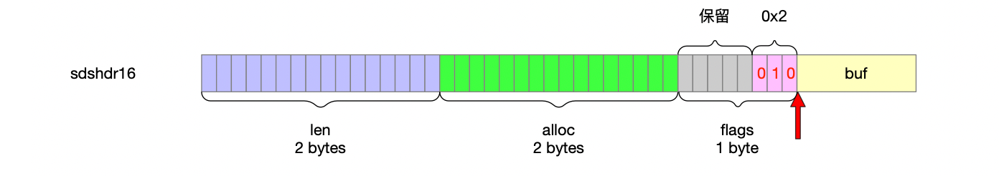

数据类型的编码方式。

## 1 数据结构


根据字符串长度细分了5种sds类型。

### 1.1 sdshdr5

```c
// 最长(2^5 - 1)长度的sdshdr
// 结构体size 1Byte
struct __attribute__ ((__packed__)) sdshdr5 {
    // 1个Byte 8位
    // 高5位 保存字符串长度
    // 低3位 保存类型标志
    unsigned char flags; /* 3 lsb of type, and 5 msb of string length */
    char buf[];
};
```


### 1.2 sdshdr8

```c
// 最长(2^8 -1)长度的sdshdr
// 结构体size 3Byte
struct __attribute__ ((__packed__)) sdshdr8 {
    // 已经使用的长度
    // unsigned char 8位
    uint8_t len; /* used */
    // buf分配的总长度 字符数组的总大小
    // 剩余大小=alloc-len
    uint8_t alloc; /* excluding the header and null terminator */
    // 1个Byte 8位
    // 高5位 保留位
    // 低3位 保存类型标志
    unsigned char flags; /* 3 lsb of type, 5 unused bits */
    // 字符数组
    char buf[];
};
```


### 1.3 sdshdr16

```c
// 最长(2^16 -1)长度的sdshdr
// 结构体size 5Byte
struct __attribute__ ((__packed__)) sdshdr16 {
    // unsigned short 16位
    uint16_t len; /* used */
    uint16_t alloc; /* excluding the header and null terminator */
    unsigned char flags; /* 3 lsb of type, 5 unused bits */
    char buf[];
};
```



### 1.4 sdshdr32

```c
// 最长(2^32 -1)长度的sdshdr
// 结构体size 9Byte
struct __attribute__ ((__packed__)) sdshdr32 {
    // unsigned int 32位
    uint32_t len; /* used */
    uint32_t alloc; /* excluding the header and null terminator */
    unsigned char flags; /* 3 lsb of type, 5 unused bits */
    char buf[];
};
```


### 1.5 sdshdr64

```c
// 最长(2^64 -1)长度的sdshdr
// 结构体size 17Byte
struct __attribute__ ((__packed__)) sdshdr64 {
    // unsigned long long 64位
    uint64_t len; /* used */
    uint64_t alloc; /* excluding the header and null terminator */
    unsigned char flags; /* 3 lsb of type, 5 unused bits */
    char buf[];
};
```


## 2 结构体大小

```c
// sds的的结构体大小 也就是sds的header大小 因为结构体最后是buf数组名 不占大小
//                   header
// sdshdr5           flags=1
// sdshdr8   len+alloc+flags=1+1+1=3
// sdshdr16  len+alloc+flags=2+2+1=5
// sdshdr32  len+alloc+flags=4+4+1=9
// sdshdr64  len+alloc+flags=8+8+1=17
// @param type 字符串类型
// @return sds结构体大小
static inline int sdsHdrSize(char type) {
    switch(type&SDS_TYPE_MASK) {
        case SDS_TYPE_5:
            return sizeof(struct sdshdr5); // 1 byte
        case SDS_TYPE_8:
            return sizeof(struct sdshdr8); // 3 bytes
        case SDS_TYPE_16:
            return sizeof(struct sdshdr16); // 5 bytes
        case SDS_TYPE_32:
            return sizeof(struct sdshdr32); // 9 bytes
        case SDS_TYPE_64:
            return sizeof(struct sdshdr64); // 17 bytes
    }
    return 0;
}
```

## 3 根据字符串长度动态分配类型

```c
// 根据字符串长度动态分配类型
// 也就是flags的低三位
// @param string_size 字符串长度
// @return 能够容纳该长度字符串的sds数据结构类型
static inline char sdsReqType(size_t string_size) {
    if (string_size < 1<<5)
        return SDS_TYPE_5;
    if (string_size < 1<<8)
        return SDS_TYPE_8;
    if (string_size < 1<<16)
        return SDS_TYPE_16;
#if (LONG_MAX == LLONG_MAX)
    if (string_size < 1ll<<32)
        return SDS_TYPE_32;
    return SDS_TYPE_64;
#else
    return SDS_TYPE_32;
#endif
}
```

## 4 不同sds类型能够表达的字符串长度

```c
// @param type sds类型
// @return sds不同数据结构所能容纳的字符串最大长度
static inline size_t sdsTypeMaxSize(char type) {
    if (type == SDS_TYPE_5)
        return (1<<5) - 1;
    if (type == SDS_TYPE_8)
        return (1<<8) - 1;
    if (type == SDS_TYPE_16)
        return (1<<16) - 1;
#if (LONG_MAX == LLONG_MAX)
    if (type == SDS_TYPE_32)
        return (1ll<<32) - 1;
#endif
    return -1; /* this is equivalent to the max SDS_TYPE_64 or SDS_TYPE_32 */
}
```

## 5 创建字符串

```c
// 创建sds字符串
// @param init 初始化的字符串内容
// @param initlen 目标长度
// @param trymalloc 控制使用不同的malloc实现方式
// @return 引用指向sds的buf
sds _sdsnewlen(const void *init, size_t initlen, int trymalloc) {
    void *sh;
    sds s;
    // 为字符串动态分配sds类型
    // sdshdr5
    // sdshdr8
    // sdshdr16
    // sdshdr32
    // sdshdr64
    char type = sdsReqType(initlen);
    /* Empty strings are usually created in order to append. Use type 8
     * since type 5 is not good at this. */
    if (type == SDS_TYPE_5 && initlen == 0) type = SDS_TYPE_8;
    // sds结构体的大小
    // 其实也就是sds的header大小(多少个Byte)
    // sdshdr5 flags=1
    // sdshdr8 len+alloc+flags=3
    // sdshdr16 len+alloc+flags=5
    // sdshdr32 len+alloc+flags=9
    // sdshdr64 len+alloc+flags=17
    int hdrlen = sdsHdrSize(type);
    unsigned char *fp; /* flags pointer. */
    size_t usable;

    assert(initlen + hdrlen + 1 > initlen); /* Catch size_t overflow */
    // sds的内存大小
    // header+字符串长度+字符串结束符(\0)
    // 分配sds内存
    // usable是申请到的内存大小
    sh = trymalloc?
        s_trymalloc_usable(hdrlen+initlen+1, &usable) :
        s_malloc_usable(hdrlen+initlen+1, &usable);
    if (sh == NULL) return NULL;
    if (init==SDS_NOINIT)
        init = NULL;
    else if (!init)
        memset(sh, 0, hdrlen+initlen+1); // 没有指定sds初始化方法 将sds内存全部置0
    s = (char*)sh+hdrlen; // s指向的是buf
    fp = ((unsigned char*)s)-1; // buf指针-1Byte就是flags
    usable = usable-hdrlen-1; // sds分配给buf长度=总共申请到的内存大小-sds的header-buf中字符串结束符
    // buf大小上限(已经刨除了字符串结束符\0)
    // buf剩余可用=buf总长度-字符串长度
    if (usable > sdsTypeMaxSize(type))
        usable = sdsTypeMaxSize(type);
    switch(type) {
        case SDS_TYPE_5: {
            *fp = type | (initlen << SDS_TYPE_BITS); // flags
            break;
        }
        case SDS_TYPE_8: {
            SDS_HDR_VAR(8,s);
            sh->len = initlen; // 字符串长度
            sh->alloc = usable; // sds实际申请的大小(多少个Byte)
            *fp = type; // flags
            break;
        }
        case SDS_TYPE_16: {
            SDS_HDR_VAR(16,s);
            sh->len = initlen;
            sh->alloc = usable;
            *fp = type;
            break;
        }
        case SDS_TYPE_32: {
            SDS_HDR_VAR(32,s);
            sh->len = initlen;
            sh->alloc = usable;
            *fp = type;
            break;
        }
        case SDS_TYPE_64: {
            SDS_HDR_VAR(64,s);
            sh->len = initlen;
            sh->alloc = usable;
            *fp = type;
            break;
        }
    }
    if (initlen && init)
        memcpy(s, init, initlen); // 把buf数组的前initlen个字符填充上字符串init
    s[initlen] = '\0'; // 结束符
    return s; // 引用指向的是sds的buf数组
}
```

## 6 字符串切割

```c
/**
 * @brief 切割字符串
 * @param s 要切割的字符串 sds实例 指针指向的是sds的buf数组
 * @param len sds字符串的长度
 * @param sep 分隔符 字符串的字符数组形式
 * @param seplen 分隔符的长度
 * @param count 用于统计字符串被切割成了多少个子串
 * @return sds数组
 */
sds *sdssplitlen(const char *s, ssize_t len, const char *sep, int seplen, int *count) {
    int elements = 0, slots = 5;
    long start = 0, j;
    sds *tokens;

    if (seplen < 1 || len < 0) return NULL;
    // sds数组内存申请 预申请长度为5的数组
    tokens = s_malloc(sizeof(sds)*slots);
    if (tokens == NULL) return NULL;

    if (len == 0) { // 源字符串为空 没法切割
        *count = 0;
        return tokens;
    }
    for (j = 0; j < (len-(seplen-1)); j++) { // 遍历源字符串字符
        /* make sure there is room for the next element and the final one */
        if (slots < elements+2) { // sds数组扩容
            sds *newtokens;

            slots *= 2;
            newtokens = s_realloc(tokens,sizeof(sds)*slots);
            if (newtokens == NULL) goto cleanup;
            tokens = newtokens;
        }
        /* search the separator */
        if ((seplen == 1 && *(s+j) == sep[0]) || (memcmp(s+j,sep,seplen) == 0)) {
            tokens[elements] = sdsnewlen(s+start,j-start);
            if (tokens[elements] == NULL) goto cleanup;
            elements++;
            start = j+seplen;
            j = j+seplen-1; /* skip the separator */
        }
    }
    /* Add the final element. We are sure there is room in the tokens array. */
    tokens[elements] = sdsnewlen(s+start,len-start);
    if (tokens[elements] == NULL) goto cleanup;
    elements++;
    *count = elements;
    return tokens;

cleanup:
    {
        int i;
        for (i = 0; i < elements; i++) sdsfree(tokens[i]);
        s_free(tokens);
        *count = 0;
        return NULL;
    }
}
```

