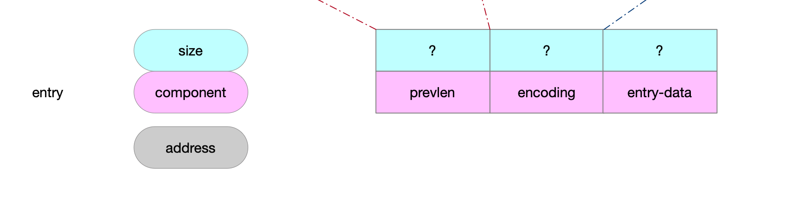
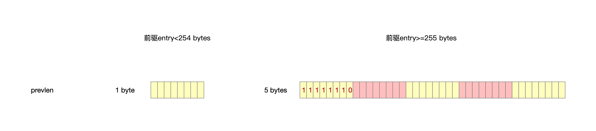
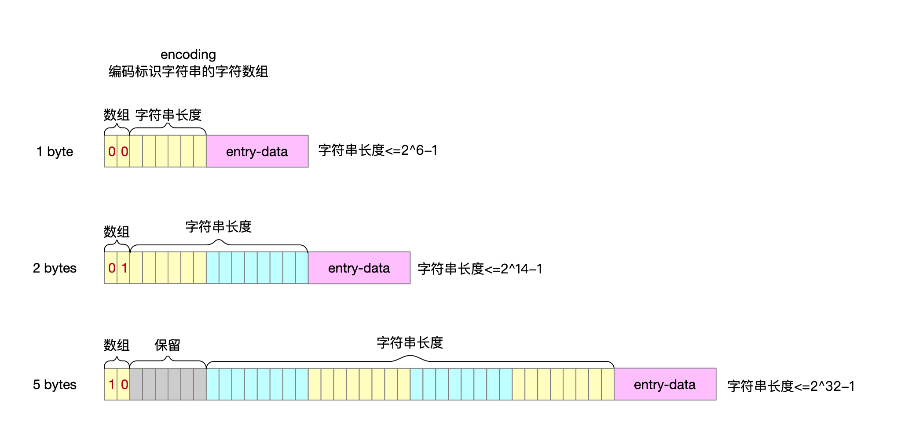
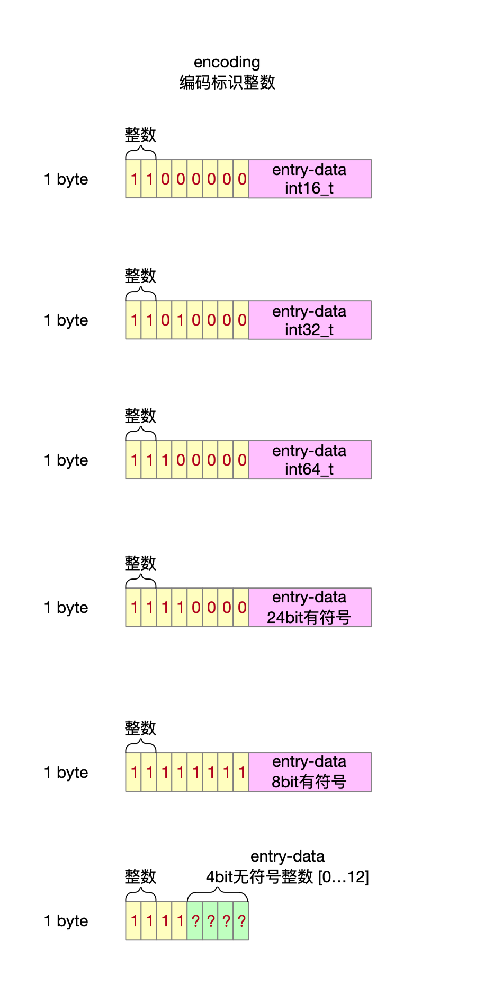
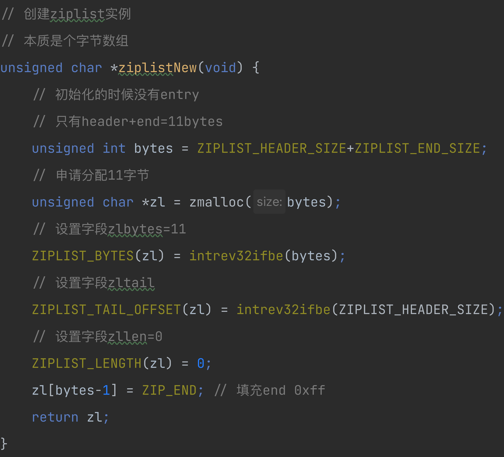
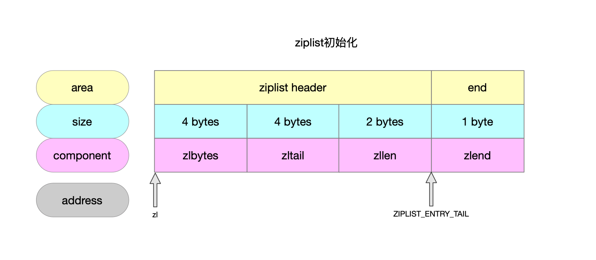
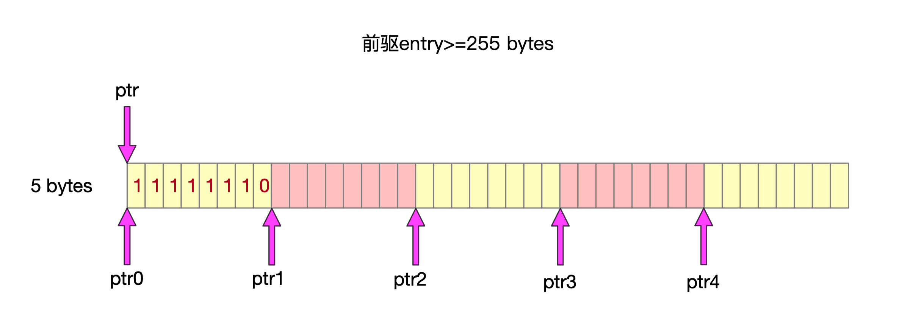
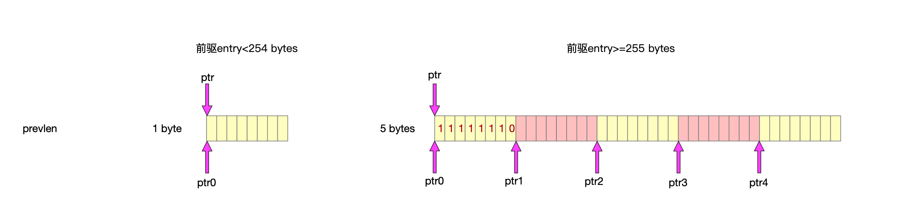
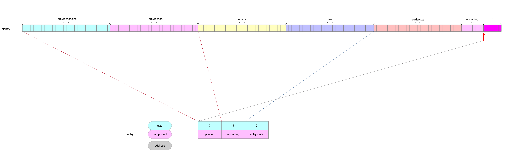

数据类型的编码方式。

## 1 ziplist是什么

### 1.1 结构

从注释上可以看出ziplist结构如下。


### 1.2 字段解释

| 字段    | 长度     | 语义                                                         |
| ------- | -------- | ------------------------------------------------------------ |
| zlbytes | uint32_t | 表示ziplist占用内存大小。                                    |
| zltail  | uint32_t | 表示最后一个entry相对ziplist的地址偏移量。                   |
| zllen   | uint16_t | entry节点数量，16bit上限是2^16-1。<br>数量<上限，代表的就是实际节点数量。<br>数量>=上限，节点的实际数量需要遍历计数。 |
| entry   | -        | 保存有限长度的字符串或者整数。                               |
| zlend   | byte     | 0xFF，特殊的节点，ziplist的结束标识。                        |

## 2 entry是什么

### 2.1 结构

从注释上可以看出entry的结构如下。



### 2.2 字段解释

| 字段       | 语义                                                         |
| ---------- | ------------------------------------------------------------ |
| prevlen    | 前驱节点entry占用多少bytes。                                 |
| encoding   | 主要作用区分存储的内容是整数还是字符串。<br>存储字符串的时候，还承担着表示字符串长度的职责。<br>存储整数的时候，可能还用来直接存储内容。 |
| entry-data | 节点实际存储的内容。<br>以字符数组形式存储的字符串，不需要\0结束标识符。<br>整数。 |

### 2.3 详解

#### 2.3.1 prevlen字段

为什么要在entry上冗余着前一个entry的内存大小，其实作用就跟双链表的指针差不多，这儿不用指针关联，只要记录上一个节点多少个字节就可以移动指针，往前寻址了。

前驱entry地址=当前entry地址-前驱entry大小



#### 2.3.2 encoding字段

encoding二进制表示形式的高2位作为标识位，决定entry中数据内容是字符数组还是整数。

##### 2.3.2.1 存储字符串



##### 2.3.2.2 存储整数



## 3 初始化ziplist





## 4 entry字段prevlen

### 4.1 prevlen前驱长度编码

```c
/**
 * @brief ptr指向entry中的prevlen字段 将prevlen的编码长度写到prevlensize中
 *                                  prevlen的值<0xfe 说明prevlen就1个字节 存储的就是前驱点占用多少bytes
 *                                  prevlen的值>=0xfe 说明prevlen共5个字节 第1个字节是0xfe标识 后4个字节存储前驱节点占用多少bytes
 * @param ptr 指向entry
 * @param prevlensize entry中prevlen字段的编码长度
 */
#define ZIP_DECODE_PREVLENSIZE(ptr, prevlensize) do {                          \
    if ((ptr)[0] < ZIP_BIG_PREVLEN) {                                          \
        (prevlensize) = 1;                                                     \
    } else {                                                                   \
        (prevlensize) = 5;                                                     \
    }                                                                          \
} while(0)
```

### 4.2 prevlen前驱长度

```c
/**
 * @brief ptr指向entry节点 将entrty中的prevlen字段向zlentry中的prevlensize和prevlen字段写入
 * @param ptr 指向entry节点
 * @param prevlensize 用来接收entry中prevlen字段的编码
 *                                    prevlen<255 1个字节表示长度 即prevlensize=1
 *                                    prevlen>=255 5个字节表示长度 即prevlensize=5
 * @param prevlen 用来接收entry中prevlen字段的值
 *                                    prevlen<255 zlentry中prevlen字段值=entry中prevlen字段值
 *                                    prevlen>=255 zlentry中prevlen字段值=entry中prevlen字段的后4个字节值
 */
#define ZIP_DECODE_PREVLEN(ptr, prevlensize, prevlen) do { \
    ZIP_DECODE_PREVLENSIZE(ptr, prevlensize);                                  \
    if ((prevlensize) == 1) {                                                  \
        (prevlen) = (ptr)[0];                                                  \
    } else { /* prevlensize == 5 */                                            \
        (prevlen) = ((ptr)[4] << 24) |                                         \
                    ((ptr)[3] << 16) |                                         \
                    ((ptr)[2] <<  8) |                                         \
                    ((ptr)[1]);                                                \
    }                                                                          \
} while(0)

```



### 4.3 prevlen需要多大内存 && prevlen字段写入

```c
// 这个函数有两个场景
//                1 不传entry时 不需要对entry中prevlen字段写入
//                2 传entry时 对entry中prevlen字段写入
// @param p 指向entry节点
// @pram len 前驱entry的长度大小
// @return p是null的时候 entry中需要给prevlen这个字段开辟多大内存(多少个byte)
unsigned int zipStorePrevEntryLength(unsigned char *p, unsigned int len) {
    if (p == NULL) {
        // 前驱节点大小的表示 要么用1个字节 要么用5个字节
        return (len < ZIP_BIG_PREVLEN) ? 1 : sizeof(uint32_t) + 1;
    } else {
        if (len < ZIP_BIG_PREVLEN) { // prevlen用1个字节表示 填充len的实际大小
            p[0] = len;
            return 1;
        } else { // prevlen用5个字节表示 第1个字节填充0xfe 后4个字节使用len的实际值
            return zipStorePrevEntryLengthLarge(p,len);
        }
    }


```


```c
// prevlen需要5个字节时 entry节点写入prevlen字段
// 这个函数有两个场景
//                1 不传entry时 不需要对entry中prevlen字段写入
//                2 传entry时 对entry中prevlen字段写入
// @param p entry节点
// @param len 写给prevlen字段表示的长度
// @return prevlen的大小 5个字节
int zipStorePrevEntryLengthLarge(unsigned char *p, unsigned int len) {
    uint32_t u32;
    if (p != NULL) {
        // prevlen共5bytes
        // 第1个byte填充标识位0xfe
        // 后4个byte写入len
        p[0] = ZIP_BIG_PREVLEN;
        u32 = len;
        memcpy(p+1,&u32,sizeof(u32));
        memrev32ifbe(p+1);
    }
    return 1 + sizeof(uint32_t);
}
```



## 5 entry字段encoding

### 5.1 编码类型

```c
// 字符串是否压缩成整型
// @param entry 内容
// @param entrylen 内容长度
// @param v 字符串转成的整数
// @param encoding entry种encoding字段
// @return 0-标识可以将字符串压缩成整型 1-标识可以将字符串压缩成整型
int zipTryEncoding(unsigned char *entry, unsigned int entrylen, long long *v, unsigned char *encoding) {
    // 字符串转换成的整数(long long)
    long long value;

    if (entrylen >= 32 || entrylen == 0) return 0; // 整型32bit边界
    if (string2ll((char*)entry,entrylen,&value)) { // 将entry字符串转换成整数value
        /* Great, the string can be encoded. Check what's the smallest
         * of our encoding types that can hold this value. */
        // entry的整数编码提供了6种 根据具体的数字大小选择合适的编码方式
        if (value >= 0 && value <= 12) { // 4bit无符号整数[0...12]
            *encoding = ZIP_INT_IMM_MIN+value; // 这种编码方式直接把内容也压缩到了encoding中了 1个字节搞定
        } else if (value >= INT8_MIN && value <= INT8_MAX) { // 8bit有符号
            *encoding = ZIP_INT_8B;
        } else if (value >= INT16_MIN && value <= INT16_MAX) { // 16bit有符号
            *encoding = ZIP_INT_16B;
        } else if (value >= INT24_MIN && value <= INT24_MAX) { // 24bit有符号
            *encoding = ZIP_INT_24B;
        } else if (value >= INT32_MIN && value <= INT32_MAX) { // 32bit有符号
            *encoding = ZIP_INT_32B;
        } else { // 64bit有符号
            *encoding = ZIP_INT_64B;
        }
        *v = value;
        return 1;
    }
    return 0;
}
```


### 5.2 encoding需要多大内存 && encoding字段写入

```c
// 该函数2个使用场景
//                p为null 只返回encoding需要几个字节即可
//                p不为null 不仅需要返回encoding需要几个字节 还需要为entry写入encoding这字段内容
// @param p 指向entry节点
// @param encoding entry中encoding字段
// @param rawlen entry中entry-data实际内容的长度
// @return entry需要为encoding这个字段开辟多大内存
//         不同的编码类型开辟的字节数不同
//         字符串 可能需要1byte或者2bytes或者5bytes
//         整数 需要1byte
unsigned int zipStoreEntryEncoding(unsigned char *p, unsigned char encoding, unsigned int rawlen) {
    unsigned char len = 1, buf[5];

    if (ZIP_IS_STR(encoding)) { // 字符串编码方式需要给encoding分配大小可能是1byte\2bytes\5bytes 根据字符串长度决定
        /* Although encoding is given it may not be set for strings,
         * so we determine it here using the raw length. */
        if (rawlen <= 0x3f) { // encoding需要1byte 高2位放1 后6位表示字符串长度 长度上限就是0x3f
            if (!p) return len;
            buf[0] = ZIP_STR_06B | rawlen;
        } else if (rawlen <= 0x3fff) { // encoding需要2bytes 高2位放1 后14位表示字符串长度 长度上限就是0x3fff
            len += 1;
            if (!p) return len;
            buf[0] = ZIP_STR_14B | ((rawlen >> 8) & 0x3f);
            buf[1] = rawlen & 0xff;
        } else { // encoding需要5bytes 高2位放1 后40位表示字符串长度 长度上限就是0x3fffffffff
            len += 4;
            if (!p) return len;
            buf[0] = ZIP_STR_32B;
            buf[1] = (rawlen >> 24) & 0xff;
            buf[2] = (rawlen >> 16) & 0xff;
            buf[3] = (rawlen >> 8) & 0xff;
            buf[4] = rawlen & 0xff;
        }
    } else { // 整数编码需要给encoding这个字段分配1byte
        /* Implies integer encoding, so length is always 1. */
        if (!p) return len;
        buf[0] = encoding;
    }

    /* Store this length at p. */
    memcpy(p,buf,len);
    return len;
}
```


## 6 entry字段entry-data

### 6.1 entry-data需要大多内存

#### 6.1.1 字符串

entry-data中存储字符串，不需要给字符数组申请结束标识\0。

```c
reqlen = slen; // 字符串编码 有多少个字符就需要申请多少个byte
```

#### 6.1.2 整数

```c
// 根据整数编码计算表示内容需要的大小 也就是entry中的entry-data字段
// @param encoding 整数编码方式
static inline unsigned int zipIntSize(unsigned char encoding) {
    switch(encoding) {
    case ZIP_INT_8B:  return 1; // 1字节
    case ZIP_INT_16B: return 2; // 2字节
    case ZIP_INT_24B: return 3; // 3字节
    case ZIP_INT_32B: return 4; // 4字节
    case ZIP_INT_64B: return 8; // 5字节
    }
    // [0...12]的数字会编码到encoding中 不需要额外的内存
    if (encoding >= ZIP_INT_IMM_MIN && encoding <= ZIP_INT_IMM_MAX)
        return 0; /* 4 bit immediate */
    /* bad encoding, covered by a previous call to ZIP_ASSERT_ENCODING */
    redis_unreachable();
    return 0;
}
```

### 6.2 entry-data字段写入

### 6.2.1 字符串

```c
memcpy(p,s,slen);
```

### 6.2.2 整数

```c
// 向entry中写入整数的entry-data
// @param p entry节点
// @param value 整数的值
// @param encoding 编码
void zipSaveInteger(unsigned char *p, int64_t value, unsigned char encoding) {
    int16_t i16;
    int32_t i32;
    int64_t i64;
    if (encoding == ZIP_INT_8B) { // 1字节
        ((int8_t*)p)[0] = (int8_t)value;
    } else if (encoding == ZIP_INT_16B) { // 2字节
        i16 = value;
        memcpy(p,&i16,sizeof(i16));
        memrev16ifbe(p);
    } else if (encoding == ZIP_INT_24B) { // 3字节
        i32 = value<<8;
        memrev32ifbe(&i32);
        memcpy(p,((uint8_t*)&i32)+1,sizeof(i32)-sizeof(uint8_t));
    } else if (encoding == ZIP_INT_32B) { // 4字节
        i32 = value;
        memcpy(p,&i32,sizeof(i32));
        memrev32ifbe(p);
    } else if (encoding == ZIP_INT_64B) { // 8字节
        i64 = value;
        memcpy(p,&i64,sizeof(i64));
        memrev64ifbe(p);
    } else if (encoding >= ZIP_INT_IMM_MIN && encoding <= ZIP_INT_IMM_MAX) { // 直接写在encoding的后6bit上了
        /* Nothing to do, the value is stored in the encoding itself. */
    } else {
        assert(NULL);
    }
}
```

## 7 ziplist大小重置

```c
// ziplist重置大小
// @param zl ziplist实例
// @param len 新ziplist的大小
unsigned char *ziplistResize(unsigned char *zl, size_t len) {
    assert(len < UINT32_MAX);
    // 内存分批
    zl = zrealloc(zl,len);
    // ziplist中zlbytes字段记录新的大小
    ZIPLIST_BYTES(zl) = intrev32ifbe(len);
    // ziplist结束标识
    zl[len-1] = ZIP_END;
    return zl;
}
```

## 8 添加节点

### 8.1 任意位置插入节点

```c
// 添加内容 以entry节点形式挂到ziplist上
// @param zl ziplist
// @param p entry节点 挂到哪个节点之后
// @param s 内容
// @param slen 内容长度
unsigned char *__ziplistInsert(unsigned char *zl, unsigned char *p, unsigned char *s, unsigned int slen) {
    // 取出ziplist的zlbytes值
    // curlen ziplist的大小
    // reqlen 需要向系统申请多大内容给当前entry节点 reqlen=prevlen需要的内存+encoding需要的内存+entry-data需要的内存
    size_t curlen = intrev32ifbe(ZIPLIST_BYTES(zl)), reqlen, newlen;
    unsigned int prevlensize, prevlen = 0;
    size_t offset;
    int nextdiff = 0;
    // encoding 0000 0000
    // 字符串编码下高2位0 剩下6位表示字符串长度
    // 也就是说如果是字符串编码方式 那么默认支持的字符串长度是2^6-1
    // 如果实际字符串长度比2^6-1要长 那么就要更新encoding编码方式
    unsigned char encoding = 0;
    long long value = 123456789; /* initialized to avoid warning. Using a value
                                    that is easy to see if for some reason
                                    we use it uninitialized. */
    zlentry tail;

    /* Find out prevlen for the entry that is inserted. */
    if (p[0] != ZIP_END) { // p指向的是end
        ZIP_DECODE_PREVLEN(p, prevlensize, prevlen);
    } else {
        unsigned char *ptail = ZIPLIST_ENTRY_TAIL(zl); // tail节点
        if (ptail[0] != ZIP_END) { // 往中间某个节点后挂载
            prevlen = zipRawEntryLengthSafe(zl, curlen, ptail);
        }
    }

    /* See if the entry can be encoded */
    // s 字符串
    // slen 字符串长度
    // value 字符串转换成的整数
    // encoding 整数的编码 也就是entry中的encoding字段
    if (zipTryEncoding(s,slen,&value,&encoding)) { // 字符串是否可以压缩成整型
        /* 'encoding' is set to the appropriate integer encoding */
        reqlen = zipIntSize(encoding); // 整数内容还需要多大内存 也就是entry节点中的entry-data需要多少字节
    } else {
        /* 'encoding' is untouched, however zipStoreEntryEncoding will use the
         * string length to figure out how to encode it. */
        reqlen = slen; // 字符串编码 有多少个字符就需要申请多少个byte
    }
    // 此时reqlen只记录了entry中需要开辟多大内存给entry-data这个字段
    /* We need space for both the length of the previous entry and
     * the length of the payload. */
    // entry中需要开辟多大内存给prevlen这个字段
    reqlen += zipStorePrevEntryLength(NULL,prevlen);
    // entry中需要开辟多大内存给encoding这个字段
    reqlen += zipStoreEntryEncoding(NULL,encoding,slen);

    /* When the insert position is not equal to the tail, we need to
     * make sure that the next entry can hold this entry's length in
     * its prevlen field. */
    int forcelarge = 0;
    nextdiff = (p[0] != ZIP_END) ? zipPrevLenByteDiff(p,reqlen) : 0;
    if (nextdiff == -4 && reqlen < 4) {
        nextdiff = 0;
        forcelarge = 1;
    }

    /* Store offset because a realloc may change the address of zl. */
    offset = p-zl;
    // 新添加entry节点了 ziplist要扩容 ziplist要扩到多大=老ziplist大小+新entry节点大小+节点不是挂在末节点可能导致的额外内存
    newlen = curlen+reqlen+nextdiff;
    // ziplist重置大小
    zl = ziplistResize(zl,newlen);
    p = zl+offset; // 保证p在ziplist中的相对位置

    /* Apply memory move when necessary and update tail offset. */
    if (p[0] != ZIP_END) {
        /* Subtract one because of the ZIP_END bytes */
        memmove(p+reqlen,p-nextdiff,curlen-offset-1+nextdiff);

        /* Encode this entry's raw length in the next entry. */
        if (forcelarge)
            zipStorePrevEntryLengthLarge(p+reqlen,reqlen);
        else
            zipStorePrevEntryLength(p+reqlen,reqlen);

        /* Update offset for tail */
        ZIPLIST_TAIL_OFFSET(zl) =
            intrev32ifbe(intrev32ifbe(ZIPLIST_TAIL_OFFSET(zl))+reqlen);

        /* When the tail contains more than one entry, we need to take
         * "nextdiff" in account as well. Otherwise, a change in the
         * size of prevlen doesn't have an effect on the *tail* offset. */
        assert(zipEntrySafe(zl, newlen, p+reqlen, &tail, 1));
        if (p[reqlen+tail.headersize+tail.len] != ZIP_END) {
            ZIPLIST_TAIL_OFFSET(zl) =
                intrev32ifbe(intrev32ifbe(ZIPLIST_TAIL_OFFSET(zl))+nextdiff);
        }
    } else {
        /* This element will be the new tail. */
        ZIPLIST_TAIL_OFFSET(zl) = intrev32ifbe(p-zl);
    }

    /* When nextdiff != 0, the raw length of the next entry has changed, so
     * we need to cascade the update throughout the ziplist */
    if (nextdiff != 0) {
        offset = p-zl;
        zl = __ziplistCascadeUpdate(zl,p+reqlen);
        p = zl+offset;
    }

    /* Write the entry */
    // entry写入prevlen字段
    p += zipStorePrevEntryLength(p,prevlen);
    // entry写入encoding字段
    // 此时的encoding状态
    //                  如果是字符串编码  encoding默认赋值为了1个byte(0000 0000) 现在还要根据字符串的实际长度再次确认encoding是1 byte\2 bytes\5 bytes
    //                  如果是整数编码   encoding就1个byte 前面已经根据整数大小填充好了encoding的各个bit
    p += zipStoreEntryEncoding(p,encoding,slen);
    // entry写入entry-data
    if (ZIP_IS_STR(encoding)) { // 写入字符串
        memcpy(p,s,slen);
    } else { // 写入整数 [0...12]的内容直接写在encoding空置的后6bit上
        zipSaveInteger(p,value,encoding);
    }
    ZIPLIST_INCR_LENGTH(zl,1);
    return zl;
}
```

### 8.2 头插\尾插

```c
/**
 * @brief push的语义是头插还是尾插
 * @param zl ziplist实例
 * @param s 元素
 * @param slen 元素大小 几个字节
 * @param where 新增元素插入到哪个entry节点之后
 * @return ziplist实例
 */
unsigned char *ziplistPush(unsigned char *zl, unsigned char *s, unsigned int slen, int where) {
    unsigned char *p;
    // 头插还是尾插
    p = (where == ZIPLIST_HEAD) ? ZIPLIST_ENTRY_HEAD(zl) : ZIPLIST_ENTRY_END(zl);
    return __ziplistInsert(zl,p,s,slen);
}
```


## 9 按照脚标查找元素

```c
// 按照entry的相对脚标查找
// @param zl ziplist实例
// @param index 给定的脚标位置
//                           负数 从后往前找
//                           非负数 从前往后找脚标位置
unsigned char *ziplistIndex(unsigned char *zl, int index) {
    unsigned char *p;
    unsigned int prevlensize, prevlen = 0;
    // 取出ziplist中zlbytes字段的值
    size_t zlbytes = intrev32ifbe(ZIPLIST_BYTES(zl));
    if (index < 0) { // 从后往前找
        index = (-index)-1;
        p = ZIPLIST_ENTRY_TAIL(zl); // 最后一个entry地址
        if (p[0] != ZIP_END) {
            /* No need for "safe" check: when going backwards, we know the header
             * we're parsing is in the range, we just need to assert (below) that
             * the size we take doesn't cause p to go outside the allocation. */
            ZIP_DECODE_PREVLEN(p, prevlensize, prevlen);
            while (prevlen > 0 && index--) {
                p -= prevlen;
                assert(p >= zl + ZIPLIST_HEADER_SIZE && p < zl + zlbytes - ZIPLIST_END_SIZE);
                ZIP_DECODE_PREVLEN(p, prevlensize, prevlen);
            }
        }
    } else { // 从前往后找
        p = ZIPLIST_ENTRY_HEAD(zl); // 首个entry地址
        while (index--) {
            /* Use the "safe" length: When we go forward, we need to be careful
             * not to decode an entry header if it's past the ziplist allocation. */
            // p指向的entry节点的大小 指针后移到下一个entry节点
            p += zipRawEntryLengthSafe(zl, zlbytes, p);
            if (p[0] == ZIP_END)
                break;
        }
    }
    // ziplist是空的 没有entry节点
    if (p[0] == ZIP_END || index > 0)
        return NULL;
    zipAssertValidEntry(zl, zlbytes, p);
    return p;
}
```

## 10 entry节点的后继节点

```c
// @param zl ziplist实例
// @param p entry节点
unsigned char *ziplistNext(unsigned char *zl, unsigned char *p) {
    ((void) zl);
    // ziplist的blbytes字段值
    size_t zlbytes = intrev32ifbe(ZIPLIST_BYTES(zl));

    /* "p" could be equal to ZIP_END, caused by ziplistDelete,
     * and we should return NULL. Otherwise, we should return NULL
     * when the *next* element is ZIP_END (there is no next entry). */
    if (p[0] == ZIP_END) { // p已经指向了end 之后没有entry节点了
        return NULL;
    }

    p += zipRawEntryLength(p); // 指针后移到下一个entry节点
    if (p[0] == ZIP_END) { // 刚才的p已经是ziplist中的最后一个entry了 现在指向了end节点
        return NULL;
    }

    zipAssertValidEntry(zl, zlbytes, p);
    return p;
}
```

## 11 zlentry

### 11.1 数据结构

```c
// 实际存放数据的节点
typedef struct zlentry {
    // 前驱节点entry的长度为prevrawlen 编码prevrawlen需要几个字节
    unsigned int prevrawlensize; /* Bytes used to encode the previous entry len*/
    // 前驱节点entry的长度为prevrawlen
    unsigned int prevrawlen;     /* Previous entry len. */
    // 当前节点entry的长度为len 编码len需要几个字节
    unsigned int lensize;        /* Bytes used to encode this entry type/len.
                                    For example strings have a 1, 2 or 5 bytes
                                    header. Integers always use a single byte.*/
    // 当前节点entry的长度为len
    unsigned int len;            /* Bytes used to represent the actual entry.
                                    For strings this is just the string length
                                    while for integers it is 1, 2, 3, 4, 8 or
                                    0 (for 4 bit immediate) depending on the
                                    number range. */
    // 节点头部所需要的字节数=prevrawlensize+lensize
    unsigned int headersize;     /* prevrawlensize + lensize. */
    // 编码方式 整数\字符数组
    unsigned char encoding;      /* Set to ZIP_STR_* or ZIP_INT_* depending on
                                    the entry encoding. However for 4 bits
                                    immediate integers this can assume a range
                                    of values and must be range-checked. */
    // 数据节点的数据(包含头部信息)以字符串形式保存
    unsigned char *p;            /* Pointer to the very start of the entry, that
                                    is, this points to prev-entry-len field. */
} zlentry;
```


### 11.2 示意图



### 11.3 数据结构转换

#### 11.3.1 entry信息写到zlentry

```c
/**
 * @brief 将p指向的entry信息写到zlentry中
 * @param p ziplist中entry节点
 * @param e zlentry
 */
static inline void zipEntry(unsigned char *p, zlentry *e) {
    // entry的prevlen字段写到zlentry的prevrawlensize和prevrawlen字段
    ZIP_DECODE_PREVLEN(p, e->prevrawlensize, e->prevrawlen);
    // entry的encoding写到zlentry的encoding字段
    ZIP_ENTRY_ENCODING(p + e->prevrawlensize, e->encoding);
    // entry的encoding以及data-entry写到zlentry的lensize和len字段
    ZIP_DECODE_LENGTH(p + e->prevrawlensize, e->encoding, e->lensize, e->len);
    assert(e->lensize != 0); /* check that encoding was valid. */
    // 写zlentry的headersize字段
    e->headersize = e->prevrawlensize + e->lensize;
    e->p = p;
}
```


##### 11.3.1.1 entry中prevlen字段解析到zlentry中prevrawlensize和prevrawlen

```c
/**
 * @brief ptr指向entry节点 将entrty中的prevlen字段向zlentry中的prevrawlensize和prevrawlen字段写入
 * @param ptr 指向entry节点
 * @param prevlensize zlentry中的prevrawlensize字段 用来接收entry中prevlen字段的编码
 *                                    prevlen<255 1个字节表示长度 即prevlensize=1
 *                                    prevlen>=255 5个字节表示长度 即prevlensize=5
 * @param prevlen zlentry中prevrawlen字段 用来接收entry中prevlen字段的值
 *                                    prevlen<255 zlentry中prevlen字段值=entry中prevlen字段值
 *                                    prevlen>=255 zlentry中prevlen字段值=entry中prevlen字段的后4个字节值
 */
#define ZIP_DECODE_PREVLEN(ptr, prevlensize, prevlen) do { \
    ZIP_DECODE_PREVLENSIZE(ptr, prevlensize);                                  \
    if ((prevlensize) == 1) {                                                  \
        (prevlen) = (ptr)[0];                                                  \
    } else { /* prevlensize == 5 */                                            \
        (prevlen) = ((ptr)[4] << 24) |                                         \
                    ((ptr)[3] << 16) |                                         \
                    ((ptr)[2] <<  8) |                                         \
                    ((ptr)[1]);                                                \
    }                                                                          \
} while(0)

```


```c
/**
 * @brief ptr指向entry中的prevlen字段 将prevlen的编码长度写到zlentry中的prevrawlensize字段
 *                                  prevlen的值<0xfe 说明prevlen就1个字节 存储的就是前驱点占用多少bytes
 *                                  prevlen的值>=0xfe 说明prevlen共5个字节 第1个字节是0xfe标识 后4个字节存储前驱节点占用多少bytes
 * @param ptr 指向entry
 * @param prevlensize zlentry中的prevrawlensize字段 用来接收entry中prevlen字段的编码长度
 */
#define ZIP_DECODE_PREVLENSIZE(ptr, prevlensize) do {                          \
    if ((ptr)[0] < ZIP_BIG_PREVLEN) {                                          \
        (prevlensize) = 1;                                                     \
    } else {                                                                   \
        (prevlensize) = 5;                                                     \
    }                                                                          \
} while(0)
```

##### 11.3.1.2 entry中encoding字段解析到zlentry中encoding字段

```c
/**
 * @brief ptr指向entry的encoding字段 把entry的encoding的高2位编码信息写到zlentry的encoding字段中
 * @param ptr 指向了entry的encoding字段
 * @param encoding 代指zlentry的encoding字段
 */
#define ZIP_ENTRY_ENCODING(ptr, encoding) do {  \
    (encoding) = ((ptr)[0]); \
    if ((encoding) < ZIP_STR_MASK) (encoding) &= ZIP_STR_MASK; \
} while(0)

```

##### 11.3.1.3 entry中encoding和data-entry字段解析到zlentry中lensize和len字段

```c
/**
 * @brief entry的encoding以及data-entry写到zlentry的lensize和len字段
 * @param ptr指向entry的encoding字段地址
 * @param encoding 代指zlentry的encoding字段
 * @param lensize 代指zlentry的lensize字段
 * @param len 代指zlentry的len字段
 */
#define ZIP_DECODE_LENGTH(ptr, encoding, lensize, len) do {                    \
    if ((encoding) < ZIP_STR_MASK) {                                           \
        if ((encoding) == ZIP_STR_06B) {                                       \
            (lensize) = 1;                                                     \
            (len) = (ptr)[0] & 0x3f;                                           \
        } else if ((encoding) == ZIP_STR_14B) {                                \
            (lensize) = 2;                                                     \
            (len) = (((ptr)[0] & 0x3f) << 8) | (ptr)[1];                       \
        } else if ((encoding) == ZIP_STR_32B) {                                \
            (lensize) = 5;                                                     \
            (len) = ((ptr)[1] << 24) |                                         \
                    ((ptr)[2] << 16) |                                         \
                    ((ptr)[3] <<  8) |                                         \
                    ((ptr)[4]);                                                \
        } else {                                                               \
            (lensize) = 0; /* bad encoding, should be covered by a previous */ \
            (len) = 0;     /* ZIP_ASSERT_ENCODING / zipEncodingLenSize, or  */ \
                           /* match the lensize after this macro with 0.    */ \
        }                                                                      \
    } else {                                                                   \
        (lensize) = 1;                                                         \
        if ((encoding) == ZIP_INT_8B)  (len) = 1;                              \
        else if ((encoding) == ZIP_INT_16B) (len) = 2;                         \
        else if ((encoding) == ZIP_INT_24B) (len) = 3;                         \
        else if ((encoding) == ZIP_INT_32B) (len) = 4;                         \
        else if ((encoding) == ZIP_INT_64B) (len) = 8;                         \
        else if (encoding >= ZIP_INT_IMM_MIN && encoding <= ZIP_INT_IMM_MAX)   \
            (len) = 0; /* 4 bit immediate */                                   \
        else                                                                   \
            (lensize) = (len) = 0; /* bad encoding */                          \
    }                                                                          \
} while(0)
```

#### 11.3.2 entry信息写到zlentry并校验

```c
/**
 * @brief 将p指向的entry节点信息封装到zlentry中
 * @param zl ziplist实例
 * @param zlbytes ziplist的zlbytes字段 ziplist所占内存大小
 * @param p 当前指向的entry节点地址
 * @param e 将entry节点信息填充到zlentry中 e指向的就是该zlentry
 * @param validate_prevlen 是否要校验前驱节点有没有越界 合法entry节点内存地址区间为[HEAD...END]
 * @return 1标识p指向的entry节点合法 0标识不合法
 */
static inline int zipEntrySafe(unsigned char* zl, size_t zlbytes, unsigned char *p, zlentry *e, int validate_prevlen) {
    // HEAD节点
    unsigned char *zlfirst = zl + ZIPLIST_HEADER_SIZE;
    // END节点
    unsigned char *zllast = zl + zlbytes - ZIPLIST_END_SIZE;
#define OUT_OF_RANGE(p) (unlikely((p) < zlfirst || (p) > zllast))

    /* If threre's no possibility for the header to reach outside the ziplist,
     * take the fast path. (max lensize and prevrawlensize are both 5 bytes) */
    if (p >= zlfirst && p + 10 < zllast) { // 1个entry=prevlen+encoding+entry-data prevlen最大值为5byte encoding最大值为5byte 该if分支确保了在[p...END]这一片内存上是有entry节点的
        // 从p地址开始 将整个entry信息写到zlentry实例中
        ZIP_DECODE_PREVLEN(p, e->prevrawlensize, e->prevrawlen);
        ZIP_ENTRY_ENCODING(p + e->prevrawlensize, e->encoding);
        ZIP_DECODE_LENGTH(p + e->prevrawlensize, e->encoding, e->lensize, e->len);
        e->headersize = e->prevrawlensize + e->lensize;
        e->p = p;
        /* We didn't call ZIP_ASSERT_ENCODING, so we check lensize was set to 0. */
        if (unlikely(e->lensize == 0))
            return 0; // 合法性校验 entry内容长度为0
        /* Make sure the entry doesn't rech outside the edge of the ziplist */
        if (OUT_OF_RANGE(p + e->headersize + e->len))
            return 0; // 合法性校验 越界 p指向的节点超出了ziplist上entry界限
        /* Make sure prevlen doesn't rech outside the edge of the ziplist */
        if (validate_prevlen && OUT_OF_RANGE(p - e->prevrawlen)) // 是否需要对前驱节点进行校验
            return 0; // 合法性校验 越界 前驱节点超出了ziplist上entry界限
        return 1;
    }

    /* Make sure the pointer doesn't rech outside the edge of the ziplist */
    if (OUT_OF_RANGE(p))
        return 0;

    /* Make sure the encoded prevlen header doesn't reach outside the allocation */
    // entry的prevlen编码写到zlentry的prevrawlensize字段
    ZIP_DECODE_PREVLENSIZE(p, e->prevrawlensize);
    if (OUT_OF_RANGE(p + e->prevrawlensize))
        return 0;

    /* Make sure encoded entry header is valid. */
    // entry的encoding字段的高2位编码标识写到zlentry的encoding字段
    ZIP_ENTRY_ENCODING(p + e->prevrawlensize, e->encoding);
    // 根据zlentry的encoding字段解析出lensize字段
    e->lensize = zipEncodingLenSize(e->encoding);
    if (unlikely(e->lensize == ZIP_ENCODING_SIZE_INVALID))
        return 0;

    /* Make sure the encoded entry header doesn't reach outside the allocation */
    if (OUT_OF_RANGE(p + e->prevrawlensize + e->lensize))
        return 0;

    /* Decode the prevlen and entry len headers. */
    // 填充zlentry的prevrawlensize和prevrawlen字段
    ZIP_DECODE_PREVLEN(p, e->prevrawlensize, e->prevrawlen);
    // 填充zlentry的len字段
    ZIP_DECODE_LENGTH(p + e->prevrawlensize, e->encoding, e->lensize, e->len);
    // zlentry的headersize字段
    e->headersize = e->prevrawlensize + e->lensize;

    /* Make sure the entry doesn't rech outside the edge of the ziplist */
    if (OUT_OF_RANGE(p + e->headersize + e->len))
        return 0;

    /* Make sure prevlen doesn't rech outside the edge of the ziplist */
    if (validate_prevlen && OUT_OF_RANGE(p - e->prevrawlen))
        return 0;

    e->p = p;
    return 1;
#undef OUT_OF_RANGE
}
```

### 11.4 entry所占内存

```c
/**
 * @brief p指向的entry所占内存 现将p指向的entry封装成zlentry 然后通过hadersize+len直接计算出entry节点的内存大小
 * @param zl ziplist实例
 * @param zlbytes ziplist所占内存大小
 * @param p 指向的entry地址
 * @return p指向的entry所占内存
 */
static inline unsigned int zipRawEntryLengthSafe(unsigned char* zl, size_t zlbytes, unsigned char *p) {
    zlentry e;
    // 将p指向的entry封装成zlentry
    assert(zipEntrySafe(zl, zlbytes, p, &e, 0));
    // entry节点所占内存
    return e.headersize + e.len;
}
```

## 12 读取entry节点中的元素

```c
/**
 * @brief p指向的entry中的entry-data读取出来
 * @param p entry地址
 * @param sstr entry中存储的元素是字符串 该字符串的字符数组地址
 * @param slen entry中存储的元素是字符串 该字符串的长度
 * @param sval entry中存储的元素是整数 该整数的值
 * @return 1标识p指向的是ziplist中合法的entry节点 并将entry中的元素读取了出来
 *         0标识p指向的不是合法entry节点地址 没有正确的元素被读取出来
 */
unsigned int ziplistGet(unsigned char *p, unsigned char **sstr, unsigned int *slen, long long *sval) {
    zlentry entry;
    if (p == NULL || p[0] == ZIP_END) return 0;
    if (sstr) *sstr = NULL;

    // 将p指向的entry信息封装到zlentry数据结构中 方便计算
    zipEntry(p, &entry); /* no need for "safe" variant since the input pointer was validated by the function that returned it. */
    if (ZIP_IS_STR(entry.encoding)) { // entry中存储的元素编码方式是字符数组
        if (sstr) {
            *slen = entry.len; // 字符串的长度
            *sstr = p+entry.headersize; // 字符数组地址
        }
    } else { // entry中存储的元素编码方式是整数
        if (sval) {
            // p+entry.headersize指向的是entry中的entry-data字段
            *sval = zipLoadInteger(p+entry.headersize,entry.encoding); // 整数
        }
    }
    return 1;
}
```

## 13 读取entry节点中整数元素

```c
/**
 * @brief entry的整数编码中 将整数数值读取出来
 * @param p 指向的是entry中的entry-data字段
 * @param encoding entry中的encoding字段值
 * @return entry中存储的整数元素的值
 */
int64_t zipLoadInteger(unsigned char *p, unsigned char encoding) {
    int16_t i16;
    int32_t i32;
    int64_t i64, ret = 0;
    if (encoding == ZIP_INT_8B) { // 11 111111 + 8bit有符号整数
        ret = ((int8_t*)p)[0];
    } else if (encoding == ZIP_INT_16B) { // 11 000000 + 16bit有符号整数
        memcpy(&i16,p,sizeof(i16));
        memrev16ifbe(&i16);
        ret = i16;
    } else if (encoding == ZIP_INT_32B) { // 11 010000 + 32bit有符号整数
        memcpy(&i32,p,sizeof(i32));
        memrev32ifbe(&i32);
        ret = i32;
    } else if (encoding == ZIP_INT_24B) { // 11 110000 + 24bit有符号整数
        i32 = 0;
        memcpy(((uint8_t*)&i32)+1,p,sizeof(i32)-sizeof(uint8_t));
        memrev32ifbe(&i32);
        ret = i32>>8;
    } else if (encoding == ZIP_INT_64B) { // 11 100000 + 64bit有符号整数
        memcpy(&i64,p,sizeof(i64));
        memrev64ifbe(&i64);
        ret = i64;
    } else if (encoding >= ZIP_INT_IMM_MIN && encoding <= ZIP_INT_IMM_MAX) { // 11 11???? 4bit无符号整数
        ret = (encoding & ZIP_INT_IMM_MASK)-1; // encoding这1byte上的后4bit就是存储的整数
    } else {
        assert(NULL);
    }
    return ret;
}
```

