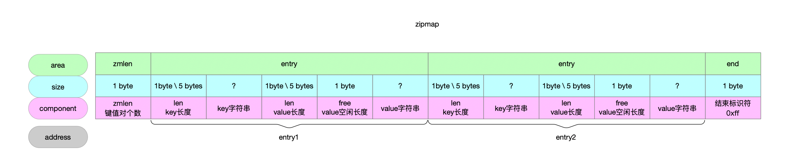
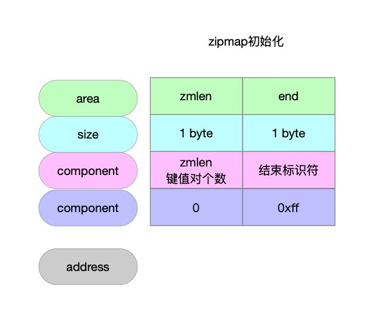

数据类型的编码方式。

## 1 zipmap数据结构

### 1.1 结构图



### 1.2 字段解释

#### 1.2.1 zipmap

| 字段  | 长度   | 语义                                                |
| ----- | ------ | --------------------------------------------------- |
| zmlen | 1 byte | zipmap实例中存储了多少个键值对，也就是entry的数量。 |
| entry | ?      | zipmap中存储的每个键值对。                          |
| end   | 1 byte | zipmap的结束标识符。                                |

#### 1.2.2 entry

| 字段  | 长度            | 语义                                                         |
| ----- | --------------- | ------------------------------------------------------------ |
| len   | 1 byte \ 5bytes | key的长度，len的编码方式根据key的长度而定。                  |
| key   | ?               | 键值对key的内容。                                            |
| len   | 1 byte \ 5bytes | value的长度，len的编码方式根据value的长度而定。              |
| free  | 1 byte          | 空闲空间，分配给value的内容，后来value更新了，可能字符串长度变小了，就空闲出来了一部分空间。 |
| value | ?               | 键值对value的内容。                                          |

## 2 zipmap实例化

```c
// @return zm实例的地址
unsigned char *zipmapNew(void) {
    // 申请2个字节 给zipmap填充两个字
    // zmlen end
    // \0x00\0xff
    unsigned char *zm = zmalloc(2);
    // zmlen字段 0个键值对
    zm[0] = 0; /* Length */
    // zipmap结束符 0xff
    zm[1] = ZIPMAP_END;
    return zm;
}
```



## 3 编码entry需要多大内存

```c
// 一个entry节点内存布局
// \len\key\len\free\value
// len->1个byte或者4个byte 具体根据key和value长度而定
// free->1个byte 并且初始化的时候free上存储的值为0x00
// @param klen key的字符串长度
// @param vlen value的字符串长度
// @return 编码[key, value]键值对需要多大内存
static unsigned long zipmapRequiredLength(unsigned int klen, unsigned int vlen) {
    unsigned int l;
    // key长度+value长度+len至少1个byte+len至少1个byte+free 1个byte
    l = klen+vlen+3;
    // 字符串长度>=0xfe时 len字段需要5个byte
    if (klen >= ZIPMAP_BIGLEN) l += 4;
    if (vlen >= ZIPMAP_BIGLEN) l += 4;
    return l;
}
```

## 4 entry中len字段

### 4.1 len字段读取

```c
// 读取zipmap中entry节点的的len字段值
// key\value的长度使用len表示 len要么1 byte 要么5 bytes
// @param p 指向entry的指针
// @return entry中的key或者value的len的值
static unsigned int zipmapDecodeLength(unsigned char *p) {
    unsigned int len = *p;
    // 字符串长度[0...253]通过1个byte表示
    if (len < ZIPMAP_BIGLEN) return len;
    // len字段5个byte 第1个byte标识符填充254 字符串长度通过后4 bytes表示
    memcpy(&len,p+1,sizeof(unsigned int)); // 读取后4个bytes上的值
    memrev32ifbe(&len);
    return len;
}
```

### 4.2 len字段编码需要多大内存 && len字段写入

```c
// 函数有2个功能
//             除非返回编码len需要几个byte之外
//             如果给定了entry节点p 还需要对entry的len字段进行编码写入
// @param p entry节点
// @param len len字段的值
// @return len字段几个byte 需要多大内存编码len字段
static unsigned int zipmapEncodeLength(unsigned char *p, unsigned int len) {
    if (p == NULL) {
        return ZIPMAP_LEN_BYTES(len);
    } else {
        if (len < ZIPMAP_BIGLEN) {
            p[0] = len;
            return 1;
        } else {
            p[0] = ZIPMAP_BIGLEN;
            memcpy(p+1,&len,sizeof(len));
            memrev32ifbe(p+1);
            return 1+sizeof(len);
        }
    }
}
```

## 5 检索key

```c
// 遍历zipmap
// 不传key 传totlen 则读取出zipmap的zmlen字段 也就是zipmap有多少个字节
// 传key 不传totlen 则搜索key 找到了就返回entry节点
// 传key 传totlen 则搜索key 找到了就返回entry节点 并且计算zipmap占多少个字节 放到totlen上
// @param zm zipmap实例
// @param key key字符串
// @param klen key的长度
// @param totlen 遍历完zipmap可以将zipmap的zmlen值记录在totlen上
// @return key所代表的entry的地址
static unsigned char *zipmapLookupRaw(unsigned char *zm, unsigned char *key, unsigned int klen, unsigned int *totlen) {
    // zm实例地址+1 如果zm中是空的也就是没有entry节点那么p指向end节点 如果zm中有entry节点那么p指向首个entry节点
    unsigned char *p = zm+1, *k = NULL;
    unsigned int l,llen;

    // 遍历整个zipmap所有的entry节点
    // 遍历entry节点过程中记录搜索到的key对应的节点
    while(*p != ZIPMAP_END) {
        unsigned char free;

        /* Match or skip the key */
        // entry节点的key的len字段值 key的字符串长度
        l = zipmapDecodeLength(p);
        // key的len字段几个byte 要么1要么5
        llen = zipmapEncodeLength(NULL,l);
        // memcmp函数比较两个地址开始的l长度 都相同返回0
        // p现在指向entry len字段占用llen个byte
        // p+llen指向字符串key
        if (key != NULL && k == NULL && l == klen && !memcmp(p+llen,key,l)) {
            /* Only return when the user doesn't care
             * for the total length of the zipmap. */
            // 找到了key的键值对
            if (totlen != NULL) {
                k = p;
            } else {
                return p;
            }
        }
        p += llen+l; // p指向value的len字段
        /* Skip the value as well */
        l = zipmapDecodeLength(p); // value的长度 value的len的值
        p += zipmapEncodeLength(NULL,l); // value的len的编码需要几个byte p指针后移到value的free字段
        free = p[0]; // value的free占1byte 读取free字段的值
        p += l+1+free; /* +1 to skip the free byte */ // p后移至下一个entry节点
    }
    if (totlen != NULL) *totlen = (unsigned int)(p-zm)+1; // 整个zipmap占多少个字节 记录在totlen上
    return k;
}
```

## 6 新增\更新节点

```c
// [key, value]键值对的设置 可能是新增 可能是更新
// @param zm zipmap实例
// @param key 字符串key
// @param klen 字符串key的长度
// @param value 字符串value
// @param vlen 字符串value的长度
// @param update 标识符 通知给调用方 update不为null就要把key是否存在的情况汇报出去
//                                key已经存在 update->1
//                                key不存在 update->0
unsigned char *zipmapSet(unsigned char *zm, unsigned char *key, unsigned int klen, unsigned char *val, unsigned int vlen, int *update) {
    // zmlen记录zm实例占多少个字节
    unsigned int zmlen, offset;
    // reqlen 一个新的entry需要多少个byte
    unsigned int freelen, reqlen = zipmapRequiredLength(klen,vlen);
    unsigned int empty, vempty;
    unsigned char *p;

    freelen = reqlen;
    if (update) *update = 0;
    // 在zipmap上搜索key的entry节点 并把zipmap的大小记录在zmlen上(zm实例占多少字节)
    p = zipmapLookupRaw(zm,key,klen,&zmlen);
    if (p == NULL) { // zm实例中没有key 则属于新增entry场景
        /* Key not found: enlarge */
        // 新增一个entry 对zm实例进行扩容 新节点挂到最后
        zm = zipmapResize(zm, zmlen+reqlen);
        // 新增节点在新zm实例中地址
        p = zm+zmlen-1;
        zmlen = zmlen+reqlen; // 新zm多大 占用多少字节

        /* Increase zipmap length (this is an insert) */
        if (zm[0] < ZIPMAP_BIGLEN) zm[0]++; // 新增了1个entry节点 更新zm实例的zmlen字段值 计数加1
    } else { // zm实例中已经存在key 属于更新entry场景
        /* Key found. Is there enough space for the new value? */
        /* Compute the total length: */
        if (update) *update = 1; // 汇报给调用 标识存在key 属于更新行为
        // entry节点p占用的字节数
        freelen = zipmapRawEntryLength(p);
        // 当前entry节点p已经占用了freelen个字节 现在要对节点进行更新 更新后的节点需要占用reqlen个字节
        if (freelen < reqlen) { // 需要扩容
            /* Store the offset of this key within the current zipmap, so
             * it can be resized. Then, move the tail backwards so this
             * pair fits at the current position. */
            // 目标节点在zm实例中相对位置
            offset = p-zm;
            // zm实例扩容
            zm = zipmapResize(zm, zmlen-freelen+reqlen);
            // 重新定位到目标节点
            p = zm+offset;

            /* The +1 in the number of bytes to be moved is caused by the
             * end-of-zipmap byte. Note: the *original* zmlen is used. */
            // 目标节点上内容复制
            memmove(p+reqlen, p+freelen, zmlen-(offset+freelen+1));
            zmlen = zmlen-freelen+reqlen; // 更新zm实例占用的字节数
            freelen = reqlen;
        }
    }

    /* We now have a suitable block where the key/value entry can
     * be written. If there is too much free space, move the tail
     * of the zipmap a few bytes to the front and shrink the zipmap,
     * as we want zipmaps to be very space efficient. */
    empty = freelen-reqlen; // entry节点的空闲字节数
    // zipmap的空闲字节数是有优化的 不允许过大的空闲字节 有过大的空闲字节会回收
    if (empty >= ZIPMAP_VALUE_MAX_FREE) {
        /* First, move the tail <empty> bytes to the front, then resize
         * the zipmap to be <empty> bytes smaller. */
        offset = p-zm;
        memmove(p+reqlen, p+freelen, zmlen-(offset+freelen+1));
        zmlen -= empty;
        zm = zipmapResize(zm, zmlen);
        p = zm+offset;
        vempty = 0;
    } else {
        vempty = empty;
    }

    /* Just write the key + value and we are done. */
    /* Key: */
    // 至此 不管是新增还是更新的场景 现在节点的内存已经准备好 就逐个写字段即可
    // \len\key\len\free\value
    // 向entry中写入key的len字段
    p += zipmapEncodeLength(p,klen);
    // 向entry中写入key
    memcpy(p,key,klen);
    p += klen;
    /* Value: */
    // 向entry中写入value的len字段
    p += zipmapEncodeLength(p,vlen);
    // 向entry中写入free字段
    *p++ = vempty;
    // 向entry中写入value
    memcpy(p,val,vlen);
    return zm;
}
```

