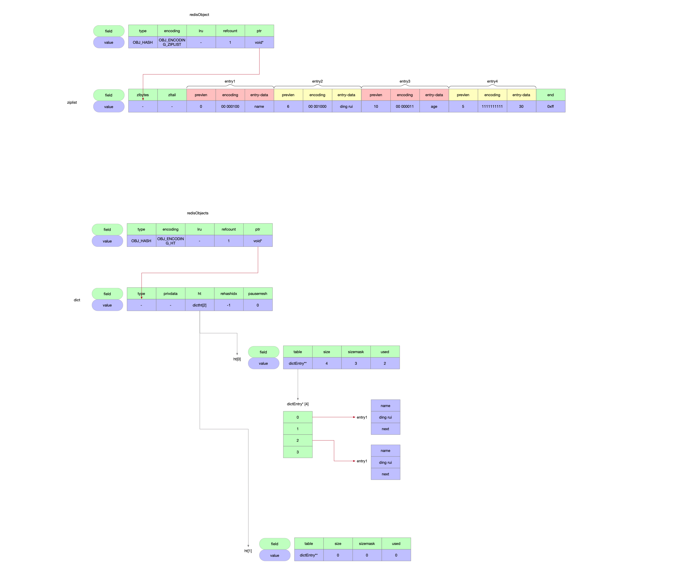
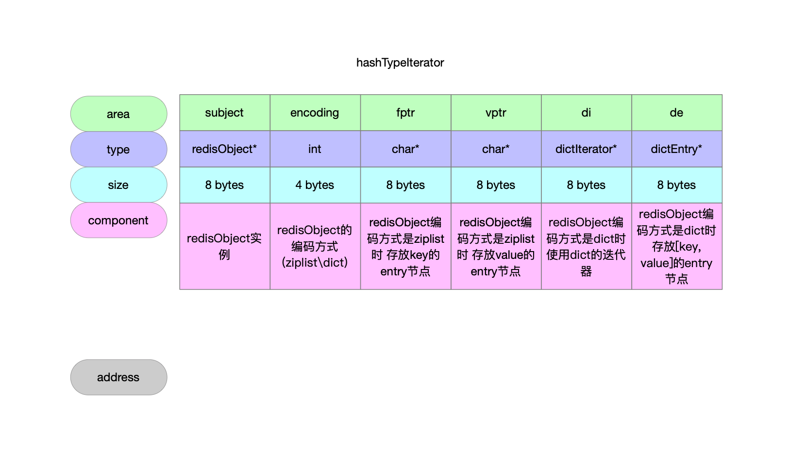
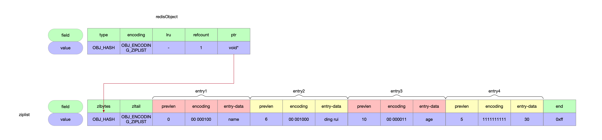
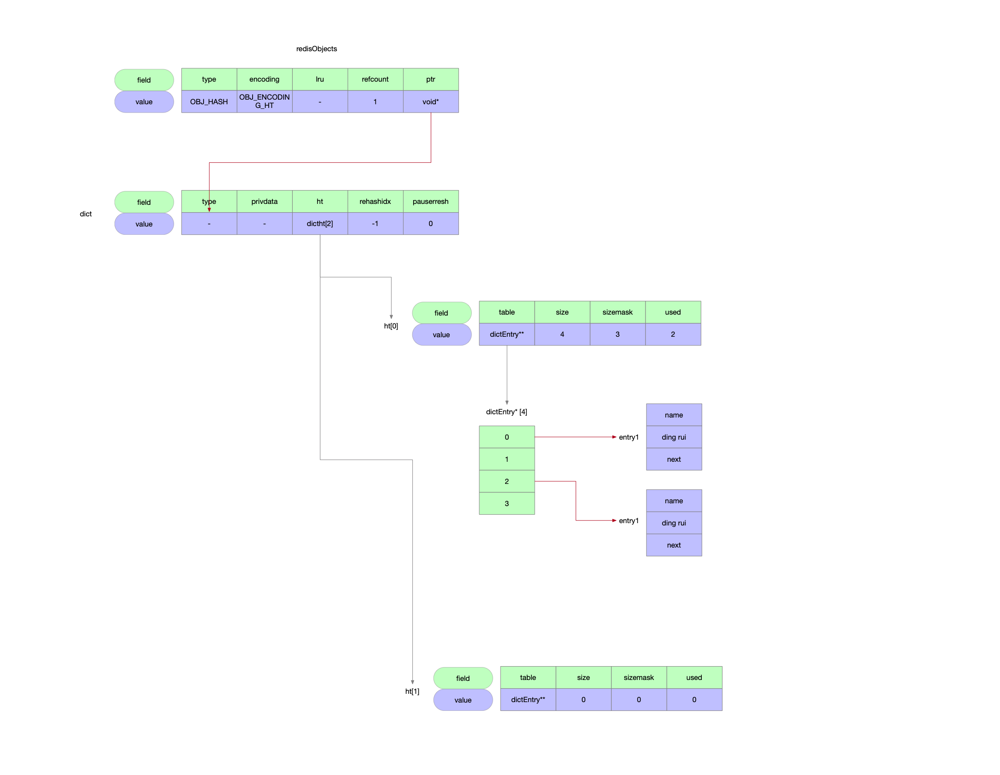

数据类型Hash哈希表。

## 1 数据结构关系

| 数据类型       | 实现   | 编码方式                                                | 数据结构 |
| -------------- | ------ | ------------------------------------------------------- | -------- |
| 哈希表OBJ_HASH | t_hash |  | ziplist  |
|                |        |          | dict     |



## 2 迭代器

### 2.1 数据结构

```c
// redisObject数据类型是OBJ_HASH 迭代器
typedef struct {
    robj *subject; // 维护redisObject实例
    int encoding; // redisObject的数据编码类型

    unsigned char *fptr, *vptr; // 编码方式是OBJ_ENCODING_ZIPLIST时使用 ziplist中的entry存放的是[key, value]键值对 也就是步进值为2 依次存放hash数据类型的key和value

    dictIterator *di; // redisObject编码方式是OBJ_ENCODING_HT时使用dict的迭代器
    dictEntry *de; // dict编码方式下迭代器的next元素 即entry节点
} hashTypeIterator;
```




### 2.2 初始化

```c
// redisObject的hash表类型数据的迭代器
// redisObject的数据类型是OBJ_HASH
// @param subect redisObject实例
// @return redisObject的OBJ_HASH类型数据的迭代器
hashTypeIterator *hashTypeInitIterator(robj *subject) {
    // redisObject的迭代器
    hashTypeIterator *hi = zmalloc(sizeof(hashTypeIterator));
    // 维护redisObject的信息
    // subject字段 redisObject实例
    hi->subject = subject;
    // encoding字段 redisObject的编码方式
    hi->encoding = subject->encoding;

    if (hi->encoding == OBJ_ENCODING_ZIPLIST) { // redisObject编码使用的是ziplist
        hi->fptr = NULL; // ziplist编码中键值对的key
        hi->vptr = NULL; // ziplist编码中键值对的value
    } else if (hi->encoding == OBJ_ENCODING_HT) { // redisObject编码使用的是dict
        hi->di = dictGetIterator(subject->ptr);
    } else {
        serverPanic("Unknown hash encoding");
    }
    return hi;
}
```

### 2.3 迭代

```c
// 迭代器的迭代操作
// @param hi redisObject数据类型是hash时候的迭代器
// @return 操作码 0-标识迭代器有next元素
//               1-标识迭代器遍历完了 没有了next元素
int hashTypeNext(hashTypeIterator *hi) {
    if (hi->encoding == OBJ_ENCODING_ZIPLIST) { // redisObject编码方式为ziplist
        unsigned char *zl;
        unsigned char *fptr, *vptr;

        zl = hi->subject->ptr; // ziplist实例
        fptr = hi->fptr; // ziplist中存放key的entry节点
        vptr = hi->vptr; // ziplist中存放value的entry节点

        // ziplist的迭代器一旦开始工作 首个元素一定维护在迭代器实例中 为空说明迭代器初始化之后还没尽心过元素的遍历
        if (fptr == NULL) { // 迭代器刚初始化完
            /* Initialize cursor */
            serverAssert(vptr == NULL);
            // ziplist中的首个entry就是要找的key
            fptr = ziplistIndex(zl, 0);
        } else {
            /* Advance cursor */
            serverAssert(vptr != NULL);
            // 上一次迭代的value的后继节点就是这次迭代的key
            fptr = ziplistNext(zl, vptr);
        }
        if (fptr == NULL) return C_ERR;

        /* Grab pointer to the value (fptr points to the field) */
        // 这次迭代的key是fptr指向的entry节点
        // 那么value就是fptr的后继节点
        vptr = ziplistNext(zl, fptr);
        serverAssert(vptr != NULL);

        /* fptr, vptr now point to the first or next pair */
        // 将迭代器要迭代的[key, value]键值对维护在迭代器的字段中
        hi->fptr = fptr;
        hi->vptr = vptr;
    } else if (hi->encoding == OBJ_ENCODING_HT) { // redisObject编码方式为dict
        if ((hi->de = dictNext(hi->di)) == NULL) return C_ERR; // 直接使用dict中的迭代器实现 de指向本次要迭代的[key, value]entry节点
    } else {
        serverPanic("Unknown hash encoding");
    }
    return C_OK;
}
```

## 3 编码转换

ziplist转换dict。

```c
// 编码类型转换
// ziplist->zipmap
// @param enc 新的编码类型
void hashTypeConvert(robj *o, int enc) {
    if (o->encoding == OBJ_ENCODING_ZIPLIST) {
        hashTypeConvertZiplist(o, enc);
    } else if (o->encoding == OBJ_ENCODING_HT) {
        serverPanic("Not implemented");
    } else {
        serverPanic("Unknown hash encoding");
    }
}
```


```c
// 编码类型转换 ziplist->dict
// @param enc 新的编码类型 即dict
void hashTypeConvertZiplist(robj *o, int enc) {
    serverAssert(o->encoding == OBJ_ENCODING_ZIPLIST);

    if (enc == OBJ_ENCODING_ZIPLIST) {
        /* Nothing to do... */

    } else if (enc == OBJ_ENCODING_HT) {
        hashTypeIterator *hi;
        dict *dict;
        int ret;

        // redisObject的数据类型是OBJ_HASH 其编码类型只有两种 OBJ_ENCODING_ZIPLIST或者OBJ_ENCODING_HT
        // 那么这个地方的对应底层数据结构就是ziplist的迭代器
        hi = hashTypeInitIterator(o);
        // 初始化dict实例
        dict = dictCreate(&hashDictType, NULL);

        while (hashTypeNext(hi) != C_ERR) { // 迭代器遍历ziplist的数据
            sds key, value;

            key = hashTypeCurrentObjectNewSds(hi,OBJ_HASH_KEY);
            value = hashTypeCurrentObjectNewSds(hi,OBJ_HASH_VALUE);
            ret = dictAdd(dict, key, value);
            if (ret != DICT_OK) {
                serverLogHexDump(LL_WARNING,"ziplist with dup elements dump",
                    o->ptr,ziplistBlobLen(o->ptr));
                serverPanic("Ziplist corruption detected");
            }
        }
        hashTypeReleaseIterator(hi);
        zfree(o->ptr); // 数据原来的编码方式为OBJ_ENCODING_ZIPLIST 释放内存
        o->encoding = OBJ_ENCODING_HT; // redisObject数据新的编码方式
        o->ptr = dict; // 数据新的编码方式为OBJ_ENCODING_HT 数据内容
    } else {
        serverPanic("Unknown hash encoding");
    }
}
```


举个例子，假设键值对为：

```json
{
    "name": "ding rui",
    "age": "30"
}
```

### 3.1 ziplist编码



### 3.2 dict编码


