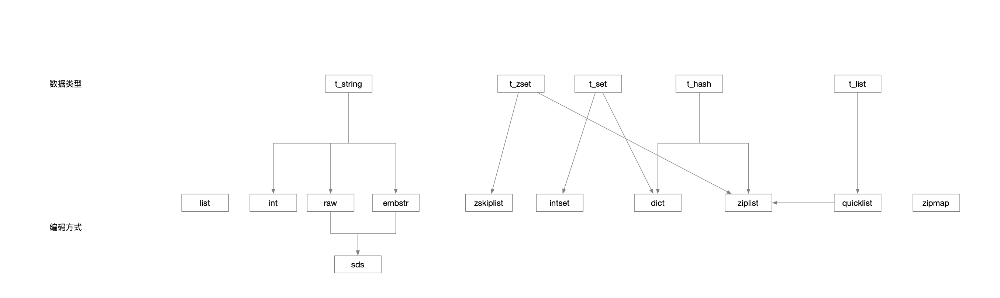
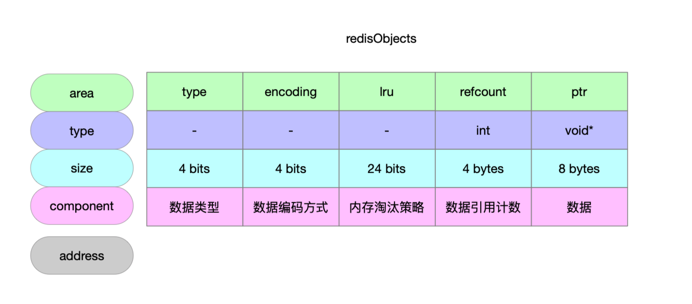
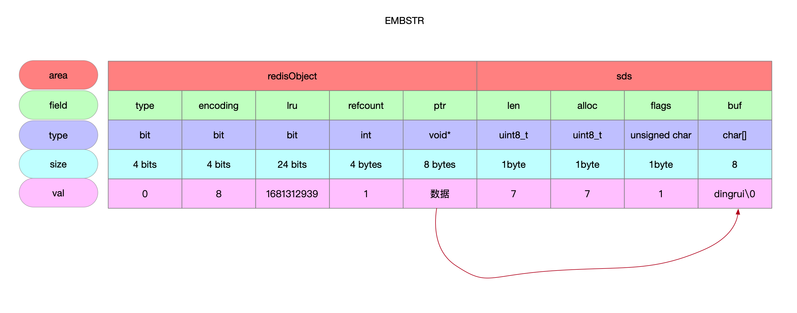
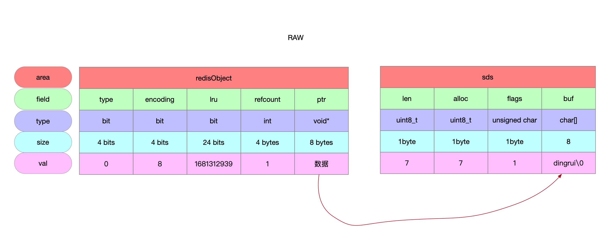

数据类型和编码



## 1 数据结构

### 1.1 数据结构图



### 1.2 type字段

| 数据类型 | 宏定义     | 值   |
| -------- | ---------- | ---- |
| 字符串   | OBJ_STRING | 0    |
| 列表     | OBJ_LIST   | 1    |
| 集合     | OBJ_SET    | 2    |
| 有序集合 | OBJ_ZSET   | 3    |
| 哈希表   | OBJ_HASH   | 4    |

### 1.3 encoding字段

| 编码方式 | 宏定义                  | 值   |
| -------- | ----------------------- | ---- |
|          | OBJ_ENCODING_RAW        | 0    |
|          | OBJ_ENCODING_INT        | 1    |
|          | OBJ_ENCODING_HT         | 2    |
|          | OBJ_ENCODING_ZIPMAP     | 3    |
|          | OBJ_ENCODING_LINKEDLIST | 4    |
|          | OBJ_ENCODING_ZIPLIST    | 5    |
|          | OBJ_ENCODING_INTSET     | 6    |
|          | OBJ_ENCODING_SKIPLIST   | 7    |
|          | OBJ_ENCODING_EMBSTR     | 8    |
|          | OBJ_ENCODING_QUICKLIST  | 9    |
|          | OBJ_ENCODING_STREAM     | 10   |

### 1.4 lru字段

配合内存淘汰策略使用的

* LRU策略
  * 记录访问数据的时间戳 单位秒 24位
* LFU策略
  * 高16位 记录访问数据的时间戳 单位分钟
  * 低8位 记录访问数据频率

### 1.5 refcount字段

数据的引用计数

### 1.6 ptr字段

数据

## 2 字符串

```c
/**
 * @brief 字符串对象
 *        对于字符串而言共3中编码方式
 *           - 编码成整数 整数的字节上限是64bit 反推字符串长度上限就是20
 *           - 编码成sds 根据长度进行选择具体的编码方式 长度临界是44
 *             - 编码成EMBSTR
 *             - 编码成RAW
 * @param ptr 字符串的字符数组形式
 * @param len 字符串长度
 * @return
 */
robj *createStringObject(const char *ptr, size_t len) {
    if (len <= OBJ_ENCODING_EMBSTR_SIZE_LIMIT)
        return createEmbeddedStringObject(ptr,len); // 字符串长度<=44 编码成EMBSTR
    else
        return createRawStringObject(ptr,len); // 编码成RAW
}
```

### 2.1 INT编码

```c
/**
 * @brief 字符串可以转换成整数 最终也将执行到这个方法
 *        体现的就是字符串的编发方式INT
 * @param value 整数
 * @param valueobj 标识是否可以使用共享对象
 *                 0标识可以使用共享对象
 *                 1标识不能用共享对象 相当于要用原型模式创建新对象
 * @return
 */
robj *createStringObjectFromLongLongWithOptions(long long value, int valueobj) {
    robj *o;

    if (server.maxmemory == 0 ||
        !(server.maxmemory_policy & MAXMEMORY_FLAG_NO_SHARED_INTEGERS))
    {
        /* If the maxmemory policy permits, we can still return shared integers
         * even if valueobj is true. */
        valueobj = 0;
    }

    if (value >= 0 && value < OBJ_SHARED_INTEGERS && valueobj == 0) { // 使用共享对象
        incrRefCount(shared.integers[value]);
        o = shared.integers[value];
    } else { // 原型
        if (value >= LONG_MIN && value <= LONG_MAX) { // 整数占用字节64bit 校验极值
            o = createObject(OBJ_STRING, NULL); // 数据类型是String
            o->encoding = OBJ_ENCODING_INT; // 编码方式是INT
            o->ptr = (void*)((long)value); // ptr指向的就是整数
        } else {
            o = createObject(OBJ_STRING,sdsfromlonglong(value));
        }
    }
    return o;
}
```

### 2.2 EMBSTR编码

```c
/**
 * @brief 字符串的编码是MEBSTR
 * @param ptr 字符串的字符数组形式
 * @param len 字符串长度
 * @return redisObject实例
 */
robj *createEmbeddedStringObject(const char *ptr, size_t len) {
    /**
     * @brief 申请一整片内存
     *        所谓的EMBSTR是针对长度<=44的字符串 将sds的内存和redisObject的内存连在一起
     *        因此 整体的内存布局如下
     *          - redisObject的内存大小
     *          - sds的内存大小
     *          - 字符串长度
     *          - 字符串结束符\0
     *        sdshdr5存储的字符串长度上限为2^5-1 即31
     *        而EMBSTR定义的存储字符串长度上限为44
     *        所以这个地方采用sdshdr8进行编码
     */
    robj *o = zmalloc(sizeof(robj)+sizeof(struct sdshdr8)+len+1); // 当前o指针指向的是用来存储redisObject的
    struct sdshdr8 *sh = (void*)(o+1); // sh指针指向的是sds数据结构 该数据结构现在柔性数组buf为空 不占空间 那么sdshdr8就是3byte大小

    o->type = OBJ_STRING; // 数据类型String
    o->encoding = OBJ_ENCODING_EMBSTR; // 编码方式EMBSTR
    o->ptr = sh+1; // 相当于sh指针后移3byte 此时指向的是sds的buf数组
    o->refcount = 1;
    if (server.maxmemory_policy & MAXMEMORY_FLAG_LFU) { // 数据访问时间记录
        o->lru = (LFUGetTimeInMinutes()<<8) | LFU_INIT_VAL;
    } else {
        o->lru = LRU_CLOCK();
    }

    sh->len = len; // 字符串长度
    sh->alloc = len; // 申请的buf数组长度
    sh->flags = SDS_TYPE_8; // sds类型
    if (ptr == SDS_NOINIT)
        sh->buf[len] = '\0';
    else if (ptr) {
        memcpy(sh->buf,ptr,len); // 字符串内容放到sds的buf数组里面
        sh->buf[len] = '\0'; // 结束符
    } else {
        memset(sh->buf,0,len+1);
    }
    return o;
}
```



### 2.3 RAW编码

```c
/**
 * @brief 字符串的编码方式是RAW
 *          - 字符串编码方式是sds
 *          - redisObject的内存布局并不一定跟sds连在一起
 * @param ptr 字符串的字符数组形式
 * @param len 字符串长度
 * @return
 */
robj *createRawStringObject(const char *ptr, size_t len) {
    // 将字符串以sds进行编码
    return createObject(OBJ_STRING, sdsnewlen(ptr,len));
}
```


```c
/**
 * @brief
 * @param type 数据类型 String List Hash Set ZSet
 * @param ptr redisObject的ptr指向的就是这个数据的实现
 *              - 对于字符串的编码sds而言 本身sds暴露的指针就是指向自己的buf数组 所以redisObject中的ptr指向的也就是buf数组
 * @return
 */
robj *createObject(int type, void *ptr) {
    robj *o = zmalloc(sizeof(*o));
    o->type = type; // 数据类型
    o->encoding = OBJ_ENCODING_RAW; // 编码方式
    o->ptr = ptr;
    o->refcount = 1;

    /* Set the LRU to the current lruclock (minutes resolution), or
     * alternatively the LFU counter. */
    // 内存淘汰策略是MAXMEMORY_NO_EVICTION
    if (server.maxmemory_policy & MAXMEMORY_FLAG_LFU) {
        /**
         * @brief
         *   - 高16位 记录访问数据的时间戳 分钟
         *   - 低8位 应该记录访问数据次数 但是这个地方初始化是5 啥意思
         */
         // TODO: 2023/4/12
        o->lru = (LFUGetTimeInMinutes()<<8) | LFU_INIT_VAL;
    } else {
        // 记录访问数据的时间戳 秒
        o->lru = LRU_CLOCK();
    }
    return o;
}
```




