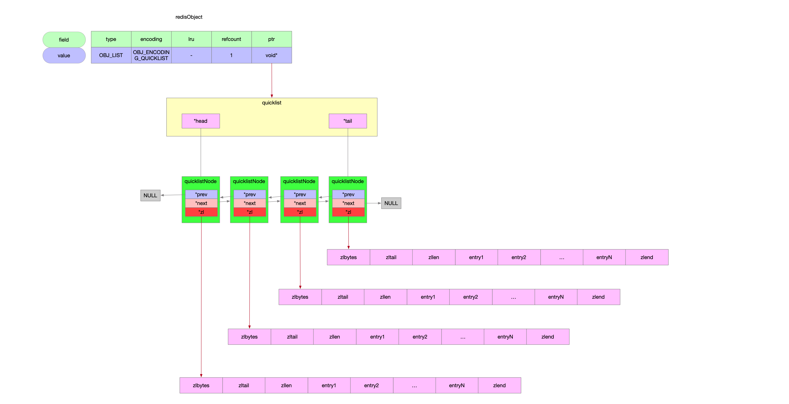
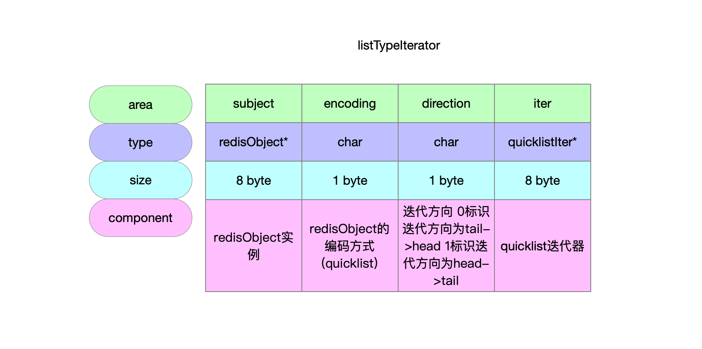

数据类型List列表。

## 1 list列表 数据结构关系

| 数据类型     | 实现   | 编码方式                                                    | 数据结构  |
| ------------ | ------ | ----------------------------------------------------------- | --------- |
| 列表OBJ_LIST | t_list |  | quicklist |
|              |        |      | ziplist   |



## 2 列表长度

```c
/**
 * @brief 列表长度 语义是列表中元素的数量
 *        列表的编码方式是quicklist 列表的长度就是quicklist中存储的元素的数量
 *        换言之就是 所有ziplist中entry节点的数量之和
 * @param subject redisObject实例
 * @return quicklist中count字段值
 */
unsigned long listTypeLength(const robj *subject) {
    if (subject->encoding == OBJ_ENCODING_QUICKLIST) { // 列表的编码方式是quicklist
        return quicklistCount(subject->ptr); // quicklist的count字段维护了quicklist中所有ziplist的entry节点计数
    } else {
        serverPanic("Unknown list encoding");
    }
}
```

## 3 列表迭代器

### 3.1 数据结构

```c
// 加上填充字节 该结构体24byte
typedef struct {
    // redisObject实例
    robj *subject;
    // redisObject的编码方式 列表的编码只有一种 就是quicklist
    unsigned char encoding;
    // 迭代方向 0标识迭代方向为tail->head 1标识迭代方向为head->tail
    unsigned char direction; /* Iteration direction */
    // quicklist迭代器
    quicklistIter *iter;
} listTypeIterator;
```



### 3.2 创建列表迭代器

```c
/**
 * @brief 创建列表的迭代器
 * @param subject redisObject实例
 * @param index 列表元素脚标[0...n-1] 从index开始迭代
 * @param direction 迭代方向 0标识列表迭代方向为tail->head 1标识列表迭代方向为head->tail
 * @return 列表迭代器
 */
listTypeIterator *listTypeInitIterator(robj *subject, long index,
                                       unsigned char direction) {
    // 申请内存24byte
    listTypeIterator *li = zmalloc(sizeof(listTypeIterator));
    // 初始化
    li->subject = subject;
    li->encoding = subject->encoding;
    li->direction = direction;
    li->iter = NULL;
    /* LIST_HEAD means start at TAIL and move *towards* head.
     * LIST_TAIL means start at HEAD and move *towards tail. */
    int iter_direction =
        direction == LIST_HEAD ? AL_START_TAIL : AL_START_HEAD;
    // 列表数据结构的实现依赖的编码方式只有quicklist
    if (li->encoding == OBJ_ENCODING_QUICKLIST) {
        li->iter = quicklistGetIteratorAtIdx(li->subject->ptr,
                                             iter_direction, index); // 创建quicklist指定位置的迭代器
    } else {
        serverPanic("Unknown list encoding");
    }
    return li;
}
```

### 3.3 释放列表迭代器

```c
// 释放列表迭代器
void listTypeReleaseIterator(listTypeIterator *li) {
    zfree(li->iter);
    zfree(li);
}
```

### 3.4 列表迭代器遍历

```c
/**
 * @brief 列表类型迭代
 *        列表的数据类型底层编码实现是quicklist 本质是通过quicklist进行迭代 将结果封装成listTypeEntry
 * @param li 列表迭代器
 * @param entry 跟客户端交互的数据结构
 * @return 是否有结果数据
 *         0标识没有数据
 *         1标识有数据
 */
int listTypeNext(listTypeIterator *li, listTypeEntry *entry) {
    /* Protect from converting when iterating */
    serverAssert(li->subject->encoding == li->encoding);

    entry->li = li;
    if (li->encoding == OBJ_ENCODING_QUICKLIST) {
        return quicklistNext(li->iter, &entry->entry); // quicklist迭代器遍历元素
    } else {
        serverPanic("Unknown list encoding");
    }
    return 0;
}
```

## 4 增

### 4.1 push实现

```c
/**
 * @brief 向列表中添加元素
 *          - lpush key value
 *          - rpush key value
 * @param subject redisObject实例
 * @param value 要添加的元素
 * @param where 0标识头插 否则标识尾插
 */
void listTypePush(robj *subject, robj *value, int where) {
    if (subject->encoding == OBJ_ENCODING_QUICKLIST) { // 编码类型 说明列表类型只有quicklist这一种编码方式 而quicklist的节点又通过ziplist进行数据存储
        // 元素进行头插还是尾插
        int pos = (where == LIST_HEAD) ? QUICKLIST_HEAD : QUICKLIST_TAIL;
        if (value->encoding == OBJ_ENCODING_INT) { // 整数转字符串
            char buf[32];
            ll2string(buf, 32, (long)value->ptr);
            quicklistPush(subject->ptr, buf, strlen(buf), pos);
        } else {
            quicklistPush(subject->ptr, value->ptr, sdslen(value->ptr), pos);
        }
    } else {
        serverPanic("Unknown list encoding");
    }
}
```

## 5 删

### 5.1 pop实现

```c
/**
 * @brief 从列表中删除元素
 * @param subject redisObject实例
 * @param where 标识方向 0标识从head弹出 否则从tail弹出
 * @return 弹出的元素被加工成了redisObject类型
 */
robj *listTypePop(robj *subject, int where) {
    long long vlong;
    robj *value = NULL;
    // 从列表头弹出元素还是列表尾弹出元素
    int ql_where = where == LIST_HEAD ? QUICKLIST_HEAD : QUICKLIST_TAIL;
    if (subject->encoding == OBJ_ENCODING_QUICKLIST) { // OBJ_LIST列表类型数据只支持quicklist的编码方式
        /**
         * quicklistPopCustom函数返回值1标识从quicklist中pop出来了一个元素
         *   - pop出来的元素是字符串 通过listPopSaver回调函数 将字符串加工成redisObject实例放在value上
         *   - pop出来的元素是整数 通过createStringObjectFromLongLong函数 将整数加工成redisObject实例
         */
        if (quicklistPopCustom(subject->ptr, ql_where, (unsigned char **)&value,
                               NULL, &vlong, listPopSaver)) {
            if (!value)
                value = createStringObjectFromLongLong(vlong);
        }
    } else {
        serverPanic("Unknown list encoding");
    }
    return value;
}
```


## 8 改

## 7 查

### 7.1 列表迭代器遍历

```c
/**
 * @brief 列表类型迭代
 *        列表的数据类型底层编码实现是quicklist 本质是通过quicklist进行迭代 将结果封装成listTypeEntry
 * @param li 列表迭代器
 * @param entry 跟客户端交互的数据结构
 * @return 是否有结果数据
 *         0标识没有数据
 *         1标识有数据
 */
int listTypeNext(listTypeIterator *li, listTypeEntry *entry) {
    /* Protect from converting when iterating */
    serverAssert(li->subject->encoding == li->encoding);

    entry->li = li;
    if (li->encoding == OBJ_ENCODING_QUICKLIST) {
        return quicklistNext(li->iter, &entry->entry); // quicklist迭代器遍历元素
    } else {
        serverPanic("Unknown list encoding");
    }
    return 0;
}
```

## 8 编码类型转换

```c
/**
 * @brief 元素转换redisObject
 * @param entry 列表元素的抽象
 * @return redisObject实例
 */
robj *listTypeGet(listTypeEntry *entry) {
    robj *value = NULL;
    if (entry->li->encoding == OBJ_ENCODING_QUICKLIST) {
        if (entry->entry.value) { // 字符串
            value = createStringObject((char *)entry->entry.value,
                                       entry->entry.sz); // 字符串封装redisObject
        } else { // 整数
            value = createStringObjectFromLongLong(entry->entry.longval); // 整数封装redisObject
        }
    } else {
        serverPanic("Unknown list encoding");
    }
    return value;
}
```

