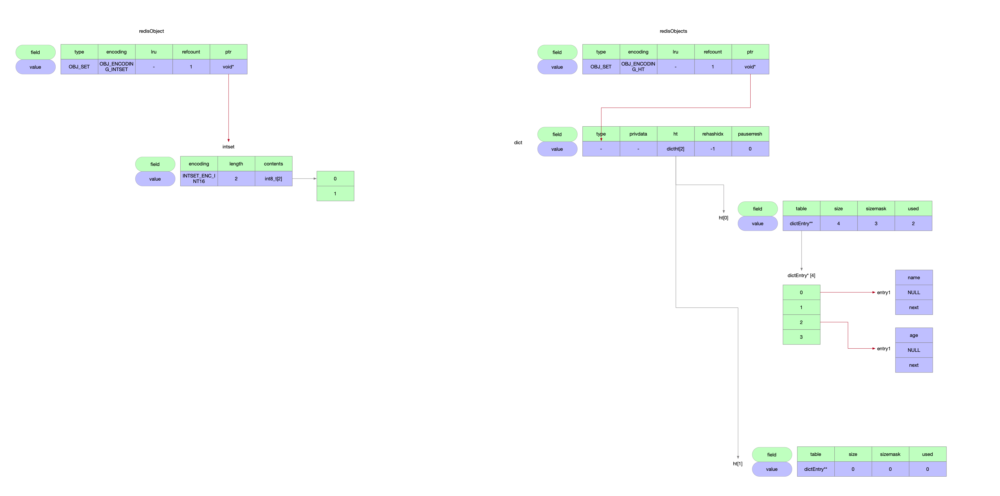
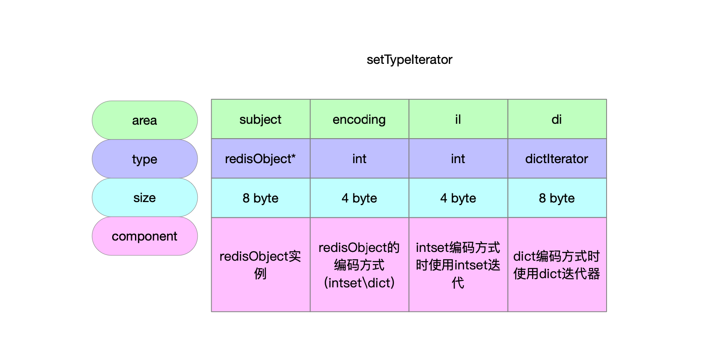

数据类型Set集合。

## 1 数据结构关系

| 数据类型    | 实现  | 编码方式                                              | 数据结构 |
| ----------- | ----- | ----------------------------------------------------- | -------- |
| 列表OBJ_SET | t_set |  | intset   |
|             |       |        | dict     |



## 2 迭代器

### 2.1 数据结构

```c
// set集合迭代器
typedef struct {
    // 维护redisObject实例
    robj *subject;
    // redisObject数据编码类型
    int encoding;
    // intset编码方式时使用intset迭代
    int ii; /* intset iterator */
    // dict编码方式时使用dict迭代器
    dictIterator *di;
} setTypeIterator;
```



### 2.2 初始化迭代器

```c
/**
 * @brief 迭代器初始化
 * @param subject redisObject实例
 * @return 迭代器实例
 */
setTypeIterator *setTypeInitIterator(robj *subject) {
    // 申请24byte内存
    setTypeIterator *si = zmalloc(sizeof(setTypeIterator));
    // 迭代器初始化
    si->subject = subject;
    si->encoding = subject->encoding;
    if (si->encoding == OBJ_ENCODING_HT) {
        si->di = dictGetIterator(subject->ptr); // dict编码方式 使用dict迭代器
    } else if (si->encoding == OBJ_ENCODING_INTSET) {
        si->ii = 0; // intset编码方式 记录下一个要遍历的数据脚标
    } else {
        serverPanic("Unknown set encoding");
    }
    return si;
}
```

### 2.3 释放迭代器

```c
/**
 * @brief 释放迭代器
 * @param si set集合的迭代器
 */
void setTypeReleaseIterator(setTypeIterator *si) {
    if (si->encoding == OBJ_ENCODING_HT)
        dictReleaseIterator(si->di);
    zfree(si);
}
```

### 2.4 迭代器查询

```c
/**
 * @brief 通过迭代器遍历set集合
 * @param si 迭代器
 * @param sdsele set集合中取到的字符串
 * @param llele set集合中取到的整数
 * @return -1标识没有在set集合中取到元素
 *         否则标识取到了元素
 */
int setTypeNext(setTypeIterator *si, sds *sdsele, int64_t *llele) {
    if (si->encoding == OBJ_ENCODING_HT) { // dict编码方式
        dictEntry *de = dictNext(si->di); // 使用dict迭代器进行遍历
        if (de == NULL) return -1; // 遍历结束
        *sdsele = dictGetKey(de);
        *llele = -123456789; /* Not needed. Defensive. */
    } else if (si->encoding == OBJ_ENCODING_INTSET) { // intset编码方式 后移数组脚标遍历
        if (!intsetGet(si->subject->ptr,si->ii++,llele))
            return -1; // 遍历结束
        *sdsele = NULL; /* Not needed. Defensive. */
    } else {
        serverPanic("Wrong set encoding in setTypeNext");
    }
    return si->encoding;
}
```

## 3 增

### 3.1 向集合中添加元素

```c
/**
 * @brief 向集合set中添加元素
 * @param subject redisObject
 * @param value 待添加的元素
 * @return 1标识添加成功
 *         0标识添加失败(包括集合中已经存在要添加的元素)
 */
int setTypeAdd(robj *subject, sds value) {
    long long llval;
    if (subject->encoding == OBJ_ENCODING_HT) { // 编码方式为dict
        dict *ht = subject->ptr;
        // 返回null表示dict中已经存在了key
        dictEntry *de = dictAddRaw(ht,value,NULL);
        if (de) {
            dictSetKey(ht,de,sdsdup(value));
            dictSetVal(ht,de,NULL);
            // 借助dict中哈希表 key是元素 value是null实现了集合的唯一性
            return 1;
        }
    } else if (subject->encoding == OBJ_ENCODING_INTSET) { // 编码方式为intset
        if (isSdsRepresentableAsLongLong(value,&llval) == C_OK) { // 待元素可以转成整数 添加到intset中
            uint8_t success = 0;
            // 将整数添加到intset中
            subject->ptr = intsetAdd(subject->ptr,llval,&success);
            if (success) { // 成功添加了元素到intset中
                /* Convert to regular set when the intset contains
                 * too many entries. */
                // redis.conf配置文件中set-max-intset-entries默认配置是512 即intset中存储的整数上限是512个 超过了阈值将set的编码从intset转换成dict
                size_t max_entries = server.set_max_intset_entries;
                /* limit to 1G entries due to intset internals. */
                if (max_entries >= 1<<30) max_entries = 1<<30;
                if (intsetLen(subject->ptr) > max_entries)
                    setTypeConvert(subject,OBJ_ENCODING_HT); // set集合的编码从intset转换成dict
                return 1;
            }
        } else { // 待添加元素不能转成整数 将集合set的编码从intset转换成dict 再将元素添加到dict中
            /* Failed to get integer from object, convert to regular set. */
            setTypeConvert(subject,OBJ_ENCODING_HT);

            /* The set *was* an intset and this value is not integer
             * encodable, so dictAdd should always work. */
            serverAssert(dictAdd(subject->ptr,sdsdup(value),NULL) == DICT_OK);
            return 1;
        }
    } else {
        serverPanic("Unknown set encoding");
    }
    return 0;
}
```

## 4 删

### 4.1 删除指定元素

```c
/**
 * @brief 从set集合中移除指定元素
 * @param setobj redisObject实例
 * @param value 要考察删除的元素
 * @return 1标识删除成功
 *         0标识没有删除成功
 */
int setTypeRemove(robj *setobj, sds value) {
    long long llval;
    if (setobj->encoding == OBJ_ENCODING_HT) { // 编码方式为dict
        if (dictDelete(setobj->ptr,value) == DICT_OK) { // 从dict中移除entry
            if (htNeedsResize(setobj->ptr)) dictResize(setobj->ptr); // 删除dict中entry节点后可能触发dict缩容
            return 1;
        }
    } else if (setobj->encoding == OBJ_ENCODING_INTSET) { // 编码方式为intset
        if (isSdsRepresentableAsLongLong(value,&llval) == C_OK) { // set的编码方式为intset 则要删除的元素一定得是整数 尝试将元素转整数
            int success;
            setobj->ptr = intsetRemove(setobj->ptr,llval,&success); // 从intset中删除指定整数
            if (success) return 1;
        }
    } else {
        serverPanic("Unknown set encoding");
    }
    return 0;
}
```

## 5 改

## 6 查

## 7 编码方式转换

```c
/**
 * @brief 集合set的编码方式有2种
 *          - intset
 *          - dict
 *        将编码方式从intset转换为dict
 * @param setobj redisObject实例
 * @param enc 要转换成哪种编码方式
 */
void setTypeConvert(robj *setobj, int enc) {
    setTypeIterator *si;
    // 必要的参数验证 数据类型set将编码方式从intset转换为dict
    serverAssertWithInfo(NULL,setobj,setobj->type == OBJ_SET &&
                             setobj->encoding == OBJ_ENCODING_INTSET);

    if (enc == OBJ_ENCODING_HT) { // 要转换成dict编码方式
        int64_t intele;
        // 创建dict实例
        dict *d = dictCreate(&setDictType,NULL);
        sds element;

        /* Presize the dict to avoid rehashing */
        // 根据intset中整数个数进行扩容到最近的2的幂次方
        dictExpand(d,intsetLen(setobj->ptr));

        /* To add the elements we extract integers and create redis objects */
        // 通过set集合迭代器将元素遍历出来放到dict中
        si = setTypeInitIterator(setobj);
        while (setTypeNext(si,&element,&intele) != -1) {
            element = sdsfromlonglong(intele); // 整数转字符串
            serverAssert(dictAdd(d,element,NULL) == DICT_OK); // 添加到dict中
        }
        setTypeReleaseIterator(si); // 回收迭代器

        setobj->encoding = OBJ_ENCODING_HT; // 更新编码方式
        zfree(setobj->ptr);
        setobj->ptr = d;
    } else {
        serverPanic("Unsupported set conversion");
    }
}
```

