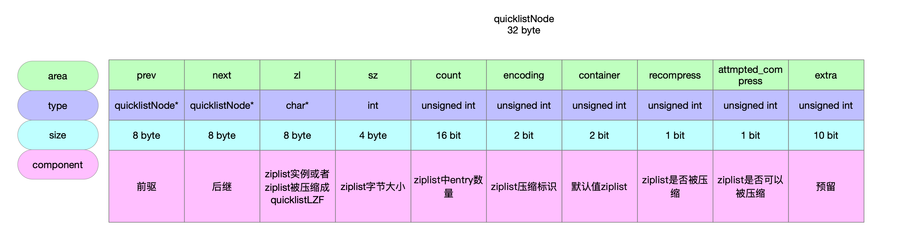
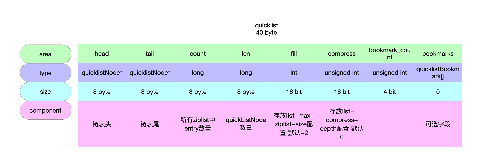
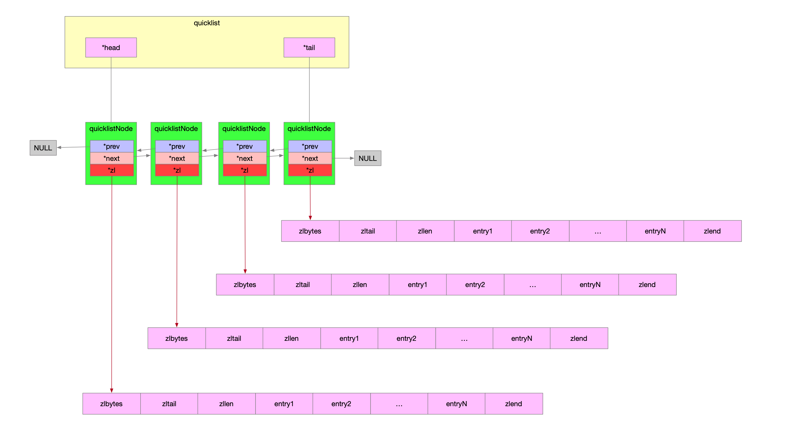

## 1 数据结构

### 1.1 链表节点

```c
// 32 byte
typedef struct quicklistNode {
    // 前驱节点
    struct quicklistNode *prev;
    // 后继节点
    struct quicklistNode *next;
    // 节点没有被压缩时指向ziplist实例 被压缩则指向quicklistLZF实例
    unsigned char *zl;
    // ziplist的字节大小 即使ziplist被压缩了 也统计它被压缩之前的大小
    unsigned int sz;             /* ziplist size in bytes */
    // 16bit ziplist的entry节点个数
    unsigned int count : 16;     /* count of items in ziplist */
    // 2bit 编码方式 quicklist节点数据是否被压缩 即ziplist是否被压缩成quicklistLZF
    // RAW 没有被压缩
    // LSF 被压缩了
    unsigned int encoding : 2;   /* RAW==1 or LZF==2 */
    // 2bit存储方式 固定值2 标识使用ziplist存储数据
    unsigned int container : 2;  /* NONE==1 or ZIPLIST==2 */
    // 1bit 数据是否被压缩
    unsigned int recompress : 1; /* was this node previous compressed? */
    // 1bit 数据能否被压缩
    unsigned int attempted_compress : 1; /* node can't compress; too small */
    // 10bit 预留bit位
    unsigned int extra : 10; /* more bits to steal for future usage */
} quicklistNode;
```



### 1.2 链表

```c
// 40 byte
typedef struct quicklist {
    // 链表头
    quicklistNode *head;
    // 链表尾
    quicklistNode *tail;
    // 所有ziplist中元素总数量
    unsigned long count;        /* total count of all entries in all ziplists */
    // quicklistNode的节点数量
    unsigned long len;          /* number of quicklistNodes */
    // 16bit 存放list-max-ziplist-size配置 默认-2
    int fill : QL_FILL_BITS;              /* fill factor for individual nodes */
    // 16bit 存放list-compress-depth配置 默认0
    unsigned int compress : QL_COMP_BITS; /* depth of end nodes not to compress;0=off */
    // 4bit
    unsigned int bookmark_count: QL_BM_BITS;
    // 可选字段 不使用时不占内存 快速列表重新分配内存时使用
    quicklistBookmark bookmarks[];
} quicklist;
```




### 1.3 示意图



## 2 创建链表节点

## 3 创建链表

## 4 链表插入元素

### 4.1 头插

### 4.2 尾插

### 4.3 任意位置

## 5 查询元素

## 6 删除元素
