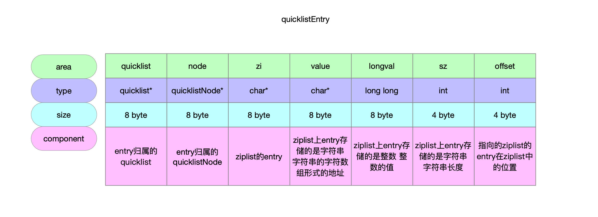
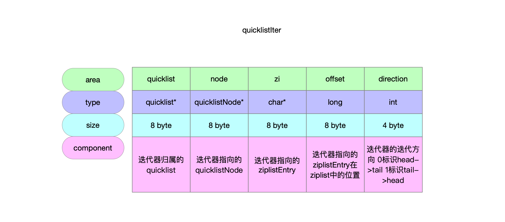

数据类型的编码方式。

## 1 数据结构

### 1.1 链表节点quicklistNode

```c
// 32 byte
typedef struct quicklistNode {
    // 前驱节点
    struct quicklistNode *prev;
    // 后继节点
    struct quicklistNode *next;
    // 节点没有被压缩时指向ziplist实例 被压缩则指向quicklistLZF实例
    unsigned char *zl;
    // ziplist的字节大小 即使ziplist被压缩了 也统计它被压缩之前的大小
    unsigned int sz;             /* ziplist size in bytes */
    // 16bit ziplist的entry节点个数
    unsigned int count : 16;     /* count of items in ziplist */
    // 2bit 编码方式 quicklist节点数据是否被压缩 即ziplist是否被压缩成quicklistLZF
    // RAW 没有被压缩
    // LSF 被压缩了
    unsigned int encoding : 2;   /* RAW==1 or LZF==2 */
    // 2bit存储方式 固定值2 标识使用ziplist存储数据
    unsigned int container : 2;  /* NONE==1 or ZIPLIST==2 */
    // 1bit 数据是否被压缩
    unsigned int recompress : 1; /* was this node previous compressed? */
    // 1bit 数据能否被压缩
    unsigned int attempted_compress : 1; /* node can't compress; too small */
    // 10bit 预留bit位
    unsigned int extra : 10; /* more bits to steal for future usage */
} quicklistNode;
```


### 1.2 链表quicklist

```c
// 40 byte
typedef struct quicklist {
    // 链表头
    quicklistNode *head;
    // 链表尾
    quicklistNode *tail;
    // 所有ziplist中元素总数量
    unsigned long count;        /* total count of all entries in all ziplists */
    // quicklistNode的节点数量
    unsigned long len;          /* number of quicklistNodes */
    // 16bit 存放list-max-ziplist-size配置 默认-2
    int fill : QL_FILL_BITS;              /* fill factor for individual nodes */
    // 16bit 存放list-compress-depth配置 默认0
    unsigned int compress : QL_COMP_BITS; /* depth of end nodes not to compress;0=off */
    // 4bit
    unsigned int bookmark_count: QL_BM_BITS;
    // 可选字段 不使用时不占内存 快速列表重新分配内存时使用
    quicklistBookmark bookmarks[];
} quicklist;
```


### 1.3 链表数据节点quicklistEntry

```c
// quicklist给元素抽象的节点
// 相当于quicklistNode是物理节点 quicklistEntry是虚拟节点
typedef struct quicklistEntry {
    // quicklist实例 标识entry节点归属于哪个quicklist
    const quicklist *quicklist;
    // quicklist有很多quicklistNode 标识entry归属于哪个node
    quicklistNode *node;
    // 在ziplist上指向的entry节点
    unsigned char *zi;
    /**
     * value longval sz 这3个字段用来存储ziplisg上节点entry中存放的元素
     *   - 元素是字符串时 用value和sz这2个字段表达
     *   - 元素是整数时 用longval这个字段表达
     */
    unsigned char *value; // ziplist上entry编码是字符串时 字符串的字符数组形式的地址
    long long longval; // ziplist上entry编码是整数时 整数的值
    unsigned int sz; // ziplist上entry编码是字符串时 字符串的长度
    // 在quicklistNode上ziplist的位置 ziplist有entry节点[0...n-1] 当前指向的entry的位置在offset
    int offset;
} quicklistEntry;
```




### 1.4 示意图


## 2 创建链表节点

```c
/**
 * @brief 创建quicklist的节点
 * @return 节点实例
 */
REDIS_STATIC quicklistNode *quicklistCreateNode(void) {
    quicklistNode *node;
    // 申请内存32byte
    node = zmalloc(sizeof(*node));
    // quicklistNode初始化
    node->zl = NULL;
    node->count = 0;
    node->sz = 0;
    node->next = node->prev = NULL;
    node->encoding = QUICKLIST_NODE_ENCODING_RAW;
    node->container = QUICKLIST_NODE_CONTAINER_ZIPLIST;
    node->recompress = 0;
    return node;
}
```

## 3 创建链表

### 3.1 默认参数

```c
// 创建quicklist实例
// @return quicklist
quicklist *quicklistCreate(void) {
    struct quicklist *quicklist;

    // 申请内存40byte
    quicklist = zmalloc(sizeof(*quicklist));
    // 实例初始化赋值
    quicklist->head = quicklist->tail = NULL;
    quicklist->len = 0;
    quicklist->count = 0;
    quicklist->compress = 0;
    quicklist->fill = -2;
    quicklist->bookmark_count = 0;
    return quicklist;
}
```

### 3.2 指定参数

```c
/**
 * @brief 指定fill字段和compress字段
 * @param fill fill字段值
 * @param compress compress字段值
 * @return quicklist实例
 */
quicklist *quicklistNew(int fill, int compress) {
    // 默认参数的quicklist
    quicklist *quicklist = quicklistCreate();
    // 指定fill字段和compress字段
    quicklistSetOptions(quicklist, fill, compress);
    return quicklist;
}
```

## 4 quicklist字段赋值

```c
/**
 * @brief 为quicklist实例设置fill字段和compress字段
 * @param quicklist quicklist实例
 * @param fill fill字段要设置的值
 * @param depth compress字段要设置的值
 */
void quicklistSetOptions(quicklist *quicklist, int fill, int depth) {
    // 设置fill字段
    quicklistSetFill(quicklist, fill);
    // 设置compress字段
    quicklistSetCompressDepth(quicklist, depth);
}
```

### 4.1 fill字段

#### 4.1.1 字段赋值

```c
// quicklist中字段fill位域长度16bit
// 能够表示的最大值为2^16-1
#define FILL_MAX ((1 << (QL_FILL_BITS-1))-1)
```


```c
// 对quicklist中fill字段赋值
// fill字段的设置从redis.conf配置文件中读取
// fill字段要么负数 以ziplist字节大小作为quicklist的容量约束 上限是16bit表示的数
//        要么正数 以ziplist中entry节点数量作为quicklist的容量约束 下限是-5
// @param quicklist quicklist实例
// @param fill 要将fill字段填充的值是多少
void quicklistSetFill(quicklist *quicklist, int fill) {
    if (fill > FILL_MAX) {
        fill = FILL_MAX;
    } else if (fill < -5) {
        fill = -5;
    }
    quicklist->fill = fill;
}
```

#### 4.1.2 配置详情

摘自`redis.conf`配置文件。

```conf
# Lists are also encoded in a special way to save a lot of space.
# The number of entries allowed per internal list node can be specified
# as a fixed maximum size or a maximum number of elements.
# For a fixed maximum size, use -5 through -1, meaning:
# -5: max size: 64 Kb  <-- not recommended for normal workloads
# -4: max size: 32 Kb  <-- not recommended
# -3: max size: 16 Kb  <-- probably not recommended
# -2: max size: 8 Kb   <-- good
# -1: max size: 4 Kb   <-- good
# Positive numbers mean store up to _exactly_ that number of elements
# per list node.
# The highest performing option is usually -2 (8 Kb size) or -1 (4 Kb size),
# but if your use case is unique, adjust the settings as necessary.
list-max-ziplist-size -2
```

### 4.2 depth字段

#### 4.2.1 字段赋值

```c
// compress字段占位域16bit 能够表示的整数上限
#define COMPRESS_MAX ((1 << QL_COMP_BITS)-1)
```


```c
/**
 * @brief 给quicklist实例的compress字段赋值
 *        compress对应redis.conf中配置list-compress-depth 默认值为0
 * @param quicklist quicklist实例
 * @param compress 要给compress字段设置的值
 */
void quicklistSetCompressDepth(quicklist *quicklist, int compress) {
    // 合法校验
    if (compress > COMPRESS_MAX) {
        compress = COMPRESS_MAX;
    } else if (compress < 0) {
        compress = 0;
    }
    quicklist->compress = compress;
}
```

#### 4.2.2 配置详情

```conf
# Lists may also be compressed.
# Compress depth is the number of quicklist ziplist nodes from *each* side of
# the list to *exclude* from compression.  The head and tail of the list
# are always uncompressed for fast push/pop operations.  Settings are:
# 0: disable all list compression
# 1: depth 1 means "don't start compressing until after 1 node into the list,
#    going from either the head or tail"
#    So: [head]->node->node->...->node->[tail]
#    [head], [tail] will always be uncompressed; inner nodes will compress.
# 2: [head]->[next]->node->node->...->node->[prev]->[tail]
#    2 here means: don't compress head or head->next or tail->prev or tail,
#    but compress all nodes between them.
# 3: [head]->[next]->[next]->node->node->...->node->[prev]->[prev]->[tail]
# etc.
list-compress-depth 0
```

## 5 quicklist节点上ziplist容量检查

### 5.1 字节大小校验

```c
// fill值[-1,-2,-3,-4,-5]对应的byte大小
static const size_t optimization_level[] = {4096, 8192, 16384, 32768, 65536};
```


```c
/**
 * @brief 校验quicklistNode的ziplist数据规模有没有达到阈值 比较的是字节大小
 * @param sz 实际字节大小
 * @param fill quicklist给每个quicklistNode预设的阈值 对应redis.conf配置文件中的list-max-ziplist-size配置项
 *             fill<0的语义是以ziplist的字节大小为衡量标准
 *             fill>=0的语义是以ziplist中的entry节点数量为衡量标砖
 * @return 1-达到了阈值
 *         0-没达到阈值
 */
REDIS_STATIC int
_quicklistNodeSizeMeetsOptimizationRequirement(const size_t sz,
                                               const int fill) {
    if (fill >= 0)
        return 0; // 参数校验 现在比较的字节大小 fill必须要<0
    /**
     * fill值      字节大小限制
     * -1            4kb
     * -2            8kb
     * -3            16kb
     * -4            32kb
     * -5            64kb
     */
    size_t offset = (-fill) - 1;
    if (offset < (sizeof(optimization_level) / sizeof(*optimization_level))) {
        if (sz <= optimization_level[offset]) { // 字节大小还没达到预设的阈值
            return 1;
        } else {
            return 0;
        }
    } else {
        return 0;
    }
}
```

### 5.2 校验fill字段阈值

```c
/**
 * @brief 考察quicklistNode还能不能继续添加元素了 也就是考察ziplist(字节大小或entry数量)是否达到了quicklist的fill字段限制
 * @param node 考察哪个quicklistNode上的ziplist
 * @param fill quicklist字段fill 用来约束每个quicklistNode的ziplist数据规模
 * @param sz 待新增元素大大小 几个字节
 * @return 1-quicklistNode的ziplist还能放元素
 *         0-quicklistNode的ziplist达到约定的容量上限了(内存大小\entry数量) 不能再继续放元素了
 */
REDIS_STATIC int _quicklistNodeAllowInsert(const quicklistNode *node,
                                           const int fill, const size_t sz) {
    if (unlikely(!node))
        return 0;

    // ziplist的entry包含3个部分 prevlen+encoding+entry-data
    int ziplist_overhead;
    /* size of previous offset */
    /**
     * 以下代码计算的是prevlen字段的内存占用
     * 我的理解是这个地方只是粗略计算 应该是做了取舍 考虑到即使quicklist的单个节点quicklistNode的大小在设定阈值上下浮动的区间内 对于查询的复杂度影响也不大
     * 
     * 如果对ziplist采用的是头插 要为prevlen字段申请的内存
     *     - 当前元素代表的entry节点的prevlen分配1byte
     *     - 当前元素的后继节点entry的prevlen可能要重维护 之前它是头节点 prevlen只占1byte
     *         - 当前元素大小<254byte 后继节点prevlen不用变 不用额外申请内存
     *         - 但前元素大小>=254byte 后继节点prevlen需要5byte 需要额外申请4byte
     * 综上需要为两个entry节点为prevlen申请1byte或者5byte
     * 
     * 如果对ziplist采用的不是头插 得知道前驱节点的大小 才能根据实际情况决定为新节点的prevlen分配多大字节 但是这个地方明显是不知道新元素的前驱节点的
     * 
     * 综上 这个函数对新增元素到quicklistNode之后是否会达到预设阈值这个判定 仅仅是粗略估计
     */
    if (sz < 254)
        ziplist_overhead = 1;
    else
        ziplist_overhead = 5;
    /* size of forward offset */
    /**
     * 新元素的ziplist的entry节点 因为是ziplist的头节点所以pevlen字段只需要1byte即可
     * 这也就是上面代码分支里面ziplist_overhead赋值1或者5的原因
     *                      prevlen字段        新元素大小<254byte       新元素大小>=254byte
     * ziplist原来的头节点       1byte               +0byte                  +4byte
     * ziplist新的头节点         1byte               +0byte                  +4byte
     * 两个节点prevlen合计需要申请内存                  1byte                   5byte
     */

    /**
     * 对于encoding字段 得看新元素的编码方式 是编码成整数还是编码成字符串
     * 编码成整数能够表达的整数最大值是b4bit 也就是2^64-1 该整数的内存大小占位也就是8byte
     *
     * 编码成字符串就可能3种长度
     * encoding占位       能够容纳的字符串长度
     *    1byte        0x3f->64个char字符->64
     *    2byte        0x3fff->16384-1个char字符->16383
     *    5byte        0xffffffff->2^32-1个char字符->2^32-1
     */
    if (sz < 64)
        ziplist_overhead += 1; // 元素可以编码成整数或者长度<64的字符串 encoding字段需要1byte
    else if (likely(sz < 16384)) // 字符串长度<16384 encoding字段需要2byte
        ziplist_overhead += 2;
    else
        ziplist_overhead += 5; // 字符串长度>=16384 encoding字段需要5byte

    /* new_sz overestimates if 'sz' encodes to an integer type */
    // 如果在quicklistNode节点上的ziplist头插新的元素之后的ziplist大小=插入之前的内存大小+entry-data大小+为prevlen字段申请的内存+为encoding字段申请的内存
    unsigned int new_sz = node->sz + sz + ziplist_overhead;
    if (likely(_quicklistNodeSizeMeetsOptimizationRequirement(new_sz, fill))) // 先考察ziplist的字节大小阈值
        return 1; // 没超阈值 可以继续往quicklistNode的ziplist添加元素
    /* when we return 1 above we know that the limit is a size limit (which is
     * safe, see comments next to optimization_level and SIZE_SAFETY_LIMIT) */
    else if (!sizeMeetsSafetyLimit(new_sz))
        return 0;
    else if ((int)node->count < fill) // 再考察ziplist的entry节点数量阈值
        return 1; // 没超阈值 可以继续往quicklistNode的ziplist添加元素
    else
        return 0;
}
```

## 6 迭代器

### 6.1 数据结构

```c
typedef struct quicklistIter {
    const quicklist *quicklist;
    // 迭代器指向的quicklistNode
    quicklistNode *current;
    // 迭代器指向的ziplistEntry
    unsigned char *zi;
    // 迭代器指向的ziplistEntry在ziplist中的位置
    long offset; /* offset in current ziplist */
    // 迭代器迭代方向 0标识head->tail 1标识tail->head
    int direction;
} quicklistIter;
```




### 6.2 创建迭代器

```c
/**
 * @brief 创建迭代器
 * @param quicklist 迭代器归属于quicklist实例
 * @param direction 迭代器的迭代方向
 *                  0标识从head->tail
 *                  1标识从tail->head
 * @return
 */
quicklistIter *quicklistGetIterator(const quicklist *quicklist, int direction) {
    quicklistIter *iter;

    iter = zmalloc(sizeof(*iter));

    if (direction == AL_START_HEAD) { // 0标识迭代器方向 从head->tail
        iter->current = quicklist->head;
        iter->offset = 0;
    } else if (direction == AL_START_TAIL) { // 1标识迭代器方向 从tail->head
        iter->current = quicklist->tail;
        iter->offset = -1;
    }

    iter->direction = direction;
    iter->quicklist = quicklist;

    iter->zi = NULL;

    return iter;
}
```

### 6.3 指定开始位置的迭代器

```c
/**
 * @brief 创建quicklist迭代器
 * @param quicklist quicklist实例
 * @param direction 迭代器的迭代方向
 *                  0标识迭代方向为quicklist尾->quicklist头
 *                  1标识迭代方向为quicklist头->quicklist尾
 * @param idx quicklist的元素脚标为[0...n-1] 从idx元素开始迭代
 * @return quicklist迭代器
 */
quicklistIter *quicklistGetIteratorAtIdx(const quicklist *quicklist,
                                         const int direction,
                                         const long long idx) {
    quicklistEntry entry;

    if (quicklistIndex(quicklist, idx, &entry)) { // 找到了指定idx位置的ziplistEntry 将其封装成quicklistEntry
        quicklistIter *base = quicklistGetIterator(quicklist, direction); // 创建迭代器
        base->zi = NULL;
        base->current = entry.node;
        base->offset = entry.offset;
        return base;
    } else {
        return NULL;
    }
}
```

## 7 增

### 7.1 quicklist插入quicklistNode节点

#### 7.1.1 任意位置

```c
/**
 * @brief 向quicklist中添加新的quicklistNode节点
 * @param quicklist quicklist实例
 * @param old_node 位置参考
 * @param new_node 要添加的新的节点
 * @param after 方向 0标识加在参考位置的前面 1标识加在参考位置的后面
 */
REDIS_STATIC void __quicklistInsertNode(quicklist *quicklist,
                                        quicklistNode *old_node,
                                        quicklistNode *new_node, int after) {
    if (after) { // 新节点加在参考位置的后面
        new_node->prev = old_node;
        if (old_node) {
            new_node->next = old_node->next;
            if (old_node->next)
                old_node->next->prev = new_node;
            old_node->next = new_node;
        }
        if (quicklist->tail == old_node)
            quicklist->tail = new_node;
    } else { // 新节点加在参考位置的前面
        new_node->next = old_node;
        if (old_node) {
            new_node->prev = old_node->prev;
            if (old_node->prev)
                old_node->prev->next = new_node;
            old_node->prev = new_node;
        }
        if (quicklist->head == old_node)
            quicklist->head = new_node;
    }
    /* If this insert creates the only element so far, initialize head/tail. */
    if (quicklist->len == 0) {
        quicklist->head = quicklist->tail = new_node;
    }

    /* Update len first, so in __quicklistCompress we know exactly len */
    quicklist->len++;

    if (old_node)
        quicklistCompress(quicklist, old_node); // 尝试根据压缩配置进行节点压缩
}
```

#### 7.2 头插

```c
/**
 * @brief quicklist添加quicklistNode节点
 * @param quicklist quicklist实例
 * @param old_node 新节点加在哪个节点之前
 * @param new_node 添加的新节点
 */
REDIS_STATIC void _quicklistInsertNodeBefore(quicklist *quicklist,
                                             quicklistNode *old_node,
                                             quicklistNode *new_node) {
    __quicklistInsertNode(quicklist, old_node, new_node, 0);
}
```

#### 7.3 尾插

```c
/**
 * @brief quicklist添加quicklistNode节点
 * @param quicklist quicklist实例
 * @param old_node 新节点加在哪个节点之后
 * @param new_node 添加的新节点
 */
REDIS_STATIC void _quicklistInsertNodeAfter(quicklist *quicklist,
                                            quicklistNode *old_node,
                                            quicklistNode *new_node) {
    __quicklistInsertNode(quicklist, old_node, new_node, 1);
}
```

### 7.2 quicklist插入元素

#### 7.2.1 头插

```c
/**
 * @brief 头插法新增元素 语义有2层
 *        quicklist的quicklistNode采用头插
 *        quicklistNode的ziplist采用头插
 * @param quicklist quicklist实例
 * @param value 新增元素
 * @param sz 新增元素value的大小(多少字节)
 * @return 0-元素添加在了quicklist的头节点上 没有新建quicklistNode
 *         1-quicklist的头节点满了 不能继续再往头节点的ziplist上放元素了 新建了一个quicklistNode作为新的头节点 把元素添加到了新头节点
 */
int quicklistPushHead(quicklist *quicklist, void *value, size_t sz) {
    quicklistNode *orig_head = quicklist->head; // 缓存链表头
    assert(sz < UINT32_MAX); /* TODO: add support for quicklist nodes that are sds encoded (not zipped) */
    if (likely(
            _quicklistNodeAllowInsert(quicklist->head, quicklist->fill, sz))) { // 校验当前quicklist的头节点quicklistNode能否继续添加元素 可以继续往头节点添加元素
        // 对ziplist头插
        quicklist->head->zl =
            ziplistPush(quicklist->head->zl, value, sz, ZIPLIST_HEAD);
        // 更新quicklistNode字段sz ziplist中新增了entry节点 大小必然会增加
        quicklistNodeUpdateSz(quicklist->head);
    } else { // quicklistNode满了不能继续添加元素了 新建一个quicklistNode作为quicklist新的头节点 元素放到新头节点里面
        // 新建quicklist节点 新建的节点头插到quicklist上
        quicklistNode *node = quicklistCreateNode();
        // 新建ziplist 元素头查到ziplist上
        node->zl = ziplistPush(ziplistNew(), value, sz, ZIPLIST_HEAD);
        // 更新quicklistNode的sz字段
        quicklistNodeUpdateSz(node);
        // 新建的quicklistNode放到头节点前面作为新的头节点
        _quicklistInsertNodeBefore(quicklist, quicklist->head, node);
    }
    // 更新quicklist字段count quicklist新增了元素 也就一位中某个ziplist中entry节点增加了
    quicklist->count++;
    // ziplist归属于quicklist的head节点 更新quicklistNode的count字段
    quicklist->head->count++;
    return (orig_head != quicklist->head); // 看看quicklist有没有新建一个quicklistNode作为头节点
}
```

#### 7.2.2 尾插

```c
/**
 * @brief 尾插法新增元素
 * @param quicklist quicklist实例
 * @param value 要添加的元素
 * @param sz 要添加的元素的内存大小
 * @return 0标识元素添加在了现有的quicklist尾节点里面 1标识quicklist为元素创建了一个新的尾节点quicklistNode
 */
int quicklistPushTail(quicklist *quicklist, void *value, size_t sz) {
    quicklistNode *orig_tail = quicklist->tail; // quicklist的尾节点
    assert(sz < UINT32_MAX); /* TODO: add support for quicklist nodes that are sds encoded (not zipped) */
    if (likely(
            _quicklistNodeAllowInsert(quicklist->tail, quicklist->fill, sz))) { // quicklist的尾节点的ziplist还没满 可以继续添加元素
        // 对ziplist尾插
        quicklist->tail->zl =
            ziplistPush(quicklist->tail->zl, value, sz, ZIPLIST_TAIL);
        // 更新quicklistNode的sz字段 ziplist添加了新元素 ziplist占内存变大了
        quicklistNodeUpdateSz(quicklist->tail);
    } else { // quicklist的尾节点满了 不能继续往它的ziplsit中加元素了 新建一个quicklistNode作为新的尾节点 用来放元素
        quicklistNode *node = quicklistCreateNode();
        node->zl = ziplistPush(ziplistNew(), value, sz, ZIPLIST_TAIL);
        // 更新quicklistNode的sz字段 ziplist添加了新元素 ziplist占内存变大了
        quicklistNodeUpdateSz(node);
        // 将新的quicklistNode尾插到quicklist中 作为新的尾节点
        _quicklistInsertNodeAfter(quicklist, quicklist->tail, node);
    }
    quicklist->count++;
    quicklist->tail->count++;
    return (orig_tail != quicklist->tail); // 查看这个新元素是加在了以前的尾节点还是新建了一个尾节点
}
```

## 8 删

## 9 改

## 10 查

### 10.1 pop列表头或者列表尾

```c
/**
 * @brief 从quicklist列表pop元素
 * @param quicklist 从quicklist实例中pop元素
 * @param where 只支持2个方向pop 0标识从列表头pop元素 否则标识从列表尾pop元素
 * @param data 列表pop出来的元素是字符串 以字符数组形式存储该字符串
 * @param sz 列表pop出来的元素是字符串 存储该字符串的长度
 * @param slong 列表pop出来的元素是整数 存储该整数
 * @return 0表示列表为空没有元素
 *         1表示列表有元素弹出
 */
int quicklistPop(quicklist *quicklist, int where, unsigned char **data,
                 unsigned int *sz, long long *slong) {
    unsigned char *vstr;
    unsigned int vlen;
    long long vlong;
    if (quicklist->count == 0)
        return 0;
    /**
     * 从quicklist列表弹出元素
     *   - 弹出的是字符串
     *     - vstr存储的是字符数组地址
     *     - vlen存储的是字符串长度
     *   - 弹出的是整数
     *     - vlong存储的是该整数
     */
    int ret = quicklistPopCustom(quicklist, where, &vstr, &vlen, &vlong,
                                 _quicklistSaver);
    if (data)
        *data = vstr;
    if (slong)
        *slong = vlong;
    if (sz)
        *sz = vlen;
    return ret;
}
```


```c
/**
 * @brief quiklist列表弹出元素
 * @param quicklist
 * @param where 方向 0标识从列表头出元素 1标识从列表尾出元素
 * @param data quicklist弹出的元素是字符串 通过saver函数放到data上
 * @param sz quicklist弹出的元素是字符串 sz存储的是该字符串的长度
 * @param sval quicklist弹出的类标元素是整数 sval存储的是该整数的值
 * @param saver quicklist弹出的元素是字符串 该字符串不是直接放到data上 而是通过调用方传递的函数
 * @return 0表示列表为空没有元素
 *         1表示列表有元素弹出 整数就放在了sval上
 *                          不是整数就放在了data上
 */
int quicklistPopCustom(quicklist *quicklist, int where, unsigned char **data,
                       unsigned int *sz, long long *sval,
                       void *(*saver)(unsigned char *data, unsigned int sz)) {
    unsigned char *p;
    unsigned char *vstr; // 列表元素存储的是字符串 缓存该字符串
    unsigned int vlen; // 列表元素存储的是字符串 缓存该字符串的长度
    long long vlong; // 列表元素存储的是整数 缓存该整数的值
    /**
     * 0标识从列表头出元素 找到quicklist的头节点quicklistNode 找到头节点里面的ziplist的HEAD节点entry
     * 1标识从列表尾出元素 找到quicklist的尾节点quicklistNode 找到尾节点里面的ziplist的TAIL节点entry
     */
    int pos = (where == QUICKLIST_HEAD) ? 0 : -1;

    if (quicklist->count == 0)
        return 0; // 列表是空的 没有quicklistNode节点

    // 初始化
    if (data)
        *data = NULL;
    if (sz)
        *sz = 0;
    if (sval)
        *sval = -123456789;

    quicklistNode *node;
    if (where == QUICKLIST_HEAD && quicklist->head) { // 从列表头出元素 找到quicklist的列表头quicklistNode
        node = quicklist->head;
    } else if (where == QUICKLIST_TAIL && quicklist->tail) { // 从列表尾出元素 找到quicklist的列表尾quicklistNode
        node = quicklist->tail;
    } else {
        return 0;
    }

    /**
     * 出列表头元素 就找到ziplist的HEAD节点entry
     * 出列表尾元素 就找到ziplist的TAIL节点entry
     * p指向的是ziplist中的entry节点地址
     */
    p = ziplistIndex(node->zl, pos);
    if (ziplistGet(p, &vstr, &vlen, &vlong)) {
        // 将p指向的entry节点的元素读取出来
        if (vstr) { // ziplist的entry存储的是字符串
            if (data)
                *data = saver(vstr, vlen);
            if (sz)
                *sz = vlen;
        } else { // ziplist的entry存储的是整数
            if (data)
                *data = NULL;
            if (sval)
                *sval = vlong;
        }
        quicklistDelIndex(quicklist, node, &p);
        return 1;
    }
    return 0;
}
```

### 10.2 查找指定位置

```c
/**
 * @brief 查找指定位置的元素
 * @param quicklist quicklist实例
 * @param idx quicklist元素脚标[0...n-1] 查找idx脚标的元素
 * @param entry idx指向的ziplist的entry封装成quicklistEntry
 * @return 是否存在idx指定的元素
 *         1标识存在元素
 *         0标识不存在元素
 */
int quicklistIndex(const quicklist *quicklist, const long long idx,
                   quicklistEntry *entry) {
    quicklistNode *n;
    unsigned long long accum = 0; // ziplist中entry节点计数 以quicklistNode为统计单位
    unsigned long long index; // 要查找的entry节点位置
    // 方向 正序还是逆序
    int forward = idx < 0 ? 0 : 1; /* < 0 -> reverse, 0+ -> forward */

    initEntry(entry);
    entry->quicklist = quicklist;

    if (!forward) {
        index = (-idx) - 1;
        n = quicklist->tail;
    } else {
        index = idx;
        n = quicklist->head;
    }

    if (index >= quicklist->count)
        return 0;

    while (likely(n)) {
        if ((accum + n->count) > index) {
            break; // n是quicklist的quicklistNode 而quicklistNode上挂着一条ziplist 要找的元素就在这条ziplist上
        } else {
            D("Skipping over (%p) %u at accum %lld", (void *)n, n->count,
              accum);
            accum += n->count;
            n = forward ? n->next : n->prev;
        }
    }

    if (!n)
        return 0;

    D("Found node: %p at accum %llu, idx %llu, sub+ %llu, sub- %llu", (void *)n,
      accum, index, index - accum, (-index) - 1 + accum);

    entry->node = n;
    if (forward) { // 方向 quicklist head->tail
        /* forward = normal head-to-tail offset. */
        entry->offset = index - accum;
    } else { // 方向 quicklist tail->head
        /* reverse = need negative offset for tail-to-head, so undo
         * the result of the original if (index < 0) above. */
        entry->offset = (-index) - 1 + accum;
    }

    quicklistDecompressNodeForUse(entry->node);
    // 查找到了idx位置的ziplist节点entry
    entry->zi = ziplistIndex(entry->node->zl, entry->offset);
    // 将ziplist的etnry存储的元素读取出来
    if (!ziplistGet(entry->zi, &entry->value, &entry->sz, &entry->longval))
        assert(0); /* This can happen on corrupt ziplist with fake entry count. */
    /* The caller will use our result, so we don't re-compress here.
     * The caller can recompress or delete the node as needed. */
    return 1;
}
```

### 10.3 quicklist迭代器遍历

```c
/**
 * @brief 迭代器遍历
 * @param iter quicklist迭代器
 * @param entry quicklist迭代器遍历的元素封装到quicklistEntry中
 * @return
 */
int quicklistNext(quicklistIter *iter, quicklistEntry *entry) {
    initEntry(entry);

    if (!iter) {
        D("Returning because no iter!");
        return 0;
    }

    entry->quicklist = iter->quicklist;
    entry->node = iter->current;

    if (!iter->current) {
        D("Returning because current node is NULL")
        return 0;
    }

    unsigned char *(*nextFn)(unsigned char *, unsigned char *) = NULL;
    int offset_update = 0;

    if (!iter->zi) { // 迭代器中没有维护当前遍历到的ziplistEntry信息 说明是初始化迭代器之后首次执行遍历操作 根据index找到ziplistEntry
        /* If !zi, use current index. */
        quicklistDecompressNodeForUse(iter->current);
        iter->zi = ziplistIndex(iter->current->zl, iter->offset); // ziplist中查找到对应的ziplistEntry
    } else {
        /* else, use existing iterator offset and get prev/next as necessary. */
        if (iter->direction == AL_START_HEAD) {
            nextFn = ziplistNext;
            offset_update = 1;
        } else if (iter->direction == AL_START_TAIL) {
            nextFn = ziplistPrev;
            offset_update = -1;
        }
        iter->zi = nextFn(iter->current->zl, iter->zi);
        iter->offset += offset_update;
    }

    entry->zi = iter->zi;
    entry->offset = iter->offset;

    if (iter->zi) { // 读取ziplistEntry元素
        /* Populate value from existing ziplist position */
        ziplistGet(entry->zi, &entry->value, &entry->sz, &entry->longval);
        return 1;
    } else { // 迭代quicklist的下一个quicklistNode
        /* We ran out of ziplist entries.
         * Pick next node, update offset, then re-run retrieval. */
        quicklistCompress(iter->quicklist, iter->current);
        if (iter->direction == AL_START_HEAD) {
            /* Forward traversal */
            D("Jumping to start of next node");
            iter->current = iter->current->next;
            iter->offset = 0;
        } else if (iter->direction == AL_START_TAIL) {
            /* Reverse traversal */
            D("Jumping to end of previous node");
            iter->current = iter->current->prev;
            iter->offset = -1;
        }
        iter->zi = NULL;
        return quicklistNext(iter, entry);
    }
}
```

