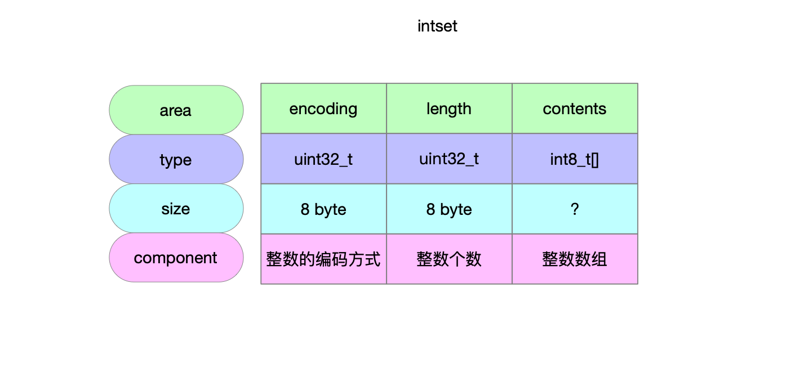
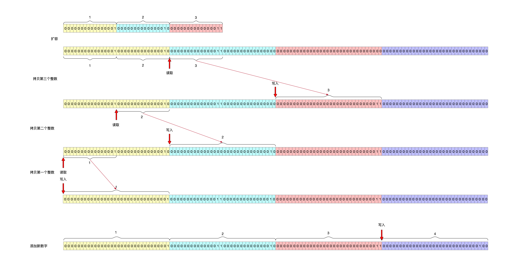

数据类型的编码方式。

## 1 数据结构

```c
typedef struct intset {
    // 编码 整数数组中整数的大小编码(16bit\32bit\64bit)
    uint32_t encoding;
    // 长度 也就是intset集合的整数个数
    uint32_t length;
    // 实际存储整数的数组
    int8_t contents[];
} intset;
```



## 2 创建集合

```c
/**
 * @brief 创建intset实例 默认编码是int16
 * @return intset实例
 */
intset *intsetNew(void) {
    // 申请8byte的内存
    intset *is = zmalloc(sizeof(intset));
    // 初始化
    is->encoding = intrev32ifbe(INTSET_ENC_INT16);
    is->length = 0;
    return is;
}
```

## 3 增

### 3.1 元素添加到指定脚标位置

```c
/**
 * @brief 将整数添加到集合指定的脚标位置
 * @param is intset
 * @param pos 数组脚标位置
 * @param value 要添加的整数
 */
static void _intsetSet(intset *is, int pos, int64_t value) {
    // 要添加的整数的编码
    uint32_t encoding = intrev32ifbe(is->encoding);

    if (encoding == INTSET_ENC_INT64) {
        ((int64_t*)is->contents)[pos] = value;
        memrev64ifbe(((int64_t*)is->contents)+pos);
    } else if (encoding == INTSET_ENC_INT32) {
        ((int32_t*)is->contents)[pos] = value;
        memrev32ifbe(((int32_t*)is->contents)+pos);
    } else {
        ((int16_t*)is->contents)[pos] = value;
        memrev16ifbe(((int16_t*)is->contents)+pos);
    }
}
```

### 3.2 添加整数

```c
/**
 * @brief 将value整数添加到intset中 保证intset集合中整数的有序性和唯一性
 * @param is intset集合实例
 * @param value 要添加到集合中的整数
 * @param success 标识添加元素成功与否
 *                1标识添加成功
 *                0标识添加失败 比如往intset中添加重复元素
 * @return intset集合
 */
intset *intsetAdd(intset *is, int64_t value, uint8_t *success) {
    uint8_t valenc = _intsetValueEncoding(value); // 整数的编码方式
    /**
     * pos指向的是intset有序集合中<=value的整数的最大脚标位置
     * 即
     * intset中包含value 指向value所在脚标
     * intset中不包含value 指向离value最近的脚标
     */
    uint32_t pos;
    if (success) *success = 1;

    /* Upgrade encoding if necessary. If we need to upgrade, we know that
     * this value should be either appended (if > 0) or prepended (if < 0),
     * because it lies outside the range of existing values. */
    if (valenc > intrev32ifbe(is->encoding)) { // 整数编码要升级
        /* This always succeeds, so we don't need to curry *success. */
        return intsetUpgradeAndAdd(is,value);
    } else { // 整数编码不需要升级
        /* Abort if the value is already present in the set.
         * This call will populate "pos" with the right position to insert
         * the value when it cannot be found. */
        if (intsetSearch(is,value,&pos)) { // 要添加的整数已经存在了
            if (success) *success = 0;
            return is;
        }

        /**
         * 给集合intset追加申请1个脚标的空间 假设长度为len 之前所有元素还分布在前len-1个脚标上
         * 现在的布局为[0...pos pos+1...n-2 n-1]
         * [0...n-2]为之前的所有整数
         * 把[pos+1...n-2]整数全部后移1个脚标也就是分布在[pos+2...n-1]上了
         * 然后把新元素添加到pos上
         */
        is = intsetResize(is,intrev32ifbe(is->length)+1);
        if (pos < intrev32ifbe(is->length)) intsetMoveTail(is,pos,pos+1); // 从pos位置开始元素后移1个脚标 空出pos位置
    }
    // 新添加的整数应该插入的有序集合位置
    _intsetSet(is,pos,value);
    is->length = intrev32ifbe(intrev32ifbe(is->length)+1); // intset中新增了一个元素 维护length字段
    return is;
}
```


## 4 删

### 4.1 删除整数

```c
/**
 * @brief 如果整数value在inset集合中 就删除value
 * @param is intset集合
 * @param value 要删除的整数
 * @param success 标识intset中包含value 可以进行删除
 * @return 删除元素之后的intset集合
 */
intset *intsetRemove(intset *is, int64_t value, int *success) {
    // 整数编码
    uint8_t valenc = _intsetValueEncoding(value);
    uint32_t pos;
    if (success) *success = 0;

    if (valenc <= intrev32ifbe(is->encoding) && intsetSearch(is,value,&pos)) { // 二分查找value
        uint32_t len = intrev32ifbe(is->length);

        /* We know we can delete */
        if (success) *success = 1;

        /* Overwrite value with tail and update length */
        /**
         * 将pos脚标位置删除
         * 采用原地算法实现
         * 将[pos+1...n-1]的所有元素前移1个脚标[pos...n-1]
         * 然后将数组缩容1个脚标 就实现了删除效果
         */
        if (pos < (len-1)) intsetMoveTail(is,pos+1,pos);
        is = intsetResize(is,len-1);
        is->length = intrev32ifbe(len-1);
    }
    return is;
}
```


## 5 改

### 5.1 保持相对位置移动元素

```c
/**
 * @brief 元素保持相对位置移到intset集合最后 目的是为了空出[from...to)位置用来写新元素
 * @param is intset
 * @param from, to 有序集合intset中[from...]区间保持相对位置挪到intset的[to...]区间上
 */
static void intsetMoveTail(intset *is, uint32_t from, uint32_t to) {
    void *src, *dst;
    uint32_t bytes = intrev32ifbe(is->length)-from;
    uint32_t encoding = intrev32ifbe(is->encoding);

    if (encoding == INTSET_ENC_INT64) {
        src = (int64_t*)is->contents+from;
        dst = (int64_t*)is->contents+to;
        bytes *= sizeof(int64_t);
    } else if (encoding == INTSET_ENC_INT32) {
        src = (int32_t*)is->contents+from;
        dst = (int32_t*)is->contents+to;
        bytes *= sizeof(int32_t);
    } else {
        src = (int16_t*)is->contents+from;
        dst = (int16_t*)is->contents+to;
        bytes *= sizeof(int16_t);
    }
    memmove(dst,src,bytes);
}
```

### 5.2 扩容\缩容

```c
/**
 * @brief intset扩容 在既有的内存上分配连续内存空间
 *        [start...end]假设为现有的一片内存 在end后面继续申请空闲空间 成为[start...end...newEnd]
 *        也就是说新的数组中完全包含了之前所有的元素内容
 *        新追加的内存空间上全部写0
 * @param is 旧intset
 * @param len 要扩容到多大(能存放多少个元素)
 * @return 新intset
 */
static intset *intsetResize(intset *is, uint32_t len) {
    uint64_t size = (uint64_t)len*intrev32ifbe(is->encoding);
    assert(size <= SIZE_MAX - sizeof(intset));
    is = zrealloc(is,sizeof(intset)+size);
    return is;
}
```

### 5.3 升级整数编码

```c
/**
 * @brief intset因为整数编码而扩容 并将新整数添加到集合中 保证有序性
 * @param is inset集合
 * @param value 添加的整数
 * @return 升级编码之后的新集合
 */
static intset *intsetUpgradeAndAdd(intset *is, int64_t value) {
    // intset旧的编码方式
    uint8_t curenc = intrev32ifbe(is->encoding);
    // intset新的编码方式
    uint8_t newenc = _intsetValueEncoding(value);
    // 旧inset中有多少个整数
    int length = intrev32ifbe(is->length);
    // value<0就往新intset头上添加 否则往新intset尾上添加
    int prepend = value < 0 ? 1 : 0;

    /* First set new encoding and resize */
    // 新的编码 要根据编码方式额外申请内存
    is->encoding = intrev32ifbe(newenc);
    // inset额外追加1个脚标的内存空间(具体多少字节要根据整数编码而定)
    is = intsetResize(is,intrev32ifbe(is->length)+1);

    /* Upgrade back-to-front so we don't overwrite values.
     * Note that the "prepend" variable is used to make sure we have an empty
     * space at either the beginning or the end of the intset. */
    /**
     * 从最后一个脚标往前
     * 取的时候按照老编码方式取
     * 放的时候按照新编码方式放
     * 效果就是将intset结合中元素从最后一个元素开始往前依次将放到新的位置
     * 如果待添加的元素>=0 就将最后一个脚标空出来
     * 如果待添加的元素<0 就将第一个脚标空出来
     *
     * 为什么这样设计 很巧妙地保证了intset集合的有序性
     *   - 首先 在编码升级之前 该intset集合是严格有序的
     *   - 该函数的入口是因为编码升级触发的 意味着新添加的数据字节变大了 那么
     *     - data>max(intset)
     *     - data<min(intset)
     *   - 所以 对intset柔性数组扩容之后 之前的整数顺序不变
     *     - 新加进来的数<0 一定就是新集合中最小的数 往最前面放
     *     - 新加进来的数>0 一定就是新集合中最大的数 往最后面放
     */
    while(length--) // 循环体中length [长度-1...0]
        _intsetSet(is,length+prepend,_intsetGetEncoded(is,length,curenc));

    /* Set the value at the beginning or the end. */
    if (prepend) // 新增的数字<0 添加到新数组最前面
        _intsetSet(is,0,value);
    else // 新增的数>=0 添加到新数组最后面
        _intsetSet(is,intrev32ifbe(is->length),value);
    is->length = intrev32ifbe(intrev32ifbe(is->length)+1);
    return is;
}
```



## 6 查

### 6.2 查找目标值所在脚标

```c
/**
 * @brief 二分查找有序数组
 * @param is intset实例
 * @param value 要查找的目标值
 * @param pos value已经存在于intset中就返回value所在的脚标
 *            intset中没有value 就返回<value的整数最大的脚标
 * @return 在intset中是否查找到了value值
 *         1标识intset中存在value 并且脚标在pos位置
 *         0标识intset中不存在value
 */
static uint8_t intsetSearch(intset *is, int64_t value, uint32_t *pos) {
    // intset的脚标区间[min...max]
    int min = 0, max = intrev32ifbe(is->length)-1, mid = -1;
    int64_t cur = -1;

    /* The value can never be found when the set is empty */
    if (intrev32ifbe(is->length) == 0) { // intset为空 不存在元素
        if (pos) *pos = 0;
        return 0;
    } else {
        /* Check for the case where we know we cannot find the value,
         * but do know the insert position. */
        // intset中有元素 有序集合 升序 校验边界脚标
        if (value > _intsetGet(is,max)) { // 查找的值比intset最大值还大
            if (pos) *pos = intrev32ifbe(is->length);
            return 0;
        } else if (value < _intsetGet(is,0)) { // 查找的值比intset最小值还小
            if (pos) *pos = 0;
            return 0;
        }
    }

    // 有序数组二分查找
    while(max >= min) {
        mid = ((unsigned int)min + (unsigned int)max) >> 1;
        cur = _intsetGet(is,mid);
        if (value > cur) {
            min = mid+1;
        } else if (value < cur) {
            max = mid-1;
        } else {
            break;
        }
    }

    if (value == cur) {
        if (pos) *pos = mid;
        return 1;
    } else {
        if (pos) *pos = min;
        return 0;
    }
}
```

### 6.2 查找脚标上元素

```c
/**
 * @brief 获取指定脚标位置的元素
 * @param is intset实例
 * @param pos 数组脚标位置
 * @return 获取到指定脚标位置的整数
 */
static int64_t _intsetGet(intset *is, int pos) {
    return _intsetGetEncoded(is,pos,intrev32ifbe(is->encoding));
}
```

### 6.3 查找元素是否存在

```c
/**
 * @brief intset中是否存在元素value
 * @param is intset实例
 * @param value 要查找的值
 * @return 1标识intset中存在value
 *         0标识intset中不存在value
 */
uint8_t intsetFind(intset *is, int64_t value) {
    uint8_t valenc = _intsetValueEncoding(value);
    return valenc <= intrev32ifbe(is->encoding) && intsetSearch(is,value,NULL);
}
```

