数据类型的编码方式。

## 1 数据结构

### 1.1 跳表节点

```c
// 跳表节点
typedef struct zskiplistNode {
    // 保存节点信息
    sds ele;
    // 节点分数 按照分数排序
    double score;
    // 后退指针 只有第1层有效
    struct zskiplistNode *backward;
    struct zskiplistLevel {
        struct zskiplistNode *forward; // 各层的前进指针
        unsigned long span; // 与下一个跳表节点的间隔
    } level[]; // 柔性数组 节点层高为n 则该数组长度为n 表示层数为[1...n]
} zskiplistNode;
```

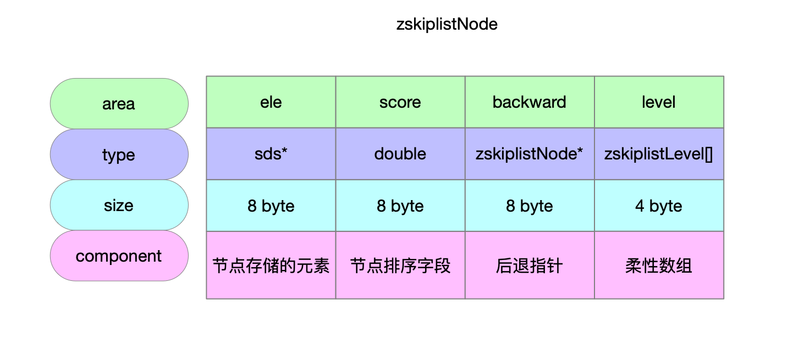

### 1.2 跳表

```c
/**
 * @brief 创建跳表
 * @return 跳表实例
 */
zskiplist *zslCreate(void) {
    int j;
    zskiplist *zsl;

    // 申请内存32byte
    zsl = zmalloc(sizeof(*zsl));
    zsl->level = 1;
    zsl->length = 0;
    // 跳表的header节点作用是哨兵 不是存储数据的
    zsl->header = zslCreateNode(ZSKIPLIST_MAXLEVEL,0,NULL);
    for (j = 0; j < ZSKIPLIST_MAXLEVEL; j++) {
        zsl->header->level[j].forward = NULL;
        zsl->header->level[j].span = 0;
    }
    zsl->header->backward = NULL;
    zsl->tail = NULL;
    return zsl;
}
```


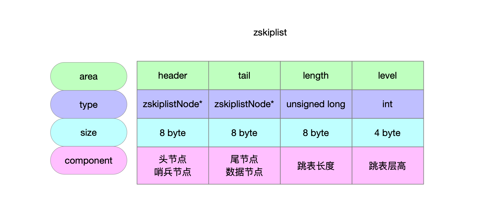

## 2 创建跳表节点

```c
/**
 * @param level 节点的层高
 * @param score 节点排序字段
 * @param ele 节点存储的元素
 * @return 跳表节点
 */
zskiplistNode *zslCreateNode(int level, double score, sds ele) {
    // 层高数组维护的是前进指针 是个柔性数组
    zskiplistNode *zn =
        zmalloc(sizeof(*zn)+level*sizeof(struct zskiplistLevel));
    // 节点的排序字段
    zn->score = score;
    // 节点存储的元素
    zn->ele = ele;
    return zn;
}
```


## 3 创建跳表

```c
/**
 * @brief 创建跳表
 * @return 跳表实例
 */
zskiplist *zslCreate(void) {
    int j;
    zskiplist *zsl;

    // 申请内存32byte
    zsl = zmalloc(sizeof(*zsl));
    zsl->level = 1;
    zsl->length = 0;
    // 跳表的header节点作用是哨兵 不是存储数据的
    zsl->header = zslCreateNode(ZSKIPLIST_MAXLEVEL,0,NULL);
    for (j = 0; j < ZSKIPLIST_MAXLEVEL; j++) {
        zsl->header->level[j].forward = NULL;
        zsl->header->level[j].span = 0;
    }
    zsl->header->backward = NULL;
    zsl->tail = NULL;
    return zsl;
}
```

初始化完成的跳表只有一个header节点。

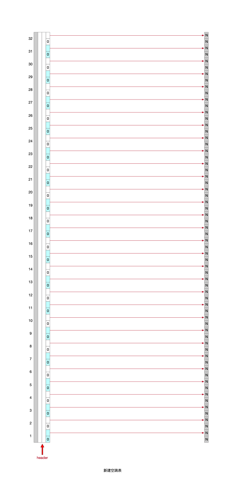

## 4 增

### 4.1 插入元素

#### 4.1.1 向跳表插入新元素

```c
/**
 * @brief 跳表的空间表现可以理解成一张二维表
 *          - 极端情况1 每次新写入元素的时候 跳表节点随机高度都是1 那么整个跳表就退化成一个双链表
 *          - 极端情况2 每次新写入元素的时候 跳表节点随机高度都是32 那么整个跳表就膨胀成一个长*高是(元素个数+1)*32的二维数组
 *
 *        向跳表中新增元素的步骤
 *          - 1 查找插入的节点位置 将从头节点到尾节点的搜索路径信息存储在update和rank表中
 *            - 1.1 按照跳表但前层高level维护[1...level]的搜索路径
 *            - 1.2 给新节点随机一个层高randLevel
 *              - 新节点层高比level还要大 就补充[level...randLevel]的搜索路径到update和rank表
 *          - 2 新建跳表节点 维护节点信息
 *          - 3 维护新节点未涉及层高的节点的步进信息
 * @param zsl 跳表实例
 * @param score 跳表节点排序字段
 * @param ele 跳表节点存储的值
 * @return 新增的跳表节点
 */
zskiplistNode *zslInsert(zskiplist *zsl, double score, sds ele) {
    /**
     * update表和rank表相当于一个hash记录表
     * 记录的是什么信息呢
     * 一个新元素的插入 首先找到准确的跳表节点位置
     * 从跳表最高层向下逐层查找有序插入位置的过程中 可能涉及3个操作
     *   - 降层
     *   - 指针前进(节点指针往后找)
     *   - 指针后退(节点指针往前找)
     * 在检索过程中
     *   - update记录的就是每一层降层的节点
     *   - rank记录的就是每一层降层节点的脚标-1
     *     - header节点为哨兵 idx=0
     *     - 实节点脚标为[1...]
     */
    zskiplistNode *update[ZSKIPLIST_MAXLEVEL], *x;
    unsigned int rank[ZSKIPLIST_MAXLEVEL];
    int i, level;

    serverAssert(!isnan(score));
    /**
     * 第一步:
     *
     * 跳表的理论层高区间是[1...32]
     * 跳表的实际层高区间是[1...level]
     * header上一定维护着[1...level]的层高
     *
     * 从header头节点开始往tail节点遍历 查找当前要写入的元素的位置
     *
     * [oldLevel...1]层高上从head节点->tail节点开始遍历
     * 将搜索路径信息维护在update表和rank表中
     */
    x = zsl->header;
    for (i = zsl->level-1; i >= 0; i--) {
        /* store rank that is crossed to reach the insert position */
        rank[i] = i == (zsl->level-1) ? 0 : rank[i+1];
        while (x->level[i].forward &&
                (x->level[i].forward->score < score ||
                    (x->level[i].forward->score == score &&
                    sdscmp(x->level[i].forward->ele,ele) < 0)))
        {
            rank[i] += x->level[i].span;
            x = x->level[i].forward;
        }
        update[i] = x;
    }
    /* we assume the element is not already inside, since we allow duplicated
     * scores, reinserting the same element should never happen since the
     * caller of zslInsert() should test in the hash table if the element is
     * already inside or not. */
    /**
     * 第二步:
     *
     * [1...32]随机层高 随机出来的节点高度可能比跳表高度要高 因此补充update和rank表
     * 层高区间为[newLevel...oldLevel]
     */
    level = zslRandomLevel();
    if (level > zsl->level) {
        for (i = zsl->level; i < level; i++) {
            rank[i] = 0;
            update[i] = zsl->header;
            update[i]->level[i].span = zsl->length;
        }
        zsl->level = level;
    }
    /**
     * 第三步:
     *
     * 新建的跳表节点
     * 维护[1...newLevel]层高信息
     * 按照update和rank表维护新节点所有层上的前进节点和步进信息 更新各层上update表节点的步进信息
     */
    x = zslCreateNode(level,score,ele);
    for (i = 0; i < level; i++) {
        /**
         * 新建节点的前进指针
         * 新建节点的前驱节点的前进指针
         */
        x->level[i].forward = update[i]->level[i].forward;
        update[i]->level[i].forward = x;

        /* update span covered by update[i] as x is inserted here */
        /**
         * 新建节点的步进值
         * rank[0]就是插入节点的前驱节点
         */
        x->level[i].span = update[i]->level[i].span - (rank[0] - rank[i]);
        update[i]->level[i].span = (rank[0] - rank[i]) + 1;
    }

    /* increment span for untouched levels */
    /**
     * 第四步:
     * 可能随机出来的层高是比老跳表的层高要低的 那么新节点未涉及的层高也要更新步进信息
     * 层高区间为[newLevel...oldLevel]
     */
    for (i = level; i < zsl->level; i++) {
        update[i]->level[i].span++;
    }

    /**
     * 第五步:
     * 节点第一层上维护后退指针
     */
    x->backward = (update[0] == zsl->header) ? NULL : update[0];
    if (x->level[0].forward)
        x->level[0].forward->backward = x;
    else
        zsl->tail = x;
    zsl->length++;
    return x;
}
```

#### 4.1.2 图解

##### 4.1.2.1 空跳表

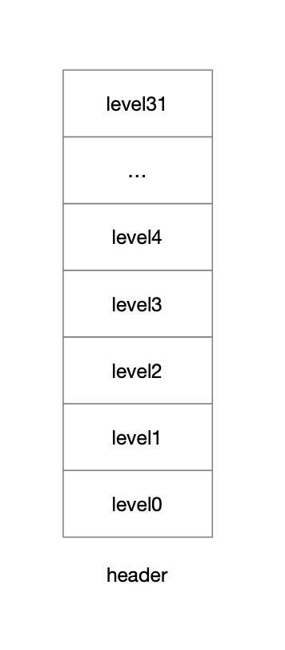

##### 4.1.2.2 插入1 随机层高4

###### 4.1.2.2.1 update和rank维护检索路径

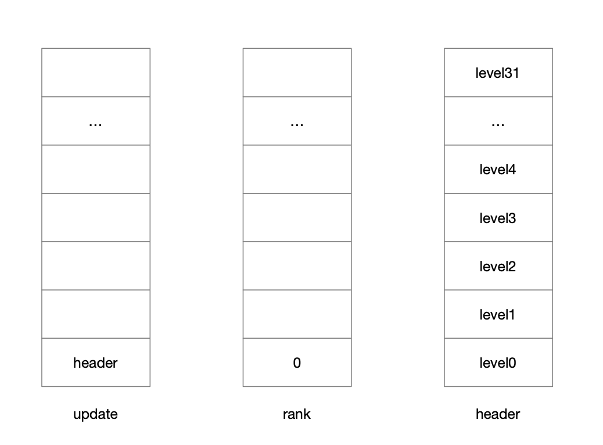

###### 4.1.2.2.2 随机层高为4并补充update和rank

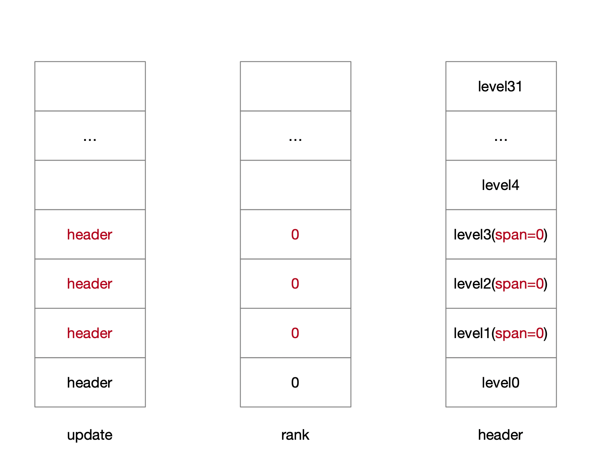

###### 4.1.2.2.3 新建节点维护各层连接信息

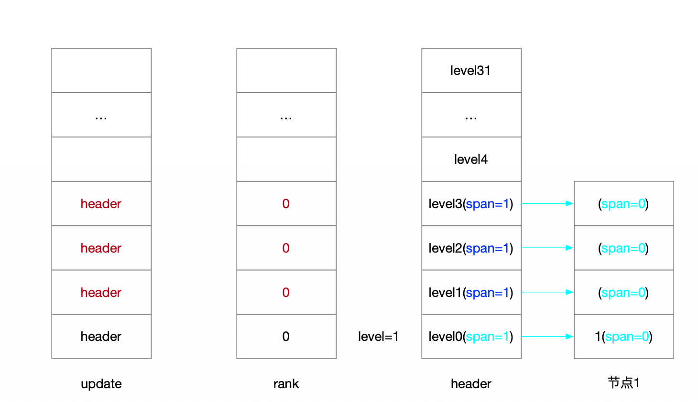

###### 4.1.2.2.4 维护后退指针

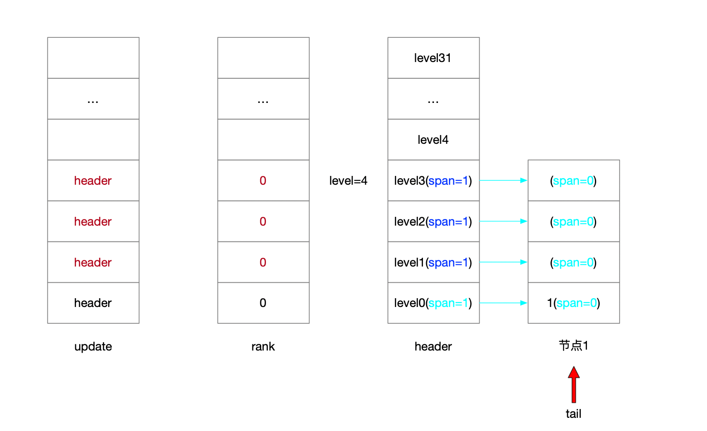

##### 4.1.2.3 插入3 随机层高1

###### 4.1.2.3.1 维护update和rank

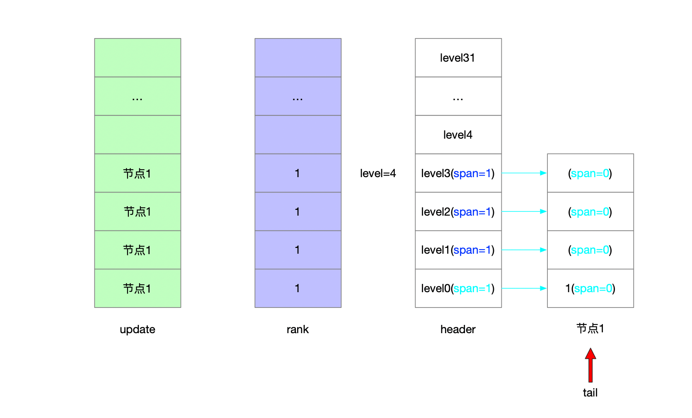

###### 4.1.2.3.2 前进指针和步进值

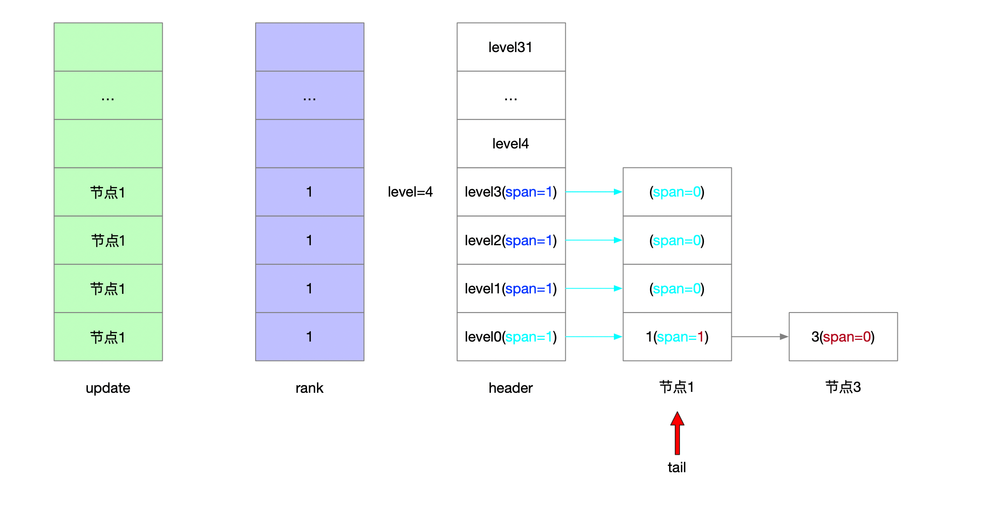

###### 4.1.2.3.3 新节点未涉及层高步进值

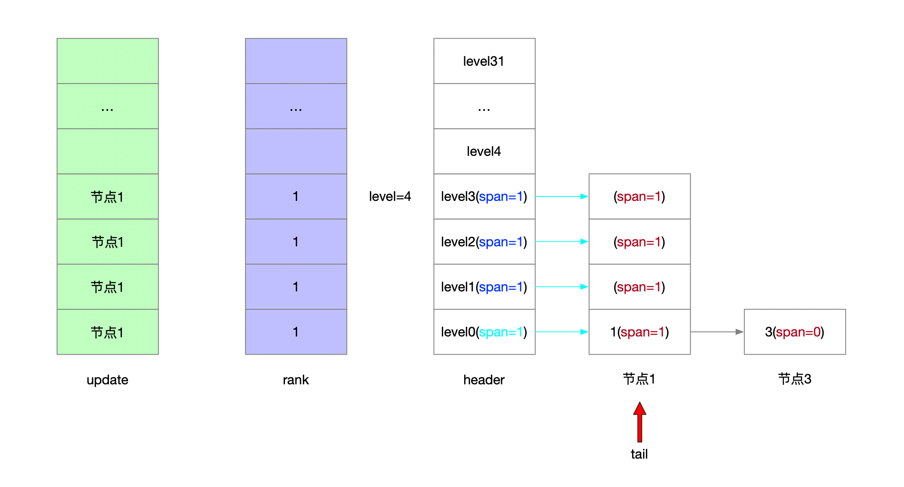

###### 4.1.2.3.4 后退指针

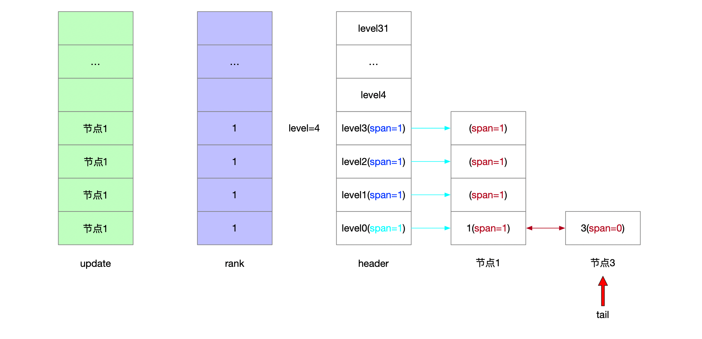

##### 4.1.2.4 插入5 随机层高1

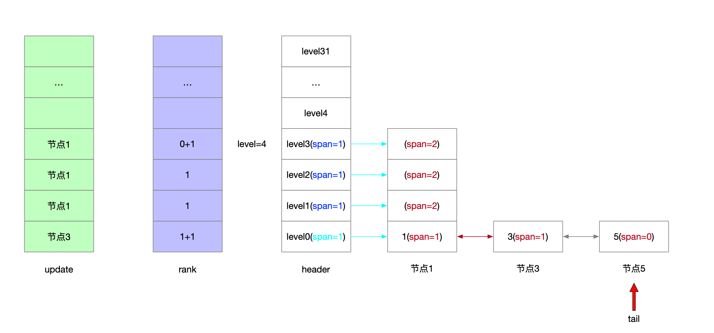

##### 4.1.2.5 插入7  随机层高3

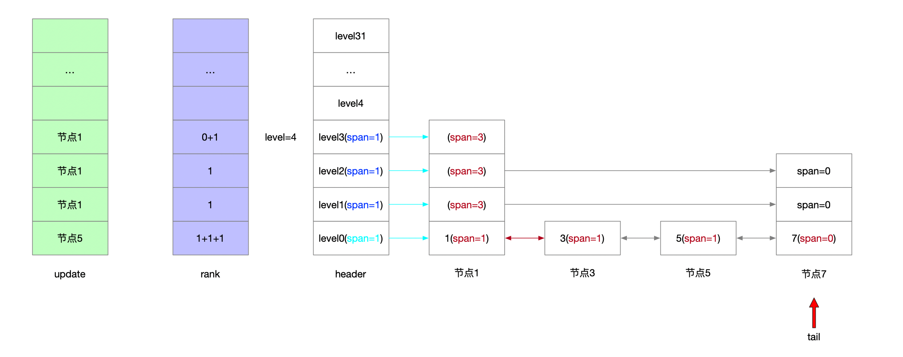

#### 4.2 节点随机层高

```c
/**
 * @brief [1...32]的随机值
 * @return 跳表节点的层高
 */
int zslRandomLevel(void) {
    int level = 1;
    while ((random()&0xFFFF) < (ZSKIPLIST_P * 0xFFFF))
        level += 1;
    return (level<ZSKIPLIST_MAXLEVEL) ? level : ZSKIPLIST_MAXLEVEL;
}
```


## 5 删

## 6 改

## 7 查
