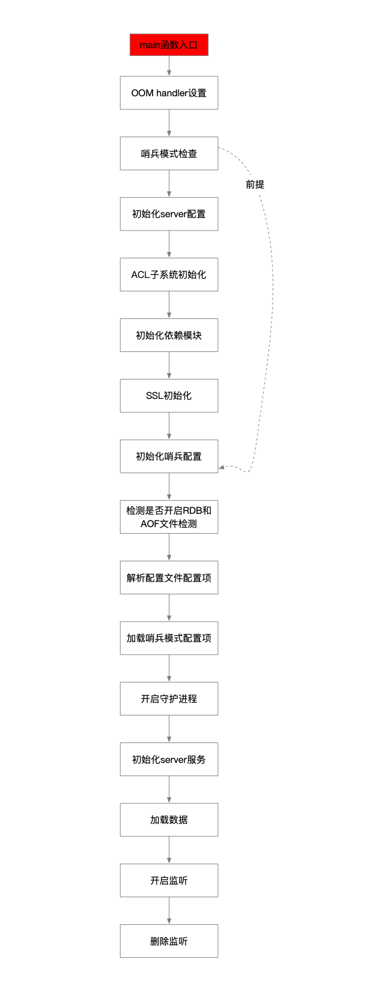

流程图



## 1 

```c
// 内存oom的处理器 注册了一个回调函数
zmalloc_set_oom_handler(redisOutOfMemoryHandler);
```

## 2 

```c
/**
  * 是否启动哨兵模式
  *   - 执行的redis-sentinel可执行文件
  *   - 启动参数配置了可选项--sentinel
  */
server.sentinel_mode = checkForSentinelMode(argc,argv);
```

## 3 

```c
// 初始化server配置 填充redisServer中的字段
initServerConfig();
```

## 4 ACL初始化

```c
// ACL子系统初始化
ACLInit()
```

## 5 模块初始化

```c
// 初始化依赖模块
moduleInitModulesSystem();
```

## 6 SSL初始化

```c
// ssl相关的初始化
tlsInit();
```

## 7 初始化哨兵配置

```c
// 初始化哨兵配置
if (server.sentinel_mode) {
    initSentinelConfig();
    initSentinel();
}
```

## 8 检测是否开启RDB和AOF文件检测

```c
// 检测是否开启RDB和AOF文件检测
if (strstr(argv[0],"redis-check-rdb") != NULL) // 运行redis-check-rdb可执行文件
    redis_check_rdb_main(argc,argv,NULL); // 检测RDB文件
else if (strstr(argv[0],"redis-check-aof") != NULL) // 运行redis-check-aof可执行文件
    redis_check_aof_main(argc,argv); // 检测AOF文件
```

## 9 

```c
// 解析配置文件配置项
loadServerConfig(server.configfile, config_from_stdin, options);
```

## 10 加载哨兵模式的配置项

```c
// 加载哨兵模式的配置项
if (server.sentinel_mode) loadSentinelConfigFromQueue();
```

## 11 

```c
// 根据配置 开启守护进程
int background = server.daemonize && !server.supervised;
if (background) daemonize();
```

## 12 初始化server服务

```c
// 初始化server服务
initServer();
```

## 13 加载数据

```c
// 恢复持久化的数据到内存数据库
loadDataFromDisk();
```

## 14 开启监听

```c
// ze主循环 开启监听
aeMain(server.el);
```

## 15 删除监听

```c
// 删除监听
aeDeleteEventLoop(server.el);
```

