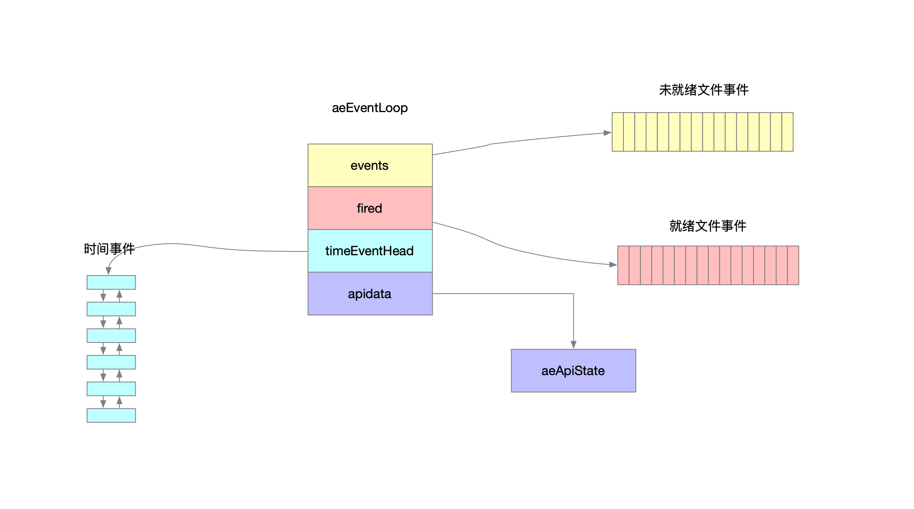
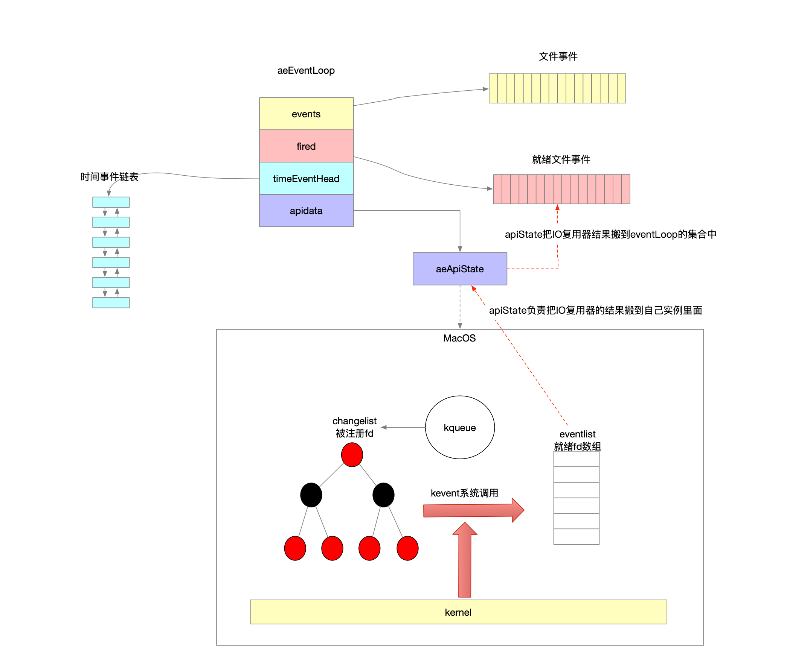

## 1 创建事件监听器

```c
/**
 * @brief 创建事件管理器
 * @param setsize 指定事件管理器的容量
 * @return
 */
aeEventLoop *aeCreateEventLoop(int setsize) {
    aeEventLoop *eventLoop;
    int i;

    monotonicInit();    /* just in case the calling app didn't initialize */

    if ((eventLoop = zmalloc(sizeof(*eventLoop))) == NULL) goto err; // 内存开辟
    eventLoop->events = zmalloc(sizeof(aeFileEvent)*setsize); // 未就绪文件事件列表
    eventLoop->fired = zmalloc(sizeof(aeFiredEvent)*setsize); // 就绪文件事件列表
    if (eventLoop->events == NULL || eventLoop->fired == NULL) goto err;
    eventLoop->setsize = setsize; // 事件管理的容量
    eventLoop->timeEventHead = NULL; // 时间事件链表
    eventLoop->timeEventNextId = 0;
    eventLoop->stop = 0;
    eventLoop->maxfd = -1;
    eventLoop->beforesleep = NULL;
    eventLoop->aftersleep = NULL;
    eventLoop->flags = 0;
    /**
     * @brief 将系统os多路复用IO与事件管理器关联起来
     *          - 将OS多路复用封装成aeApiState接口
     *          - 事件管理器持有aeApiSate的实例 这样就屏蔽了OS对多路复用的实现差异
     */
    if (aeApiCreate(eventLoop) == -1) goto err; // 我是很喜欢goto关键字的 新语言go中也使用了这个关键字 很难理解Java中竟然没有这个机制
    /* Events with mask == AE_NONE are not set. So let's initialize the
     * vector with it. */
    for (i = 0; i < setsize; i++)
        eventLoop->events[i].mask = AE_NONE; // 标记未就绪事件的状态为还没注册到复用器上
    return eventLoop;

err:
    if (eventLoop) { // 资源回收
        zfree(eventLoop->events);
        zfree(eventLoop->fired);
        zfree(eventLoop);
    }
    return NULL;
}
```



## 2 文件事件

### 2.1 添加

```c
/**
 * @brief 将fd以及对fd关注的IO事件类型封装成文件事件 添加到事件管理器中
 * @param eventLoop 事件管理器
 * @param fd
 * @param mask 要监听fd的什么类型IO事件(可读\可写)
 * @param proc 处理器 当感兴趣的事件类型(可读\可写)到达时回调
 * @param clientData 文件事件的私有数据
 * @return
 */
int aeCreateFileEvent(aeEventLoop *eventLoop, int fd, int mask,
        aeFileProc *proc, void *clientData)
{
    if (fd >= eventLoop->setsize) { // fd超过了事件管理器的预设极值了
        errno = ERANGE;
        return AE_ERR;
    }
    // fd就是脚标索引 在未就绪数组中找到对应位置 完成初始化
    aeFileEvent *fe = &eventLoop->events[fd];

    // 将fd注册到多路复用器上 指定监听fd的事件mask
    if (aeApiAddEvent(eventLoop, fd, mask) == -1)
        return AE_ERR;
    // 记录fd关注的事件类型
    fe->mask |= mask;
    // fd可读可写时指定回调的处理器
    if (mask & AE_READABLE) fe->rfileProc = proc;
    if (mask & AE_WRITABLE) fe->wfileProc = proc;
    // 事件的私有数据
    fe->clientData = clientData;
    if (fd > eventLoop->maxfd)
        eventLoop->maxfd = fd;
    return AE_OK;
}
```

### 2.2 删除

```c
/**
 * @brief 告知事件管理器 让其移除对fd关注的IO事件类型 关注的事件移除光了就将文件事件从事件管理器中逻辑删除
 * @param eventLoop 事件管理器
 * @param fd
 * @param mask 需要IO复用器移除对什么IO事件类型的关注
 */
void aeDeleteFileEvent(aeEventLoop *eventLoop, int fd, int mask)
{
    if (fd >= eventLoop->setsize) return;
    // 索引到文件事件
    aeFileEvent *fe = &eventLoop->events[fd];
    if (fe->mask == AE_NONE) return; // 事件并没有注册过IO复用器

    /* We want to always remove AE_BARRIER if set when AE_WRITABLE
     * is removed. */
    /**
     * 要移除fd上对可写IO事件的关注
     * 意思打上标记 暂缓处理
     * 比如有个场景 现在该socket已经可写 并且mask掩码也只有可写
     *   - 先告诉IO复用器以后不用关注socket的可写事件了
     *   - 然后文件事件更新完mask之后变成了0
     *   - 事件管理器eventLoop将这个fd的文件事件标记为了AE_NONE
     * 紧接着遇到了对事件的处理函数调用 就错过对本来可写的socket执行一次写操作
     * 因此这个地方用BARRIER标记着 给socket一个写机会
     */
    if (mask & AE_WRITABLE) mask |= AE_BARRIER;

    // 从IO复用器上移除对fd的某个或者某些IO事件类型的关注
    aeApiDelEvent(eventLoop, fd, mask);
    // IO复用器更新完成 更新mask掩码
    fe->mask = fe->mask & (~mask);
    if (fd == eventLoop->maxfd && fe->mask == AE_NONE) { // fd对应的文件事件 关注的IO事件类型都已经移除光了 相当于从eventLoop事件管理器里面删除了该fd
        /* Update the max fd */
        int j;

        for (j = eventLoop->maxfd-1; j >= 0; j--)
            if (eventLoop->events[j].mask != AE_NONE) break;
        eventLoop->maxfd = j;
    }
}
```

### 2.3 关注fd的IO事件类型

```c
/**
 * @brief 某个fd关注的IO事件类型 也就是注册在IO复用器上 等待的事件类型
 * @param eventLoop 事件管理器
 * @param fd
 * @return 调用方根据不同的IO事件类型掩码计算
 */
int aeGetFileEvents(aeEventLoop *eventLoop, int fd) {
    if (fd >= eventLoop->setsize) return 0;
    aeFileEvent *fe = &eventLoop->events[fd];

    return fe->mask;
}
```

## 3 时间事件

### 3.1 添加

```c
/**
 * @brief 创建一个时间事件加到事件管理器eventLoop上
 * @param eventLoop 事件管理器
 * @param milliseconds 期待事件在多久之后被调度执行 毫秒
 * @param proc 事件处理器 定义了时间事件被调度起来之后如何执行
 * @param clientData 时间事件的私有数据
 * @param finalizerProc 时间事件的析构处理器 用于回收资源
 * @return 事件的id
 */
long long aeCreateTimeEvent(aeEventLoop *eventLoop, long long milliseconds,
        aeTimeProc *proc, void *clientData,
        aeEventFinalizerProc *finalizerProc)
{
    long long id = eventLoop->timeEventNextId++;
    // 新建一个时间事件
    aeTimeEvent *te;

    te = zmalloc(sizeof(*te));
    if (te == NULL) return AE_ERR;
    // 事件的id
    te->id = id;
    // 记录事件理论应该被调度执行的时间
    te->when = getMonotonicUs() + milliseconds * 1000;
    // 事件处理器
    te->timeProc = proc;
    // 事件的析构处理器
    te->finalizerProc = finalizerProc;
    // 事件的私有数据
    te->clientData = clientData;
    te->prev = NULL;
    /**
     * 新创建的时间事件头插到timeEventHead双链表上
     * 由此可见redis对于时间事件的管理很简单
     * 将来采用的查找策略也只能是轮询
     * 变向说明redis中管理的时间事件基数很小很小
     */
    te->next = eventLoop->timeEventHead;
    te->refcount = 0;
    if (te->next)
        te->next->prev = te;
    eventLoop->timeEventHead = te;
    return id;
}
```

### 3.2 删除

```c
/**
 * @brief 根据时间事件的唯一id 将该事件从事件管理器中移除
 *        删除是逻辑删除 将待删除的事件id置为特定标记
 * @param eventLoop 事件管理器
 * @param id 时间事件id
 * @return 操作状态码
 *         0-标识成功
 *         -1-标识失败
 */
int aeDeleteTimeEvent(aeEventLoop *eventLoop, long long id)
{
    // 事件管理器中的时间事件链表
    aeTimeEvent *te = eventLoop->timeEventHead;
    // 轮询链表节点 找到要删除的目标节点
    while(te) {
        if (te->id == id) {
            te->id = AE_DELETED_EVENT_ID; // 标记该事件被删除
            return AE_OK;
        }
        te = te->next;
    }
    return AE_ERR; /* NO event with the specified ID found */
}
```

### 3.3 调度时机

```c
/**
 * @brief 考察时间事件中最早可以被调度的某个事件 还要多久
 *        这种一般都是在某个阻塞点之前 然后那个阻塞点可以根据最早应该被调度起来的时间进行阻塞
 * @param eventLoop 
 * @return 
 *         -1-标识没有时间事件
 *         0-还要等0微秒可以调度某个时间事件执行
 *         n-还要等n微秒可以调度某个时间事件执行
 */
static int64_t usUntilEarliestTimer(aeEventLoop *eventLoop) {
    // 时间事件链表头节点
    aeTimeEvent *te = eventLoop->timeEventHead;
    // 事件管理器中没有时间事件
    if (te == NULL) return -1;

    // 轮询链表 找到链表节点中 最早要被调度执行的时间事件
    aeTimeEvent *earliest = NULL;
    while (te) {
        if (!earliest || te->when < earliest->when)
            earliest = te;
        te = te->next;
    }

    monotime now = getMonotonicUs();
    return (now >= earliest->when) ? 0 : earliest->when - now;
}
```

### 3.4 调度事件

```c
/**
 * @brief 处理时间事件
 * @param eventLoop 事件管理器
 * @return 一轮处理中调度的事件数量
 */
static int processTimeEvents(aeEventLoop *eventLoop) {
    // 统计调度了多少个事件执行
    int processed = 0;
    aeTimeEvent *te;
    long long maxId;

    // 轮询事件管理器中的时间事件链表
    te = eventLoop->timeEventHead;
    maxId = eventLoop->timeEventNextId-1;
    monotime now = getMonotonicUs();
    while(te) {
        long long id;

        /* Remove events scheduled for deletion. */
        if (te->id == AE_DELETED_EVENT_ID) { // 已经被标记逻辑删除了 尝试将需要删除的节点进行清理删除
            aeTimeEvent *next = te->next;
            /* If a reference exists for this timer event,
             * don't free it. This is currently incremented
             * for recursive timerProc calls */
            if (te->refcount) { // 链表节点还不能直接删除 还在被引用着
                te = next;
                continue;
            }
            // 经典的从双链表上删除某个节点 删除te节点
            if (te->prev)
                te->prev->next = te->next;
            else
                eventLoop->timeEventHead = te->next;
            if (te->next)
                te->next->prev = te->prev;
            if (te->finalizerProc) {
                te->finalizerProc(eventLoop, te->clientData);
                now = getMonotonicUs();
            }
            zfree(te);
            te = next;
            continue;
        }

        /* Make sure we don't process time events created by time events in
         * this iteration. Note that this check is currently useless: we always
         * add new timers on the head, however if we change the implementation
         * detail, this check may be useful again: we keep it here for future
         * defense. */
        // 注释说是防御性编程 当前链表是头插法 不可能出现遍历到的节点是新添加的节点
        if (te->id > maxId) {
            te = te->next;
            continue;
        }

        if (te->when <= now) { // 链表上遍历到的某个节点已经可以被调度执行
            int retval;

            id = te->id;
            te->refcount++;
            retval = te->timeProc(eventLoop, id, te->clientData); // 回调处理器对事件进行处理
            te->refcount--;
            processed++; // 调度了事件数量计数
            now = getMonotonicUs();
            if (retval != AE_NOMORE) { // 是个周期性事件 更新期待被下一轮调度的事件
                te->when = now + retval * 1000;
            } else { // 标识时间事件不是周期性事件 调度过一次就删除
                te->id = AE_DELETED_EVENT_ID;
            }
        }
        te = te->next;
    }
    return processed;
}
```

## 4 管理调度

```c
/**
 * @brief 事件管理器调度
 * @param eventLoop 事件管理器
 * @param flags 调度策略
 *                - 0 不调度
 * @return 调度的事件数量
 *         包含
 *           - 时间事件
 *           - 文件事件
 */
int aeProcessEvents(aeEventLoop *eventLoop, int flags)
{
    int processed = 0, numevents;

    /* Nothing to do? return ASAP */
    /**
     * 事件管理器eventLoop中只有2种类型的事件
     *   - 文件事件AE_FILE_EVENTS
     *   - 时间事件AE_TIME_EVENTS
     * 调度策略里面2种类型都不调度 直接结束调度流程
     */
    if (!(flags & AE_TIME_EVENTS) && !(flags & AE_FILE_EVENTS)) return 0;

    /* Note that we want to call select() even if there are no
     * file events to process as long as we want to process time
     * events, in order to sleep until the next time event is ready
     * to fire. */
    /**
     * if分支
     *   - maxfd!=-1意味着有文件事件
     *   - 对时间事件进行调度
     * 如果eventLoop中只管理着时间事件 并且客户端指定了调度策略是DONT_WAIT 那么直接不进if分支
     *   - 首先时间事件大概率会需要阻塞一段时间等到执行时机
     *   - 那么这个阻塞时间不会浪费 而是用来阻塞等待IO复用器的系统调用
     *   - 但是eventLoop管理器只管理着时间事件 所以陷入系统调用后也不会有文件事件就绪
     *   - 说白了这个阻塞时间是被白白浪费的
     *   - 所以不进if分支 直接单独调度一次时间事件
     */
    if (eventLoop->maxfd != -1 ||
        ((flags & AE_TIME_EVENTS) && !(flags & AE_DONT_WAIT))) {
        int j;
        struct timeval tv, *tvp;
        int64_t usUntilTimer = -1;

        if (flags & AE_TIME_EVENTS && !(flags & AE_DONT_WAIT))
            usUntilTimer = usUntilEarliestTimer(eventLoop); // 本次调度对时间事件是关注的 距离最近的一个时间事件应该被调度起来还有usUntilTimer微秒

        if (usUntilTimer >= 0) { // 还要等多久可以调度时间事件
            tv.tv_sec = usUntilTimer / 1000000;
            tv.tv_usec = usUntilTimer % 1000000;
            tvp = &tv;
        } else { // 时间事件已经就绪 可以被立即调度
            /* If we have to check for events but need to return
             * ASAP because of AE_DONT_WAIT we need to set the timeout
             * to zero */
            if (flags & AE_DONT_WAIT) {
                tv.tv_sec = tv.tv_usec = 0;
                tvp = &tv;
            } else {
                /* Otherwise we can block */
                tvp = NULL; /* wait forever */
            }
        }

        if (eventLoop->flags & AE_DONT_WAIT) {
            tv.tv_sec = tv.tv_usec = 0;
            tvp = &tv;
        }

        if (eventLoop->beforesleep != NULL && flags & AE_CALL_BEFORE_SLEEP)
            eventLoop->beforesleep(eventLoop); // IO复用器阻塞前 回调

        /* Call the multiplexing API, will return only on timeout or when
         * some event fires. */
        /**
         * 带超时调用IO复用器
         *   - 要么在指定阻塞时间tvp之前就有就绪Socket发生
         *   - 要么经过tvp阻塞都没有就绪Socket
         *   - 要么指定的是永久阻塞知道有就绪Socket
         * 这样设计的根因在于兼顾时间事件的处理 提高整个系统的吞吐
         *
         * 发生一次系统调用 numevents个fd就绪 就绪的fd被放在了eventLoop的fired就绪数组里面
         */
        numevents = aeApiPoll(eventLoop, tvp);

        /* After sleep callback. */
        if (eventLoop->aftersleep != NULL && flags & AE_CALL_AFTER_SLEEP)
            eventLoop->aftersleep(eventLoop); // IO复用器阻塞后 回调

        for (j = 0; j < numevents; j++) {
            // 遍历未就绪的fd列表
            aeFileEvent *fe = &eventLoop->events[eventLoop->fired[j].fd];
            int mask = eventLoop->fired[j].mask; // 就绪fd的可读可写状态
            int fd = eventLoop->fired[j].fd;
            // 计数被调度执行的fd数量
            int fired = 0; /* Number of events fired for current fd. */

            /* Normally we execute the readable event first, and the writable
             * event later. This is useful as sometimes we may be able
             * to serve the reply of a query immediately after processing the
             * query.
             *
             * However if AE_BARRIER is set in the mask, our application is
             * asking us to do the reverse: never fire the writable event
             * after the readable. In such a case, we invert the calls.
             * This is useful when, for instance, we want to do things
             * in the beforeSleep() hook, like fsyncing a file to disk,
             * before replying to a client. */
            // 强制指定先写后读
            int invert = fe->mask & AE_BARRIER;

            /* Note the "fe->mask & mask & ..." code: maybe an already
             * processed event removed an element that fired and we still
             * didn't processed, so we check if the event is still valid.
             *
             * Fire the readable event if the call sequence is not
             * inverted. */
            /**
             * 比较巧妙的设计
             * 对于读写顺序而言 要么是先写后读 要么是先读后写
             * 以下代码编排的就很优雅
             * 不是通过
             * if(先读后写)
             * {
             *     read();
             *     write();
             * }
             * else
             * {
             *     write();
             *     read();
             * }
             * 而是直接固定写在中间 根据条件判定读1执行还是读2执行
             */
            // 读1
            if (!invert && fe->mask & mask & AE_READABLE) { // 可以先读后写 并且该fd当初被设置需要关注可读事件 此时fd也处于可读就绪状态
                fe->rfileProc(eventLoop,fd,fe->clientData,mask); // 回调执行 可读
                fired++;
                fe = &eventLoop->events[fd]; /* Refresh in case of resize. */
            }

            /* Fire the writable event. */
            // 写
            if (fe->mask & mask & AE_WRITABLE) { // fd当初被设置需要关注可写事件 此时fd也处于可写就绪状态
                if (!fired || fe->wfileProc != fe->rfileProc) {
                    fe->wfileProc(eventLoop,fd,fe->clientData,mask);
                    fired++;
                }
            }

            /* If we have to invert the call, fire the readable event now
             * after the writable one. */
            // 读2
            if (invert) { // 强制要求先写后读
                fe = &eventLoop->events[fd]; /* Refresh in case of resize. */
                if ((fe->mask & mask & AE_READABLE) &&
                    (!fired || fe->wfileProc != fe->rfileProc))
                {
                    fe->rfileProc(eventLoop,fd,fe->clientData,mask);
                    fired++;
                }
            }

            processed++;
        }
    }
    /* Check time events */
    if (flags & AE_TIME_EVENTS)
        processed += processTimeEvents(eventLoop); // 调度时间事件

    return processed; /* return the number of processed file/time events */
}
```

## 5 启动事件监听器

```c
void aeMain(aeEventLoop *eventLoop) {
    eventLoop->stop = 0;
    while (!eventLoop->stop) {
        // 调度策略是关注时间事件和文件事件 在阻塞系统调用IO复用器前后回调指定的函数
        aeProcessEvents(eventLoop, AE_ALL_EVENTS|
                                   AE_CALL_BEFORE_SLEEP|
                                   AE_CALL_AFTER_SLEEP);
    }
}
```

## 6 示意图

示意图也反映了redis的核心线程模型，和Netty的单个NioEventLoop比较起来，除了二者的任务队列选择不一样，整体思想可以说一模一样。


