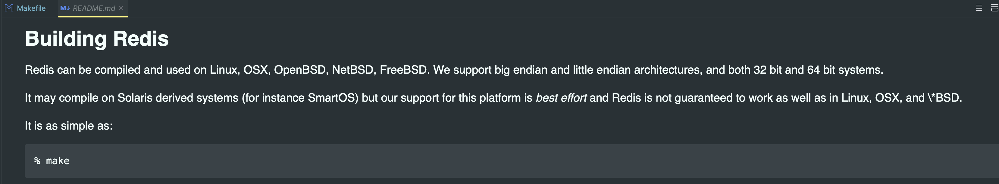

Redis以make作为项目构建管理工具，因此我们只要看Makefile的rule编写，就知道编译源码的过成了。况且每个人编写Makefile的习惯各样，也可以借此良机借鉴风格。

1 项目编译
---

首先，在Readme中作者描述了如何编译项目，即在项目根目录执行`make`。



2 根目录Makefile
---

根据编译命令可知，我们只要关注当前文件的第一条rule即可，如下：

```Makefile
# Top level makefile, the real shit is at src/Makefile

# 执行make的时候找到的第一个target是default 该target依赖一个dependency为all
# 但是该Makefile中没有再定义为all的target 即make找不到叫all的target
# 在这种情况下make会执行.DEFAULT
default: all

# 因为make的执行是从default作为入口下来的
# 因此$@指代的是all
# 也就是说要执行的shell是cd src && make all
.DEFAULT:
	cd src && $(MAKE) $@
```

关于make的规则，可以参考[官网的文档](https://www.gnu.org/savannah-checkouts/gnu/make/manual/make.html)。

3 src目录下Makefile
---

```Makefile
# redis源码根目录下makefile中的cd src && make all
# MakeFile真正工作的地方
all: $(REDIS_SERVER_NAME) $(REDIS_SENTINEL_NAME) $(REDIS_CLI_NAME) $(REDIS_BENCHMARK_NAME) $(REDIS_CHECK_RDB_NAME) $(REDIS_CHECK_AOF_NAME)
	@echo ""
	@echo "Hint: It's a good idea to run 'make test' ;)"
	@echo ""
```

从MakeFile中可以看出来redis工程共提供了如下6个可执行程序的编译

- redis-server

- redis-sentinel

- redis-check-rdb

- redis-check-aof

- redis-cli

- redis-benchmark

以redis-server可执行程序的编译为例

#### 3.1 源码文件

```Makefile
%.o: %.c .make-prerequisites
	$(REDIS_CC) -MMD -o $@ -c $<
```

#### 3.2 .o文件

```Makefile
REDIS_SERVER_OBJ=adlist.o quicklist.o ae.o anet.o dict.o server.o sds.o zmalloc.o lzf_c.o lzf_d.o pqsort.o zipmap.o sha1.o ziplist.o release.o networking.o util.o object.o db.o replication.o rdb.o t_string.o t_list.o t_set.o t_zset.o t_hash.o config.o aof.o pubsub.o multi.o debug.o sort.o intset.o syncio.o cluster.o crc16.o endianconv.o slowlog.o scripting.o bio.o rio.o rand.o memtest.o crcspeed.o crc64.o bitops.o sentinel.o notify.o setproctitle.o blocked.o hyperloglog.o latency.o sparkline.o redis-check-rdb.o redis-check-aof.o geo.o lazyfree.o module.o evict.o expire.o geohash.o geohash_helper.o childinfo.o defrag.o siphash.o rax.o t_stream.o listpack.o localtime.o lolwut.o lolwut5.o lolwut6.o acl.o gopher.o tracking.o connection.o tls.o sha256.o timeout.o setcpuaffinity.o monotonic.o mt19937-64.o
```

上面的源码文件gcc编译为.o中间文件

#### 3.3 链接

```Makefile
$(REDIS_SERVER_NAME): $(REDIS_SERVER_OBJ)
	$(REDIS_LD) -o $@ $^ ../deps/hiredis/libhiredis.a ../deps/lua/src/liblua.a $(FINAL_LIBS)
```

链接.o中间文件和链接库文件，编译为可执行文件

- 系统依赖

- 静态库

- 动态库

#### 3.4 系统依赖

