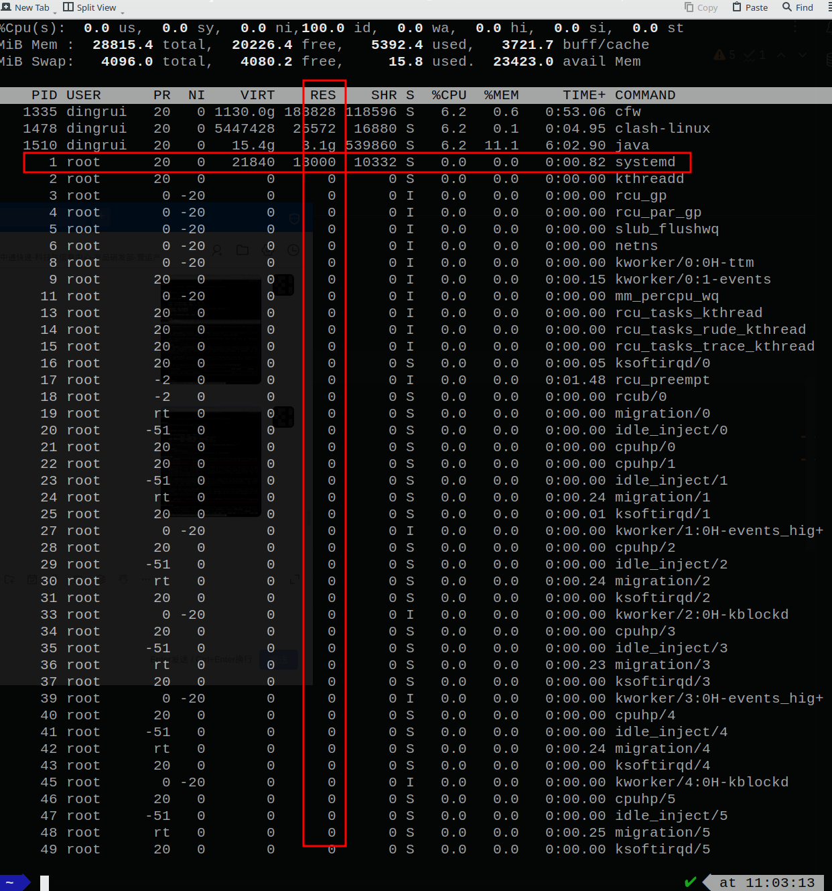
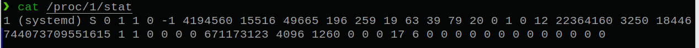

> 前文了解了为何redis需要抽象一层内存管理器，以及redis是怎么做的跨平台兼容。
> 这个章节尝试跟着zmalloc的代码进行逐行学习，整个zmalloc.c源文件700+行，再除去注释和换行等，实际代码规模不大，因此计划以函数为粒度进行解读和学习。

1 ASSERT_NO_SIZE_OVERFLOW
---

> 这是一个断言函数，这个函数存在的目的也是为了跨平台兼容。

```c
/**
 * PREFIX_SIZE是内存前缀 这个内存前缀是redis级别的 目的是为了知道redis从OS系统真实获得(或者近似真实获得)了多少内存
 *   <li>对于已经有malloc_size支持的内存分配器 有直接库函数知道redis从OS获取到的真实内存大小 所以不需要redis额外负担记录的职责<li>
 *   <li>对于没有malloc_size redis只能自己负担这个记录工作 但是因为没有OS帮助 是不知道OS分配的真实内存大小 只能靠redis记下自己主动申请了多少空间</li>
 * 因此在第二种情况下 redis就要评估到底需要多大的额外空间来记录内存大小 这个值大小肯定依赖malloc接受的入参 又跟机器的字宽有直接关系
 * 但是不论怎样 肯定是一个unsigned的整数 并且PREFIX_SIZE肯定得>0
 * 此时redis期待向OS申请的内存大小就是sz+PREFIX_SIZE 两个unsigned整数相加就可能存在整数溢出的情况 如果溢出了那么两数求和就是负数
 *
 * 因此ASSERT_NO_SIZE_OVERFLOW断言的就是判断要向malloc申请的内存大小没有超过malloc能够分配的上限 即没有溢出
 */
#ifdef HAVE_MALLOC_SIZE
#define PREFIX_SIZE (0)
/* 内存分配器支持malloc_size 不需要redis自己负担前缀内存来记录大小 因此也size_t类型本身就是malloc函数接受的类型 直接传给malloc即可 即不需要对参数判断 因此断言函数是空的 */
#define ASSERT_NO_SIZE_OVERFLOW(sz)

#else
#if defined(__sun) || defined(__sparc) || defined(__sparc__)
#define PREFIX_SIZE (sizeof(long long))
#else
#define PREFIX_SIZE (sizeof(size_t))
#endif
/* 内存分配器不支持malloc_size 需要redis自己负担前缀内存来记录大小 因此总共期待申请的内存大小是sz+PREFIX_SIZE 此时就要判断这个和是否溢出了size_t类型的整数大小 */
#define ASSERT_NO_SIZE_OVERFLOW(sz) assert((sz) + PREFIX_SIZE > (sz))

#endif
```

2 used_memory
---

> redis记录用了OS系统的内存空间大小。

```c
 /**
  * redis侧记录使用的内存大小
  * <ul>
  *   <li>编译环境有malloc_size支持的情况下 记录的就是OS实实在在分配给redis的内存大小 也就是redis真实用了多少空间</li>
  *   <li>编译环境没有malloc_size支持的情况下 记录的就是redis实际向OS申请的内存大小 OS实际分配给redis的空间>=这个值 因此这种情况下记录的`使用空间`就是实际被分配的约数</li>
  * </ul>
  * 为什么要定义成原子变量
  * 我现在的认知是虽然redis的IO操作(即面向用户的存取操作)是单线程
  * 但是redis还会开启新线程处理后台任务或者非用户层的存取任务
  * 那么就可能面临并发更新这个内存值的情况
  */
static redisAtomic size_t used_memory = 0;
```

对这个变量的操作无非就是加或者减：

### 2.1 申请了新内存空间

```c
 /* 原子更新使用内存 malloc申请完之后 加上新分配的空间大小 */
#define update_zmalloc_stat_alloc(__n) atomicIncr(used_memory,(__n))
```

### 2.2 释放了内存空间

```c
/* 原子更新使用内存 free释放完之后 减去释放的空间大小 */
#define update_zmalloc_stat_free(__n) atomicDecr(used_memory,(__n))
```

3 内存分配失败处理器
---

```c
// 定义函数指针 指针变量指向的函数在发生OOM时被调用 则该函数就是名义上的OOM处理器
// 决定了发生内存OOM时怎么处理
static void (*zmalloc_oom_handler)(size_t) = zmalloc_default_oom;

// 内存OOM处理器-默认处理器
static void zmalloc_default_oom(size_t size) {
    fprintf(stderr, "zmalloc: Out of memory trying to allocate %zu bytes\n",
        size);
    fflush(stderr);
    abort();
}
```

如果对默认的处理器不甚满意，则可以对这个函数指针变量进行赋值，按照处理器函数的原型自定义一个函数，之后发生OOM时便可以回调到自定义的处理器。

```c
/**
 * 注册内存OOM回调函数
 * @param oom_handler 函数指针 发生OOM时的处理器
 */
void zmalloc_set_oom_handler(void (*oom_handler)(size_t)) {
    zmalloc_oom_handler = oom_handler;
}
```

4 malloc的封装
---

### 4.1 trymalloc_usable

> 不处理OOM 关注内存块大小

```c
/* Try allocating memory, and return NULL if failed.
 * '*usable' is set to the usable size if non NULL. */
/**
 * 尝试动态内存分配
 * 分配失败就返回NULL
 * @param size 期待申请的内存大小
 * @param usable 在内容申请成功的前提下 表示成功申请下来的内存块大小(设为n) 可能存在两种情况
 *        <ul>
 *          <li>n>=申请的大小</li>
 *          <li>n==申请的大小</li>
 *        </ul>
 * @return 可以使用的起始地址 用来存取用户数据
 */
void *ztrymalloc_usable(size_t size, size_t *usable) {
  /**
   * 这个断言函数我觉得真实精妙
   * 判定一个类型的数数否溢出的思路
   */
    ASSERT_NO_SIZE_OVERFLOW(size);
	/**
	 * 调用malloc通过内存分配器向OS申请内存
	 */
    void *ptr = malloc(MALLOC_MIN_SIZE(size)+PREFIX_SIZE);

    if (!ptr) return NULL;
#ifdef HAVE_MALLOC_SIZE
	// 有malloc_size库函数支持 直接获取申请到的内存块的实际大小 更新使用内存 加上新分配的大小
    size = zmalloc_size(ptr);
    update_zmalloc_stat_alloc(size);
	// 内存块实际大小(该值>=申请的大小)
    if (usable) *usable = size;
	// malloc给的指针已经指向了给用户使用的起始地址
    return ptr;
#else
  // 没有有malloc_size库函数支持 更新使用内存 加上新申请的大小
  // 使用内存块的前缀空间记录这个内存块的大小(理论上应该记录实际大小 但是无从获取 因此只能记录期待申请的大小)
    *((size_t*)ptr) = size;
    update_zmalloc_stat_alloc(size+PREFIX_SIZE);
	// 内存块的近似大小(该值==申请的大小)
    if (usable) *usable = size;
	// 自己空出前缀空间 模拟malloc的实现 将指针指向给用户使用的起始地址
    return (char*)ptr+PREFIX_SIZE;
#endif
}
```

### 4.2 zmalloc_usable

> 处理OOM 关注内存块大小

```c
/**
 * 对malloc的封装
 * 尝试动态分配内存 并获取到内存块大小
 * 如果OOM了也要进行处理
 */
void *zmalloc_usable(size_t size, size_t *usable) {
    void *ptr = ztrymalloc_usable(size, usable);
    if (!ptr) zmalloc_oom_handler(size);
    return ptr;
}
```

### 4.3 ztry_malloc

> 不处理OOM 不关注内存块大小

```c
/**
 * 对malloc的封装
 * 尝试动态分配内存
 * 如果OOM了也直接交给上层关注
 */
void *ztrymalloc(size_t size) {
    void *ptr = ztrymalloc_usable(size, NULL);
    return ptr;
}
```

### 4.4 zmalloc

> 处理OOM 关注内存块大小

```c
/**
 * 对malloc的封装
 * 如果OOM要对OOM进行处理
 */
void *zmalloc(size_t size) {
    // 尝试申请内存 并不关注获得的内存块大小
    void *ptr = ztrymalloc_usable(size, NULL);
	// 内存分配失败 回调处理器处理OOM
    if (!ptr) zmalloc_oom_handler(size);
    return ptr;
}
```

如上，其实就是统一对malloc的封装，按照场景需求分为两类
- 是否需要OOM处理
- 是否关注内存块大小

那么二者组合情况就有4种
- 处理OOM 关注内存块 则不带try带usable
- 处理OOM 不关注内存块 则不带try不带usable
- 不处理OOM 关注内存块 则带try带usable
- 不处理OOM 不关注内存块 则带try不带usable

5 malloc系列
---

> 根据上述的命名方式，结合malloc、calloc、realloc三者之间的区别，其他的函数基本不用看也知道该怎么封装了。

| malloc           | 处理OOM        | 不处理OOM         |
|------------------|----------------|-------------------|
| 关注内存块大小   | zmalloc_usable | ztrymalloc_usable |
| 不关注内存块大小 | zmalloc        | ztrymalloc        |

| calloc           | 处理OOM        | 不处理OOM         |
|------------------|----------------|-------------------|
| 关注内存块大小   | zcalloc_usable | ztrycalloc_usable |
| 不关注内存块大小 | zcalloc        | ztrycalloc        |

| realloc          | 处理OOM         | 不处理OOM          |
|------------------|-----------------|--------------------|
| 关注内存块大小   | zrealloc        | ztryrealloc_usable |
| 不关注内存块大小 | zrealloc_usable | ztryrealloc        |

6 zfree的封装
---

### 6.1 zfree

```c
/**
 * 对free(...)函数的封装
 * <ul>
 *   <li>更新内存使用量 要释放的内存块对应的内存块大小要扣减掉</li>
 *   <li>向OS申请释放内存</li>
 * </ul>
 * 要更新内存使用量 就要知道内存块大小 此时也更加印证了PREFIX_SIZE的重要性 正式因为PREFIX_SIZE统一了跟OS系统一样的内存块大小机制 大大简化了整个的内存使用量统计操作
 */
void zfree(void *ptr) {
#ifndef HAVE_MALLOC_SIZE
    void *realptr;
    size_t oldsize;
#endif

    if (ptr == NULL) return;
#ifdef HAVE_MALLOC_SIZE
	// 更新内存使用量 释放掉的内存量
    update_zmalloc_stat_free(zmalloc_size(ptr));
	// 释放
    free(ptr);
#else
	// 前移前缀空间 这个地方才是OS视角的use_ptr
    realptr = (char*)ptr-PREFIX_SIZE;
	// 前缀空间上存储的内存大小
    oldsize = *((size_t*)realptr);
	// 更新内存使用量 释放掉的内存量
    update_zmalloc_stat_free(oldsize+PREFIX_SIZE);
	// 释放
    free(realptr);
#endif
}
```

对于PREFIX_SIZE机制，可以借助下图来理解:

比如我们作为用户进程向OS申请了sz大小的内存
- 先看红色字体，从OS视角来看 实际分配的内存块比sz更大。这个内存块的起始地址是real，因为要记录一些元信息，因此给到我们的是use的起始地址。
- 再从用户视角来看，我们以为这个内存地址就是从use开始的，并且真个分配到的内存只有sz，起始可能可用的比sz还要大一点。
- 其次再看蓝色字体，就是在redis层面模拟OS的这样机制，我们也额外负担一点内存空间来模拟存储内存块大小。

我觉得这样用一点空间换取来的是api和算法的统一，也让维护的内存使用量具有实际意义。


### 6.2 zfree_usable

```c
/* Similar to zfree, '*usable' is set to the usable size being freed. */
// 同zfree 只是将待释放的内存块大小返回出来
void zfree_usable(void *ptr, size_t *usable) {
#ifndef HAVE_MALLOC_SIZE
    void *realptr;
    size_t oldsize;
#endif

    if (ptr == NULL) return;
#ifdef HAVE_MALLOC_SIZE
    update_zmalloc_stat_free(*usable = zmalloc_size(ptr));
    free(ptr);
#else
    realptr = (char*)ptr-PREFIX_SIZE;
    *usable = oldsize = *((size_t*)realptr);
    update_zmalloc_stat_free(oldsize+PREFIX_SIZE);
    free(realptr);
#endif
}
```

7 zstrdup
---

```c
/**
 * 复制字符串
 * 实现很简单 但是我不太理解为啥把这个函数放在zmalloc
 */
char *zstrdup(const char *s) {
    // 字符串长度 多一个byte放\0结束符
    size_t l = strlen(s)+1;
    char *p = zmalloc(l);

    memcpy(p,s,l);
    return p;
}
```

8 zmalloc_used_memory
---

```c
// 内存使用量
size_t zmalloc_used_memory(void) {
    size_t um;
	// 读取used_memory变量的值
    atomicGet(used_memory,um);
    return um;
}
```

9 zmalloc_get_rss
---

> 上面提到过redis自己在服务端维护了变量`used_memory`，其约等于OS系统实际分配的内存空间。
> 现在要获取redis进程在OS系统中驻留的内存空间，系统给进程分配了内存之后，为了使用效率提升，可能会将一部分不常使用的空间放到swap交换区去，那么物理内存的驻留空间实际是减少的，可以提升内存的使用效率。

RSS=Resident Set Size

从描述也可以看得出来，RSS的获取依赖各个系统的实现，因此redis就要进行跨平台的封装。

因为我常用的系统只有mac和linux，所以这两个平台上的实现方式可以跟到函数详细研究，其他平台就粗略看一下。

### 9.1 linux

在正式看redis的函数之前，回忆一些常用操作和知识作为铺垫。

#### 9.1.1 strchr(...)

这个函数就是给定一个字符串，给定一个目标字符，函数会找到在这个字符串中第一次出现目标字符的地方。


#### 9.1.2 strtol系列函数

将字符串形式的数字转换成指定进制表达的整数形式。


#### 9.1.3 sysconf(...)

系统进程的运行时信息sysconf(_SC_PAGESIZE)就是获取到内存页的一页有多少byte，比如一页4k就是4096byte。


#### 9.1.4 RSS内存

##### 9.1.4.1 top命令

top可以在终端获取到所有进程的内存占用信息，如图的RES就是某个进程的内存驻留大小，单位是kb，即1号进程驻留的物理地址空间大小为13000kb。



##### 9.1.4.2 /proc虚拟文件系统

上述top命令采集的指标信息就来自/proc虚拟文件系统，比如我们想要知道1号进程的信息，`cat /proc/1/stat`即可：




##### 9.1.4.3 stat指标

`cat /proc/1/stat >> ~/Desktop/pid_1_stat.txt`将stat信息写到文件中方便处理，`:%s/ /\r/g`将空格替换成换行，如下内容：

```txt
1
(systemd)
S
0
1
1
0
-1
4194560
15516
49665
196
259
19
63
39
79
20
0
1
0
12
22364160
3250
18446744073709551615
1
1
0
0
0
0
671173123
4096
1260
0
0
0
17
6
0
0
0
0
0
0
0
0
0
0
0
0
0
```

合计52项，下表为每个参数的说明：

| /proc/{pid}/stat参数 | property      | 解释                                                                                   | value                |
|----------------------|---------------|----------------------------------------------------------------------------------------|----------------------|
| 第1项                | pid           | 进程(包括线程)号                                                                       | 1                    |
| 第2项                | comm          | 程序(命令)名字                                                                         | systemd              |
| 第3项                | task_state    | 任务的状态(R=running S=sleeping D=disk sleep T=stopped T=tracing stop Z=zombie X=dead) | S                    |
| 第4项                | ppid          | 父进程id                                                                               | 0                    |
| 第5项                | pgid          | 线程组号                                                                               | 1                    |
| 第6项                | sid           | 该任务所在的会话组id                                                                   | 1                    |
| 第7项                | tty_nr        | 该任务的tty终端的设备号                                                                | 0                    |
| 第8项                | tty_gprp      | 终端的进程组号                                                                         | -1                   |
| 第9项                | task->flags   | 进程标志位                                                                             | 4194560              |
| 第10项               | min_flt       | 该任务不需要从硬盘拷数据而发生的缺页次数                                               | 15516                |
| 第11项               | cmin_flt      | 累计的该任务的所有的waited-for进程曾经发生的次缺页的次数目                             | 49665                |
| 第12项               | maj_flt       | 该任务需要从硬盘拷数据而发生的缺页(次缺页)的次数                                       | 196                  |
| 第13项               | cmaj_flt      | 累计的该任务的所有的waited-for进程曾经发生的主缺页的次数目                             | 259                  |
| 第14项               | utime         | 该任务在用户态运行的时间 单位为jiffies                                                 | 19                   |
| 第15项               | stime         | 该任务在内核态运行的时间 单位为jiffies                                                 | 63                   |
| 第16项               | cutime        | 累计的该任务的所有waited-for进程曾经在用户态运行的时间 单位为jiffies                   | 39                   |
| 第17项               | cstime        | 累计的该任务的所有的waited-for进程曾经在内核态运行的时间 单位为jiffies                 | 79                   |
| 第18项               | priority      | 任务的动态优先级                                                                       | 20                   |
| 第19项               | nice          | 任务的静态优先级                                                                       | 0                    |
| 第20项               | num_threads   | 该任务所在的线程组里面的线程数量                                                       | 1                    |
| 第21项               | it_real_value | 由于计时间隔导致的下一个SIGALRM发送进程的时延 单位为jiffy                              | 0                    |
| 第22项               | start_time    | 该任务启动的时间 单位为jiffies                                                         | 12                   |
| 第23项               | vsize         | 该任务的虚拟地址空间的大小 单位page                                                    | 22364160             |
| 第24项               | rss           | 该任务当前驻留物理地址空间的大小 单位page                                              | 3250                 |
| 第25项               |               |                                                                                        | 18446744073709551615 |
| 第26项               |               |                                                                                        | 1                    |
| 第27项               |               |                                                                                        | 1                    |
| 第28项               |               |                                                                                        | 0                    |
| 第29项               |               |                                                                                        | 0                    |
| 第30项               |               |                                                                                        | 0                    |
| 第31项               |               |                                                                                        | 0                    |
| 第32项               |               |                                                                                        | 671173123            |
| 第33项               |               |                                                                                        | 4096                 |
| 第34项               |               |                                                                                        | 1260                 |
| 第35项               |               |                                                                                        | 0                    |
| 第36项               |               |                                                                                        | 0                    |
| 第37项               |               |                                                                                        | 0                    |
| 第38项               |               |                                                                                        | 17                   |
| 第39项               |               |                                                                                        | 6                    |
| 第40项               |               |                                                                                        | 0                    |
| 第41项               |               |                                                                                        | 0                    |
| 第42项               |               |                                                                                        | 0                    |
| 第43项               |               |                                                                                        | 0                    |
| 第44项               |               |                                                                                        | 0                    |
| 第45项               |               |                                                                                        | 0                    |
| 第46项               |               |                                                                                        | 0                    |
| 第47项               |               |                                                                                        | 0                    |
| 第48项               |               |                                                                                        | 0                    |
| 第49项               |               |                                                                                        | 0                    |
| 第50项               |               |                                                                                        | 0                    |
| 第51项               |               |                                                                                        | 0                    |
| 第52项               |               |                                                                                        | 0                    |

说明1号进程驻留的物理内存大小为3250个page，而1个page大小为4kb(4096 byte)，则rss=13000kb。

##### 9.1.4.4 zmalloc_get_rss实现

至此，我们再来看redis中如何获取rss的，就会十分轻松。

```c
/* Test for proc filesystem */
// linux系统上运行时的指标都从/proc虚拟文件系统上拿
#ifdef __linux__
/* linux系统从/proc虚拟文件系统获取RSS /proc/{pid}/stat 的第24项就是RSS(驻留物理内存多少个page) */
#define HAVE_PROC_STAT 1
```

```c
/**
 * linux系统的/proc虚拟文件系统
 * 在linux上想要知道某个进程的实际内存占用很简单 使用top命令即可 其中RES就是内存驻留(不包含swap交换内存) 单位是kb
 * 具体到某个进程的运行时信息存储在文件/proc/{pid}/stat上 这个文件内容每个指标项通过空格作为分割符 第24个就是RSS指标 单位是页
 * 因此linux系统某个进程的RSS就是直接读这个文件即可
 */
#if defined(HAVE_PROC_STAT)
#include <sys/types.h>
#include <sys/stat.h>
#include <fcntl.h>

size_t zmalloc_get_rss(void) {
    // 页大小(单位是bytes) 下面要去读/proc/{pid}/stat获取RSS大小 得到的是页数
	// 结果是4096 byte
    int page = sysconf(_SC_PAGESIZE);
    size_t rss;
    char buf[4096];
    char filename[256];
    int fd, count;
    char *p, *x;
	// 虚拟文件系统的文件路径/proc/{pid}/stat
    snprintf(filename,256,"/proc/%ld/stat",(long) getpid());
	// 文件不存在
    if ((fd = open(filename,O_RDONLY)) == -1) return 0;
	// 文件内容读到buf数组中 读完关闭文件
    if (read(fd,buf,4096) <= 0) {
        close(fd);
        return 0;
    }
    close(fd);

    p = buf;
	// 各个指标用空格作为分割符 第24个就是RSS指标
    count = 23; /* RSS is the 24th field in /proc/<pid>/stat */
    while(p && count--) {
        p = strchr(p,' ');
        if (p) p++;
    }
    if (!p) return 0;
	// 找到第24项和25项之间的空格 人为将其改成\0结束符 目的是让函数strtoll(...)将第24项字符串形式转成整数形式
    x = strchr(p,' ');
    if (!x) return 0;
    *x = '\0';
	// 将第24项的RSS字符串形式转换成10进制整数形式(long long类型)
    rss = strtoll(p,NULL,10);
	// rss页*每页page个byte
    rss *= page;
    return rss;
}
```

### 9.2 mac

### 9.3
