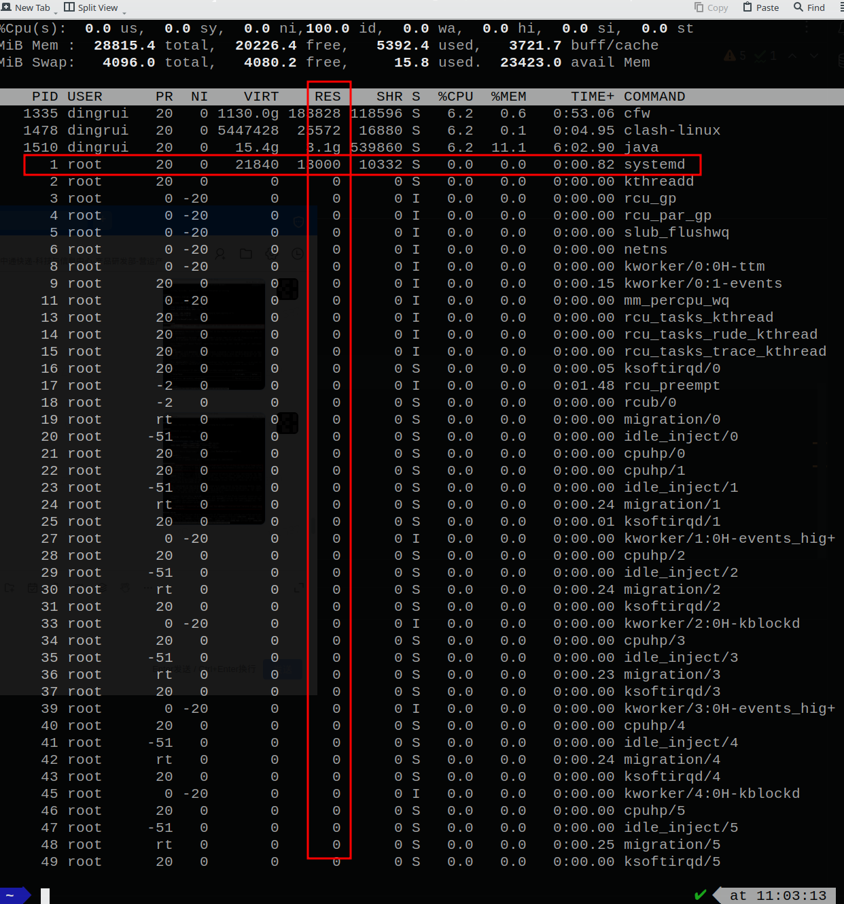
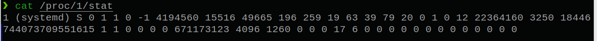

1 top命令
---

top可以在终端获取到所有进程的内存占用信息，如图的RES就是某个进程的内存驻留大小，单位是kb，即1号进程驻留的物理地址空间大小为13000kb。



2 /proc虚拟文件系统
---

上述top命令采集的指标信息就来自/proc虚拟文件系统，比如我们想要知道1号进程的信息，`cat /proc/1/stat`即可：



3 stat指标
---

`cat /proc/1/stat >> ~/Desktop/pid_1_stat.txt`将stat信息写到文件中方便处理，`:%s/ /\r/g`将空格替换成换行，如下内容：

```txt
1
(systemd)
S
0
1
1
0
-1
4194560
15516
49665
196
259
19
63
39
79
20
0
1
0
12
22364160
3250
18446744073709551615
1
1
0
0
0
0
671173123
4096
1260
0
0
0
17
6
0
0
0
0
0
0
0
0
0
0
0
0
0
```

合计52项，下表为每个参数的说明：

| /proc/{pid}/stat参数 | property      | 解释                                                                                   | value                |
|----------------------|---------------|----------------------------------------------------------------------------------------|----------------------|
| 第1项                | pid           | 进程(包括线程)号                                                                       | 1                    |
| 第2项                | comm          | 程序(命令)名字                                                                         | systemd              |
| 第3项                | task_state    | 任务的状态(R=running S=sleeping D=disk sleep T=stopped T=tracing stop Z=zombie X=dead) | S                    |
| 第4项                | ppid          | 父进程id                                                                               | 0                    |
| 第5项                | pgid          | 线程组号                                                                               | 1                    |
| 第6项                | sid           | 该任务所在的会话组id                                                                   | 1                    |
| 第7项                | tty_nr        | 该任务的tty终端的设备号                                                                | 0                    |
| 第8项                | tty_gprp      | 终端的进程组号                                                                         | -1                   |
| 第9项                | task->flags   | 进程标志位                                                                             | 4194560              |
| 第10项               | min_flt       | 该任务不需要从硬盘拷数据而发生的缺页次数                                               | 15516                |
| 第11项               | cmin_flt      | 累计的该任务的所有的waited-for进程曾经发生的次缺页的次数目                             | 49665                |
| 第12项               | maj_flt       | 该任务需要从硬盘拷数据而发生的缺页(次缺页)的次数                                       | 196                  |
| 第13项               | cmaj_flt      | 累计的该任务的所有的waited-for进程曾经发生的主缺页的次数目                             | 259                  |
| 第14项               | utime         | 该任务在用户态运行的时间 单位为jiffies                                                 | 19                   |
| 第15项               | stime         | 该任务在内核态运行的时间 单位为jiffies                                                 | 63                   |
| 第16项               | cutime        | 累计的该任务的所有waited-for进程曾经在用户态运行的时间 单位为jiffies                   | 39                   |
| 第17项               | cstime        | 累计的该任务的所有的waited-for进程曾经在内核态运行的时间 单位为jiffies                 | 79                   |
| 第18项               | priority      | 任务的动态优先级                                                                       | 20                   |
| 第19项               | nice          | 任务的静态优先级                                                                       | 0                    |
| 第20项               | num_threads   | 该任务所在的线程组里面的线程数量                                                       | 1                    |
| 第21项               | it_real_value | 由于计时间隔导致的下一个SIGALRM发送进程的时延 单位为jiffy                              | 0                    |
| 第22项               | start_time    | 该任务启动的时间 单位为jiffies                                                         | 12                   |
| 第23项               | vsize         | 该任务的虚拟地址空间的大小 单位page                                                    | 22364160             |
| 第24项               | rss           | 该任务当前驻留物理地址空间的大小 单位page                                              | 3250                 |
| 第25项               |               |                                                                                        | 18446744073709551615 |
| 第26项               |               |                                                                                        | 1                    |
| 第27项               |               |                                                                                        | 1                    |
| 第28项               |               |                                                                                        | 0                    |
| 第29项               |               |                                                                                        | 0                    |
| 第30项               |               |                                                                                        | 0                    |
| 第31项               |               |                                                                                        | 0                    |
| 第32项               |               |                                                                                        | 671173123            |
| 第33项               |               |                                                                                        | 4096                 |
| 第34项               |               |                                                                                        | 1260                 |
| 第35项               |               |                                                                                        | 0                    |
| 第36项               |               |                                                                                        | 0                    |
| 第37项               |               |                                                                                        | 0                    |
| 第38项               |               |                                                                                        | 17                   |
| 第39项               |               |                                                                                        | 6                    |
| 第40项               |               |                                                                                        | 0                    |
| 第41项               |               |                                                                                        | 0                    |
| 第42项               |               |                                                                                        | 0                    |
| 第43项               |               |                                                                                        | 0                    |
| 第44项               |               |                                                                                        | 0                    |
| 第45项               |               |                                                                                        | 0                    |
| 第46项               |               |                                                                                        | 0                    |
| 第47项               |               |                                                                                        | 0                    |
| 第48项               |               |                                                                                        | 0                    |
| 第49项               |               |                                                                                        | 0                    |
| 第50项               |               |                                                                                        | 0                    |
| 第51项               |               |                                                                                        | 0                    |
| 第52项               |               |                                                                                        | 0                    |

说明1号进程驻留的物理内存大小为3250个page，而1个page大小为4kb(4096 byte)，则rss=13000kb。

