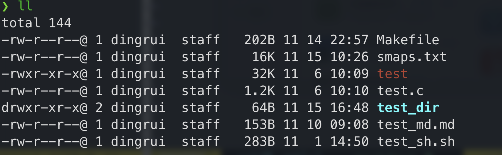
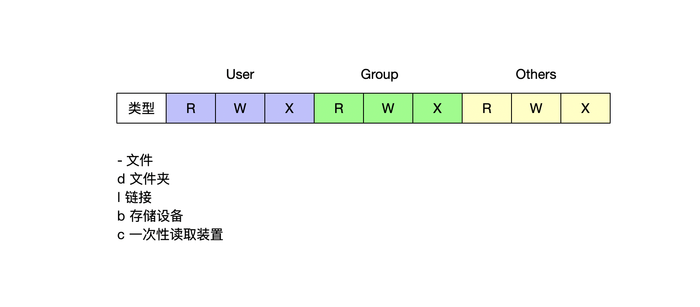
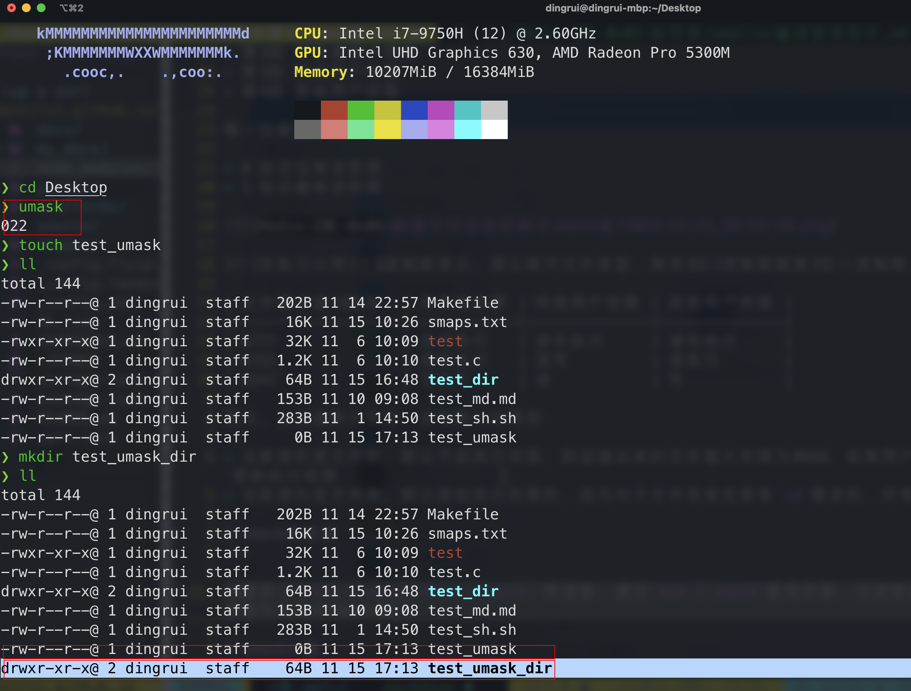

1 权限
---

随便看一些文件的权限信息，如下：

文件属性被分为4段，每一段以及每一位的信息都是固定的

- 第1段 文件属性
- 第2段 所有者用户权限
- 第3段 同组用户权限
- 第4段 其他用户权限

每一位都是0跟1标识

- 0 标识没有该权限
- 1 标识拥有该权限

3个2进制可以用1个8进制数表示，那么除开文件类型，剩余9位2进制数就是3位八进制数，那么

| 文件属性值(8进制) | 所有者权限 | 同组用户权限 | 其他用户权限 |
|-------------------|------------|--------------|--------------|
| 0777              | 读写执行   | 读写执行     | 读写执行     |
| 0765              | 读写执行   | 读写         | 读执行       |
| 0342              | 写执行     | 读           | 写           |

其次，当创建新文件时，会有默认的规则：

- 当新建的是文件时，默认不给执行权限，即创建出来的文件最大权限为0666，如果用户自己有执行需求，可以使用`chmod`更新执行权限
- 当新建的是文件夹，默认是给执行权限的，因为对于文件夹肯定是有`cd`需求的，所有创建出来的最大权限为0777

2 umask库函数
---

OS提供了`mode_t umask(mode_t cmask)`库函数，通过`man 2 umask`查询手册，该函数的形参cmask表示要移除的权限，返回值为之前的cmask值。

如图，默认的umask值为`0022`，即新建的文件权限移除写权限：

- 新建的是文件，先从`0777`中移除group和others的写权限，更新为`0755`，因为是文件类型是文件，默认不给执行权限，将user、group和others的执行权限移除，更新为`0644`，也即`-rw-r--r--`。
- 新建的文件夹，先从`0777`中移除group和others的写权限，更新为`0755`，因为文件类型是文件夹，默认是给执行权限的，因此最终权限为`0755`，也即`drwxr-xr-x`。

3 umask计算
---

上述已经举过一个例子，下表多举几个示例：

| umask值 | 新建文件的权限   | 新建文件夹的权限 |
|---------|------------------|------------------|
| 0003    | 0664(-rw-rw-r--) | 0774(drwxrwxr--) |
| 0004    | 0662(-rw-rw--w-) | 0773(drwxrwx-wx) |
| 0005    | 0662(-rw-rw--w-) | 0772(drwxrwx-w-) |
