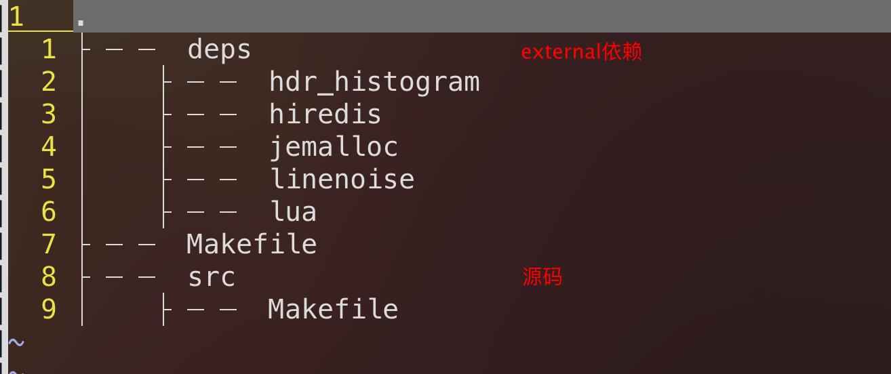

Redis项目是通过make构建的，考虑到以下几点，我觉得有必要通过cmake脚本生成MakeFile

- cmake的跨平台性

- 源码的结构自定义组织

但是reids项目本身为了兼容跨平台性以及性能优化，提供了诸多的编译选项，我当前的cmake脚本只关注linux平台

- linux系统

- jemalloc内存分配器

### 1 项目结构



项目的构建分为两个部分

- 依赖的3rd_party编译，将其编译位链接库

- 源码，将其编译位可执行程序

### 2 make

之前看过了MakeFile的rule，

### 3 cmake脚本编写

为了尽可能的简单，因此只关注于linux平台，并且当前只编写了编译redis-server可执行程序的脚本

从MakeFile中可以看出来redis工程共提供了如下6个可执行程序的编译

- redis-server

- redis-sentinel

- redis-check-rdb

- redis-check-aof

- redis-cli

- redis-benchmark

#### 3.1 根目录

##### 3.1.1 CmakeLists.txt文件

负责源码的编译以及链接库

```CMakeLists
cmake_minimum_required(VERSION 3.13)
project(redis_6.2 C)

#debug模式编译
set(CMAKE_BUILD_TYPE Debug CACHE STRING "set build type to debug")

#编译选项
add_definitions(
    "-O2"
    "-Wall"
    "-std=c99"
    "-pedantic"
)

#external依赖库目录
set(DEPS_PATH ${CMAKE_CURRENT_SOURCE_DIR}/deps)

#编译源码需要依赖的系统共享库
set(SHARED_LIBS -lm -ldl -lpthread)

#在编译Redis之前需要执行src目录下的mkreleasehdr.sh脚本生成release.h
execute_process(
    COMMAND sh ${CMAKE_CURRENT_SOURCE_DIR}/src/mkreleasehdr.sh
    WORKING_DIRECTORY ${CMAKE_CURRENT_SOURCE_DIR}/src
)

#[[
external依赖头文件路径
]]
include_directories(
    ${DEPS_PATH}/hdr_histogram
    ${DEPS_PATH}/hiredis
    ${DEPS_PATH}/jemalloc/include
    ${DEPS_PATH}/linenoise
    ${DEPS_PATH}/lua/src
)

# 添加需要编译子目录
add_subdirectory(deps)

#[[
链接库路径
deps/hdr_histogram目录编译成静态库hdr_histogram
deps/hiredis目录编译成动态库libhiredis.so
deps/jemalloc目录编译成静态库libjemalloc.a
dpes/linenoise目录编译成静态库linenoise
deps/lua目录编译成动态库lua
]]
link_directories(${DEPS_PATH}/hdr_histogram)
link_directories(${DEPS_PATH}/hiredis)
link_directories(${DEPS_PATH}/jemalloc/lib)
link_directories(${DEPS_PATH}/linenoise)
link_directories(${DEPS_PATH}/lua/src)

#编译redis-server可执行程序的源码文件
set(REDIS_SERVER_LIST
    src/adlist.c src/quicklist.c src/ae.c src/anet.c src/dict.c src/server.c src/sds.c src/zmalloc.c src/lzf_c.c src/lzf_d.c src/pqsort.c src/zipmap.c src/sha1.c src/ziplist.c src/release.c src/networking.c src/util.c src/object.c src/db.c src/replication.c src/rdb.c src/t_string.c src/t_list.c src/t_set.c src/t_zset.c src/t_hash.c src/config.c src/aof.c src/pubsub.c src/multi.c src/debug.c src/sort.c src/intset.c src/syncio.c src/cluster.c src/crc16.c src/endianconv.c src/slowlog.c src/scripting.c src/bio.c src/rio.c src/rand.c src/memtest.c src/crcspeed.c src/crc64.c src/bitops.c src/sentinel.c src/notify.c src/setproctitle.c src/blocked.c src/hyperloglog.c src/latency.c src/sparkline.c src/redis-check-rdb.c src/redis-check-aof.c src/geo.c src/lazyfree.c src/module.c src/evict.c src/expire.c src/geohash.c src/geohash_helper.c src/childinfo.c src/defrag.c src/siphash.c src/rax.c src/t_stream.c src/listpack.c src/localtime.c src/lolwut.c src/lolwut5.c src/lolwut6.c src/acl.c src/gopher.c src/tracking.c src/connection.c src/tls.c src/sha256.c src/timeout.c src/setcpuaffinity.c src/monotonic.c src/mt19937-64.c)

#生成可执行文件
add_executable(redis-server ${REDIS_SERVER_LIST})

#[[
链接库文件
deps/hdr_histogram目录编译成静态库libhdr_histogram.a
deps/hiredis目录编译成动态库libhiredis.so
deps/jemalloc目录编译成静态库libjemalloc.a
dpes/linenoise目录编译成静态库liblinenoise.a
deps/lua目录编译成静态库liblua.a
]]
target_link_libraries(redis-server
    hdr_histogram hiredis lua jemalloc ${SHARED_LIBS})

```

##### 3.1.2 configure.sh文件

执行cmake脚本生成Makefile

```shell
#!/bin/sh

cmake -S . -B build
```

##### 3.1.3 build.sh文件

执行make

```shell
#!/bin/sh

cd build ; make
```

##### 3.1.4 run.sh文件

运行redis-server可执行程序

```shell
#!/bin/sh

cd build ; ./redis-server
```

#### 3.2 deps目录

负责编译3rd_party的依赖

```CMakeLists
add_subdirectory(hdr_histogram)
add_subdirectory(hiredis)
add_subdirectory(jemalloc)
add_subdirectory(linenoise)
add_subdirectory(lua)
```

##### 3.2.1 deps/hdr_histogram

```CMakeLists
add_library(hdr_histogram
    hdr_histogram.h hdr_histogram.c
)
```

##### 3.2.2 deps/hiredis

hiredis本身就是cmake项目，因此不需要额外编写cmake脚本

##### 3.2.3 deps/jemalloc

###### 3.2.3.1 sh脚本

```shell
#!/bin/sh

./configure --with-version=5.1.0-0-g0 --with-lg-quantum=3 --with-jemalloc-prefix=je_
make lib/libjemalloc.a
```

###### 3.2.3.2 cmake脚本

```CMakeLists
execute_process(
    COMMAND bash "${CMAKE_CURRENT_SOURCE_DIR}/build_jemalloc.sh"
    WORKING_DIRECTORY ${CMAKE_CURRENT_SOURCE_DIR}
)

file(COPY lib/libjemalloc.a DESTINATION ${CMAKE_CURRENT_BINARY_DIR}/lib)
file(REMOVE lib/libjemalloc.a)
```

##### 3.2.4 deps/linenoise

```CMakeLists
add_library(linenoise linenoise.c)
```

##### 3.2.5 deps/lua

```CMakeLists
set(LUA_SRC
        src/lapi.c src/lcode.c src/ldebug.c src/ldo.c src/ldump.c src/lfunc.c
        src/lgc.c src/llex.c src/lmem.c
        src/lobject.c src/lopcodes.c src/lparser.c src/lstate.c src/lstring.c
        src/ltable.c src/ltm.c
        src/lundump.c src/lvm.c src/lzio.c src/strbuf.c src/fpconv.c
        src/lauxlib.c src/lbaselib.c src/ldblib.c src/liolib.c src/lmathlib.c
        src/loslib.c src/ltablib.c
        src/lstrlib.c src/loadlib.c src/linit.c src/lua_cjson.c
        src/lua_struct.c
        src/lua_cmsgpack.c
        src/lua_bit.c
        )
add_library(lua STATIC ${LUA_SRC})
```