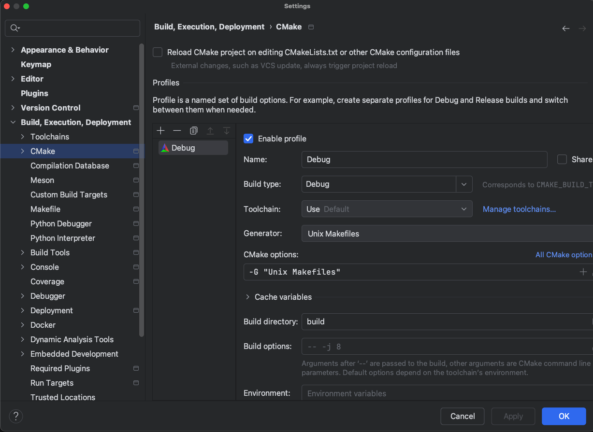
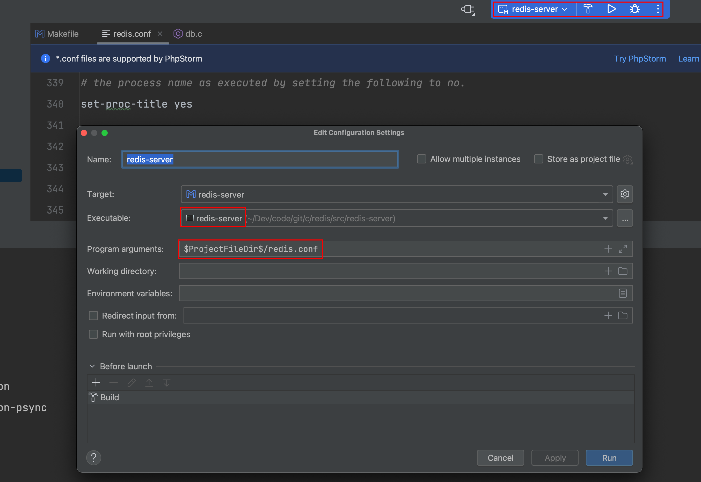
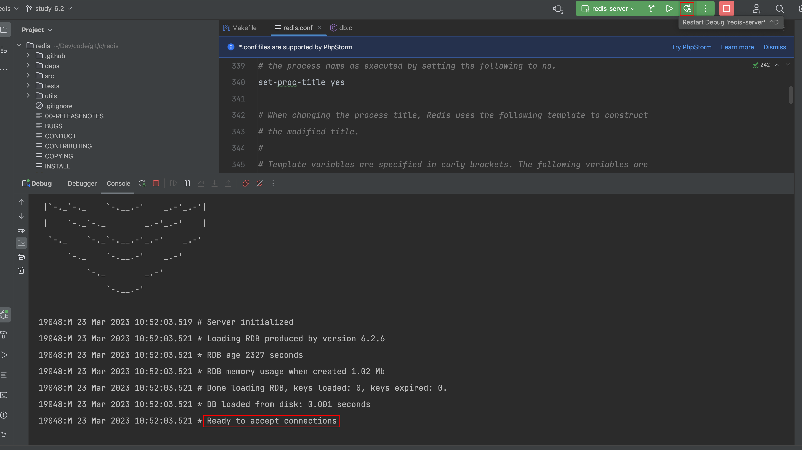

### 1 环境

| Name  | Ver      |
| ----- | -------- |
| MacOS | 11.5.2   |
| Clion | 2022.3.3 |
| Clang | 12.0.5   |
| LLDB  | 15.0.5   |

### 2 源码

[github源码地址](https://github.com/redis/redis)

[我的源码笔记地址](https://github.com/Bannirui/redis.git)

将源码for到自己仓库

```shell
git clone git@github.com:Bannirui/redis.git
cd redis
git remote add upstream git@github.com:redis/redis.git
git remote set-url --push upstream no_push
git fetch upstream
git checkout 6.2
git checkout -b study-6.2
git push origin study-6.2
```

> 在mac arm平台下直接编译会报错


### 3 导入Clion并编译

#### 3.1 ToolChain

将使用Clang作为构建调试工具，调试器不能使用GDB，之前使用GDB有问题，得使用LLDB。


#### 3.2 编译
##### 3.2.1 直接用make
###### 3.2.1.1 make配置

选择Clang作为Makefile项目的构建工具。


###### 3.2.1.2 make test

根据提示，出现如下提示`It's a good idea to run 'make test'`，则在终端执行`make test`。


###### 3.2.1.3 编译成功

终端出现如下提示`All tests passed without errors`，则表示编译成功。


##### 3.2.2 用cmake生成make脚本
###### 3.2.2.1 cmake配置


###### 3.2.2.2 sh脚本

进到项目根目录下执行
```sh
./configure.sh
./build.sh
```

### 4 调试

#### 4.1 配置



#### 4.2 启动

##### 4.2.1 服务端

服务端已经启动监听在知名端口。



##### 4.2.2 客户端

启动客户端跟服务端交互，此时就可以进行调试跟踪了。

