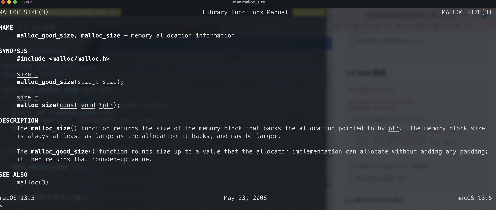
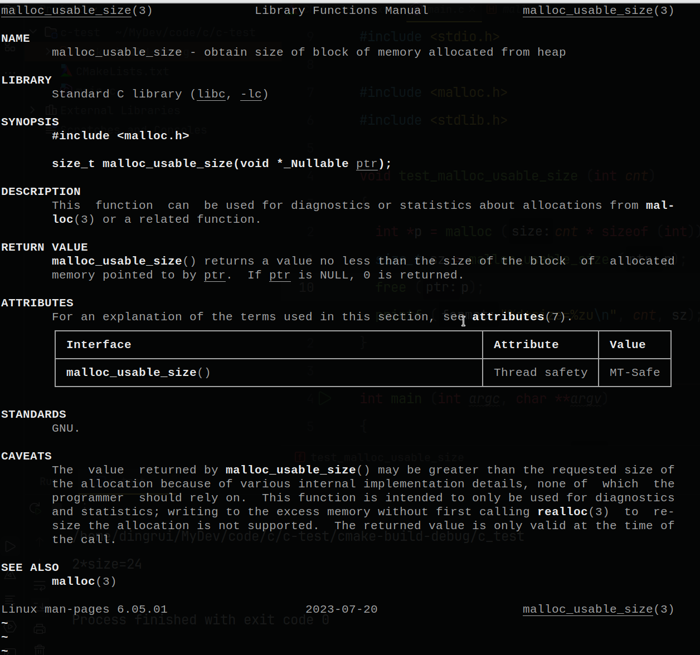
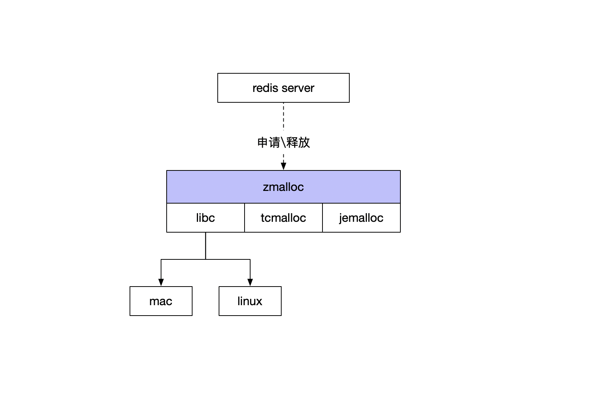
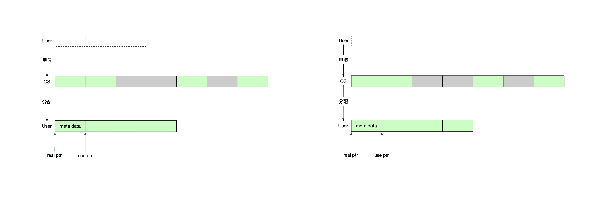

1 操作系统的内存分配
---

一个基本的事实是不同的操作系统可能有不同的内存分配器实现，函数原型、执行效率、内存碎片等等或多或少存在着差异。

我自己的主力机只有一台mac和一台linux的迷你机，因此只能查阅这两个系统相关的库函数。

### 1.1 linux系统

```c
#include <stdio.h>

#include <malloc.h>
#include <stdlib.h>

void test_malloc_usable_size (int cnt)
{
  int *p = malloc (cnt * sizeof (int));
  size_t sz = malloc_usable_size (p);
  free (p);
  printf ("%d*size=%zu\n", cnt, sz);
}

int main (int argc, char **argv)
{
  test_malloc_usable_size (2);
}
```

### 1.2 mac系统

```c
#include <stdio.h>

#include <malloc/malloc.h>
#include <stdlib.h>

void test_malloc_size (int cnt)
{
  int *p = (int *)malloc (cnt * sizeof (int));
  size_t ret = malloc_size (p);
  printf ("%d*(int), ret=%zu\n", cnt, ret);
  free (p);
}

int main (int argc, char **argv)
{
  test_malloc_size (1);
}
```

从上面的示例代码可以看出：

- 虽然macos和linux都实现了`malloc`函数，但是二者的头文件路径并不一样，对于开发者而言在使用的时候就需要根据实际情况引入头文件

- 两个平台都提供了查询动态内容实际分配的内存大小的功能，但是函数原型并不一样，在mac上是`malloc_size(...)`，在linux上是`malloc_usable_size(...)`

关于库函数的手册说明，如下：

- mac的malloc_size

    

- linux的malloc_usable_size

    

2 zmalloc分配器
---

基于上述，redis想要做到跨平台的话，就要在各个系统提供的库函数之上，封装统一的api。再者，如果有了统一封装，又可以更方便定制化进行内存管理，即在用户进程和OS之间扮演了中介的角色。



那么，zmalloc要关注的几个实现可能如下：

- 统一的`malloc`系列函数

- 统一的`free`系列函数

- 记录用户进程向OS申请的内存，用于量化指标统计

- 分析内存碎片和使用率等情况，合理地交互OS以达到内存管理

目前为止看到的分配器的实现就3大类，tcmalloc实现、jemalloc实现、libc实现，而对标准库的实现依赖平台，我只熟悉mac和linux，姑且将OS分为3种：mac、linux和其他。即如下：

- tcmalloc内存分配器

- jemalloc内存分配器

- libc内存分配器

    - linux的glibc内存分配器

    - mac的内存分配器

    - 其他OS的内存分配器

3 内存分配器编译选项
---

编译选项需要从Makefile中看，3个选项

- tcmalloc

- jemalloc

- libc

```Makefile
# Default allocator defaults to Jemalloc if it's not an ARM
# 指定内存分配器 linux操作系统上redis默认使用的是jemalloc适配器
MALLOC=libc
ifneq ($(uname_M),armv6l)
ifneq ($(uname_M),armv7l)
ifeq ($(uname_S),Linux)
	MALLOC=jemalloc
endif
endif
endif

# 将tcmalloc分配器编译到项目中
ifeq ($(MALLOC),tcmalloc)
	FINAL_CFLAGS+= -DUSE_TCMALLOC
	FINAL_LIBS+= -ltcmalloc
endif

# MALLOC变量默认是libc也就是说默认使用系统自带的内存分配实现
# linux系统下会将MALLOC赋值为jemalloc 编译选项中通过宏定义USE_JEMALLOC标识使用了jemalloc内存分配器
# 将jemalloc分配器编译到项目中
ifeq ($(MALLOC),jemalloc)
	DEPENDENCY_TARGETS+= jemalloc
	FINAL_CFLAGS+= -DUSE_JEMALLOC -I../deps/jemalloc/include
	FINAL_LIBS := ../deps/jemalloc/lib/libjemalloc.a $(FINAL_LIBS)
endif
```

使用哪个内存分配器是在编译的时候通过-D宏参数定义的

- -DUSE_TCMALLOC 使用tcmalloc分配器

- -DUSE_JEMALLOC 使用jemalloc分配器

-  没有指定上述二者 就使用libc 即系统自带的默认分配器实现

4 zmalloc和zmalloc_size的封装
---

统一封装api，要做的就是

- 底层依赖的头文件

- 底层函数封装

    - 封装为zmalloc

    - 封装为zmalloc_size

### 4.1 tcmalloc分配器

```c
/**
 * 编译参数-DUSE_TCMALLOC指定了使用tcmalloc分配器
 * 该分配器实现并不是每个版本都支持malloc_size
 * <ul>
 *   <li>版本<1.6 不支持malloc_size</li>
 *   <li>版本>=1.6 支持malloc_size</li>
 * </ul>
 * 将tc_malloc_size(...)封装成zmalloc_size(...)
 */
#if defined(USE_TCMALLOC)
#define ZMALLOC_LIB ("tcmalloc-" __xstr(TC_VERSION_MAJOR) "." __xstr(TC_VERSION_MINOR))
/* tcmalloc头文件 */
#include <google/tcmalloc.h>
#if (TC_VERSION_MAJOR == 1 && TC_VERSION_MINOR >= 6) || (TC_VERSION_MAJOR > 1)
/* tcmalloc版本>=1.6支持malloc_size 将其提供的tc_malloc_size(...)函数封装为统一的zmalloc_size(...) */
#define HAVE_MALLOC_SIZE 1
/* zmalloc_size(...)封装 */
#define zmalloc_size(p) tc_malloc_size(p)
#else
/* tcmaloc版本<1.6不支持malloc_size */
#error "Newer version of tcmalloc required"
#endif
```

```c
#if defined(USE_TCMALLOC)
#define malloc(size) tc_malloc(size)
#define calloc(count,size) tc_calloc(count,size)
#define realloc(ptr,size) tc_realloc(ptr,size)
#define free(ptr) tc_free(ptr)
```

### 4.2 jemalloc分配器

```c
/**
 * 编译参数-DUSE_JEMALLOC指定了使用jemalloc分配器
 * 该分配器实现并不是每个版本都支持malloc_size
 * <ul>
 *   <li>版本<2.1 不支持malloc_size</li>
 *   <li>版本>=2.1 支持malloc_size</li>
 * </ul>
 * 将je_malloc_usable_size(...)封装成zmalloc_size(...)
 */
#elif defined(USE_JEMALLOC)
#define ZMALLOC_LIB ("jemalloc-" __xstr(JEMALLOC_VERSION_MAJOR) "." __xstr(JEMALLOC_VERSION_MINOR) "." __xstr(JEMALLOC_VERSION_BUGFIX))
/* jemalloc头文件 */
#include <jemalloc/jemalloc.h>
#if (JEMALLOC_VERSION_MAJOR == 2 && JEMALLOC_VERSION_MINOR >= 1) || (JEMALLOC_VERSION_MAJOR > 2)
/* jemalloc版本>=2.1支持malloc_size 将其提供的je_malloc_size(...)函数封装为统一的zmalloc_size(...) */
#define HAVE_MALLOC_SIZE 1
/* zmalloc_size(...)封装 */
#define zmalloc_size(p) je_malloc_usable_size(p)
#else
/* jemalloc版本<2.1不支持malloc_size */
#error "Newer version of jemalloc required"
#endif
```

```c
#elif defined(USE_JEMALLOC)
 /* jemalloc分配器的函数封装 */
#define malloc(size) je_malloc(size)
#define calloc(count,size) je_calloc(count,size)
#define realloc(ptr,size) je_realloc(ptr,size)
#define free(ptr) je_free(ptr)
#define mallocx(size,flags) je_mallocx(size,flags)
#define dallocx(ptr,flags) je_dallocx(ptr,flags)
```

### 4.3 libc

因为是c标准库，相当于libc于OS是顶层抽象，所以他们的malloc函数的prototype都是一样的。但是`malloc_size`不同，所以只需要跨平台封装`zmalloc_size(...)`函数即可。

#### 4.3.1 mac

```c
/**
 * 没有通过编译参数指定具体的内存分配器
 * 就用系统libc自带的默认实现
 * 我常用的系统就macos和linux这两个 二者对c标准库的实现不同
 * <ul>
 *   <li>头文件
 *     <ul>
 *       <li>mac头文件为<malloc/malloc.h></li>
 *       <li>linux头文件为<malloc.h></li>
 *     </ul>
 *   </li>
 *   <li>malloc_size的支持
 *     <ul>
 *       <li>mac的库函数为malloc_size(...)</li>
 *       <li>linux的库函数为malloc_usable_size(...)</li>
 *     </ul>
 *   </li>
 * </ul>
 */
#elif defined(__APPLE__)
/**
 * mac平台
 * <ul>
 *   <li>malloc系列头文件为<malloc/malloc.h></li>
 *   <li>有malloc_size支持</li>
 *   <li>malloc_size实现为malloc_size(...)，将其封装为zmalloc_size(...)</li>
 * </ul>
 */
 /* mac下libc头文件 */
#include <malloc/malloc.h>
#define HAVE_MALLOC_SIZE 1
/* zmalloc_size(...)函数封装 */
#define zmalloc_size(p) malloc_size(p)
#endif
```

#### 4.3.2 linux

```c
#else
/**
 * linux平台的libc实现为glibc
 * <ul>
 *   <li>malloc系列头文件为<malloc.h></li>
 *   <li>有malloc_size支持</li>
 *   <li>malloc_size实现为malloc_usable_size(...)，将其封装为zmalloc_size(...)</li>
 * </ul>
 */
/* linux下libc头文件 */
#include <malloc.h>
#endif

#define HAVE_MALLOC_SIZE 1
/* zmalloc_size(...)函数封装 */
#define zmalloc_size(p) malloc_usable_size(p)
```

5 再看malloc_size
---

以mac的手册为例，再看一下`malloc_size`的描述

```shell
DESCRIPTION
     The malloc_size() function returns the size of the memory block that backs the allocation pointed to by ptr.  The memory block size
     is always at least as large as the allocation it backs, and may be larger.
```

即通过函数`malloc(...)`申请了动态内存，返回的结果是指针`ptr`，`malloc_size(...)`函数返回的就是`ptr`指针指向的这个内存块的大小，通常这个内存块大小都是比申请的更大的。



对于内存分配我的理解如上图所示

- 首先OS中的内存可能本身就不连续，因此需要额外域记录着彼此的关联关系

- 再者将来负责释放内存是通过`free(...)`函数，因此要在内存块中记录要回收的大小

- 还可能为了考虑效率之类的，进行机器字长对齐

- 所以相当于OS给用户进程的内存大小不仅要满足期望的需求大小，在此基础之上还需要额外的空间

- 比如一个用户进程向系统申请3个单位的内存空间，此时OS有内存碎片，组合之后总共给了用户4个单位的内存空间，其中前1个单位用来存储meta信息，ptr指向的是起始地址是真正给用户进程读写的。


因此可以通过`malloc_size`这个函数来知道真正向系统申请了多少的内存。

那么这个内存值的意义是什么呢，我觉得可能的用处有

- 明确知道了某个系统\服务\进程向系统申请了多少的内存，即内存使用情况

- 如果此时能够通过某个系统调用知道OS内存的真实分配情况，二者一比较就能知道当前内存使用率

- 基于对内存碎片率的量化，拟定一个指标，如果恰好有一个系统调用触发内存回收，便可以有效控制内存的使用

前文看到的tcmalloc、jemalloc、mac的libc、linux的libc都是提供了对malloc_size的支持，如果恰好有一个内存分配器的实现没有对这个函数的提供，redis就要自己再额外的花费一定的开销用来记录内存大小了。假设约定用x个byte空间来记录大小，期望申请n个byte，实际申请N个byte，实际分配M个byte，那么可以想象此时记录的内存大小=n+N，而大部分情况下M>=N，因此一旦分配器没有提供这样一个函数支持，那么记录的内存大小是不准确的，更逼近于申请大小，而不是对实际分配大小的记录。