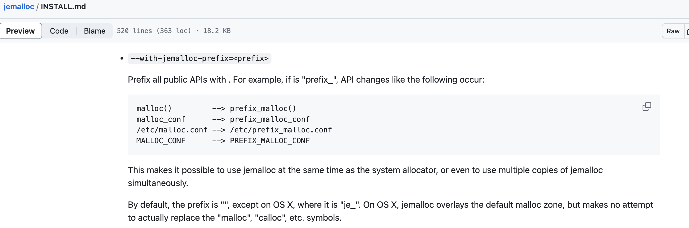

在中分析`zmalloc_get_allocator_info`函数时，主要依赖的api是`je_mallctl`，但是并没有找到这个函数的实现。

在[jemalloc的git上](https://github.com/jemalloc/jemalloc/blob/dev/INSTALL.md)我们看到如下描述：



所以，我们需要重新看一遍makefile中的规则编写，尤其是如何将jemalloc编译到项目中的。

1 根目录Makefile
---

```makefile
# 因为make的执行是从default作为入口下来的
# 因此$@指代的是all
# 也就是说要执行的shell是cd src && make all
.DEFAULT:
	cd src && $(MAKE) $@
```

2 src目录下Makefile
---

### 2.1 all

```makefile
# redis源码根目录下makefile中的cd src && make all
# MakeFile真正工作的地方
# redis-server
# redis-sentinel
# redis-cli
# redis-benchmark
# redis-check-rdb
# redis-check-aof
all: $(REDIS_SERVER_NAME) $(REDIS_SENTINEL_NAME) $(REDIS_CLI_NAME) $(REDIS_BENCHMARK_NAME) $(REDIS_CHECK_RDB_NAME) $(REDIS_CHECK_AOF_NAME)
	@echo ""
	@echo "Hint: It's a good idea to run 'make test' ;)"
	@echo ""
```

### 2.2 redis-server

以redis-server的编译为例进行分析make的整个执行流程。

```makefile
# redis-server
# 依赖.o文件
$(REDIS_SERVER_NAME): $(REDIS_SERVER_OBJ)
	$(REDIS_LD) -o $@ $^ ../deps/hiredis/libhiredis.a ../deps/lua/src/liblua.a $(FINAL_LIBS)
```

### 2.3 .o汇编

```makefile
# 依赖.make-prerequisites 对依赖的库进行处理 包括jemalloc
%.o: %.c .make-prerequisites
	# .c文件编译成.o文件
	# gcc -MMD -o x.o -c x.c
	$(REDIS_CC) -MMD -o $@ -c $<
```

### 2.4 .make=prerequisites

```makefile
# Prerequisites target
.make-prerequisites:
	# 创建.make-prerequisites文件
	touch $@

# Clean everything, persist settings and build dependencies if anything changed
# strip函数将字符串中空格去掉
# 这个if相当于嵌套在.make-prerequisites中
# 首次编译肯定会触发persist-settings执行
ifneq ($(strip $(PREV_FINAL_CFLAGS)), $(strip $(FINAL_CFLAGS)))
.make-prerequisites: persist-settings
endif

# 这个if相当于嵌套在.make-prerequisites中
# 首次编译肯定会触发persist-settings执行
ifneq ($(strip $(PREV_FINAL_LDFLAGS)), $(strip $(FINAL_LDFLAGS)))
.make-prerequisites: persist-settings
endif
```

### 2.5 presist-settings

```makefile
persist-settings: distclean
	echo STD=$(STD) >> .make-settings
	echo WARN=$(WARN) >> .make-settings
	echo OPT=$(OPT) >> .make-settings
	echo MALLOC=$(MALLOC) >> .make-settings
	echo BUILD_TLS=$(BUILD_TLS) >> .make-settings
	echo USE_SYSTEMD=$(USE_SYSTEMD) >> .make-settings
	echo CFLAGS=$(CFLAGS) >> .make-settings
	echo LDFLAGS=$(LDFLAGS) >> .make-settings
	echo REDIS_CFLAGS=$(REDIS_CFLAGS) >> .make-settings
	echo REDIS_LDFLAGS=$(REDIS_LDFLAGS) >> .make-settings
	echo PREV_FINAL_CFLAGS=$(FINAL_CFLAGS) >> .make-settings
	echo PREV_FINAL_LDFLAGS=$(FINAL_LDFLAGS) >> .make-settings
	# cd ../deps && make hiredis
	# cd ../deps && make linenoise
	# cd ../deps && make lua
	# cd ../deps && make jdr_histogram
	# cd ../deps && make jemalloc 编译jemalloc项目
	-(cd ../deps && $(MAKE) $(DEPENDENCY_TARGETS))
```

重要的是最后一句`-(cd ../deps && $(MAKE) $(DEPENDENCY_TARGETS))`，即关注`../deps/Makefile`即可。

3 deps目录下Makefile
---

```makefile
jemalloc: .make-prerequisites
	@printf '%b %b\n' $(MAKECOLOR)MAKE$(ENDCOLOR) $(BINCOLOR)$@$(ENDCOLOR)
	# --with-jemalloc-prefix=je_
	# configure生成makefile
	cd jemalloc && ./configure --with-version=5.1.0-0-g0 --with-lg-quantum=3 --with-jemalloc-prefix=je_ CFLAGS="$(JEMALLOC_CFLAGS)" LDFLAGS="$(JEMALLOC_LDFLAGS)"
	# 执行make
	cd jemalloc && $(MAKE) CFLAGS="$(JEMALLOC_CFLAGS)" LDFLAGS="$(JEMALLOC_LDFLAGS)" lib/libjemalloc.a
```

至此，结合jemalloc的文档说明，jemalloc为了避免`malloc`系列函数的同名混淆，在`configure`生成makefile时候指定`--with-jemalloc-prefix=je_`，那么编译出来的jemallc系列函数都会变成形如`je_malloc`这样。