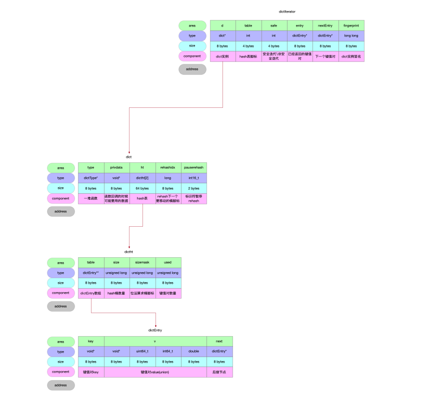
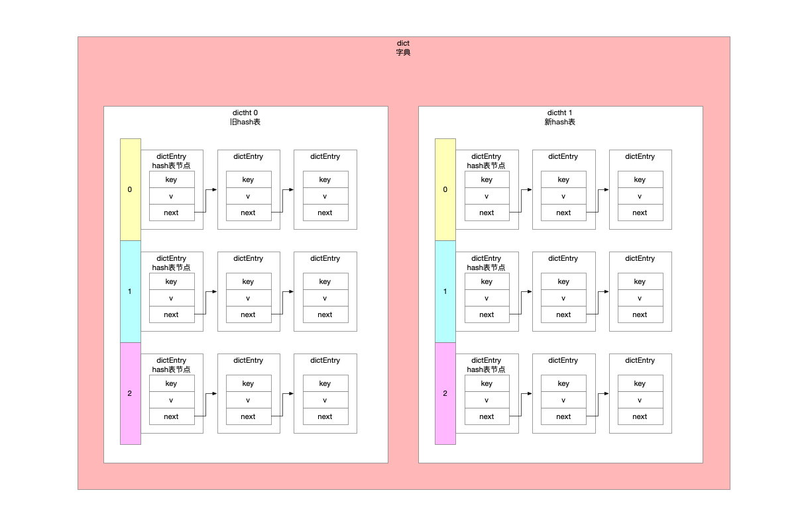

首先我认为数据结构是算法的附着点，数据结构又是对内存布局的描述，一切的行为方法都是围绕内存布局展开的，所以学习数据结构最重要的就是搞清楚内存布局。

其次，数据结构的目的一定是为了解决数据的存取问题，但是为了实现高效的存取操作，一定会为此搭建纷繁复杂的基建。其核心一定是get和put，所以在搞明白数据结构的内存布局之后，我一般只关注数据是怎么存进去的和怎么取出来的。

1 内存布局
---

### 1.1 布局

dict的底层结构是数组+链表的组织形式，链表中每个脚标处称为hash桶，每个hash桶上放置一条单链表，并且该单链表是通过头插法解决的hash冲突。



### 1.2 键值对



```c
// hash表中的键值对 在单链表中的节点
typedef struct dictEntry {
    void *key; // 键值对的key
	/**
	 * 这个键值对的值设计成union很巧妙
	 * <ul>
	 *   <li>从数据类型的角度来讲这样的设计丰富了redis的dict支持的值的类型
	 *     <ul>
	 *       <li>既支持指针类型的数据</li>
	 *       <li>又支持非指针类型的数据
	 *         <ul>
	 *           <li>unsigned 64位</li>
	 *           <li>signed 64位</li>
	 *           <li>double</li>
	 *         </ul>
	 *       </li>
	 *     </ul>
	 *   </li>
	 *   <li>从内存占用角度来说 普遍64位系统 指针类型占8byte 上述非指针类型都是64位也是8byte 空间占用是一样的</li>
	 * </ul>
	 * 那为什么要支持值是非指针类型的呢
	 * 我的猜想是为了减少以后使用过程中的解引用操作(尤其是频繁地get数字加减乘除之后再set回去)
	 * 但是因为v的类型是union的 就注定代码复杂度立马倍数级上来 需要对u64 s64和double的3种类型单独定义get和set实现
	 * <ul>源码通过dictSetVal宏定义解决value类型赋值指针类型的数据
	 *   <li>涉及深拷贝时候 客户端定义valDup的实现 value拷贝的时候回调</li>
	 *   <li>浅拷贝的时候直接赋值即可</li>
	 * </ul>
	 * 至于数字类型的成员u64 s64或者d就需要客户端根据需要分别调用
	 * <ul>
	 *   <li>dictSetSignedIntegerVal</li>
	 *   <li>dictSetUnsignedIntegerVal</li>
	 *   <li>dictSetDoubleVal</li>
	 * </ul>
	 */
	// TODO: 2023/12/13 为什么不直接设计成void* 而要考虑数字
    union {
        void *val;
        uint64_t u64;
        int64_t s64;
        double d;
    } v; // 键值对的value
	// 后驱节点
    struct dictEntry *next;
} dictEntry;
```

在hash桶中存放的键值对，在dict中数据的最小粒度就是dictEntry。

2 存数据
---

假设我现在要往dict中添加一个键值对，涉及的流程如下

- 计算key的hash值是多少
- hash值在数组上的脚标
- 初始化一个键值对实例
- 此时hash桶已经被占了就说明发生了hash冲突，头插到链表

### 2.1 dictAdd

```c
/**
 * 往dict中添加键值对
 * @return 操作状态码
 *         <ul>
 *           <li>0 标识添加成功</li>
 *           <li>1 标识添加失败</li>
 *         </ul>
 */
int dictAdd(dict *d, void *key, void *val)
{
	/**
	 * 添加键值对节点
	 * 可能会失败
	 * <ul>
	 *   <li>dict不允许重复key</li>
	 *   <li>触发扩容 扩容失败</li>
	 * </ul>
	 */
    dictEntry *entry = dictAddRaw(d,key,NULL);

    if (!entry) return DICT_ERR;
	/**
	 * 这个地方就开始体现怎么应对多类型的value赋值问题了
	 * <ul>键值对的value可以是
	 *   <li>指针类型</li>
	 *   <li>无符号整数</li>
	 *   <li>有符号整数</li>
	 *   <li>浮点数</li>
	 * </ul>
	 * 调用这个宏来应付不同的选择
	 * 根据用户的valDup函数来处理value的赋值
	 * <ul>
	 *   <li>给定了valDup 就用这个函数处理指针类型的数据</li>
	 *   <li>其他的数据类型是值类型的</li>
	 * </ul>
	 */
    dictSetVal(d, entry, val);
    return DICT_OK;
}
```

### 2.2 dictAddRaw

```c
/**
 * 这个函数存在的必要性是什么 也就是说为什么要同时提供dictAdd和dictAddRaw这两个API
 * 我的理解还是因为键值对v类型设计union衍生出来的特性支持
 * 因为想要键值对存储的类型丰富->将v的类型设计为union->因为v是union的意味着redis源码无法明确知晓用户到底想要把value设置成什么类型->因此在dictAdd基础指向额外提供这个方法给用户提供自定义设置value类型的入口
 * 调用方在此基础上自己关注value怎么设置
 * @param existing hash表不存在重复key key已经存在了就无法新增 用于存放重复的key
 *                 至于为什么设计成dictEntry**类型的指针变量 因为键值对存储在hash表中的形式是数组+链表 每个链表节点的类型都是dictEntry*
 *                 那么用户交互键值对节点最直接的类型就是dictEntry*
 *                 所以这个地方existing类型相当于对dictEntry*的一个变量再取址一次 就是dictEntry**
 * @return         写入失败就返回NULL
 *                 写入成功就返回新增的键值对节点
 */
dictEntry *dictAddRaw(dict *d, void *key, dictEntry **existing)
{
    // key在hash表的脚标位置
    long index;
    dictEntry *entry;
	// dict可能有1个表 可能有2个表 表示数据往哪个表上写
    dictht *ht;
    // 字典当前正在rehash 当前线程协助迁移一个桶
    if (dictIsRehashing(d)) _dictRehashStep(d);

    /* Get the index of the new element, or -1 if
     * the element already exists. */
	/**
	 * index -1表示key在dict中hash表数组脚标计算不出来
	 * <ul>
	 *   <li>key已经存在了 把存在的key返回出去 dict不允许重复key 调用方就去更新value值就完成了add新键值对的语义</li>
	 *   <li>诸如扩容失败导致计算不出来key落在数组的位置</li>
	 * </ul>
	 */
    if ((index = _dictKeyIndex(d, key, dictHashKey(d,key), existing)) == -1)
        return NULL;

    /* Allocate the memory and store the new entry.
     * Insert the element in top, with the assumption that in a database
     * system it is more likely that recently added entries are accessed
     * more frequently. */
	/**
	 * 数据往哪儿写
	 * <ul>
	 *   <li>dict可能只有1个hash表</li>
	 *   <li>可能有2个hash表</li>
	 * </ul>
	 * 取决于当前dict的状态 在rehash中就有2个表
	 * 既然在rehash 就是处在把[0]号表元素往[1]号表迁移的过程中
	 * 所以新增的数据就不要往[0]号表写了 然后再迁移
	 * 直接一步到位 写到[1]号表上去
	 */
    ht = dictIsRehashing(d) ? &d->ht[1] : &d->ht[0];
	// 键值对 实例化 初始化
    entry = zmalloc(sizeof(*entry));
	// 经典的单链表头插法
    entry->next = ht->table[index];
    ht->table[index] = entry;
    // 键值对计数
    ht->used++;

    /* Set the hash entry fields. */
    // 设置节点的key
    dictSetKey(d, entry, key);
    return entry;
}
```

3 hash函数
---

- hash函数的作用是啥，计算key的hash值，这个hash值的作用是在作为key在数组hash桶位置的依据。
- 一个好的hash函数设计是为了尽可能减少hash碰撞，尽可能平衡键值对在数组上的分布，平衡空间和时间复杂度。
- 再者，只知道key的地址，dict本身是没办法对hash函数一概而论的，因此hash函数属于dict的基础设施，有用户定义好告诉dict，因为dict看到的仅仅是key的地址，用户是知道key的数据类型的。

### 3.1 用户指定key的hash函数

```c
/**
 * dict实例成员初始化
 */
int _dictInit(dict *d, dictType *type,
        void *privDataPtr)
{
    /**
     * UDT成员初始化
     * <ul>
     *   <li>初始化2张空的hash表</li>
     *   <li>多态函数接口</li>
     * </ul>
     */
    _dictReset(&d->ht[0]);
    _dictReset(&d->ht[1]);
	/**
	 * 多态函数
	 * 从dict视角看到的key是地址 value大概率也是地址(也有可能是整数)
	 * 因此只能期待用户指定好关于key和value的所有操作函数定义
	 * <ul>
	 *   <li>key的hash函数</li>
	 *   <li>key的复制/比较/回收</li>
	 *   <li>value的复制/回收</li>
	 * </ul>
	 */
    d->type = type;
    d->privdata = privDataPtr;
	/**
	 * rehash状态初始化 -1标识没进行rehash
	 */
    d->rehashidx = -1;

	/**
	 * rehash暂停状态初始化 0标识初始状态
	 */
    d->pauserehash = 0;
    return DICT_OK;
}
```

### 3.2 计算hash值

```c
#define dictHashKey(d, key) (d)->type->hashFunction(key)
```

4 扩容
---

假使持续往dict中添加键值对，随着存储的膨胀，意味着平均情况下每个hash桶里面的链表都有可能无限增长，而链表的检索时间复杂度是O(N)。当效率不够的时候基本会用空间换时间，所以出发扩容，水平方向的扩容重新打散链表从而减少链表的长度。

因此，跟扩容有关值的关注的点为

- 扩容时机，什么样的数据规模应该扩容，用什么指标衡量数据规模
- 怎么扩容
- 扩容之后当前的键值对怎么处理

### 4.1 扩容时机

```c
/**
 * 考察dict是否需要扩容 如果有扩容需求就触发扩容
 * @return <ul>
 *           <li>0标识需要扩容并且扩容成功</li>
 *           <li>1标识不需要扩容或者扩容失败
 *             <ul>
 *               <li>可能因为不需要扩容</li>
 *               <li>可能是需要扩容但是扩容失败了(申请新内存OOM)</li>
 *             </ul>
 *           </li>
 *         </ul>
 */
static int _dictExpandIfNeeded(dict *d)
{
    /* Incremental rehashing already in progress. Return. */
	// 上一轮扩容还没结束(hash桶还没迁移完)
    if (dictIsRehashing(d)) return DICT_OK;

    /* If the hash table is empty expand it to the initial size. */
    // hash表刚初始化出来 把hash表数组初始化到4个长度
    if (d->ht[0].size == 0) return dictExpand(d, DICT_HT_INITIAL_SIZE);

    /* If we reached the 1:1 ratio, and we are allowed to resize the hash
     * table (global setting) or we should avoid it but the ratio between
     * elements/buckets is over the "safe" threshold, we resize doubling
     * the number of buckets. */
	/**
	 * 扩容时机
	 * <ul>
	 *   <li>键值对的数量已经达到了hash表数组长度 就平均而言 可以理解为最坏情况下每个hash桶都被占了</li>
	 *   <li>并且每个hash桶里面的链表长度平均超过了5</li>
	 * </ul>
	 * 核心还是因为担心最坏情况下某个或者某些链表过长导致检索的时间复杂度过高 所以用空间换时间
	 */
	// TODO: 2023/12/13 这个地方有2点没明白 在dictTypeExpandAllowed和当前这个函数中 为什么用used+1而不是直接用used 从上面的判断分支走下来 used为0的情况早已经排除了
    if (d->ht[0].used >= d->ht[0].size &&
        (dict_can_resize ||
         d->ht[0].used/d->ht[0].size > dict_force_resize_ratio) &&
        dictTypeExpandAllowed(d))
    {
	    // 扩容新的数组长度是>节点数的2的幂次方 也就为扩容基准并不是现在数组大小 而是现在节点数量 最坏情况下没有hash冲突保证容纳所有节点
        return dictExpand(d, d->ht[0].used + 1);
    }
    return DICT_OK;
}
```

### 4.2 扩容方式

满足了上面的扩容阈值，或者说达到了扩容时机，就可以进行数组扩容，那么扩容的方式是什么呢？

- 以扩容前键值对数量为基数，比这个大就行，也就是在最优情况下让hash表的结构退化成数组，加快检索的效率，降低时间复杂度
- 为了替代取模运算%，用上位运算，人为保证数组的长度是2的幂次方
- 在上面2个前提之下，将数组长度约束到最小，因为一次扩容直接过大，也会存在极大概率导致空间浪费

因此，上述3点的综合就是扩容的方式

#### 4.2.1 dictExpand

```c
/**
 * hash表扩容 本质就是数组长度的增加
 * zmalloc涉及OOM异常交由zmalloc机制处理 当前函数不单独处理OOM
 * @param size 期待将数组扩容到多长
 *             期待是一回事 实际扩容结果是另一回事 源码为了将来使用位元算计算key落在的数组的hash桶脚标 需要确保数组长度是2的幂次方
 *             因此希望数组长度是x 实际会计算得出y(y是2的幂次方 y>=2的最小值)
 * @return <ul>请求操作状态
 *           <li>0 标识扩容成功</li>
 *           <li>非0 标识扩容失败</li>
 *         </ul>
 */
int dictExpand(dict *d, unsigned long size) {
    return _dictExpand(d, size, NULL);
}
```

#### 4.2.2 _dictExpand

```c
/**
 * @param size          hash表数组期待扩容到多长
 * @param malloc_failed zmalloc的OOM异常标识
 *                      <ul>
 *                        <li>没有传入指针变量 说明调用方肯定不关注OOM的异常</li>
 *                        <li>传入了指针变量 说明调用方可能关注OOM异常 调用方可能想自行处理OOM</li>
 *                      </ul>
 * @return              <ul>请求操作状态
 *                        <li>0 标识扩容成功</li>
 *                        <li>非0 标识扩容失败</li>
 *                      </ul>
 */
int _dictExpand(dict *d, unsigned long size, int* malloc_failed)
{
    /**
     * 取决于调用方是否要自行处理zmalloc的OOM
     * 初始化内存 防止污染
     */
    if (malloc_failed) *malloc_failed = 0;

    /* the size is invalid if it is smaller than the number of
     * elements already inside the hash table */
	/**
	 * 扩容前置校验
	 * <ul>
	 *   <li>首先dict要是已经在rehash中了 上一次的hash桶还没迁移完 就不能再触发扩容</li>
	 *   <li>其次 要检验期待扩容的大小是否合理 扩容是因为当前数组的容量使用达到了某一阈值 也就是扩容时机问题 dict中hash表的数据结构是数组+链表 极致情况下 如果用空间换时间 没有出现hash冲突的时候 hash表退化成数组 那么数组的最小长度就是键值对数量
	 *       那么一次扩容被触发 最优的扩容后长度=min(比size大的最小的2的幂次方, >=键值对数量)
	 *   </li>
	 * </ul>
	 * 扩容时机是发生在dictAdd中考察键值对数量是否过多 键值对数量/数组长度>5
	 */
    if (dictIsRehashing(d) || d->ht[0].used > size)
        return DICT_ERR;

	// 扩容之后的新表
    dictht n; /* the new hash table */
    // 保证扩容后数组长度是2的幂次方 这样就可以通过位运算计算key的hash桶脚标=hash&(len-1)
    unsigned long realsize = _dictNextPower(size);

    /* Detect overflows */
	/**
	 * 经典的溢出检查
	 * <ul>
	 *   <li>其一要校验的是上面函数2倍计算出来的结果有没有溢出 也就是realsize<size的作用</li>
	 *   <li>其二是防御性的校验 因为平台上实际申请内存malloc系列的参数类型是sizet 本质也是unsigned long类型
	 *       此时已经数组长度realsize 数组元素大小是sizeof(dictEntry*) 那么要给这个数组分配的空间(byte)就是二者乘积
	 *       这个内存容量的表达是否溢出前置到这个地方校验一下
	 *   </li>
	 * </ul>
	 */
    if (realsize < size || realsize * sizeof(dictEntry*) < realsize)
        return DICT_ERR;

    /* Rehashing to the same table size is not useful. */
	// 依然是校验
    if (realsize == d->ht[0].size) return DICT_ERR;

    /* Allocate the new hash table and initialize all pointers to NULL */
    // 初始化hash表成员
    n.size = realsize;
    n.sizemask = realsize-1;
	// 根据实参设定 决定处理OOM的时机
    if (malloc_failed) {
	    // 太try了
        n.table = ztrycalloc(realsize*sizeof(dictEntry*));
        *malloc_failed = n.table == NULL;
        if (*malloc_failed)
            return DICT_ERR;
    } else
        n.table = zcalloc(realsize*sizeof(dictEntry*));

    n.used = 0;

    /* Is this the first initialization? If so it's not really a rehashing
     * we just set the first hash table so that it can accept keys. */
	/**
	 * 扩容的函数暴露给了外面 那么触发扩容的时机就起码有2处
	 * <ul>
	 *   <li>dict实例化之后还没put数据 就手动主动进行expand</li>
	 *   <li>dict在put过程中触发了数组长度使用阈值 被动触发扩容</li>
	 * </ul>
	 * dict刚实例化完 直接把新表给[0]号就行
	 */
    if (d->ht[0].table == NULL) {
        d->ht[0] = n;
        return DICT_OK;
    }

    /* Prepare a second hash table for incremental rehashing */
	/**
	 * 因为hash表数组长度使用触发了扩容阈值
	 * 新表给到[1]号表
	 * 标记rehash标识
	 */
    d->ht[1] = n;
    d->rehashidx = 0;
    return DICT_OK;
}
```

### 4.3 重哈希方式

将hash数组增加容量仅仅是扩容的开始，因为扩容一定意味着键值对对数组容量的使用率达到了阈值，因此后续的工作是将所有已存的键值对迁移到新的数组上。

那么，这时候就有两个策略

- 扩容过程一气呵成，hash表实例只有1个
- 依然是空间换时间的方式，维护2张hash表，将键值对的迁移动作后置，分散到之后的工作线程上

#### 4.3.1 迁移消耗分散到每个工作线程

几乎就是每个前台工作线程都会先考察一下dict是不是要rehash，然后分担一点迁移工作。

```c
    // 字典当前正在rehash 当前线程协助迁移一个桶
    if (dictIsRehashing(d)) _dictRehashStep(d);
```

#### 4.3.2 迁移

```c
/**
 * 渐进式rehash实现
 * @param n 目标帮助迁移n个hash桶
 *          所谓目标是迁移n个hash桶 实际上前的数量<=n的 因为中间涉及到性能保护的设计可以让线程提前退出rehash流程
 * @return  返回值为0或者1
 *          <ul>
 *            <li>0 标识dict的rehash已经完成 现在有且只有1个hash表 不再需要线程进来帮助迁移hash桶了</li>
 *            <li>1 标识dict的hash表还有hash桶要迁移</li>
 *          </ul>
 */
int dictRehash(dict *d, int n) {
	/**
	 * 数据质量的防御
	 * <ul>
	 *   <li>迁移1个桶的时候不存在这个担忧</li>
	 *   <li>迁移n(n>1)个桶的时候 假使n个桶两两之间分布在hash表数组很离散的位置 即数组元素之间脚标间隔很远 就意味着当前线程遍历数组脚标可能数量很大 会耗时 对于当前线程而言 协助迁移hash桶只是分外之事 不是主线任务 所以要平衡迁移hash桶的时间</li>
	 * </ul>
	 * 鉴于这样的考量 就要给hash表数组的轮询设定阈值
	 */
    int empty_visits = n*10; /* Max number of empty buckets to visit. */
	// rehash状态校验
    if (!dictIsRehashing(d)) return 0;

	/**
	 * 当前线程rehash任务的停止边界
	 * <ul>
	 *   <li>迁移目标n个桶</li>
	 *   <li>轮询的hash表脚标数量统计上限</li>
	 *   <li>dict的[0]号表迁移结束</li>
	 * </ul>
	 */
    while(n-- && d->ht[0].used != 0) {
	    /**
	     * <ul>
	     *   <li>de记录hash表数组中存放的单链表</li>
	     *   <li>nextde记录单链表头</li>
	     * </ul>
	     */
        dictEntry *de, *nextde;

        /* Note that rehashidx can't overflow as we are sure there are more
         * elements because ht[0].used != 0 */
		/**
		 * 防止数组脚标溢出
		 * rehashidx是标识的要迁移的hash桶 也就是数组脚标指向的数组元素 将来要通过arr[rehashidx]方式来获取数组元素的 防止溢出
		 */
        assert(d->ht[0].size > (unsigned long)d->rehashidx);
		/**
		 * <ul>
		 *   <li>一方面 跳过hash表数组中的空桶</li>
		 *   <li>另一方面 统计总共遍历了多少个桶 考察是不是达到了遍历上限</li>
		 * </ul>
		 */
        while(d->ht[0].table[d->rehashidx] == NULL) {
            d->rehashidx++;
            if (--empty_visits == 0) return 1;
        }
        /**
         * 不是空桶
         * 准备把整条单链表迁移走 轮询单链表所有节点 依次迁移走
         */
        de = d->ht[0].table[d->rehashidx];
        /* Move all the keys in this bucket from the old to the new hash HT */
        // de指向hash桶的链表头 遍历链表将节点逐个迁移到新表上
        while(de) {
            uint64_t h;

            nextde = de->next;
            /* Get the index in the new hash table */
            // key在新表的hash桶位置
            h = dictHashKey(d, de->key) & d->ht[1].sizemask; // hash表长度是2的幂次方 通过位运算计算key的hash桶脚标
            // 单链表头插法
            de->next = d->ht[1].table[h];
            d->ht[1].table[h] = de;
            d->ht[0].used--; // 旧表上每迁移走一个键值对 就更新计数
            d->ht[1].used++; // 新表上每迁过来一个键值对 就更新计数
            de = nextde;
        }
        d->ht[0].table[d->rehashidx] = NULL; // 一个桶上单链表所有节点都迁移完了
        d->rehashidx++; // 一个桶迁移结束后 下一次迁移的脚标位置
    }

    /* Check if we already rehashed the whole table... */
    // rehash任务完成后判定一下hash表是否都迁移完成了
    // 迁移完成了就回收老表 把表1指向新表
    if (d->ht[0].used == 0) {
        zfree(d->ht[0].table);
        d->ht[0] = d->ht[1];
        _dictReset(&d->ht[1]);
        d->rehashidx = -1;
        return 0;
    }

    /* More to rehash... */
    return 1;
}
```

5 取数据
---

根据key查询value，思路就是

- 计算key的hash值
- hash值定位到数组脚标
- 找到hash桶里面的链表
- 遍历链表比较key

```c
/**
 * 查找key
 */
dictEntry *dictFind(dict *d, const void *key)
{
    dictEntry *he;
    uint64_t h, idx, table;

    // 字典为空 没有键值对
    if (dictSize(d) == 0) return NULL; /* dict is empty */
    // 字典正在rehash状态 协助迁移1个hash桶
    if (dictIsRehashing(d)) _dictRehashStep(d);
    // key的hash值
    h = dictHashKey(d, key);
    for (table = 0; table <= 1; table++) {
        idx = h & d->ht[table].sizemask;
        he = d->ht[table].table[idx];
        while(he) {
		    // 找到了key
            if (key==he->key || dictCompareKeys(d, key, he->key))
                return he;
            he = he->next;
        }
        if (!dictIsRehashing(d)) return NULL;
    }
    return NULL;
}
```