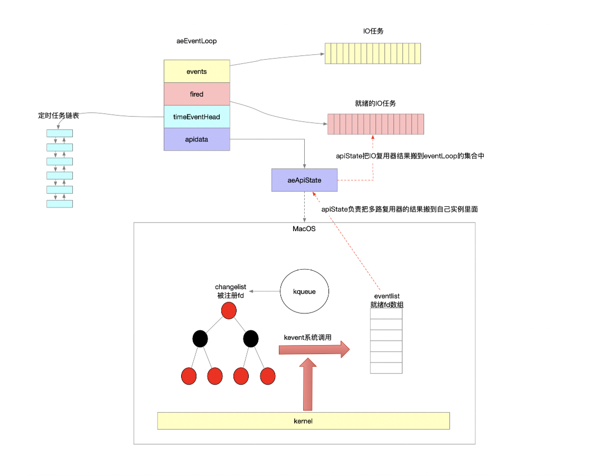

多路复用器应该是整个框架中的核心，在很多网络框架中都是起着一个重要的衔接作用

- 一方面通过库函数的实现提供高效的网络服务

- 另一方面借助回调时机作为锚点整合业务任务

- 形成一个整体的EDA系统

因此框架会对多路复用器进行一次封装，借助系统多路复用器的回调时机王成

- 网络socket的业务处理

- 非socket的业务处理

通过多路复用器推进系统的循环往复的工作，因此一般这样的抽象封装成为事件循环器

### 1 创建事件循环器

```c
/**
 * 创建事件循环管理器
 * @param setsize 指定事件循环管理器的容量
 * @return 事件循环管理器
 */
aeEventLoop *aeCreateEventLoop(int setsize) {
    aeEventLoop *eventLoop;
    int i;

    monotonicInit();    /* just in case the calling app didn't initialize */

	// 内存开辟
    if ((eventLoop = zmalloc(sizeof(*eventLoop))) == NULL) goto err;
	// 数组内存开辟 用来存放需要注册到多路复用器的事件
    eventLoop->events = zmalloc(sizeof(aeFileEvent)*setsize);
	// 数组内存开辟 用来存放从多路复用器返回的就绪事件集合
    eventLoop->fired = zmalloc(sizeof(aeFiredEvent)*setsize);
    if (eventLoop->events == NULL || eventLoop->fired == NULL) goto err;
	// 事件循环管理器容量
    eventLoop->setsize = setsize;
    eventLoop->timeEventHead = NULL;
    eventLoop->timeEventNextId = 0;
    eventLoop->stop = 0;
    eventLoop->maxfd = -1;
    eventLoop->beforesleep = NULL;
    eventLoop->aftersleep = NULL;
    eventLoop->flags = 0;
	/**
	 * 创建系统的多路复用器实例
	 * 系统平台有差异 每个系统的多路复用器实现有差异 这样就可以屏蔽对用户的实现差异
	 */
    if (aeApiCreate(eventLoop) == -1) goto err; // 我是很喜欢goto关键字的 新语言go中也使用了这个关键字 很难理解Java中竟然没有这个机制
    /* Events with mask == AE_NONE are not set. So let's initialize the
     * vector with it. */
	/**
	 * malloc分配的内存未初始化
	 * 防止以后引起状态误判 这个地方进行事件状态初始化
	 */
    for (i = 0; i < setsize; i++)
        eventLoop->events[i].mask = AE_NONE;
    return eventLoop;

err:
    if (eventLoop) {
        zfree(eventLoop->events);
        zfree(eventLoop->fired);
        zfree(eventLoop);
    }
    return NULL;
}
```

### 2 注册IO任务

```c
/**
 * 将fd以及对fd关注的IO事件类型封装IO任务 添加到事件管理器中
 * @param mask 要监听fd的什么类型IO事件 可读还是可写
 *             <ul>
 *               <li>1 监听可读事件</li>
 *               <li>2 监听可写事件</li>
 *             </ul>
 * @param proc 处理器 将来借助多路复用器发现fd事件状态就绪时可以找个合适的时机进行回调
 * @param clientData 回调的时候可能需要处理一些数据 将数据维护在eventLoop中供将来使用
 * @return 状态码
 *         <ul>
 *           <li>-1 标识失败</li>
 *           <li>0 标识成功</li>
 *         </ul>
 */
int aeCreateFileEvent(aeEventLoop *eventLoop, int fd, int mask,
        aeFileProc *proc, void *clientData)
{
    // 边界校验 fd要当作events数组的脚标使用 不能越界
    if (fd >= eventLoop->setsize) {
        errno = ERANGE;
        return AE_ERR;
    }
    // fd就是脚标索引 在未就绪数组中找到对应位置 完成初始化
    aeFileEvent *fe = &eventLoop->events[fd];

	/**
     * 将fd注册到多路复用器上 指定监听fd的事件类型
     * <ul>
     *   <li>1 监听可读事件</li>
     *   <li>2 监听可写事件</li>
     * </ul>
	 */
    if (aeApiAddEvent(eventLoop, fd, mask) == -1)
        return AE_ERR;
    // 记录fd关注的事件类型
    fe->mask |= mask;
    // fd可读可写时指定回调的处理器
    if (mask & AE_READABLE) fe->rfileProc = proc;
    if (mask & AE_WRITABLE) fe->wfileProc = proc;
    /**
     * 给回调函数使用
     */
    fe->clientData = clientData;
    if (fd > eventLoop->maxfd)
        eventLoop->maxfd = fd;
    return AE_OK;
}
```

### 3 注册定时任务

```c
/**
 * 注册一个定时任务到eventLoop中
 * @param milliseconds 期望定时任务在多久之后被调度执行 毫秒
 * @param proc 事件处理器 定义了定时任务被调度起来之后如何执行 回调函数
 * @param clientData 回调函数执行的时候可能需要一些数据 可以通过这样的方式传递
 * @param finalizerProc 定时任务的的析构处理器 用于回收资源
 * @return 事件的id -1标识失败
 */
long long aeCreateTimeEvent(aeEventLoop *eventLoop, long long milliseconds,
        aeTimeProc *proc, void *clientData,
        aeEventFinalizerProc *finalizerProc)
{
    // 给定时任务分配id
    long long id = eventLoop->timeEventNextId++;
    aeTimeEvent *te;

    te = zmalloc(sizeof(*te));
    if (te == NULL) return AE_ERR;
    // 定时任务的id
    te->id = id;
    // 记录定时任务理论应该被调度执行的时间
    te->when = getMonotonicUs() + milliseconds * 1000;
    // 定时任务处理器
    te->timeProc = proc;
    // 定时任务的析构处理器
    te->finalizerProc = finalizerProc;
    // 回到函数执行的时候可能需要一些数据
    te->clientData = clientData;
    te->prev = NULL;
    /**
     * 定时任务头插到timeEventHead双链表上
     * 由此可见redis对于定时任务的管理很简单
     * 将来采用的查找策略也只能是轮询
     * 变向说明redis中管理的定时任务基数很小
     */
    te->next = eventLoop->timeEventHead;
    te->refcount = 0;
    if (te->next)
        te->next->prev = te;
    eventLoop->timeEventHead = te;
    return id;
}
```

### 4 调度定时任务

```c
/**
 * 调度定时任务的执行
 * <ul>
 *   <li>执行物理删除定时任务的时机</li>
 *   <li>调度可以执行的定时任务<ul>
 *     <li>一次性定时任务执行完打上逻辑删除标识</li>
 *     <li>周期性定时任务执行完更新下一次调度时机</li>
 *   </ul>
 *   </li>
 * </ul>
 * @return 在这一轮处理中调度起来的定时任务数量
 */
static int processTimeEvents(aeEventLoop *eventLoop) {
    // 统计调度了多少个定时任务执行
    int processed = 0;
    aeTimeEvent *te;
    long long maxId;

    // 链表
    te = eventLoop->timeEventHead;
	/**
	 * 当前定时任务的最大id
	 * 在遍历链表的时候发现链表节点上挂着的定时任务id大于了maxId 就说明这个节点是在轮询动作之后新增的
	 * maxId相当于在链表轮询之前给链表数据状况打了个快照
	 * 这种场景是不可能发生的 因为链表的挂载方式是头插法 即使有新增的链表节点加进来 也是加在了头节点之前 不可能遇到
	 */
    maxId = eventLoop->timeEventNextId-1;
    monotime now = getMonotonicUs();
    while(te) {
        long long id;

        /* Remove events scheduled for deletion. */
		/**
		 * 惰性删除的体现
		 * 当初提供删除定时任务的api并没有执行物理删除 仅仅是把id打成了-1标识 逻辑删除
		 * 现在这个场景遍历使用定时任务 发现id为-1的判定为删除状态的节点 进行真正的删除判定
		 */
        if (te->id == AE_DELETED_EVENT_ID) {
            aeTimeEvent *next = te->next;
            /* If a reference exists for this timer event,
             * don't free it. This is currently incremented
             * for recursive timerProc calls */
			/**
			 * 这个引用计数是该定时任务正在被调度执行的次数 也就是定时任务还在运行中 不能删除
			 * 继续把删除动作延迟 放到以后的某个时机再去删除
			 */
            if (te->refcount) {
                te = next;
                continue;
            }
            // 经典的从双链表上删除某个节点 删除te节点
            if (te->prev)
                te->prev->next = te->next;
            else
                eventLoop->timeEventHead = te->next;
            if (te->next)
                te->next->prev = te->prev;
			// 准备回收te 执行回调 定制化处理析构逻辑
            if (te->finalizerProc) {
                te->finalizerProc(eventLoop, te->clientData);
                now = getMonotonicUs();
            }
            zfree(te);
            te = next;
            continue;
        }

        /* Make sure we don't process time events created by time events in
         * this iteration. Note that this check is currently useless: we always
         * add new timers on the head, however if we change the implementation
         * detail, this check may be useful again: we keep it here for future
         * defense. */
		/**
		 * 对于正常的定时任务 就是那些id!=-1的
		 * 在遍历这个链表之前已经给id的上限打了个快照maxId 也就是说在遍历过程中不可能遇到某个节点的id是>maxId的
		 * 这个地方单纯低防御性编程
		 */
        if (te->id > maxId) {
            te = te->next;
            continue;
        }

		/**
		 * 找到可以被调度的定时任务
		 */
        if (te->when <= now) {
            int retval;

            id = te->id;
			// 标识定时任务正在执行中 事件被调度执行的次数
            te->refcount++;
			/**
			 * 回调函数 调度执行定时任务
			 * 执行完毕之后根据回调函数的返回值界定该定时任务是不是周期性定时任务
			 * <ul>
			 *   <li>-1 标识一次性事件</li>
			 *   <li></li>
			 * </ul>
			 */
            retval = te->timeProc(eventLoop, id, te->clientData);
			// 释放计数 让将来的物理删除事件得以正常进行下去
            te->refcount--;
			// 更新调度计数
            processed++;
            now = getMonotonicUs();
			/**
			 * 周期性定时任务要更新下一次调度时机
			 * 回调函数的返回值语义是retval秒后
			 */
            if (retval != AE_NOMORE) {
                te->when = now + retval * 1000;
            } else {
			    // 一次性定时任务执行完毕后打上逻辑删除标识 等着下一次执行物理删除的时机
                te->id = AE_DELETED_EVENT_ID;
            }
        }
        te = te->next;
    }
    return processed;
}
```

### 5 调度执行

```c
 /**
  * 调度任务
  * <ul>既包含(网络)IO任务也包含定时任务
  *   <li>IO事件托管给系统多路复用器</li>
  *   <li>定时任务自己维护调度策略</li>
  * </ul>
  * @param flags 调度策略 看位信息
  *              <ul>
  *                <li>1 调度IO任务</li>
  *                <li>2 调度定时任务</li>
  *                <li>3 调度IO任务和定时任务</li>
  *                <li>4 非阻塞式调用多路复用器</li>
  *                <li>8 在多路复用器阻塞前执行回调</li>
  *                <li>16 在多路复用器阻塞唤醒后执行回调</li>
  *              </ul>
  * @return 总共调度了多少个任务
  *         <ul>
  *           <li>IO任务</li>
  *           <li>定时任务</li>
  *         </ul>
  */
int aeProcessEvents(aeEventLoop *eventLoop, int flags)
{
    int processed = 0, numevents;

    /* Nothing to do? return ASAP */
    /**
     * 事件管理器eventLoop中只管理有2种类型的任务
     * <ul>
     *   <li>IO任务</li>
     *   <li>定时任务 又分为一次性定时任务和周期性定时任务</li>
     * </ul>
     * 参数校验需要调度IO任务还是定时任务
     */
    if (!(flags & AE_TIME_EVENTS) && !(flags & AE_FILE_EVENTS)) return 0;

    /* Note that we want to call select() even if there are no
     * file events to process as long as we want to process time
     * events, in order to sleep until the next time event is ready
     * to fire. */
	/**
	 * 这个条件判断是什么意思
	 * <ul>
	 *   <li>IO任务的maxfd!=-1意味着eventLoop管理者IO任务</li>
	 *   <li>调度策略指定<ul>
	 *     <li>需要调度定时任务</li>
	 *     <li>需要利用多路复用器的超时阻塞机制</li></ul>
	 *   </li>
	 * </ul>
	 * 也就是说多路复用器的机制和能力被用于
	 * <ul>
	 *   <li>注册IO事件到系统多路复用器上 多路复用器管理和告知用户就绪事件</li>
	 *   <li>利用多路复用器的超时阻塞机制实现精准定时功能</li>
	 * </ul>
	 * 这个if判断就是看看是不是需要使用多路复用器
	 */
    if (eventLoop->maxfd != -1 ||
        ((flags & AE_TIME_EVENTS) && !(flags & AE_DONT_WAIT))) {
        int j;
        struct timeval tv, *tvp;
        int64_t usUntilTimer = -1;

		/**
		 * 调度策略
		 * <ul>
		 *   <li>需要调度IO任务</li>
		 *   <li>需要多路复用器的超时阻塞功能</li>
		 * </ul>
		 * 计算出最近一次的定时任务需要被调度的时机 最大化执行效率
		 * 最坏的情况就是 多路复用器没有就绪的事件 一直到超时时间才从阻塞中唤醒 然后这个时机无缝衔接开始调度普通任务
		 */
        if (flags & AE_TIME_EVENTS && !(flags & AE_DONT_WAIT))
            usUntilTimer = usUntilEarliestTimer(eventLoop);

        if (usUntilTimer >= 0) {
            tv.tv_sec = usUntilTimer / 1000000;
            tv.tv_usec = usUntilTimer % 1000000;
            tvp = &tv;
        } else {
            /* If we have to check for events but need to return
             * ASAP because of AE_DONT_WAIT we need to set the timeout
             * to zero */
            if (flags & AE_DONT_WAIT) {
                tv.tv_sec = tv.tv_usec = 0;
                tvp = &tv;
            } else {
                /* Otherwise we can block */
                tvp = NULL; /* wait forever */
            }
        }
		// 多路复用器poll的timeout是0
        if (eventLoop->flags & AE_DONT_WAIT) {
            tv.tv_sec = tv.tv_usec = 0;
            tvp = &tv;
        }

		// 多路复用器poll调用之前 执行回调的时机
        if (eventLoop->beforesleep != NULL && flags & AE_CALL_BEFORE_SLEEP)
            eventLoop->beforesleep(eventLoop);

        /* Call the multiplexing API, will return only on timeout or when
         * some event fires. */
        /**
         * 发起多路复用器的poll调用
         * 根据tvp超时标识实现阻塞与否以及控制超时时间是多久
         * <ul>
         *   <li>tvp是null 标识阻塞式调用 直到有就绪事件</li>
         *   <li>tvp是0 相当于立马返回 非阻塞式调用</li>
         *   <li>tvp非0 阻塞相应时间</li>
         * </ul>
         * 这样设计的根因在于兼顾定时任务的处理 提高整个系统的吞吐
         */
        numevents = aeApiPoll(eventLoop, tvp);

        /* After sleep callback. */
		// 多路复用器poll调用之后 执行回调的时机
        if (eventLoop->aftersleep != NULL && flags & AE_CALL_AFTER_SLEEP)
            eventLoop->aftersleep(eventLoop);

        for (j = 0; j < numevents; j++) {
		    // 就绪的事件 当初注册在eventLoop时的IO任务
		    int fd = eventLoop->fired[j].fd;
            aeFileEvent *fe = &eventLoop->events[fd];
			/**
			 * IO任务的就绪状态
			 * <ul>
			 *   <li>1 可读</li>
			 *   <li>2 可写</li>
			 * </ul>
			 */
            int mask = eventLoop->fired[j].mask;
            // 计数被调度执行IO任务
            int fired = 0; /* Number of events fired for current fd. */

            /* Normally we execute the readable event first, and the writable
             * event later. This is useful as sometimes we may be able
             * to serve the reply of a query immediately after processing the
             * query.
             *
             * However if AE_BARRIER is set in the mask, our application is
             * asking us to do the reverse: never fire the writable event
             * after the readable. In such a case, we invert the calls.
             * This is useful when, for instance, we want to do things
             * in the beforeSleep() hook, like fsyncing a file to disk,
             * before replying to a client. */
            /**
             * 当初注册任务事件的时候指定了监听的事件类型
             * 对于系统的多路复用器而言 只有可读可写
             * <ul>
             *   <li>关注可读事件</li>
             *   <li>关注可写事件</li>
             * </ul>
             * 但是redis在实现的是为了某些场景的高性能 对客户端暴露了指定先写后读的顺序
             * 正常的读写顺序是先读后写
             * 客户端可以通过AE_BARRIER标识指定先写后读
             * 下面即将对就绪的fd进行读写操作 因此要先判断好读写顺序
             *
             * 比较巧妙的设计
             * 对于读写顺序而言 要么是先写后读 要么是先读后写
             * 以下代码编排的就很优雅
             * 不是通过
             * if(先读后写)
             * {
             *     read();
             *     write();
             * }
             * else
             * {
             *     write();
             *     read();
             * }
             * 而是直接将写fd的逻辑固定在中间 再将读fd的逻辑固定在前后 然后通过if条件是走前面的读逻辑还是后面的读逻辑
             */
            int invert = fe->mask & AE_BARRIER;

            /* Note the "fe->mask & mask & ..." code: maybe an already
             * processed event removed an element that fired and we still
             * didn't processed, so we check if the event is still valid.
             *
             * Fire the readable event if the call sequence is not
             * inverted. */
			// 先读后写的顺序
            if (!invert && fe->mask & mask & AE_READABLE) {
			    // 回调读fd的函数
                fe->rfileProc(eventLoop,fd,fe->clientData,mask); // 回调执行 可读
                fired++;
                fe = &eventLoop->events[fd]; /* Refresh in case of resize. */
            }

            /* Fire the writable event. */
            if (fe->mask & mask & AE_WRITABLE) {
                if (!fired || fe->wfileProc != fe->rfileProc) {
				    // 回调写fd的函数
                    fe->wfileProc(eventLoop,fd,fe->clientData,mask);
                    fired++;
                }
            }

            /* If we have to invert the call, fire the readable event now
             * after the writable one. */
			// 先写后读的顺序
            if (invert) {
                fe = &eventLoop->events[fd]; /* Refresh in case of resize. */
                if ((fe->mask & mask & AE_READABLE) &&
                    (!fired || fe->wfileProc != fe->rfileProc))
                {
				    // 回调读fd的函数
                    fe->rfileProc(eventLoop,fd,fe->clientData,mask);
                    fired++;
                }
            }

            processed++;
        }
    }
    /* Check time events */
	/**
	 * 调度策略指定了需要调度定时任务
	 */
    if (flags & AE_TIME_EVENTS)
        processed += processTimeEvents(eventLoop);

    return processed; /* return the number of processed file/time events */
}
```

### 6 事件循环器启动入口

```c
/**
 * eventLoop启动
 */
void aeMain(aeEventLoop *eventLoop) {
    eventLoop->stop = 0;
    while (!eventLoop->stop) {
		/**
		 * 调度策略
		 * <ul>
		 *   <li>需要调度执行的任务类型 IO任务和普通任务</li>
		 *   <li>在多路复用器阻塞前执行回调函数</li>
		 *   <li>在多路复用器从阻塞中唤醒后执行回调函数</li>
		 * </ul>
		 */
        aeProcessEvents(eventLoop, AE_ALL_EVENTS|
                                   AE_CALL_BEFORE_SLEEP|
                                   AE_CALL_AFTER_SLEEP);
    }
}
```

