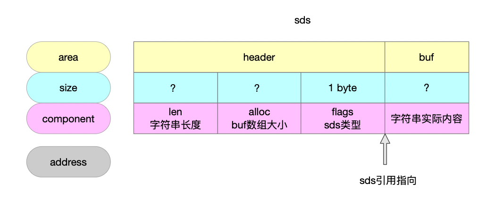
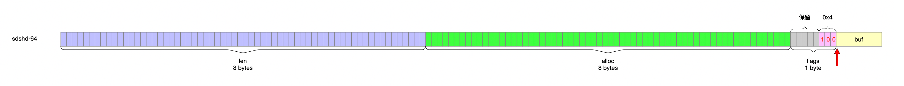

### 1 sds字符串是什么

```c
/**
 * 字符数组
 * 为什么这样 我觉得是向下兼容C语言中的字符串类型
 */
typedef char *sds;
```

__attribute__ ((__packed__)) 告诉编译器取消结构体在编译过程中的对齐优化 按照实际字节占用进行对齐

为什么禁止编译器优化呢？因为5种类型的sds的结构是精心设计的
 
- 1 首先为了能完全兼容C语言中的字符串 最终暴露给用户的依然是指向实际字符串数组的指针

- 2 为了弥补C语言字符串的缺陷(比如二进制不安全 获取字符串长度时间复杂度太高 增减字符串长度对内存空间不优化) 设计了sds的头

- 3 redis为了极致压缩内存 设计了5种类型的sds 也即有5种头类型 头里面存储的就是sds字符串的元数据信息 拿到了头信息就完全掌握了sds字符串信息

- 4 现在已经确定了sds字符串指针指向的存储实际字符串的字符数组 也就是说往高地址空间是字符串内容 想读头信息只能往低地址空间了 又因为有5种类型 所以sds指针往低地址方向的第一部分得存储标识信息区分sds类型

- 5 一旦知道了当前是哪种sds类型 又因为数据结构的大小在编译期间就决定了 便能够知道当前sds的头大小 一旦知道头大小就能偏移指针直接到sds数据结构的头 又因为sds类型知道了 自然而然可以随便玩转指针了

如上种种 核心就是2点
 
- sds类型枚举的字段设计

- sds的数据结构不能被破坏

所以才告诉编译器不要因为优化而改变布局

顺着上面的思路，下面定义的5种sds数据结构也就不难理解了
 
首先抛开sdshdr5这种类型不谈

- buf成员

  - 要兼容C字符串 那么就是依然要保持字符数组的结构 并且将来暴露给用户的指针就是指向buf的

  - 将来要拿着指向buf的指针反向操作所代表的sds类型 因此需要有能力把指针从buf位置移动到sds位置 所以将buf设计成柔性数组 在编译期就确定数据结构大小 方便计算数据结构大小 从而进行指针移动

- len成员

  - C字符串求长度是个O(n)时间复杂度的消耗 因此将字符长长度信息放在sds头中 优化成O(1)的操作 典型用空间换时间

  - 这个len本身的类型就决定了能表达多大的数字 也就是说不同长度的字符串倒逼选择不同的len类型 不同呢的len类型得设计对应的sdshdr数据结构

- alloc成员

  - C字符串每一次的增删都意味着要重新分配内存然后拷贝原字符串或者memset

  - sds为了减少一些场景的内存分配开销 用alloc记录一次分配好的内存大小 也就是说buf整个大小由alloc来表达 字符串长度由len来表达 因为要兼容C的字符串因此buf实际使用的就是len+1

- flags成员

  - 上面几个成员都是功能需要 确定好之后自然而然的问题就是如何确定不同sds类型

  - 并且因为sds指针指向的buf 所以flags有且只能放在buf的低地址方向

  - 内存编排的最小单位是byte 首先定义成byte是足够用了 其次要看到底用几bit

    - 1bit可以表达2种类型

    - 2bit可以表达4种类型

    - 3bit可以表达8种类型

有了flags的用途再看当前的情况

表达长度的成员len的类型可以定义成8bit 16bit 32bit 64bit，因此与之对应的sds的类型就有4种sdshdr8 sdshdr16 sdshdr32 sdshdr64

也就是说flags的8bit只要用到低位的2bit就足够了

我的猜想是作者觉得剩余的6bit浪费掉太可惜了因此想利用起来，6bit能够表达的sizet是[0...2^6)

上面分析过sds结构成员len alloc flags buf 功能完备性必不可少的是len flags buf

alloc的用途是性能优化 减少了字符串伸缩时候产生的内存重分配情况

因此如果有这样一个场景 字符串定义好之后就不发生变化或者很少发生伸缩变化

那我是不是可以把alloc放弃掉 然后把len信息跟类型信息一起编到flags中去

这就是sdshdr5的诞生吧

此时在4种sds类型基础上额外增加了一种sds类型

那么flags的低2位明显不够用了 至少得用低3位来表达类型 剩下的高5bit来表达长度

- 每种sds字符串类型名称的数字后缀就是sds能表达的字符串长度使用的bit

  - sds5 就是5bit长度上限 [0...2^5)

  - sds8 就是8bit长度上限 (2^5...2^8)

  - sds16 就是16bit长度上限 (2^8...2^16)

  - sds32 就是32bit长度上限 (2^16...2^32)

  - sds64 就是64bit长度上限 (2^32...2^64)

- sds向OS申请到的实际内存大小存放在alloc中

- buf就是sds向OS申请到的内存

- sds字符串长度用len表达

- sds为了兼容C字符串 因此sds字符串也存了结束符\0 即buf中实际使用的就是len+1

- sds5没有存alloc信息 也就是说虽然实际上可能buf还有可用空间 但是因为没存储alloc所以就不知情 因此发生sds字符串伸缩都要重新创建实例

- redis设计出sds5肯定不是为了炫技 而是说真的有地方要使用 那么什么地方用到的字符串长度在64以下并且不发生字符串伸缩变化呢 应该就是key了吧

### 2 sds的结构



```c
struct __attribute__ ((__packed__)) sdshdr5 {
    unsigned char flags; /* 3 lsb of type, and 5 msb of string length */
    char buf[];
};
struct __attribute__ ((__packed__)) sdshdr8 {
    uint8_t len; /* used */
	/**
	 * buf缓冲区的可用空间 整个buf中除了C字符串结束符剩下的空间
	 * 分配给sds的整个内存包括
	 * <ul>
	 *   <li>除去header的内存占用就是buf数组</li>
	 *   <li>buf数组是C字符串 因此字符串结束符占1个byte</li>
	 * </ul>
	 */
    uint8_t alloc; /* excluding the header and null terminator */
    unsigned char flags; /* 3 lsb of type, 5 unused bits */
    char buf[];
};
struct __attribute__ ((__packed__)) sdshdr16 {
    uint16_t len; /* used */
    uint16_t alloc; /* excluding the header and null terminator */
    unsigned char flags; /* 3 lsb of type, 5 unused bits */
    char buf[];
};
struct __attribute__ ((__packed__)) sdshdr32 {
    uint32_t len; /* used */
    uint32_t alloc; /* excluding the header and null terminator */
    unsigned char flags; /* 3 lsb of type, 5 unused bits */
    char buf[];
};
struct __attribute__ ((__packed__)) sdshdr64 {
    uint64_t len; /* used */
    uint64_t alloc; /* excluding the header and null terminator */
    unsigned char flags; /* 3 lsb of type, 5 unused bits */
    char buf[];
};
```

- sds5

  

- sds8

  


- sds16

  

- sds32

  

- sds64

  

  ### 3 创建实例

```c
/**
 * 根据C字符串创建sds字符串
 * @param init C字符串
 * @param initlen C字符串长度
 * @return sds字符串实例 指向的sds的buf数组
 */
sds sdsnewlen(const void *init, size_t initlen) {
    return _sdsnewlen(init, initlen, 0);
}
```

```c
/**
 * 根据C字符串创建sds实例
 * @param init C字符串
 * @param initlen C字符串长度
 * @param trymalloc 标识符 控制选择的内存分配函数 不是很重要 无非就是上层还是下层去关注OOM的处理
 *                  非0 try一下 不用关注OOM的处理策略
 *                  0 不try 需要关注OOM的处理策略
 * @return sds字符串实例 指针指向的实际上是sds的buf数组
 */
sds _sdsnewlen(const void *init, size_t initlen, int trymalloc) {
    void *sh;
    sds s;
	// 根据C字符串长度需求选择sds字符串类型
    char type = sdsReqType(initlen);
    /* Empty strings are usually created in order to append. Use type 8
     * since type 5 is not good at this. */
	/**
	 * 注释是说的场景问题 创建空字符串的sds字符串大多数可能都是为了用来做字符串拼接使用的
	 * 应该是考虑到2点
	 * <ul>
	 *   <li>sds5字符串没有alloc 也就是sds5没有表达空间预分配的能力</li>
	 *   <li>sds5字符串长度较短</li>
	 * </ul>
	 * 因此这种场景就直接sds8起步
	 */
    if (type == SDS_TYPE_5 && initlen == 0) type = SDS_TYPE_8;
	// sizeof计算出不同sds类型的header大小 为了从buf指针移动
    int hdrlen = sdsHdrSize(type);
    unsigned char *fp; /* flags pointer. */
	// 向OS内存分配器申请内存 分配的实际的内存空间大小
    size_t usable;

	/**
	 * 经典溢出检测
	 * 要表达一个initlen长度的字符串 sds的空间大小至少是包含头+字符串长度+\0结束标识符
	 * 这样的内存大小是要向OS内存分配器申请的 其接收的参数类型是sizet
	 * 3个整数求和结果肯定要做溢出检测的
	 */
    assert(initlen + hdrlen + 1 > initlen); /* Catch size_t overflow */
	// OS内存分配器分配的内存
    sh = trymalloc?
        s_trymalloc_usable(hdrlen+initlen+1, &usable) :
        s_malloc_usable(hdrlen+initlen+1, &usable);
    if (sh == NULL) return NULL;
    if (init==SDS_NOINIT)
        init = NULL;
    else if (!init)
        memset(sh, 0, hdrlen+initlen+1); // 没有指定sds初始化方法 将sds内存全部置0
	// s指向buf数组
    s = (char*)sh+hdrlen;
	// fp指向flags
    fp = ((unsigned char*)s)-1;
	// buf数组剩余可用空间
    usable = usable-hdrlen-1;
	/**
	 * 为什么要做下面这一步的限制呢
	 * 因为usable是要赋值给alloc的
	 * 5种sds类型种sds5是没有维护alloc的 可以抛开不谈
	 * 其他4种sds类型 每种alloc的类型跟len的类型都是一样的
	 * 因此下面的判断是防止数据溢出
	 * 比如sds8中len和alloc的数据类型都是8bit 能存放的最大的值也就是2^8-1
	 */
    if (usable > sdsTypeMaxSize(type))
        usable = sdsTypeMaxSize(type);
	/**
	 * 对sds数据结构len alloc flags成员进行赋值操作
	 * sds5特殊之外其他都是直接赋值
	 * sds5将len和类型信息都编码近flags成员中 高5位编码字符串长度 低3位编码sds类型
	 */
    switch(type) {
        case SDS_TYPE_5: {
            *fp = type | (initlen << SDS_TYPE_BITS); // flags
            break;
        }
        case SDS_TYPE_8: {
            SDS_HDR_VAR(8,s);
            sh->len = initlen;
            sh->alloc = usable;
            *fp = type;
            break;
        }
        case SDS_TYPE_16: {
            SDS_HDR_VAR(16,s);
            sh->len = initlen;
            sh->alloc = usable;
            *fp = type;
            break;
        }
        case SDS_TYPE_32: {
            SDS_HDR_VAR(32,s);
            sh->len = initlen;
            sh->alloc = usable;
            *fp = type;
            break;
        }
        case SDS_TYPE_64: {
            SDS_HDR_VAR(64,s);
            sh->len = initlen;
            sh->alloc = usable;
            *fp = type;
            break;
        }
    }
	// C字符串内容拷贝到sds字符串中
    if (initlen && init)
        memcpy(s, init, initlen);
	/**
	 * 保留C字符串结束符的原因是sds字符串返回给用户的是指向的buf数组
	 * 为了完全兼容C字符串的API 就保留了结束符
	 */
    s[initlen] = '\0';
    return s;
}
```

