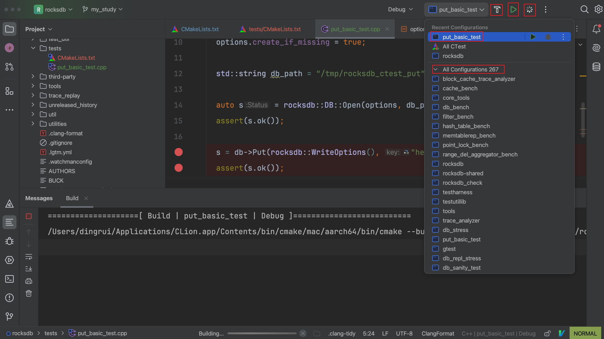

依然老规矩，不管什么类型的源码，都是场景驱动。所以后面肯定要Debug功能，提前把ctest的方式在源码工程搭建调通。后面每遇到一个功能点需要深入就调试跟进。

## 1 根目录下cmake

在CMakeLists文件中添加

```txt
include(CTest)
enable_testing()
add_subdirectory(tests)
```

## 2 调试代码

### 2.1 新建tests

`mkdir tests` 在源码根目录下新建tests放自己写的所有测试代码

### 2.2 cmake

`touch tests/CMakeLists.txt` 在tests目录下新建cmake

```txt
set(LIB_NAME rocksdb)
# Collect all cpp files in this directory
file(GLOB TEST_SOURCES CONFIGURE_DEPENDS "*.cpp")

foreach (TEST_SRC ${TEST_SOURCES})
    # Extract file name without extension
    get_filename_component(TEST_NAME ${TEST_SRC} NAME_WE)
    # Create executable
    add_executable(${TEST_NAME} ${TEST_SRC})
    # Link main library
    target_link_libraries(${TEST_NAME} PRIVATE ${LIB_NAME})
    target_include_directories(${TEST_NAME}
            PRIVATE ${PROJECT_SOURCE_DIR}/include
    )
    # Register with CTest
    add_test(NAME ${TEST_NAME}
            COMMAND ${TEST_NAME}
    )
endforeach ()
```

### 2.2 测试代码

在tests下新建测试代码

```cpp
//
// Created by rui ding on 2026/1/26.
//

#include <rocksdb/db.h>
#include <rocksdb/options.h>

#include <cassert>
#include <iostream>

int main() {
  rocksdb::DB* db = nullptr;

  rocksdb::Options options;
  options.create_if_missing = true;

  std::string db_path = "/tmp/rocksdb_ctest_put";

  auto s = rocksdb::DB::Open(options, db_path, &db);
  assert(s.ok());

  s = db->Put(rocksdb::WriteOptions(), "hello", "rocksdb");
  assert(s.ok());

  delete db;
  return 0;
}
```

## 3 调试

我用的是clion，找到自己的这个target，进行编译/运行/调试

