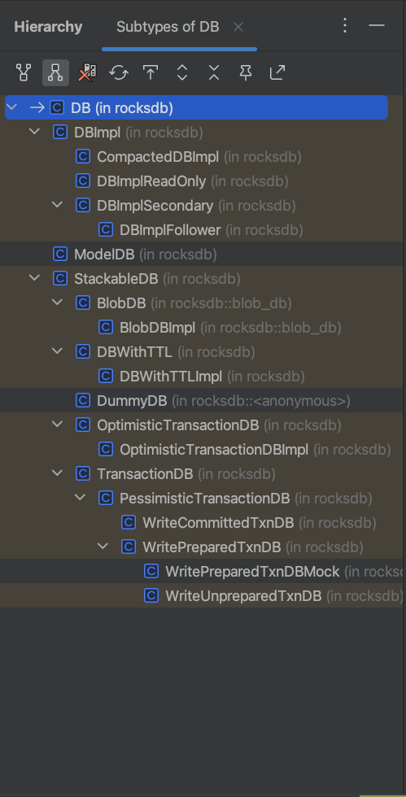
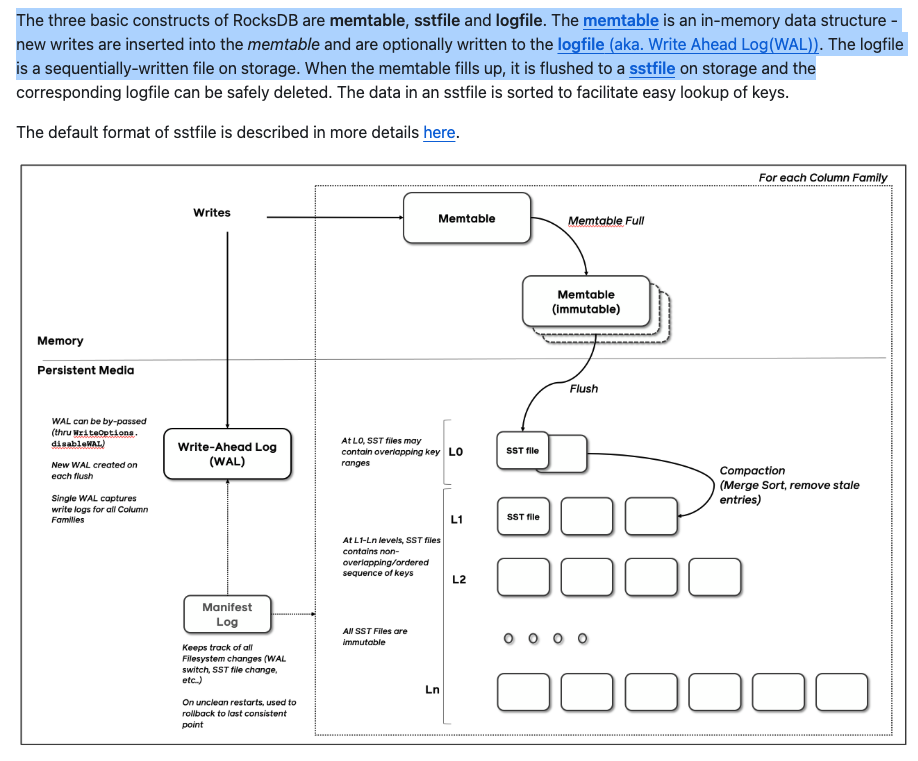

## 1 DB的设计

先看类图

当然不是每个类都要深入学习，我整理成下面这样，先宏观理解设计方式

- 1 RocksDB首先抽象了一个DB，负责定义接口，保证了清晰的边界，稳定的能力
- 2 在有了DB接口后提供了具体的实现DBImpl，这是LSM的实现
- 3 然后就是一个装饰器设计模式进行功能增强，在不破坏DBImpl的基础上实现定制功能

## 2 LSM的实现

毋庸置疑，肯定要把大部分精力放在DBImpl上面，里面必然会揭开所有迷雾

- 1 WAL(Write-Ahead Log预写日志)
- 2 MemTable(跳表)
- 3 Immutable MemTable
- 4 SSTable(BlockBasedTable)
- 5 Compaction
- 6 VersionSet/Manifest
- 7 Get/Put/Write的真实实现

这么多复杂功能的实现需要依赖大量的组件，而所有的功能组件和资源肯定都要在Open的时候进行就绪准备。所以首先应该调试Open流程看看怎么初始化db的。