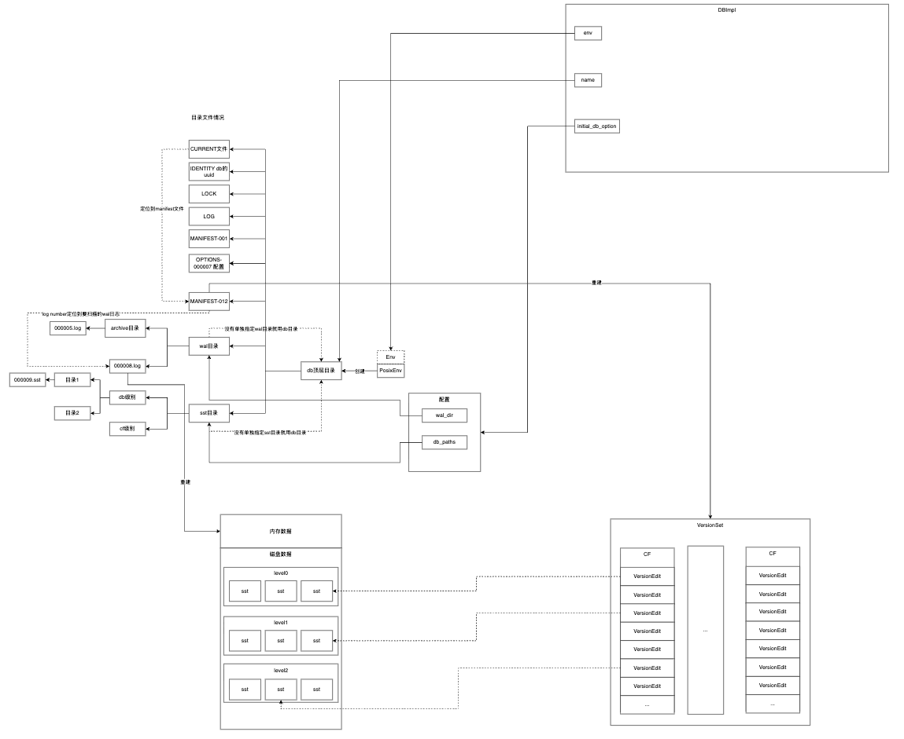

跟其他数据库一样，为了持久化数据最终一定会在磁盘呆着，为了避免刷盘性能开销，一部分数据会前置在内存等到合适的时机再持久化到磁盘。
这部分内存数据的安全性保证就引进了WAL机制。所以数据库的数据就分布在两个地方，内存和磁盘。

那么问题就来了，在数据库启动的时候我怎么知道哪些数据放内存，哪些数据在磁盘以及在磁盘哪个文件上。

内存里面的数据很简单，既然有了wal机制，就可以从wal日志恢复。

关于磁盘里面的数据，RocksDB在内存中新建了一个数据结构VersionSet里面维护了每个列簇的Version情况，所谓的Version就是每个SST文件的情况包括SST
文件编号、文件总大小、文件内容序号区间、key区间，换言之RocksDB借助VersionSet对某个key在SST的分布了如指掌。
