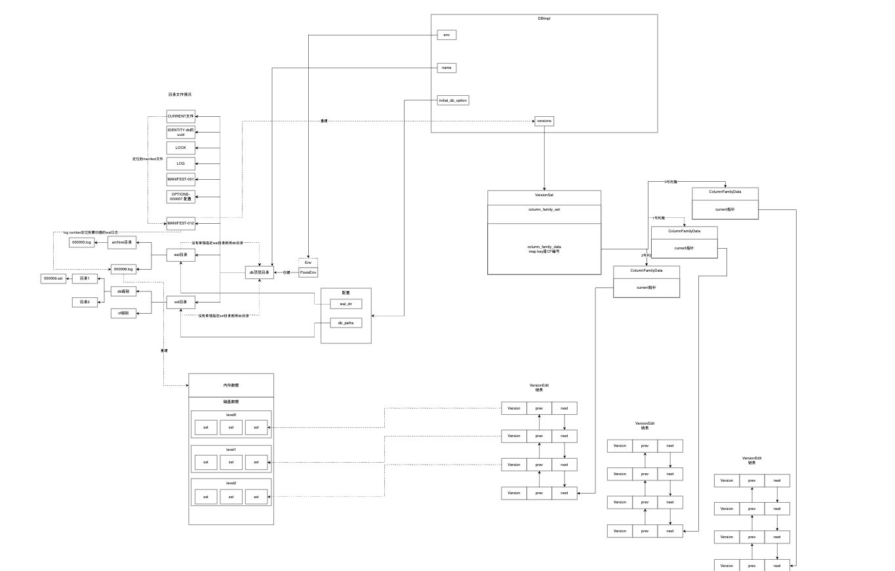

## 1 什么是Version

配合manifest中的内容看更直观  

RocksDB两手抓，一手抓没持久化的数据在内存，一手抓持久化的数据在SST，回放内存数据靠wal，溯源数据在SST的分布情况也需要一个机制，一类比wal就唤出了VersionSet。

从某个具体的CF视角看，它的每次SST变更就会产生一个VersionEdit，一群VersionEdit组成的概念就是这个CF的Version。再把视角扩大到所有CF，就形成了VersionSet。

通过VersionSet，RocksDB就能拿着key定位到这个key在哪个sst文件里面。

## 2 盘点VersionSet



## 3 VersionSet的代码结构

### 3.1 构造DB的时候构建默认的VersionDB对象

```cpp
  versions_.reset(new VersionSet(
      dbname_, &immutable_db_options_, mutable_db_options_, file_options_,
      table_cache_.get(), write_buffer_manager_, &write_controller_,
      &block_cache_tracer_, io_tracer_, db_id_, db_session_id_,
      options.daily_offpeak_time_utc, &error_handler_, read_only));
```

### 3.2 ColumnFamilySet

在VersionSet的构造函数中也会构造个默认的column_family_set

```cpp
    : column_family_set_(new ColumnFamilySet(
          dbname, _db_options, storage_options, table_cache,
          write_buffer_manager, write_controller, block_cache_tracer, io_tracer,
          db_id, db_session_id)),
```

### 3.3 CF的映射

在ColumnFamilySet通过map映射CF的信息

```cpp
  // 列簇名字映射到列簇编号
  UnorderedMap<std::string, uint32_t> column_families_;
  // 列簇编号映射到列簇 在列簇的信息里面有个current指针 这个指针指向当前列最新的Version链表结点
  UnorderedMap<uint32_t, ColumnFamilyData*> column_family_data_;
```

### 3.4 CF怎么找到自己的Version

在上面ColumnFamilySet里面根据CF的编号索引到ColumnFamilyData后，在Data里面用current指针指向自己的Version

```cpp
  // 列簇的Version链表 这个current指针指向的是在链表中最新的 也就是链表尾的结点 每个Version链表结点就是真实的每次的VersionEdit
  Version* current_;         // == dummy_versions->prev_
```

### 3.5 Version的结构

Version的数据结构是双链表

```cpp
  // 对SST的变更生成了一次VersionEdit 在时间序上形成双链表结构 每次有新生成一个VersionEdit就串到链表尾 然后把CF里面的current指针指过来
  Version* next_;     // Next version in linked list
  Version* prev_;     // Previous version in linked list
```

## 4 启动的时候从manifest构建恢复VersionSet

VersionSet中有个函数Recover负责从manifest文件中重建VersionSet

### 4.1 从CURRENT里面看看MANIFEST是哪个

```cpp
  // 从CURRENT文件中拿到当前的manifest文件名
  std::string manifest_path;
  Status s = GetCurrentManifestPath(dbname_, fs_.get(), is_retry,
                                    &manifest_path, &manifest_file_number_);
```




### 4.2 读manifest文件

```cpp
    // 顺序读取整个manifest文件 回放所有的VersionEdit 生成当前的version 至此RocksDB知道了自己有哪些sst 这些sst在第几层 key range是什么
    handler.Iterate(reader, &log_read_status);
```

#### 4.2.1 读取日志记录

对于manifest，RocksDB把它和wal一样对待，都抽象成日志，所以读的时候单位是一条条日志记录而不是简单的一行一行

```cpp
reader.ReadRecord(&record, &scratch)
```

里面有详细的解读

### 4.3 反序列化

```cpp
    // 从manifest中拿到的一个个日志记录 拿到的是二进制 反序列出来得到对应的VersionEdit
    s = edit.DecodeFrom(record);
```

序列化/反序列化是协议设计的选择和方案实现，在里面有全面的介绍和RocksDB的手搓TLV的解析

### 4.4 VersionEdit回放到VersionSet

上面反序列化拿到了VersionEdit

#### 4.4.1 怎么还有事务的事情

```cpp
      // 一个VersionSet可能是单独的 也可能是属于一个事务组的
      // 单独的好办直接回放到VersionSet就行
      // 属于事务组的就要保证要么全部成功要么全部不要
      if (edit.IsInAtomicGroup()) {
        /**
         * 首先理解为什么VersionEdit会有事务概念
         * 举个例子 现在发生一次sst的compaction
         * 要把L1层的100.sst和L1层的101.sst合并成L2层的200.sst
         * 在磁盘上的步骤是
         * 1 写入200.sst
         * 2 删除100.sst
         * 3 删除101.sst
         * 在manifest对应的应该就是3个VersionEdit
         * 1 DeleteFile(L1, 100)
         * 2 DeleteFile(L1, 101)
         * 3 AddFile(L2, 200)
         * 这3个VersionEdit就必须得是在一个事务里面保证在恢复VersionSet的时候是原子的
         * 为什么呢 如果在2之后3之前宕机了 然后在重启恢复VersionSet的时候没以讲究事务语义就这么一条条VersionEdit进行恢复 最终重启后VersionSet里面
         * 1 DeleteFile(L1, 100)=>L1的100.sst被删除了看不到了
         * 2 DeleteFile(L1, 101)=>L1的101.sst被删除了看不到了
         * 3 AddFile(L2, 200)=>crash导致没有被恢复到VersionSet VersionSet自然看不到L2的sst.200
         * 所以这就必须要求事务的原子性
         */
        if (read_buffer_.IsFull()) {
          /**
           * 一个事务组的VersionEdit凑齐了才一起回放到VersionSet里面
           * 怎么保证事务呢 下面代码可以分成3个阶段 最核心的就for循环
           * 1 OnAtomicGroupReplayBegin
           * 2 for循环
           * 3 OnAtomicGroupReplayEnd
           * 这是标准的事务处理范式 但是那是针对恢复文件 需要在文件内容的开头跟结尾打上标识表示一个事务的完整性
           * 但是现在是把VersionEdit恢复到VersionSet VersionSet是在内存里面 所以事情就变得简单了
           * 在for循环逐个回放VersionEdit 只要但凡一个VersionEdit有问题就最终会导致s.ok()不成立
           * 最终也会带着外层的while循环跳出进而当前函数返回false 调用方也会感知到恢复VersionSet这件事实 重启和Open失败
           * 这个设计在工程上我觉得很合理
           * 比如有3个VersionEdit在事务 回放到第2个的时候有问题了 也就是说内存操作出问题了 前面已经回放到内存上的那1个我自然不用管了 因为最终整个Open或者重启都会失败 整个进程都没的了
           */
          s = OnAtomicGroupReplayBegin();
          for (size_t i = 0; s.ok() && i < read_buffer_.replay_buffer().size();
               i++) {
            auto& e = read_buffer_.replay_buffer()[i];
            s = ApplyVersionEdit(e, &cfd);
            if (s.ok()) {
              recovered_edits++;
            }
          }
          if (s.ok()) {
            read_buffer_.Clear();
            s = OnAtomicGroupReplayEnd();
          }
        }
      }
```

#### 4.4.2 VersionEdit真正的核心

```cpp
        s = ApplyVersionEdit(edit, &cfd);
```
