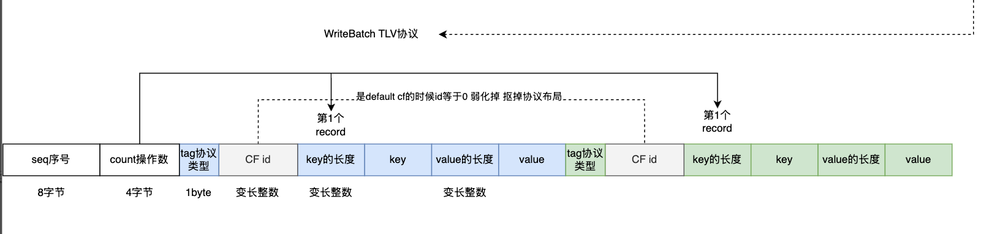

跟对比起来看，VersionEdit是manifest文件的逻辑协议，WriteBatch是wal文件的逻辑协议。

除了协议本身的信息内容，最大的区别是VersionEdit协议没有协议头，WriteBatch有协议头。


## 1 为什么叫WriteBatch

在中wal中每一条记录是一个put操作，下面的测试代码看一下批量提交

```cpp
  rocksdb::WriteBatch batch;
  for (int i = 0; i < 10; ++i) {
    batch.Put("hello" + std::to_string(i),
              "world" + std::to_string(i));
  }
  rocksdb::WriteOptions write_opts;
  write_opts.sync = false;
  s = db->Write(write_opts, &batch);
```


再看一下wal文件可以看到是一条记录对应10个put操作。所谓的WriteBatch就是在wal里面的一条记录可能对应多个put操作，一次put一个kv仅仅是特例，封装出来WriteBatch作为逻辑协议。

## 2 WriteBatch的核心成员

WriteBatch有且仅有一个成员

```cpp
  /**
   * WriteBatch逻辑协议=协议头+协议体
   * wal日志读出来Block->分割成fragment物理协议->刨去物理协议头拿到fragment协议体->拼成record->就是WriteBatch逻辑协议
   * 这个里面存放的就是WriteBatch逻辑协议的二进制
   */
  std::string rep_;  // See comment in write_batch.cc for the format of rep_
```

## 3 WriteBatch布局

只要是协议，就会有布局



整个布局可以看作两个部分

- 协议头12字节
  - seq序号 8字节
  - count 4字节 表示当前WriteBatch记录了几个put操作
- 协议体 里面放着put的操作 可能1个可能多个 取决于count

每个put record就是标准的TLV协议，为了压缩空间又有两个形态

- 是默认cf tag+key的length+key+value的length+value
- 不是默认cf tag+cf的id+key的length+key+value的length+value

```cpp
  // Sequence,Count,ByteSize,Physical Offset,Key(s) : value
  // 1,       1,    27,      0,     PUT(0) : 0x68656C6C6F30 : 0x776F726C6430
  // WriteBatch的协议布局
  // 8字节seq序号+4字节count表示当前WriteBatch有多少个record+1字节的tag+变长整数cf_id+变长整数key的长度+key+变长整数value的长度+value
  // sequence number是序号 类型是64位整数
  // count是record记录里面的操作数量 类型是32位整数
  // 一个WriteBatch也就是wal里面的一个日志记录至少包含这两个数 12字节
  // 因为wal可能写到一半宕机或者被截断 拿这12字节作为record结构完整性校验的标准
  static constexpr size_t kHeader = 12;
```

## 4 构建WriteBatch

### 4.1 从wal的record构建

很简单就是把二进制挪到WriteBatch成员里面

```cpp
/**
 * 构建WriteBatch逻辑协议
 * wal读出来的原始record字节写到WriteBatch里面
 * @param b WriteBatch逻辑协议
 * @param contents 从wal日志里面解析出来的二进制 剥去了物理协议头后的内容
 */
Status WriteBatchInternal::SetContents(WriteBatch* b, const Slice& contents) {
  // WriteBatch逻辑协议有头 用协议头简单校验一下协议结构完整
  assert(contents.size() >= WriteBatchInternal::kHeader);
  assert(b->prot_info_ == nullptr);
  // 覆盖写
  b->rep_.assign(contents.data(), contents.size());
  b->content_flags_.store(ContentFlags::DEFERRED, std::memory_order_relaxed);
  return Status::OK();
```

### 4.2 从put流程构建

```cpp
/**
 * 键值对编码到WriteBatch协议
 * 1 协议头里面的count字段
 * 2 TLV协议 tag+cf id+key长度+key+value长度+value
 */
Status WriteBatchInternal::Put(WriteBatch* b, uint32_t column_family_id,
                               const Slice& key, const Slice& value) {
  if (key.size() > size_t{std::numeric_limits<uint32_t>::max()}) {
    return Status::InvalidArgument("key is too large");
  }
  if (value.size() > size_t{std::numeric_limits<uint32_t>::max()}) {
    return Status::InvalidArgument("value is too large");
  }

  LocalSavePoint save(b);
  // 协议头里面count+1编码进去
  WriteBatchInternal::SetCount(b, WriteBatchInternal::Count(b) + 1);
  if (column_family_id == 0) {
    // tag标识
    // 默认cf约定在编码里面不需要cf id
    b->rep_.push_back(static_cast<char>(kTypeValue));
  } else {
    b->rep_.push_back(static_cast<char>(kTypeColumnFamilyValue));
    // cf id
    PutVarint32(&b->rep_, column_family_id);
  }
  // key的长度+key
  PutLengthPrefixedSlice(&b->rep_, key);
  // value的长度+value
  PutLengthPrefixedSlice(&b->rep_, value);
  b->content_flags_.store(
      b->content_flags_.load(std::memory_order_relaxed) | ContentFlags::HAS_PUT,
      std::memory_order_relaxed);
  if (b->prot_info_ != nullptr) {
    // Technically the optype could've been `kTypeColumnFamilyValue` with the
    // CF ID encoded in the `WriteBatch`. That distinction is unimportant
    // however since we verify CF ID is correct, as well as all other fields
    // (a missing/extra encoded CF ID would corrupt another field). It is
    // convenient to consolidate on `kTypeValue` here as that is what will be
    // inserted into memtable.
    b->prot_info_->entries_.emplace_back(ProtectionInfo64()
                                             .ProtectKVO(key, value, kTypeValue)
                                             .ProtectC(column_family_id));
  }
  return save.commit();
}
```