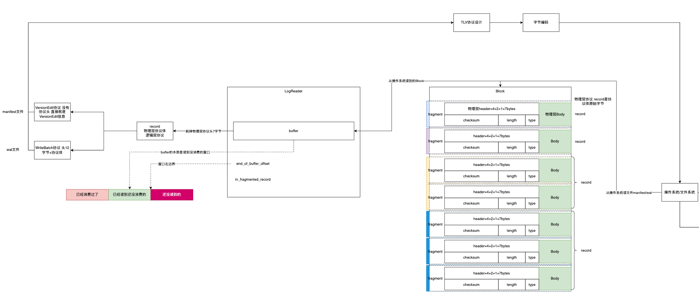
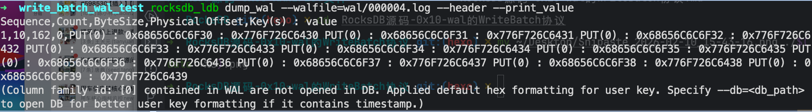

跟对比起来看，VersionEdit是manifest文件的逻辑协议，WriteBatch是wal文件的逻辑协议。

除了协议本身的信息内容，最大的区别是VersionEdit协议没有协议头，WriteBatch有协议头。



## 1 为什么叫WriteBatch

在中wal中每一条记录是一个put操作，下面的测试代码看一下批量提交

```cpp
  rocksdb::WriteBatch batch;
  for (int i = 0; i < 10; ++i) {
    batch.Put("hello" + std::to_string(i),
              "world" + std::to_string(i));
  }
  rocksdb::WriteOptions write_opts;
  write_opts.sync = false;
  s = db->Write(write_opts, &batch);
```



再看一下wal文件可以看到是一条记录对应10个put操作。所谓的WriteBatch就是在wal里面的一条记录可能对应多个put操作，一次put一个kv仅仅是特例，封装出来WriteBatch作为逻辑协议。

## 2 WriteBatch的核心成员

WriteBatch有且仅有一个成员

```cpp
  /**
   * WriteBatch逻辑协议=协议头+协议体
   * wal日志读出来Block->分割成fragment物理协议->刨去物理协议头拿到fragment协议体->拼成record->就是WriteBatch逻辑协议
   * 这个里面存放的就是WriteBatch逻辑协议的二进制
   */
  std::string rep_;  // See comment in write_batch.cc for the format of rep_
```

## 3 构建WriteBatch

很简单就是把二进制挪到WriteBatch成员里面

```cpp
/**
 * 构建WriteBatch逻辑协议
 * wal读出来的原始record字节写到WriteBatch里面
 * @param b WriteBatch逻辑协议
 * @param contents 从wal日志里面解析出来的二进制 剥去了物理协议头后的内容
 */
Status WriteBatchInternal::SetContents(WriteBatch* b, const Slice& contents) {
  // WriteBatch逻辑协议有头 用协议头简单校验一下协议结构完整
  assert(contents.size() >= WriteBatchInternal::kHeader);
  assert(b->prot_info_ == nullptr);
  // 覆盖写
  b->rep_.assign(contents.data(), contents.size());
  b->content_flags_.store(ContentFlags::DEFERRED, std::memory_order_relaxed);
  return Status::OK();
}
```


