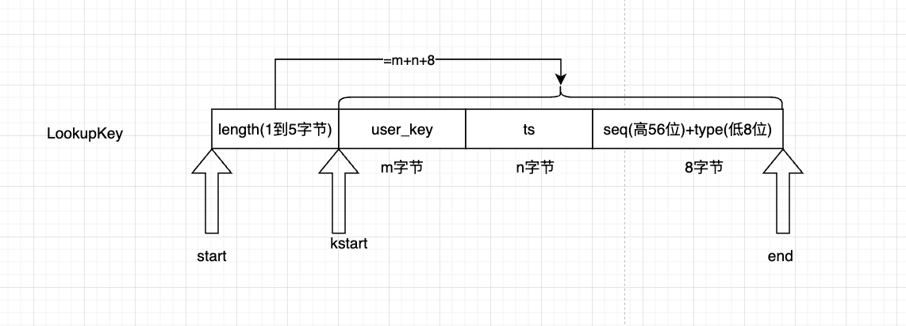

## 1 测试代码

```cpp
int main() {
  rocksdb::Options options;
  options.create_if_missing = true;

  // 不在options中显式制定wal的目录就会用db_path
  std::string dbName = "/tmp/rocksdb_ctest_read";
  std::string walDir = dbName + "/wal";
  std::string sstDir = dbName + "/sst";
  options.wal_dir = walDir;
  std::vector<rocksdb::DbPath> sstPaths = {{sstDir + "/flash_path", 512},
                                           {sstDir + "/hard_drive", 1024}};
  options.db_paths = sstPaths;

  // sst目录属于资源目录 RocksDB不会帮我创建 要自己创建好
  auto* env = rocksdb::Env::Default();
  env->CreateDirIfMissing(dbName);
  env->CreateDirIfMissing(walDir);
  env->CreateDirIfMissing(sstDir);
  env->CreateDirIfMissing(sstDir + "/flash_path");
  env->CreateDirIfMissing(sstDir + "/hard_drive");

  std::unique_ptr<rocksdb::DB> db;
  auto s = rocksdb::DB::Open(options, dbName, &db);
  assert(s.ok());
  // 写
  s = db->Put(rocksdb::WriteOptions(), "hello", "world");
  assert(s.ok());
  // 读
  std::string val;
  s = db->Get(rocksdb::ReadOptions(), "hello", &val);
  assert(s.ok());
  std::cout<<"key=hello, value="<<val<<std::endl;
  return 0;
}
```

## 2 关于字符串

```cpp
  virtual inline Status Get(const ReadOptions& options,
                            ColumnFamilyHandle* column_family, const Slice& key,
                            std::string* value) final {
    assert(value != nullptr);
    // 构造字符串的安全视图
    PinnableSlice pinnable_val(value);
    assert(!pinnable_val.IsPinned());
    auto s = Get(options, column_family, key, &pinnable_val);
    if (s.ok() && pinnable_val.IsPinned()) {
      // 什么时候才要显式复制内存 只有当内存不是我自己 我只负责托管内存生命周期
      value->assign(pinnable_val.data(), pinnable_val.size());
    }  // else value is already assigned
    return s;
  }
```

虽然用的是std::string，名称叫string，但是不能只是狭隘地理解成字符串，而是字节序列。针对string，RocksDB有两个自己的场景优化

- 一是性能优化
- 二是安全性的优化

## 3 构造LookupKey

这个东西存在的目的是查询，把查询条件编码到了一起

想象一下现在需要在有序集合中查询`Seek(key = (a, snapshot))`，转换成的语义是

```sql
WHERE key = a AND sequence <= snapshot
ORDER BY sequence DESC
LIMIT 1
```

直接看内存布局



它的三个成员

```cpp
  const char* start_; // 整个LookupKey开始->给memtable用
  const char* kstart_; // user_key开始->提取user_key
  const char* end_; // 整个LookupKey结束
```

它的构造函数

```cpp
/**
 * 本质是查找的是界key
 * LookupKey=user_key+ts+sequence+type的编码结构 用于在有序结构中做版本查找
 * 内存布局是 长度(这个长度表示LookupKey自己占了多少个字节)+user_key+ts+8字节数字(高56位seq 低8位type)
 * 因为长度用的是变长整数 所以最多5个字节
 */
LookupKey::LookupKey(const Slice& _user_key, SequenceNumber s,
                     const Slice* ts) {
  size_t usize = _user_key.size();
  size_t ts_sz = (nullptr == ts) ? 0 : ts->size();
  // 前几个字节放的是长度 因为这个整数用的是变长编码 所以最多5字节 那么LookupKey最多占用的空间就是5+usize+ts_sz+8个字节
  size_t needed = usize + ts_sz + 13;  // A conservative estimate
  char* dst;
  if (needed <= sizeof(space_)) { // 预分配了200字节的buffer 够用就用它 不够再申请个新的更大的buffer
    dst = space_;
  } else {
    dst = new char[needed];
  }
  // buffer的起始 也就是LookupKey的地址
  start_ = dst;
  // NOTE: We don't support users keys of more than 2GB :)
  // LookupKey有多大 编到开头的几个字节 编码完后dst指向的是user_key
  dst = EncodeVarint32(dst, static_cast<uint32_t>(usize + ts_sz + 8));
  // 记录user_key的地址
  kstart_ = dst;
  // 把user_key拷贝进来
  memcpy(dst, _user_key.data(), usize);
  // 指向ts地址
  dst += usize;
  // 把ts拷贝进来
  if (nullptr != ts) {
    memcpy(dst, ts->data(), ts_sz);
    dst += ts_sz;
  }
  // 8字节 高56位放的是sequence number 低8位放的是type
  EncodeFixed64(dst, PackSequenceAndType(s, kValueTypeForSeek));
  dst += 8;
  end_ = dst;
}
```

上面的流程看到会需要seq作为key的检索条件，这个seq就是MVCC读隔离发挥威力的地方

## 4 从快照里面读数据

在真正的读数据之前，非常重要的是拿到数据的快照

### 4.1 先从MemTable里面读



### 4.2 MemTable在落盘过程中从冻结的MemTable里面读



### 4.3 SST查找


